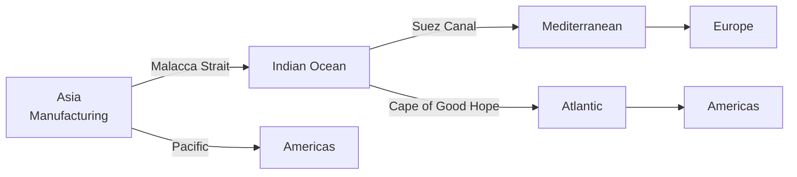

# World Regions — ภูมิภาคของโลก

> *"The world is a book, and those who do not travel read only one page."* — Saint Augustine

World Regions examines the major geographic regions of Earth. Students learn about continents, regional characteristics, and how globalization connects distant places. The focus is on understanding diversity while recognizing shared challenges.

---

## 1 | Grade Band Breakdown

| Grade | Key Content |
|---|---|
| **ป.1–3** | — |
| **ป.4–6** | Seven continents, major oceans, basic regions |
| **ม.1–3** | Regional comparison, cultural geography |
| **ม.4–6** | Globalization geography, regional blocs, geopolitical analysis |

---

## 2 | Continents and Oceans

### Seven Continents

| Continent | Thai | Area (million km²) | Population (billion) | Countries |
|---|---|---|---|---|
| **Asia** | เอเชีย | 44.6 | 4.7 | 48 |
| **Africa** | แอฟริกา | 30.4 | 1.4 | 54 |
| **North America** | อเมริกาเหนือ | 24.7 | 0.6 | 23 |
| **South America** | อเมริกาใต้ | 17.8 | 0.4 | 12 |
| **Antarctica** | แอนตาร์กติกา | 14.0 | 0 (research) | 0 |
| **Europe** | ยุโรป | 10.2 | 0.7 | 44 |
| **Australia/Oceania** | ออสเตรเลีย/โอเชียเนีย | 8.5 | 0.04 | 14 |

### Five Oceans

| Ocean | Thai | Area (million km²) | Key Feature |
|---|---|---|---|
| **Pacific** | มหาสมุทรแปซิฟิก | 168.2 | Largest, deepest (Mariana Trench) |
| **Atlantic** | มหาสมุทรแอตแลนติก | 106.5 | Second largest |
| **Indian** | มหาสมุทรอินเดีย | 70.6 | Warmest |
| **Southern** | มหาสมุทรใต้ | 21.9 | Surrounds Antarctica |
| **Arctic** | มหาสมุทรอาร์กติก | 14.1 | Smallest, mostly ice-covered |

---

## 3 | Major World Regions

### East Asia (เอเชียตะวันออก)

| Country | Thai | Population | Economy |
|---|---|---|---|
| **China** | จีน | 1.4 billion | $18 trillion |
| **Japan** | ญี่ปุ่น | 125 million | $4.2 trillion |
| **South Korea** | เกาหลีใต้ | 52 million | $1.7 trillion |
| **Taiwan** | ไต้หวัน | 23 million | $790 billion |

### Southeast Asia (เอเชียตะวันออกเฉียงใต้)

See [[11_ASEAN_Economics]] and [[13_SE_Asian_History]]

### South Asia (เอเชียใต้)

| Country | Thai | Population | Key Feature |
|---|---|---|---|
| **India** | อินเดีย | 1.4 billion | World's most populous |
| **Pakistan** | ปากีสถาน | 240 million | Nuclear power |
| **Bangladesh** | บังคลาเทศ | 170 million | Delta, climate vulnerability |
| **Sri Lanka** | ศรีลังกา | 22 million | Island, tea |

### Middle East / West Asia (ตะวันออกกลาง)

| Country | Thai | Key Feature |
|---|---|---|
| **Saudi Arabia** | ซาอุดิอาระเบีย | Oil, Mecca |
| **UAE** | สหรัฐอาหรับเอมิเรตส์ | Dubai, finance |
| **Iran** | อิหร่าน | Persian civilization |
| **Israel** | อิสราเอล | Religion, technology |
| **Turkey** | ตุรกี | Bridge between Europe and Asia |

### Europe (ยุโรป)

| Region | Thai | Key Features |
|---|---|---|
| **Western Europe** | ยุโรปตะวันตก | Germany, France, UK |
| **Northern Europe** | ยุโรปเหนือ | Scandinavia, Baltic |
| **Southern Europe** | ยุโรปใต้ | Italy, Spain, Greece |
| **Eastern Europe** | ยุโรปตะวันออก | Poland, Romania, Ukraine |

### Africa (แอฟริกา)

| Region | Thai | Key Features |
|---|---|---|
| **North Africa** | แอฟริกาเหนือ | Egypt, Morocco, Arab culture |
| **Sub-Saharan** | แอฟริกาใต้สะฮารา | Nigeria, Kenya, South Africa |
| **Sahara Desert** | ทะเลทรายสะฮารา | World's largest hot desert |

### Americas (อเมริกา)

| Region | Thai | Key Features |
|---|---|---|
| **North America** | อเมริกาเหนือ | USA, Canada, Mexico |
| **Central America** | อเมริกากลาง | Guatemala, Panama |
| **Caribbean** | แคริบเบียน | Cuba, Jamaica, Bahamas |
| **South America** | อเมริกาใต้ | Brazil, Argentina, Chile |

### Oceania (โอเชียเนีย)

| Country | Thai | Key Feature |
|---|---|---|
| **Australia** | ออสเตรเลีย | Continent + country |
| **New Zealand** | นิวซีแลนด์ | Maori culture |
| **Pacific Islands** | หมู่เกาะแปซิฟิก | Fiji, Samoa, Vanuatu |

---

## 4 | Global Trade Routes

| Route | Thai | Significance |
|---|---|---|
| **Malacca Strait** | ช่องแคบมะละกา | 40% of world trade |
| **Suez Canal** | คลองสุเอซ | Europe-Asia shortcut |
| **Panama Canal** | คลองปานามา | Atlantic-Pacific link |
| **Bering Strait** | ช่องแคบเบริง | Asia-America (potential) |
| **Arctic Route** | เส้นทางอาร์กติก | Opening due to climate change |

---

## 5 | Global Political-Economic Blocs

| Bloc | Thai | Members | Focus |
|---|---|---|---|
| **EU** | สหภาพยุโรป | 27 countries | Political-economic integration |
| **ASEAN** | อาเซียน | 10 countries | Regional cooperation |
| **NAFTA/USMCA** | นาฟตา/ยูเอสเอ็มซีเอ | USA, Canada, Mexico | Trade |
| **BRICS** | บริคส์ | Brazil, Russia, India, China, South Africa | Emerging economies |
| **G7** | จีเจ็ด | 7 largest advanced economies | Coordination |
| **G20** | จีทเวนตี้ | 20 major economies | Global governance |
| **RCEP** | อาร์ซีอีพี | ASEAN + 5 | World's largest trade bloc |
| **CPTPP** | ซีพีทีพีพี | 11 Pacific countries | High-standard trade |
| **OPEC** | โอเปค | 13 oil-producing countries | Oil production |

---

## 6 | Globalization (โลกาภิวัตน์)

### Dimensions

| Dimension | Thai | Description |
|---|---|---|
| **Economic** | เศรษฐกิจ | Trade, investment, supply chains |
| **Cultural** | วัฒนธรรม | Media, food, fashion, ideas |
| **Political** | การเมือง | International organizations, treaties |
| **Technological** | เทคโนโลยี | Internet, communication, transport |
| **Environmental** | สิ่งแวดล้อม | Climate change, pollution (no borders) |
| **Demographic** | ประchnากร | Migration, refugee flows |

### Globalization Impacts

| Positive | Negative |
|---|---|
| Economic growth | Inequality |
| Technology transfer | Cultural homogenization |
| Lower prices | Job displacement |
| Cultural exchange | Environmental damage |
| Faster communication | Loss of sovereignty |
| Disease spread | Pandemics |

---

## 7 | Upper Secondary (ม.4-6): Geopolitics

### Key Geopolitical Concepts

| Concept | Thai | Description |
|---|---|---|
| **Heartland Theory** | ทฤษฎีแฮตแลนด์ | Mackinder: control of Eurasia = global control |
| **Rimland Theory** | ทฤษฎีริมแลนด์ | Spykman: coastal powers dominate |
| **Sea power vs land power** | อำนาจทางทะเล vs ทางบก | Mahan vs Mackinder |
| **Soft power** | อำนาจอ่อน | Cultural influence (K-pop, anime, Hollywood) |
| **Hard power** | อำนาจแข็ง | Military, economic coercion |

### Superpower Rivalry

| Dimension | USA | China |
|---|---|---|
| **Military** | Strongest military | Rapidly modernizing |
| **Economy** | Largest (nominal) | Largest (PPP), #2 nominal |
| **Currency** | US dollar (global reserve) | Yuan (internationalizing) |
| **Technology** | Silicon Valley, AI | Huawei, TikTok, 5G |
| **Alliances** | NATO, Japan, Korea | SCO, Belt and Road |
| **Southeast Asia** | Traditional ally | Largest trading partner |

### Thailand's Geopolitical Position

| Strategy | Thai | Description |
|---|---|---|
| **Bamboo diplomacy** | ทูตกระบอก | Bend with wind, don't break |
| **Balancing** | สมดุล | Maintain relations with all powers |
| **ASEAN centrality** | อาเซียนเป็นศูนย์กลาง | Regional framework |
| **Hedging** | วางเดิมพันหลายด้าน | Don't choose sides |

---

## 8 | Thai Terminology

| Thai | English |
|---|---|
| ทวีป | Continent |
| มหาสมุทร | Ocean |
| ภูมิภาค | Region |
| โลกาภิวัตน์ | Globalization |
| ภูมิรัฐศาสตร์ | Geopolitics |
| โลกาภิวัตน์เศรษฐกิจ | Economic globalization |
| สหภาพยุโรป | European Union |
| ตะวันออกกลาง | Middle East |
| โลกที่สาม | Third World (historical) |

---

## 9 | Real-World Examples

- **Malacca Strait** — 40% of global trade passes through this narrow waterway near Thailand
- **Belt and Road Initiative** | China's infrastructure project spanning 140+ countries
- **K-pop globalization** | Korean culture spread worldwide via social media
- **Refugee crisis** | Syria, Ukraine, Myanmar — millions displaced across borders
- **Climate change** | Global problem requiring international cooperation (Paris Agreement)

---

## 10 | Cross-Links

- [[Social Studies - Overview|← Back to Social Studies]]
- [[01_Geography_of_Thailand|Geography of Thailand]] — Thailand in world context
- [[12_World_Regions|World Regions]] (if separate) — Regional detail
- [[13_SE_Asian_History|SE Asian History]] — Regional history
