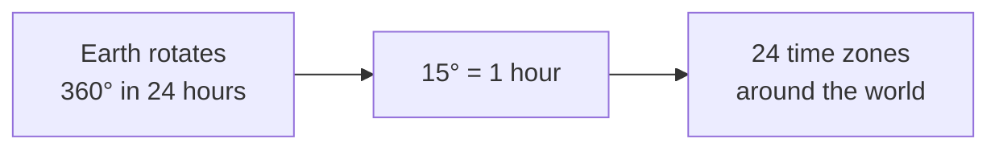
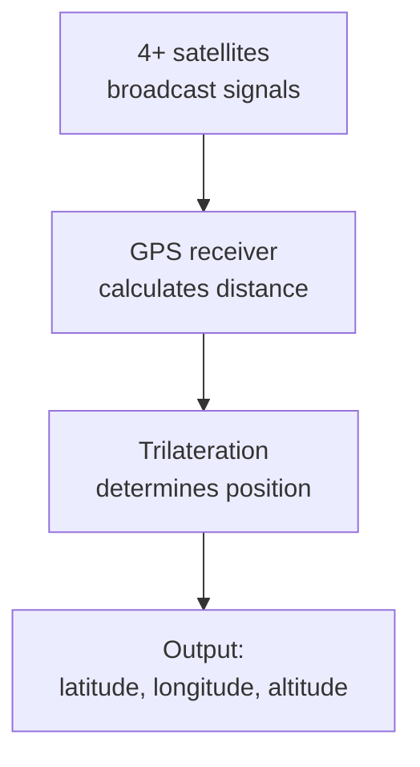

# Geographic Coordinates — พิกัดภูมิศาสตร์

> *"With coordinates, any point on Earth can be precisely located — the foundation of navigation, mapping, and GPS."*

Geographic Coordinates teaches students how to locate any point on Earth using latitude and longitude. Students learn about the coordinate system, time zones, map projections, and modern GPS technology.

---

## 1 | Grade Band Breakdown

| Grade | Key Content |
|---|---|
| **ป.1–3** | — |
| **ป.4–6** | Latitude/longitude intro, finding places on map |
| **ม.1–3** | Coordinate calculation, time zones, hemispheres |
| **ม.4–6** | Map projections, GPS technology, survey methods |

---

## 2 | The Geographic Grid

### Latitude (ละติจูด)

| Aspect | Details |
|---|---|
| **Definition** | Angular distance north/south of equator |
| **Range** | 0° (Equator) to 90° (Poles) |
| **Direction** | North (N) or South (S) |
| **Lines** | Called "parallels" (เส้นขนาน) — run east-west |
| **Length** | ~111 km per degree |

### Important Latitudes

| Line | Thai | Latitude | Significance |
|---|---|---|---|
| **Equator** | เส้นศูนย์สูตร | 0° | Divides N/S hemispheres |
| **Tropic of Cancer** | เส้นทรอปิกออฟแคนเซอร์ | 23.5°N | Northern tropics |
| **Tropic of Capricorn** | เส้นทรอปิกออฟแคปริคอร์น | 23.5°S | Southern tropics |
| **Arctic Circle** | เส้นอาร์กติกเซอร์เคิล | 66.5°N | Polar day/night |
| **Antarctic Circle** | เส้นแอนตาร์กติกเซอร์เคิล | 66.5°S | Polar day/night |

### Longitude (ลองจิจูด)

| Aspect | Details |
|---|---|
| **Definition** | Angular distance east/west of Prime Meridian |
| **Range** | 0° to 180° E or W |
| **Direction** | East (E) or West (W) |
| **Lines** | Called "meridians" (เส้นเมริเดียน) — run north-south |
| **Prime Meridian** | 0° — passes through Greenwich, England |

---

## 3 | Locating Places

### Coordinate Format

| Format | Example (Bangkok) |
|---|---|
| **Degrees, Minutes, Seconds (DMS)** | 13°45'N, 100°30'E |
| **Decimal Degrees (DD)** | 13.75°, 100.50° |

### Thailand's Geographic Extent

| Point | Location | Coordinates |
|---|---|---|
| **Northernmost** | Chiang Rai | 20°27'N |
| **Southernmost** | Narathiwat (Betong) | 5°37'N |
| **Easternmost** | Ubon Ratchathani | 105°37'E |
| **Westernmost** | Mae Hong Son | 97°22'E |
| **Center** | Bangkok | 13°45'N, 100°30'E |

### Major World Cities

| City | Latitude | Longitude |
|---|---|---|
| **London** | 51.5°N | 0° |
| **New York** | 40.7°N | 74°W |
| **Tokyo** | 35.7°N | 139.7°E |
| **Sydney** | 33.9°S | 151.2°E |
| **Singapore** | 1.3°N | 103.8°E |

---

## 4 | Time Zones (เขตเวลา)

### How Time Zones Work

| Concept | Thai | Description |
|---|---|---|
| **Prime Meridian** | เส้นเมริเดียนแรก | 0° at Greenwich, base for time |
| **UTC/GMT** | เวลามาตรฐานสากล | Coordinated Universal Time |
| **Time zone** | เขตเวลา | 15° of longitude = 1 hour difference |
| **International Date Line** | เส้นแบ่งวันสากล | ~180° — date changes |

### Thailand's Time

| Aspect | Details |
|---|---|
| **Time zone** | ICT (Indochina Time) |
| **UTC offset** | UTC+7 |
| **Daylight saving** | None (doesn't observe) |
| **Same time zone** | Vietnam, Laos, Cambodia, Indonesia (WIB) |

### World Time Zone Comparison

| City | UTC Offset | Difference from Bangkok |
|---|---|---|
| **Bangkok** | UTC+7 | — |
| **Tokyo** | UTC+9 | +2 hours |
| **London** | UTC+0 | -7 hours |
| **New York** | UTC-5 | -12 hours |
| **Los Angeles** | UTC-8 | -15 hours |
| **Sydney** | UTC+10 | +3 hours |
| **Dubai** | UTC+4 | -3 hours |

---

## 5 | Map Projections (การฉายแผนที่)

| Projection | Thai | Description | Distortion |
|---|---|---|---|
| **Mercator** | เมอร์เคเตอร์ | Cylindrical — accurate direction | Size distorted near poles |
| **Robinson** | โรบินสัน | Compromise — balanced | Slight distortion all |
| **Gall-Peters** | กอล-ปีเตอร์ส | Equal-area — accurate size | Shape distorted |
| **Azimuthal** | แอซิมัท | Polar view | Distance from center |

### The Problem with Mercator

| Issue | Description |
|---|---|
| **Greenland illusion** | Greenland appears same size as Africa (Africa is 14× larger) |
| **Eurocentric** | Europe appears centered and enlarged |
| **Navigation use** | Good for ships — compass directions are accurate |

---

## 6 | GPS Technology (ระบบจีพีเอส)

| System | Thai | Owner | Satellites |
|---|---|---|---|
| **GPS** | จีพีเอส | USA | 31 |
| **GLONASS** | กลอนัส | Russia | 24 |
| **Galileo** | กาลิเลโอ | EU | 30 |
| **BeiDou** | เปย์ต้าว | China | 35 |
| **QZSS** | คิวแซส | Japan | 4 (regional) |

### How GPS Works

| Component | Function |
|---|---|
| **Satellites** | Broadcast time and position signals |
| **Receiver** | Calculates distance from each satellite |
| **Trilateration** | 4+ satellites needed for 3D position |
| **Accuracy** | 3-5 meters (civilian), cm-level (survey) |

---

## 7 | Survey Methods (ม.4-6)

| Method | Thai | Description |
|---|---|---|
| **Triangulation** | การวัดสามเหลี่ยม | Measure angles from known points |
| **Total station** | สถานีวัดรวม | Electronic distance + angle measurement |
| **GNSS survey** | สำรวจด้วยดาวเทียม | GPS-based precise survey |
| **Photogrammetry** | การถ่ายวัดจากภาพ | Measurements from aerial photos |
| **Lidar** | ไลดาร์ | Laser scanning for 3D models |

---

## 8 | Upper Secondary (ม.4-6): Advanced Applications

### GIS Analysis Types

| Analysis | Thai | Application |
|---|---|---|
| **Buffer analysis** | การวิเคราะห์พื้นที่รอบข้าง | Flood zones around rivers |
| **Overlay** | การซ้อนทับชั้นข้อมูล | Combine land use + population |
| **Network analysis** | การวิเคราะห์เครือข่าย | Routing, accessibility |
| **Interpolation** | การประมาณค่า | Estimate values between points |
| **Viewshed** | พื้นที่มองเห็น | What can be seen from a point |

### Remote Sensing (การรับรู้จากระยะไกล)

| Type | Thai | Application |
|---|---|---|
| **Optical** | ภาพถ่ายดาวเทียมแสง | Google Earth, land cover |
| **Radar** | เรดาร์ | All-weather, day/night |
| **Lidar** | ไลดาร์ | 3D terrain, vegetation height |
| **Infrared** | อินฟราเรด | Vegetation health, thermal |
| **Multispectral** | หลายช่วงคลื่น | Crop analysis, mineral mapping |

---

## 9 | Thai Terminology

| Thai | English |
|---|---|
| ละติจูด | Latitude |
| ลองจิจูด | Longitude |
| เส้นศูนย์สูตร | Equator |
| เส้นเมริเดียน | Meridian |
| เขตเวลา | Time zone |
| ระบบพิกัดภูมิศาสตร์ | Geographic coordinate system |
| ระบบระบุตำแหน่งบนโลก | GPS |
| การฉายแผนที่ | Map projection |
| เส้นแบ่งวันสากล | International Date Line |

---

## 10 | Real-World Examples

- **Google Maps** — Uses GPS + GIS to provide navigation worldwide
- **Grab/Uber** — Real-time GPS tracking for ride-hailing
- **Thai agricultural drones** — GPS-guided drones for crop spraying
- **2018 Cave Rescue** — GPS and mapping critical for Thai cave rescue
- **Bangkok BTS** — GPS coordinates for station locations

---

## 11 | Cross-Links

- [[Social Studies - Overview|← Back to Social Studies]]
- [[03_Map_Skills_and_Geographic_Tools|Map Skills]] — Using coordinates on maps
- [[14_Geographic_Skills|Geographic Skills]] — Field methods
- [[01_Geography_of_Thailand|Geography of Thailand]] — Thai coordinates
