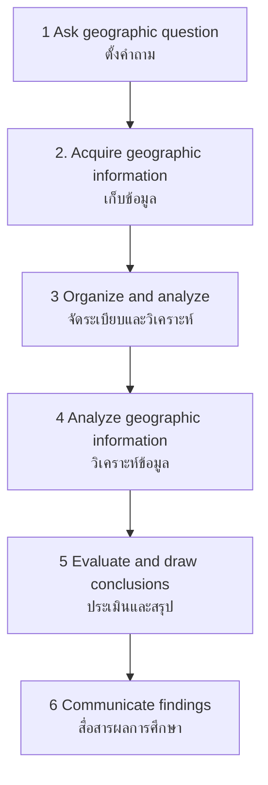

# Geographic Skills — ทักษะทางภูมิศาสตร์

> *"Geography is not just about finding places on a map — it is about understanding how places work and how people interact with their environment."*

Geographic Skills covers the practical methods geographers use to study the world. From field observation to data analysis, students learn to think geographically and conduct real geographic research.

---

## 1 | Grade Band Breakdown

| Grade | Key Content |
|---|---|
| **ป.1–3** | Observation, describing local environment |
| **ป.4–6** | Data collection, simple surveys, drawing maps |
| **ม.1–3** | Geographic analysis, interpreting data, field studies |
| **ม.4–6** | Research methodology, GIS analysis, independent projects |

---

## 2 | Geographic Thinking

| Skill | Thai | Description |
|---|---|---|
| **Spatial thinking** | การคิดเชิงพื้นที่ | Understanding where and why |
| **Observation** | การสังเกต | Noticing geographic features |
| **Description** | การพรรณนา | Recording what is seen |
| **Analysis** | การวิเคราะห์ | Understanding causes and patterns |
| **Explanation** | การอธิบาย | Why patterns exist |
| **Prediction** | การพยากรณ์ | What may happen |
| **Evaluation** | การประเมิน | Assessing solutions |
| **Decision-making** | การตัดสินใจ | Choosing best course |

---

## 3 | The Geographic Inquiry Method

### Step Details

| Step | Question | Methods |
|---|---|---|
| **Ask** | What do you want to know? | Define research question |
| **Acquire** | Where will you get data? | Fieldwork, maps, satellite, census |
| **Organize** | How will you structure data? | Tables, databases, GIS |
| **Analyze** | What patterns do you see? | Statistics, spatial analysis |
| **Evaluate** | What do findings mean? | Interpretation, conclusions |
| **Communicate** | How will you share? | Reports, maps, presentations |

---

## 4 | Fieldwork Methods (การภาคสนาม)

### Observation and Recording

| Method | Thai | Description |
|---|---|---|
| **Field sketch** | การวาดภาพภาคสนาม | Draw what you see |
| **Photography** | การถ่ายภาพ | Document features |
| **Note-taking** | การจดบันทึก | Record observations |
| **Measurement** | การวัด | Temperature, wind, stream flow |
| **Sampling** | การเก็บตัวอย่าง | Systematic collection |
| **Interviewing** | การสัมภาษณ์ | Ask local people |

### Field Instruments

| Instrument | Thai | Measurement |
|---|---|---|
| **Compass** | เข็มทิศ | Direction |
| **GPS unit** | จีพีเอส | Location coordinates |
| **Clinometer** | คลินอมิเตอร์ | Slope angle |
| **Thermometer** | เทอร์โมมิเตอร์ | Temperature |
| **Anemometer** | แอนิโมมิเตอร์ | Wind speed |
| **Rain gauge** | เครื่องวัดฝน | Rainfall |
| **pH meter** | เครื่องวัด pH | Water acidity |
| **Flow meter** | เครื่องวัดอัตราการไหล | Stream velocity |

---

## 5 | Data Collection Methods

### Primary Data (ข้อมูลปฐมภูมิ)

| Method | Thai | Description |
|---|---|---|
| **Field survey** | การสำรวจภาคสนาม | Direct measurement |
| **Questionnaire** | แบบสอบถาม | Structured data collection |
| **Interview** | การสัมภาษณ์ | In-depth responses |
| **Observation** | การสังเกต | Record what is seen |
| **Experiment** | การทดลอง | Controlled testing |

### Secondary Data (ข้อมูลทุติยภูมิ)

| Source | Thai | Examples |
|---|---|---|
| **Government statistics** | สถิติของรัฐ | NSO census, economic data |
| **Maps** | แผนที่ | Topographic, thematic |
| **Satellite imagery** | ภาพถ่ายดาวเทียม | Google Earth, Landsat |
| **Academic publications** | สิ่งพิมพ์วิชาการ | Journals, books |
| **News and reports** | ข่าวและรายงาน | Media, NGO reports |

---

## 6 | Data Analysis

### Statistical Analysis

| Technique | Thai | Application |
|---|---|---|
| **Mean, median, mode** | ค่าเฉลี่ย | Central tendency |
| **Standard deviation** | ส่วนเบี่ยงเบนมาตรฐาน | Data spread |
| **Correlation** | ความสัมพันธ์ | Relationship between variables |
| **Regression** | การถดถอย | Predict trends |
| **Spatial statistics** | สถิติเชิงพื้นที่ | Geographic patterns |

### Spatial Analysis (การวิเคราะห์เชิงพื้นที่)

| Technique | Thai | Application |
|---|---|---|
| **Mapping** | การทำแผนที่ | Visualize patterns |
| **Buffer** | พื้นที่รอบข้าง | Distance-based zones |
| **Overlay** | การซ้อนทับ | Layer multiple variables |
| **Hotspot analysis** | วิเคราะห์จุดร้อน | Cluster identification |
| **Network analysis** | วิเคราะห์เครือข่าย | Routing, accessibility |

---

## 7 | Presenting Geographic Information

### Visual Methods

| Method | Thai | Best For |
|---|---|---|
| **Map** | แผนที่ | Spatial distribution |
| **Graph** | กราฟ | Trends over time |
| **Chart** | แผนภูมิ | Comparisons |
| **Diagram** | แผนภาพ | Processes |
| **Photograph** | ภาพถ่าย | Field evidence |
| **Infographic** | อินโฟกราฟิก | Combined visual |
| **GIS map** | แผนที่ GIS | Multi-layer analysis |

### Graph Types

| Graph | Thai | Use |
|---|---|---|
| **Line graph** | กราฟเส้น | Change over time |
| **Bar graph** | กราฟแท่ง | Comparing categories |
| **Pie chart** | กราฟวงกลม | Proportions |
| **Scatter plot** | กราฟกระจาย | Correlation |
| **Population pyramid** | พีระมิดประชากร | Age-sex structure |

---

## 8 | Geographic Research Project Framework

### Steps for Student Project

| Step | Thai | Description |
|---|---|---|
| **1. Topic selection** | เลือกหัวข้อ | Choose geographic phenomenon |
| **2. Research question** | ตั้งคำถามวิจัย | What, where, why? |
| **3. Literature review** | ตรวจสอบเอกสาร | What is already known |
| **4. Methodology** | ระเบียบวิธี | How will you study it |
| **5. Data collection** | เก็บรวบรวมข้อมูล | Fieldwork, surveys |
| **6. Analysis** | วิเคราะห์ | Process data |
| **7. Conclusion** | สรุป | Answer research question |
| **8. Presentation** | นำเสนอ | Report, map, presentation |

---

## 9 | Upper Secondary (ม.4-6): Advanced Methods

### GIS Software

| Software | Type | Use |
|---|---|---|
| **QGIS** | Open-source | Free GIS analysis |
| **ArcGIS** | Commercial | Industry standard |
| **Google Earth Pro** | Free | Visualization, measurement |
| **Google Earth Engine** | Cloud | Satellite imagery analysis |
| **MapInfo** | Commercial | Desktop mapping |

### Remote Sensing Analysis

| Technique | Thai | Application |
|---|---|---|
| **Land cover classification** | การจำแนกพื้นที่ปกคลุม | Map forests, urban areas |
| **Change detection** | การตรวจจับการเปลี่ยนแปลง | Deforestation, urban growth |
| **Vegetation index (NDVI)** | ดัชนีพืชพรรณ | Crop health, biomass |
| **Thermal analysis** | การวิเคราะห์ความร้อน | Urban heat islands |
| **Flood mapping** | การทำแผนที่น้ำท่วม | Disaster assessment |

### Ethnographic Methods

| Method | Thai | Description |
|---|---|---|
| **Participant observation** | การสังเกตแบบมีส่วนร่วม | Live with community |
| **Oral histories** | ประวัติศาสตร์มุขปาฐะ | Record local knowledge |
| **Community mapping** | การทำแผนที่ร่วมกับชุมชน | Locals draw their maps |
| **Focus groups** | กลุ่มสนทนา | Group discussion |

---

## 10 | Thai Terminology

| Thai | English |
|---|---|
| การสำรวจภาคสนาม | Fieldwork |
| การสังเกต | Observation |
| การเก็บข้อมูล | Data collection |
| การวิเคราะห์เชิงพื้นที่ | Spatial analysis |
| ระเบียบวิธีวิจัย | Research methodology |
| แบบสอบถาม | Questionnaire |
| การสัมภาษณ์ | Interview |
| การนำเสนอ | Presentation |

---

## 11 | Real-World Examples

- **Community mapping** — Thai villages map flood risk with local knowledge
- **NSO census** — National Statistical Office collects demographic data every 10 years
- **Google Earth** — Free tool for exploring anywhere on Earth
- **Disaster mapping** — Volunteers create maps during floods using OpenStreetMap
- **Thai school field trips** — Students visit local temples, rivers, farms for geographic study

---

## 12 | Cross-Links

- [[Social Studies - Overview|← Back to Social Studies]]
- [[03_Map_Skills_and_Geographic_Tools|Map Skills]] — Map-making tools
- [[13_Geographic_Coordinates|Geographic Coordinates]] — Locating places
- [[10_Environmental_Conservation|Environmental Conservation]] — Environmental fieldwork
