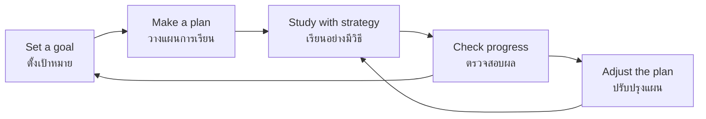

# Educational Guidance — การแนะแนวการศึกษา

> *"Educational guidance helps students learn how to learn, set goals, and choose the pathway that fits who they are."*

Educational guidance is the domain of กิจกรรมแนะแนว that supports students in managing their own learning. It covers everything from adjusting to school in ป.1 to choosing a university program in ม.6. Unlike classroom teaching, guidance works on the **learner's relationship with learning itself**: how they plan, how they cope with difficulty, how they choose between pathways, and how they prepare for transitions.

In the Thai system, educational guidance becomes most visible at three decision points: the move from primary to secondary (ป.6 → ม.1), the choice of upper-secondary stream (ม.3 → ม.4: วิทย์-คณิต, ศิลป์-คำนวณ, ศิลป์-ภาษา, วิชาชีพ), and the transition to higher education or work (ม.6).

---

## 1 | Grade Band Breakdown

| Grade | Key Content |
|---|---|
| **ป.1–3** | Adjusting to school routines, asking for help, simple learning habits, following classroom rules, homework routines |
| **ป.4–6** | Study strategies (note-taking, review), setting simple goals, discovering strengths and learning preferences, basic test-taking skills, preparing for ป.6 → ม.1 transition |
| **ม.1–3** | Self-assessment of interests and aptitudes, choosing an upper-secondary or vocational pathway, study planning, time management, exam preparation (O-NET ม.3) |
| **ม.4–6** | Higher-education program research, application systems (Admissions, กสพท., portfolio), scholarship awareness, transition planning, independent study skills |

---

## 2 | The Learning Cycle

Educational guidance teaches students that learning is a manageable process, not something that "just happens":

### Study Strategies by Age

| Strategy | Thai | ป.4–6 version | ม.1–6 version |
|---|---|---|---|
| Spaced review | การทบทวนแบบเว้นระยะ | Review a little each day, not all at once | Schedule: day 1, day 3, day 7, day 30 after learning |
| Active recall | การทดสอบตนเอง | Close the book and retell the lesson | Practice tests, flashcards, teaching a friend |
| Note-taking | การจดบันทึก | Write key words and pictures | Cornell notes, mind maps, summary sheets |
| Interleaving | การสลับวิชา | Don't study one subject all evening | Alternate subjects in one session |
| Prioritization | การจัดลำดับความสำคัญ | Do homework before play | Rank tasks: urgent + important first |

---

## 3 | The Three Thai Transition Points

### Transition 1: ป.6 → ม.1

| Concern | Guidance response |
|---|---|
| New, larger school | School visits, orientation, buddy systems |
| Many teachers instead of one | Organizational skills, planner use |
| Harder subjects | Study-skills workshops, homework routines |
| New social environment | Friendships, joining clubs, homeroom support |

### Transition 2: ม.3 → ม.4 (Stream Choice)

| Stream | Thai | Suits students who... |
|---|---|---|
| Science-Math | วิทย์-คณิต | Enjoy logic, calculation, laboratory work; aim for medicine, engineering, science |
| Math-Arts (Calculation) | ศิลป์-คำนวณ | Prefer mixed quantitative/qualitative thinking; aim for business, economics, architecture |
| Language-Arts | ศิลป์-ภาษา | Love languages, communication, humanities; aim for law, communication arts, translation |
| Vocational | อาชีวศึกษา | Prefer hands-on learning; aim for skilled trades, technical careers, immediate employability |

**Guidance principle:** The choice should rest on three legs — ความสนใจ (interest), ความถนัด (aptitude), and โอกาสในอนาคต (future opportunity). One leg alone (e.g., "my friends are going วิทย์-คณิต") is a weak foundation.

### Transition 3: ม.6 → University / Work

| Pathway | Key preparation |
|---|---|
| University (Admissions) | Understanding the point system, subject requirements, portfolio |
| University (กสพท.) | Direct admission tests, interviews, program-specific exams |
| Vocational college | Skill portfolios, hands-on assessment |
| Direct employment | Resume, interview skills, workplace readiness |

---

## 4 | OBEC Guidance Stages

| Stage | Thai | Level | Education emphasis |
|---|---|---|---|
| Career Awareness | การตระหนักรู้ด้านอาชีพ | ป.1–6 | Learning routines, school adjustment, seeing how learning connects to life |
| Career Exploration | การสำรวจอาชีพ | ม.1–3 | Discovering interests, choosing upper-secondary pathway |
| Career Preparation & Assimilation | การเตรียมความพร้อมและปรับตัวสู่อาชีพ | ม.4–6 | Higher-education planning, admission systems, transition to work |

---

## 5 | Common Activities in Thai Schools

| Activity | Thai | What it looks like |
|---|---|---|
| Guidance period (แนะแนว) | คาบแนะแนว | Weekly homeroom lesson on study skills, planning, career information |
| Aptitude-interest inventory | แบบวัดแววอาชีพ | OBEC-provided self-assessment; a conversation starter, not a verdict |
| Study-skills workshop | กิจกรรมทักษะการเรียน | Note-taking, memory techniques, exam strategy |
| University visit | ศึกษาดูงาน/เยี่ยมมหาวิทยาลัย | ม.5–6 students tour campuses, attend open houses |
| Individual counseling | ให้คำปรึกษารายบุคคล | One-on-one with guidance teacher about learning problems |
| Portfolio development | การจัดทำแฟ้มสะสมงาน | Documenting activities and achievements for admission |

---

## 6 | A Worked Scenario

> **Situation:** Nong Bee, ม.3, must choose her ม.4 stream. She likes biology and helping people, struggles somewhat with physics, and her parents want her in วิทย์-คณิต because "it has more options."

**Guidance approach:**

| Step | Action |
|---|---|
| 1. Self-assessment | Interest inventory + honest grades review: strong in biology, weak in physics |
| 2. Information | Explore programs: nursing, public health, pharmacy — which streams do they accept? |
| 3. Reality check | วิทย์-คณิต requires physics through ม.6; is the struggle a motivation problem or an aptitude gap? |
| 4. Conversation | Guidance teacher facilitates a family discussion weighing interest + aptitude + opportunity |
| 5. Decision with backup | Choose a stream AND identify tutoring/strategy support for weaker subjects |

---

## 7 | Thai Terminology

| Thai | English |
|---|---|
| การแนะแนวการศึกษา | Educational guidance |
| การวางแผนการเรียน | Study planning |
| การจัดการเวลา | Time management |
| การตั้งเป้าหมาย | Goal setting |
| การเลือกเส้นทางการศึกษา | Pathway choice |
| แผนการเรียน | Study plan / track |
| การเปลี่ยนผ่าน | Transition |
| การเรียนรู้ด้วยตนเอง | Self-directed learning |
| แฟ้มสะสมงาน | Portfolio |
| ครูแนะแนว | Guidance teacher/counselor |
| คะแนนสอบ | Exam score |
| การสอบเข้า | Entrance examination |

---

## 8 | Real-World Examples

- **TCAS / Admissions system** — Thailand's university admission rounds; guidance teachers run information sessions for ม.6 students and parents
- **แบบวัดแววอาชีพ** — OBEC's online interest inventory at guidestudent.obec.go.th, used as a reflection starting point in ม.1–3
- **After-school tutoring decisions** — Guidance helps families decide whether tutoring addresses a real gap or just anxiety
- **Scholarship applications** — กองทุนการศึกษาเพื่อความเสมอภาค, university scholarships, organization grants

---

## 9 | Cross-Links

- [[00_overview|Guidance Overview (BOK)]]
- [[02_Career_Guidance|Career Guidance]] — Educational pathways lead to careers
- [[03_Personal_Guidance|Personal Guidance]] — Motivation and confidence support learning
- [[../02 Student Activities/03_Clubs|Clubs]] — Academic clubs reinforce learning
- [[../../body-of-knowledge/Career and Technology/Career and Technology - Overview|Career and Technology (BOK)]] — Vocational pathways
