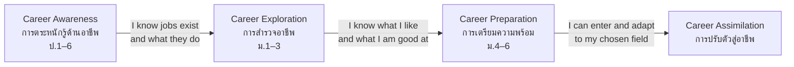

# Career Guidance — การแนะแนวอาชีพ

> *"Career guidance is not about choosing a job early — it is a 12-year process of discovering who you are and what you can contribute."*

Career guidance develops students' understanding of the world of work and their own place in it. The OBEC framework structures this as three developmental stages — **Career Awareness** (ป.1–6), **Career Exploration** (ม.1–3), and **Career Preparation & Assimilation** (ม.4–6) — each deeper than the last. The aim is a student who can make informed, self-directed career decisions, not one who follows a test result.

---

## 1 | Grade Band Breakdown

| Grade | Key Content |
|---|---|
| **ป.1–3** | Recognizing community jobs (teacher, doctor, farmer, shopkeeper, police), understanding that work helps people, pretending and play around occupations |
| **ป.4–6** | Career awareness: the variety of occupations, work values, what parents and community members do, how school subjects connect to jobs |
| **ม.1–3** | Career exploration: interests, aptitudes, personality, work-experience activities, career days, considering ม.4 streams with careers in mind |
| **ม.4–6** | Career preparation: employability skills, portfolio, workplace visits and internships, university program research, adapting to professional expectations |

---

## 2 | The OBEC Three-Stage Model

| Stage | Guiding question | Typical activities |
|---|---|---|
| **Awareness** | "What jobs exist? What do they do?" | Career stories, family job sharing, community walks |
| **Exploration** | "What suits me? What routes exist?" | Interest inventories, career day, workplace visits, work-experience camps |
| **Preparation** | "What must I do to get in and thrive?" | Subject planning, portfolio, internships, interview practice |
| **Assimilation** | "How do I adapt to real work?" | Internships, mentorship, workplace etiquette, professional skills |

---

## 3 | Knowing Yourself: The Three-Legged Stool

A sound career decision rests on three legs:

| Leg | Thai | Questions to ask | Tools |
|---|---|---|---|
| **Interest** | ความสนใจ | What do I enjoy doing for hours? What do I read about voluntarily? | Interest inventories, hobby review |
| **Aptitude** | ความถนัด | What comes easily? What do others say I am good at? What do my grades show? | Aptitude tests, grades, teacher feedback |
| **Values** | ค่านิยม | What kind of life do I want? Stability or adventure? Income or service? Independence or teamwork? | Values card sorts, reflection |

**Pitfall:** An interest inventory is a **conversation starter, not a verdict**. It says "you might explore this," never "you must become this."

---

## 4 | The Thai Career Landscape

Guidance introduces students to major career clusters and their typical pathways:

| Cluster | Thai examples | Typical preparation |
|---|---|---|
| Health sciences | แพทย์, พยาบาล, เภสัชกร, กายภาพบำบัด | วิทย์-คณิต → medical/nursing faculty (highly competitive) |
| Engineering | วิศวกรเครื่องกล, ไฟฟ้า, ซอฟต์แวร์ | วิทย์-คณิต → engineering faculty |
| Business | บัญชี, การตลาด, การเงิน, ผู้ประกอบการ | ศิลป์-คำนวณ / วิทย์-คณิต → business school |
| Law & public administration | ทนายความ, ราชการ, การทูต | ศิลป์-ภาษา → law, political science |
| Education | ครู, นักวิชาการศึกษา | Any stream → education faculty |
| Technology & digital | โปรแกรมเมอร์, นักวิเคราะห์ข้อมูล, ดีไซเนอร์ | วิทย์-คณิต / portfolio routes → CS, IT, digital media |
| Skilled trades | ช่างยนต์, ช่างไฟฟ้า, เชฟ, ช่างเสริมสวย | อาชีวศึกษา → employment or further study |
| Creative industries | นักดนตรี, นักออกแบบ, ครีเอเตอร์ | ศิลปะ / portfolio routes → fine & applied arts |

---

## 5 | Common Activities

| Activity | Thai | Stage | What it develops |
|---|---|---|---|
| Career day | วันอาชีพ | Awareness/Exploration | Guest speakers describe real work life |
| Interest inventory | แบบวัดแววอาชีพ | Exploration | Self-reflection starting point (OBEC provides one) |
| Workplace visit | การดูงาน | Exploration | Observing real workplaces |
| Work experience | การฝึกประสบการณ์อาชีพ | Exploration/Preparation | OBEC "SUMMER CAMP อาชีพ" placements during break |
| Internship | ฝึกงาน | Preparation | Sustained workplace immersion (ม.4–6) |
| Portfolio | แฟ้มสะสมผลงาน | Preparation | Evidence of skills for admission and employment |
| Career counseling | การให้คำปรึกษาอาชีพ | All | Individual guidance on decisions |
| Mock interview | สัมภาษณ์จำลอง | Preparation | Interview skills for admission/jobs |

---

## 6 | A Worked Scenario

> **Situation:** Nong Art, ม.5 วิทย์-คณิต, chose the science stream because he liked games and "IT people earn well." Now he is exhausted by physics and realizes he loves the *design* side of games, not the programming.

**Guidance approach:**

| Step | Action |
|---|---|
| 1. Reassess | Separate interest (visual design, storytelling) from the assumed path (programming) |
| 2. Explore adjacent careers | Game artist, UX/UI designer, digital media — what do they actually require? |
| 3. Check the mechanics | Can he enter digital media programs from วิทย์-คณิต? (Often yes — portfolio-based admission exists) |
| 4. Build evidence | Start a portfolio now: drawing practice, small design projects, online courses |
| 5. Reframe, don't panic | Physics remains a graduation requirement but no longer defines his identity |

**Lesson:** Career guidance includes the courage to *revise* a decision when self-knowledge deepens.

---

## 7 | Thai Terminology

| Thai | English |
|---|---|
| การแนะแนวอาชีพ | Career guidance |
| การตระหนักรู้ด้านอาชีพ | Career awareness |
| การสำรวจอาชีพ | Career exploration |
| การเตรียมความพร้อมทางอาชีพ | Career preparation |
| การปรับตัวสู่อาชีพ | Career assimilation |
| แววอาชีพ | Career aptitude |
| ความสนใจ | Interest |
| ความถนัด | Aptitude |
| ค่านิยมในการทำงาน | Work values |
| การฝึกประสบการณ์อาชีพ | Work experience |
| การฝึกงาน | Internship |
| แฟ้มสะสมผลงาน | Portfolio |
| การประกอบอาชีพ / อาชีพ | Career / occupation |

---

## 8 | Real-World Examples

- **แบบวัดแววอาชีพ (OBEC)** — Online interest inventory at guidestudent.obec.go.th used across ม.1–3
- **SUMMER CAMP อาชีพ** — OBEC work-experience program: "ค้นหาตัวตนที่ใช่" during school break
- **University open houses** — ม.5–6 students attend program exhibitions and talk to lecturers
- **Family conversations** — Parents sharing their own career journeys is Awareness-stage guidance at home

---

## 9 | Cross-Links

- [[00_overview|Guidance Overview (BOK)]]
- [[01_Educational_Guidance|Educational Guidance]] — Pathways connect education to career
- [[../02 Student Activities/05_Leadership_Activities|Leadership Activities]] — Workplace-ready soft skills
- [[../../body-of-knowledge/Career and Technology/Career and Technology - Overview|Career and Technology (BOK)]] — Entrepreneurship and practical careers
- [[../../body-of-knowledge/Social Studies/Social Studies - Overview|Social Studies (BOK)]] — Economics of work and sufficiency economy
