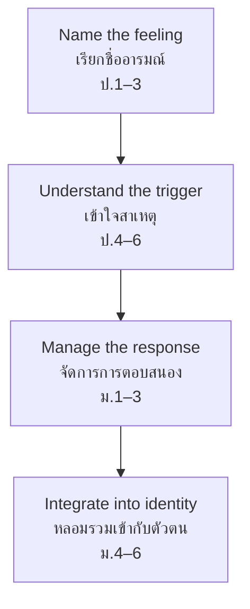

# Personal Guidance — การแนะแนวส่วนตัว

> *"Personal guidance helps students understand their emotions, build self-esteem, and make responsible decisions for their own lives."*

Personal guidance supports the emotional and psychological development of the learner. Where educational guidance works on the *learning* and career guidance works on the *future*, personal guidance works on the *self*: feelings, confidence, identity, stress, and decision-making. In Thai secondary schools — where academic pressure, family expectations, and social comparison all peak during adolescence — this domain is the quiet backbone of student well-being.

---

## 1 | Grade Band Breakdown

| Grade | Key Content |
|---|---|
| **ป.1–3** | Naming feelings (happy, sad, angry, scared), understanding right and wrong, building self-confidence, managing simple emotions, asking trusted adults for help |
| **ป.4–6** | Self-esteem, understanding others' feelings, managing anger and disappointment, basic decision-making, coping with comparison and peer pressure |
| **ม.1–3** | Identity development ("who am I?"), emotional regulation, stress management, responsible decision-making, self-acceptance, body changes and self-image |
| **ม.4–6** | Mental health awareness, resilience building, independent decision-making, managing entrance-exam pressure, life-direction anxiety, preparing for adult independence |

---

## 2 | The Emotional Development Path

Each stage builds on the previous one. A ม.3 student who cannot yet *name* feelings will struggle to *manage* them; guidance starts where the student actually is.

---

## 3 | Key Concepts

| Concept | Thai | Description |
|---|---|---|
| Self-esteem | ความภาคภูมิใจในตนเอง | A realistic, stable sense of one's own worth |
| Self-acceptance | การยอมรับตนเอง | Accepting strengths AND weaknesses without self-hate |
| Emotional regulation | การจัดการอารมณ์ | Feeling the emotion without being controlled by it |
| Self-awareness | การรู้จักตนเอง | Understanding one's values, needs, patterns, and triggers |
| Resilience | ความยืดหยุ่นทางใจ | The capacity to recover from setbacks |
| Decision-making | การตัดสินใจ | Choosing thoughtfully among options, owning the outcome |
| Stress management | การจัดการความเครียด | Reducing and coping with pressure |
| Help-seeking | การขอความช่วยเหลือ | Recognizing when a problem exceeds self-management and asking for support |

---

## 4 | Stress: The Adolescent Constant

### Common Stress Sources by Level

| Level | Typical stressors |
|---|---|
| ป.1–3 | Separation from parents, new rules, being scolded, friendship squabbles |
| ป.4–6 | Grades and homework load, comparison with classmates, bullying, parental expectations |
| ม.1–3 | Stream choice pressure, body changes, first romantic feelings, social media comparison, identity questions |
| ม.4–6 | University entrance exams, future anxiety, family expectations vs. own wishes, romantic relationships, financial concerns |

### The Stress Curve

A moderate amount of stress *improves* performance; too little brings boredom, too much brings collapse:

| Zone | Arousal level | State | What guidance teaches |
|---|---|---|---|
| Under-stimulated | Too low | Boredom, carelessness | Find meaning, set challenges |
| Optimal zone | Moderate | Focused, energized | Protect this zone: sleep, breaks, planning |
| Over-stressed | Too high | Anxiety, freeze, avoidance | Reduce load, breathing, reframing, seek help |

### Healthy Coping Menu

| Category | Examples |
|---|---|
| Physical | Exercise, adequate sleep, deep breathing, eating regularly |
| Mental | Breaking tasks into steps, reframing ("this is hard" not "I am stupid"), journaling |
| Social | Talking to friends, family, guidance teacher; asking for help |
| Meaning | Remembering goals, connecting effort to purpose, sufficiency mindset (พอเพียง) |
| **Unhealthy (to recognize)** | Avoidance, doom-scrolling, self-harm, substances, isolation — signals to seek adult help |

---

## 5 | Decision-Making Frameworks

### The 5-Step Decision (suitable ป.4 up)

| Step | Thai | Example: choosing an elective club |
|---|---|---|
| 1. Define the choice | กำหนดปัญหา | "Which club should I join this term?" |
| 2. List options | หาทางเลือก | Art, English, football, volunteering |
| 3. Weigh consequences | พิจารณาผลตามมา | What do I gain/lose from each? What do others gain/lose? |
| 4. Choose and act | ตัดสินใจและลงมือ | Choose English club |
| 5. Review | ทบทวน | After a month: was it right? Adjust if not |

### Values Check (suitable ม.1 up)

Before a big decision, ask three questions: **Is it true to who I am? Is it fair to those affected? Can I own the outcome?**

---

## 6 | Common Activities

| Activity | Thai | What it develops |
|---|---|---|
| Feelings vocabulary (ป.1–3) | การเรียกชื่อความรู้สึก | Emotional literacy through cards, faces, stories |
| Reflection journal | บันทึกการสะท้อนคิด | Writing about feelings and events |
| Individual counseling | การให้คำปรึกษารายบุคคล | Private support for personal concerns |
| Group counseling | การให้คำปรึกษาเป็นกลุ่ม | Shared struggles, peer support, normalizing |
| Values clarification | การจำแนกค่านิยม | Sorting what matters most |
| Mindfulness practice | การฝึกสติ | Breathing and awareness exercises |
| Goal-setting workshop | กิจกรรมตั้งเป้าหมาย | Personal goals and action planning |
| Resilience stories | เรื่องเล่าความยืดหยุ่น | Studying how people recover from failure |

---

## 7 | A Worked Scenario

> **Situation:** Nong Fah, ม.2, has become withdrawn. Grades dropped, she skips club, and a friend tells the homeroom teacher that Fah "says everything is pointless." At home, her parents recently divorced.

**Guidance approach:**

| Step | Action | Principle |
|---|---|---|
| 1. Open the door | Guidance teacher invites her for a casual chat — no forms, no labels | Rapport before assessment |
| 2. Listen first | Let her tell her story without immediate advice | Being heard is itself therapeutic |
| 3. Assess scope | Sleep, appetite, self-harm thoughts, duration — is this within school support or needing referral? | Know the boundary: schools counsel, clinics treat |
| 4. Normalize | "Many students carry family pain. It is not your fault, and you are not alone." | Reducing shame |
| 5. Small wins | One achievable goal this week (attend club once, talk to one friend) | Rebuilding agency gradually |
| 6. Loop in support | With consent, coordinate homeroom teacher and, where appropriate, parents; refer to mental-health services if red flags appear | The student is never handled alone |

---

## 8 | Thai Terminology

| Thai | English |
|---|---|
| การแนะแนวส่วนตัว | Personal guidance |
| อารมณ์ | Emotion |
| ความภาคภูมิใจในตนเอง | Self-esteem |
| การยอมรับตนเอง | Self-acceptance |
| การจัดการอารมณ์ | Emotional regulation |
| ความยืดหยุ่นทางใจ | Resilience |
| การตัดสินใจ | Decision-making |
| ความเครียด | Stress |
| การจัดการความเครียด | Stress management |
| สุขภาพจิต | Mental health |
| การขอความช่วยเหลือ | Help-seeking |
| ครูแนะแนว / ครูที่ปรึกษา | Guidance teacher / homeroom adviser |

---

## 9 | Real-World Examples

- **Entrance-exam stress (ม.6)** — Schools run stress-management sessions before A-Level/O-NET rounds
- **Bullying and self-worth** — Guidance teachers mediate, support the victim, and address the aggressor's behavior in parallel
- **Divorce/loss at home** — Long-term quiet support, coordination with families, watch for academic signals
- **Social media comparison** — Workshops distinguishing curated feeds from real life; digital self-image
- **OBEC mental-health direction** — สพฐ. has been upgrading teacher capacity in mental-health first aid and coaching

---

## 10 | Cross-Links

- [[00_overview|Guidance Overview (BOK)]]
- [[04_Social_Guidance|Social Guidance]] — Personal and social development are intertwined
- [[05_Life_Skills_and_Well-being|Life Skills and Well-being]] — Coping, safety, mental health
- [[../../body-of-knowledge/Health and PE/Health and PE - Overview|Health & PE (BOK)]] — Mental health strand
