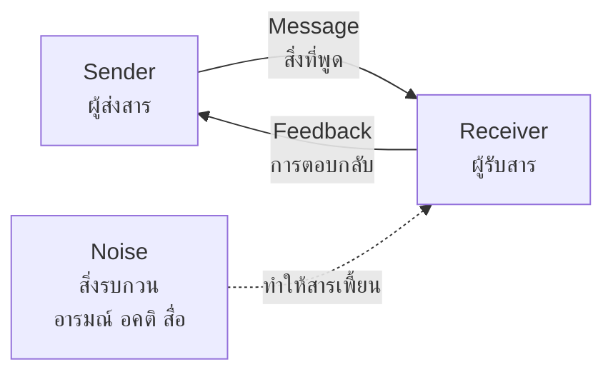

# Social Guidance — การแนะแนวสังคม

> *"Social guidance helps students build healthy relationships, communicate effectively, and participate responsibly in their community."*

Social guidance develops the interpersonal side of the learner: friendship, communication, cooperation, conflict resolution, and responsible participation — including online. In a culture that values ความสัมพันธ์ (relationships) and ความสามัคคี (harmony), social guidance also gives students tools to handle the hard parts of group life: peer pressure, cliques, bullying, and disagreement.

---

## 1 | Grade Band Breakdown

| Grade | Key Content |
|---|---|
| **ป.1–3** | Making friends, sharing, taking turns, following rules, polite words (ขอโทษ ขอบคุณ สวัสดี), respectful communication with adults |
| **ป.4–6** | Teamwork, active listening, understanding differences, basic conflict resolution, online etiquette, recognizing bullying |
| **ม.1–3** | Peer relationships and pressure, managing conflicts, responsible social media use, romantic feelings and boundaries, social roles |
| **ม.4–6** | Professional communication, leadership in groups, civic participation, networking, managing complex relationships, digital reputation |

---

## 2 | Communication: The Core Skill

### The Communication Loop

Guidance teaches that misunderstandings usually come from *noise* — assumptions, emotions, distractions — not from bad intentions.

### Active Listening (การฟังอย่างตั้งใจ)

| Element | What it looks like | What to avoid |
|---|---|---|
| Full attention | Face the speaker, put the phone down | Listening while scrolling |
| Checking | "So you're saying..." | Jumping to conclusions |
| Clarifying | "What did you mean when you said...?" | Pretending to understand |
| Responding to feeling | "That sounds frustrating." | Only solving the problem |

### I-Messages vs. You-Blame

| Style | Example | Effect |
|---|---|---|
| **You-blame** | "You always take my stuff without asking!" | Defensive, escalates |
| **I-message** | "I felt upset when my pens were taken without asking. I need to be asked first." | Owns the feeling, states the need, opens negotiation |

---

## 3 | Friendship Across Development

| Stage | What friendship means | Common problems | Guidance focus |
|---|---|---|---|
| ป.1–3 | "We play together" | Sharing disputes, exclusion games | Turn-taking, kind words, including others |
| ป.4–6 | "We like the same things" | Cliques, teasing, comparison | Empathy, standing up for others, choosing friends by values |
| ม.1–3 | "They understand me" | Peer pressure, betrayal, romantic feelings, online drama | Authenticity vs. fitting in, boundaries, repair after conflict |
| ม.4–6 | "We support each other's growth" | Drifting apart, envy over success, romantic breakups | Mutual respect, letting friendships change, healthy romance |

### Peer Pressure: The 4-Refusal Method

| Step | Example response |
|---|---|
| 1. Say no clearly | "No, I don't want to." |
| 2. Give a reason (optional) | "I have practice tomorrow." |
| 3. Suggest an alternative | "Let's go get food instead." |
| 4. Leave if pushed | Walk away and tell a trusted adult if it continues |

---

## 4 | Bullying (การกลั่นแกล้ง)

| Form | Thai | Examples |
|---|---|---|
| Physical | ร่างกาย | Hitting, taking belongings |
| Verbal | วาจา | Name-calling, mocking appearance |
| Social/Relational | ทางสังคม | Exclusion, spreading rumors |
| Cyber | ออนไลน์ | Group-chat mocking, fake accounts, sharing private images |

**The three roles** guidance teaches students to recognize: the aggressor (ผู้กลั่นแกล้ง), the target (ผู้ถูกกลั่นแกล้ง), and the bystander (ผู้เห็นเหตุการณ์) — and that a bystander who reports is an *upstander*, not a snitch.

---

## 5 | Digital Citizenship (พลเมืองดิจิทัล)

| Principle | Thai | Practice |
|---|---|---|
| Digital footprint | รอยเท้าดิจิทัล | What you post stays findable — think before posting |
| Respect online | การเคารพออนไลน์ | No mocking, no pile-ons, comment as if face-to-face |
| Privacy | ความเป็นส่วนตัว | Guard personal info and others' images |
| Verify before sharing | ตรวจสอบก่อนแชร์ | Fake news spreads through careless shares |
| Balance | สมดุล | Screen time that crowds out sleep, study, and friends is a problem |

---

## 6 | A Worked Scenario

> **Situation:** A ม.2 class group-chat turns on one boy, Ken, after he misses a shot at the school football final. Memes mocking him spread to other classes. He stops coming to football practice.

**Guidance approach:**

| Step | Action |
|---|---|
| 1. Support the target first | Check on Ken; separate his worth from one match; involve parents as needed |
| 2. Address the chat | Homeroom session on the group-chat effect: "everyone added one small joke — together it was an avalanche" |
| 3. Convert bystanders | Teach the upstander role: one person changing the topic or checking on Ken shifts the whole dynamic |
| 4. Repair, not just punish | Where appropriate, guided apology and a class agreement on chat norms |
| 5. Follow up | Two weeks later: is Ken back at practice? Is the chat calmer? |

---

## 7 | Thai Terminology

| Thai | English |
|---|---|
| การแนะแนวสังคม | Social guidance |
| ทักษะการสื่อสาร | Communication skills |
| การฟังอย่างตั้งใจ | Active listening |
| ความเห็นอกเห็นใจ | Empathy |
| ความร่วมมือ | Cooperation |
| การแก้ไขความขัดแย้ง | Conflict resolution |
| แรงกดดันจากเพื่อน | Peer pressure |
| การกลั่นแกล้ง | Bullying |
| ผู้เห็นเหตุการณ์ | Bystander |
| พลเมืองดิจิทัล | Digital citizenship |
| รอยเท้าดิจิทัล | Digital footprint |
| บทบาททางสังคม | Social roles |

---

## 8 | Real-World Examples

- **Group projects** — Practicing task division, listening, and disagreeing without fighting
- **Class chat groups** — The main arena where ม.1–3 social conflicts actually happen
- **Sports teams** — Learning to lose gracefully and support teammates
- **Student council elections** — Campaigning respectfully and accepting results
- **Welcoming new students** — Buddy programs that turn social skills into school culture

---

## 9 | Cross-Links

- [[00_overview|Guidance Overview (BOK)]]
- [[03_Personal_Guidance|Personal Guidance]] — Self-understanding anchors relationships
- [[05_Life_Skills_and_Well-being|Life Skills and Well-being]] — Refusal skills, safety
- [[../02 Student Activities/04_Student_Organizations|Student Organizations]] — Democracy in practice
- [[../../body-of-knowledge/Social Studies/Social Studies - Overview|Social Studies (BOK)]] — Citizenship and society
