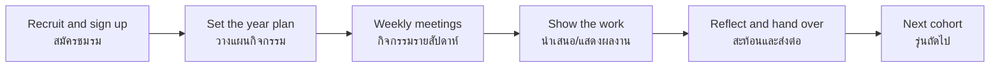

# Clubs — ชมรม/ชุมนุม

> *"Clubs give students a place where learning follows their curiosity, not the exam schedule."*

Clubs (ชมรม or ชุมนุม) are interest-based student activities that let students explore academic subjects, arts, sports, technology, and service beyond the regular classroom. In most Thai schools, club time appears weekly on the timetable; the offerings are decided by each school from student interest, teacher expertise, and resources. Where academics teach *what to know*, clubs teach *how to pursue* — sustained interest, practice, peer teaching, and the experience of getting good at something by choice.

---

## 1 | Grade Band Breakdown

| Grade | Key Content |
|---|---|
| **ป.1–3** | Simple interest groups, games, creative play, story clubs — mostly teacher-led |
| **ป.4–6** | Topic-based clubs (art, science, sports, reading, Thai culture); choosing based on interest; belonging to a group |
| **ม.1–3** | Diverse offerings; sustained participation across terms; skill development; older students assist younger; first taste of running an activity |
| **ม.4–6** | Specialized clubs; student-led with teacher advisors; portfolio building; competition and exhibition preparation; clubs as identity |

---

## 2 | The Club Landscape

| Type | Thai | Typical examples | What it builds |
|---|---|---|---|
| Academic | ชมรมวิชาการ | Math, Science, English, Thai, Social Studies, debate | Depth beyond class, competition skills |
| Arts & Music | ชมรมศิลปะ/ดนตรี | Band, Thai music (ดนตรีไทย), choir, dance, drawing, photography | Expression, performance, discipline of practice |
| Sports | ชมรมกีฬา | Football, basketball, badminton, table tennis, volleyball, takraw | Fitness, teamwork, losing well |
| Technology | ชมรมเทคโนโลยี | Programming, robotics, web design, esports, media production | Making, not just using, technology |
| Service | ชมรมบำเพ็ญประโยชน์ | Volunteering, environment, tutoring juniors | Contribution, empathy |
| Culture | ชมรมวัฒนธรรม | Thai classical dance, local crafts, cultural performance | Heritage, identity |
| Language | ชมรมภาษา | English club, Chinese, Japanese, Korean | Communication, confidence |
| Health | ชมรมสุขภาพ | First aid (with ยุวกาชาด), mental-health awareness | Care for self and others |

---

## 3 | How a Club Year Works

| Stage | Who leads | Notes |
|---|---|---|
| Sign-up fair | School + club leaders | Clubs present to attract members; students choose freely |
| Year plan | Club committee + advisor | Balance practice, projects, events |
| Weekly meetings | Committee with advisor coaching | Attendance, activity, clean-up |
| Showcases | All members | School fairs, competitions, exhibitions, concerts |
| Hand-over | ม.4–6 or ม.6 leaders train juniors | Continuity is the club's real curriculum |

---

## 4 | The Club Committee (คณะกรรมการชมรม)

| Role | Thai | Responsibility |
|---|---|---|
| President | ประธานชมรม | Overall direction, represents the club |
| Vice-president | รองประธาน | Deputizes, coordinates sub-teams |
| Secretary | เลขานุการ | Records, correspondence, member list |
| Treasurer | เหรัญญี | Budget, supplies, honesty about money |
| Activity coordinator | ประสานกิจกรรม | Plans sessions and logistics |
| Teacher advisor | ครูที่ปรึกษาชมรม | Guidance, safeguarding, institutional memory |

**The committee cycle is a leadership apprenticeship:** juniors observe → assist → lead → hand over.

---

## 5 | Key Concepts

| Concept | Thai | Description |
|---|---|---|
| Interest-based learning | การเรียนรู้ตามความสนใจ | Motivation comes from choice |
| Sustained participation | การมีส่วนร่วมอย่างต่อเนื่อง | Skill grows across terms, not one-off events |
| Peer learning | การเรียนรู้จากกันและกัน | Senior members teach juniors |
| Student choice | สิทธิ์การเลือกของผู้เรียน | The club exists because students chose it |
| Leadership | ความเป็นผู้นำ | Committee roles rotate and train successors |
| Exhibition of learning | การนำเสนอผลงาน | Work becomes visible: fairs, competitions, concerts |
| Portfolio evidence | หลักฐานแฟ้มสะสมงาน | ม.4–6 club work feeds admission portfolios |

---

## 6 | A Worked Scenario

> **Situation:** The school's Robotics Club has 8 members, all ม.4–6. Four are ม.6 and will graduate. The teacher advisor worries the club will collapse next year.

**Sustainable club practice:**

| Step | Action |
|---|---|
| 1. Diagnose | The club ran on ม.6 talent; no ม.4–5 members ever held responsibility |
| 2. Recruit deliberately | Run a demo booth at the ม.1–3 club fair; recruit 10 juniors |
| 3. Pair and transfer | Each ม.6 member mentors one or two juniors on a real build |
| 4. Hand the keys over | Juniors run sessions by term 2; seniors advise only |
| 5. Document | A club handbook: what we tried, what broke, what worked |
| 6. Pass the ceremony | Formal hand-over at the last meeting — the club belongs to the new committee |

---

## 7 | Thai Terminology

| Thai | English |
|---|---|
| ชมรม / ชุมนุม | Club |
| วันชมรม / คาบชมรม | Club day / club period |
| สมัครชมรม | Club sign-up |
| คณะกรรมการชมรม | Club committee |
| ประธานชมรม | Club president |
| เลขานุการ | Secretary |
| เหรัญญี | Treasurer |
| ครูที่ปรึกษาชมรม | Club advisor |
| ผลงาน / การแสดงผลงาน | Work / showcase |
| การส่งต่อ | Hand-over / succession |
| การเรียนรู้จากเพื่อน | Peer learning |
| ความสนใจ | Interest |

---

## 8 | Real-World Examples

- **Club fair (ตลาดนัดชมรม)** — Start-of-year marketplace where clubs recruit; students compare before committing
- **Science club → science fair** — Building projects for งานวิทย์ศาสตร์ competitions at district and national levels
- **English club → speech contests** — Weekly practice producing contestants for Speech/Drama competitions
- **Volunteer club → tutoring juniors** — ม.4–5 members tutoring ป. students on weekends
- **Photography club → school archive** — Members documenting every school event; the yearbook depends on them

---

## 9 | Cross-Links

- [[00_overview|Student Activities Overview (BOK)]]
- [[04_Student_Organizations|Student Organizations]] — Governance vs. interest-based participation
- [[05_Leadership_Activities|Leadership Activities]] — Committee work as leadership training
- [[../01 Guidance/02_Career_Guidance|Career Guidance]] — Clubs as career exploration
- [[../../body-of-knowledge/Arts/Arts - Overview|Arts (BOK)]] — Arts clubs
- [[../../body-of-knowledge/Science/00_Fundamental Science - Overview|Science (BOK)]] — Science clubs
