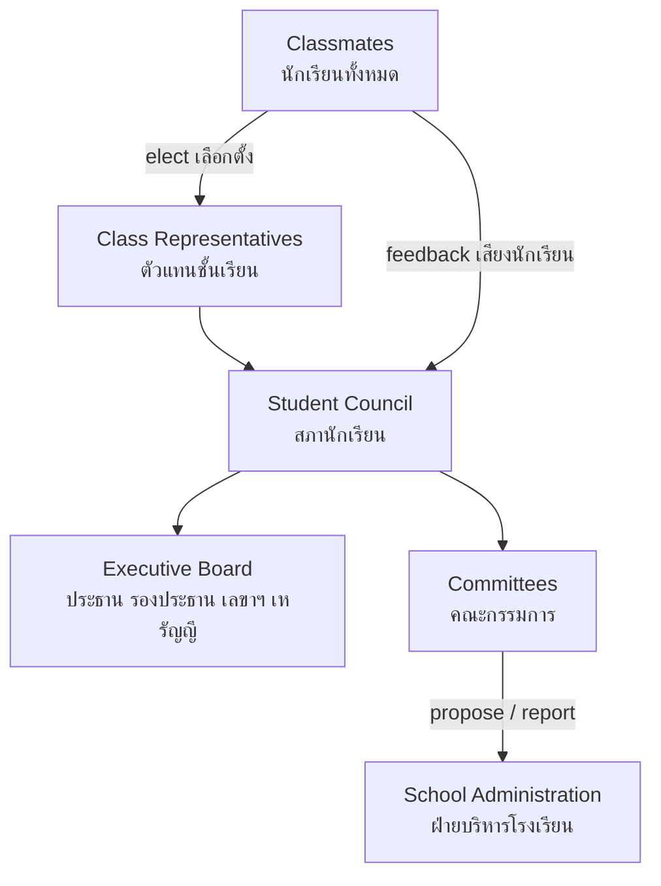

# Student Organizations — องค์กรนักเรียน

> *"The student council is a small democracy: students learn representation, elections, budgets, and the discipline of keeping promises."*

Student Organizations (องค์กรนักเรียน) are the governance structures through which students participate in running school life: student councils, class representative systems, and committees. They exist so that students experience democracy as practice — campaigns, votes, mandates, meetings, budgets, accountability — years before they vote in national elections.

---

## 1 | Grade Band Breakdown

| Grade | Key Content |
|---|---|
| **ป.1–3** | Simple class roles (class leader, line leader, helpers), taking turns, doing a small job well |
| **ป.4–6** | Class representatives, simple student council, voting, helping run school events |
| **ม.1–3** | Full student council with elected officers and committees; representing classmates; event planning; first budget responsibility |
| **ม.4–6** | Advanced governance: policy proposals to school administration, large-event management, mentoring junior councilors, external representation |

---

## 2 | Typical Structure

| Body | Thai | Function |
|---|---|---|
| General assembly | สภานักเรียน (ชุมใหญ่) | All members meet; major decisions |
| Executive board | คณะกรรมการบริหารสภานักเรียน | President, VP, secretary, treasurer |
| Committees | คณะกรรมการต่างๆ | Events, sports, welfare, discipline, PR |
| Class representatives | ตัวแทนชั้นเรียน | Two-way channel between class and council |
| Advisor(s) | ครูที่ปรึกษาสภานักเรียน | Guidance, veto for safety/legality, continuity |

---

## 3 | The Election Cycle (วงจรการเลือกตั้ง)

| Phase | What happens | What students learn |
|---|---|---|
| 1. Registration | Candidates register, form teams | Commitment, eligibility rules |
| 2. Campaign | Posters, speeches, policy platforms | Persuasion with substance; rules vs. vote-buying (giving candy for votes = disqualification lesson) |
| 3. Debate / speech day | Public policy speeches | Public speaking, answering questions |
| 4. Vote | Secret ballot, student election committee, counting | One person one vote; counting transparency |
| 5. Announcement and transition | Results, hand-over from the old council | Winning and losing gracefully |
| 6. Term of office | Meetings, projects, reports | Governing is slower and harder than promising |

**The classic lesson:** candidates promise "air conditioning in every room," then discover the council's actual budget — and learn that credible promises are specific, feasible, and budgeted.

---

## 4 | What Student Councils Actually Do

| Domain | Thai | Examples |
|---|---|---|
| Events | กิจกรรม/งาน | Sports day, Teacher's Day (วันครู), Children's Day (วันเด็ก), school fairs, graduation |
| Student welfare | สวัสดิการนักเรียน | Feedback on canteen food, water points, toilets, lost-and-found |
| Discipline support | เวรรักษาการ | Morning duty, uniform checks (with teachers) |
| Representation | เป็นตัวแทน | Bringing student issues to administrators; joining school committees |
| Service | บำเพ็ญประโยชน์ | Charity drives, disaster relief collections |
| Traditions | ธรรมเนียมโรงเรียน | Maintaining school spirit, alumni ties |

---

## 5 | Meetings and Motions (การประชุม)

A council meeting is a classroom of democracy:

| Element | Thai | Purpose |
|---|---|---|
| Agenda | ระเบียบวาระ | Decide in advance what to decide |
| Quorum | องค์ประชุม | Enough members present for legitimacy |
| Motion | ญัตติ | A proposal stated precisely enough to be voted on |
| Amendment | แก้ไขญัตติ | Improving a proposal without killing it |
| Vote | การลงมติ | Majority (เสียงข้างมาก); chair votes only to break ties |
| Minutes | รายงานการประชุม | What was decided, by whom, who does what by when |
| Action list | มติที่ได้รับมอบหมาย | Decisions become tasks with owners and deadlines |

---

## 6 | Key Concepts

| Concept | Thai | Description |
|---|---|---|
| Representation | การเป็นตัวแทน | Speaking for others' interests, not one's own |
| Mandate | อำนาจที่ได้รับมอบหมาย | Authority granted by election, limited by promises |
| Accountability | ความรับผิดชอบต่อผู้เลือกตั้ง | Reporting back; facing recall or non-reelection |
| Majority and minority | เสียงข้างมาก–ข้างน้อย | Majority decides; minority is heard and protected |
| Transparency | ความโปร่งใส | Open budgets, published minutes |
| Checks and balances | การถ่วงดุล | Advisor's veto, assembly's vote, administration's approval |
| Deliberation | การปรึกษาหารือ | Deciding after hearing, not before |

---

## 7 | A Worked Scenario

> **Situation:** The student council promised "a suggestion system" in its campaign. Six months in, the physical suggestion box is full of complaint notes and the council has opened none in public. Students start mocking the council online.

**Repairing legitimacy:**

| Step | Action |
|---|---|
| 1. Own the failure | President reports openly at assembly: "We collected suggestions and went silent. That was wrong." |
| 2. Set a process | Weekly sorting session; each item answered publicly: doing it / can't do it and why / needs admin approval |
| 3. Fix the channel | Box + a Google/LINE form; log every item with a reference number |
| 4. Report monthly | Three numbers: received, resolved, pending with reasons |
| 5. Deliver something small and fast | One quick win (a new water-point cup rack) proves the system works |
| 6. Protect the principle | Some requests are impossible — explaining *why* honestly is representation; pretending is not |

---

## 8 | Thai Terminology

| Thai | English |
|---|---|
| องค์กรนักเรียน | Student organization |
| สภานักเรียน | Student council |
| ตัวแทนชั้นเรียน | Class representative |
| การเลือกตั้ง | Election |
| ผู้สมัคร | Candidate |
| หาเสียง | Campaigning |
| ลงคะแนนเสียง / ลงมติ | Casting a vote / voting on a motion |
| เสียงข้างมาก | Majority |
| คณะกรรมการ | Committee |
| ประธาน / รองประธาน | President / Vice-president |
| เลขานุการ / เหรัญญี | Secretary / Treasurer |
| ระเบียบวาระ | Agenda |
| ญัตติ | Motion |
| มติที่ประชุม | Resolution of the meeting |
| รายงานการประชุม | Minutes |
| ความโปร่งใส | Transparency |
| ครูที่ปรึกษาสภานักเรียน | Council advisor |

---

## 9 | Real-World Examples

- **สภานักเรียน campaigns** — Posters and speeches before elections; schools enforce no-vote-buying rules
- **วันเด็ก (Children's Day, January)** — Council-organized games and shows for the school and community
- **วันครู (Teacher's Day, January 16)** — Council coordinates honors for teachers
- **Canteen feedback committees** — Reps meet with the canteen operator monthly — the most practical lesson in stakeholder negotiation
- **Charity drives** — Council-run collections after floods or for rural schools

---

## 10 | Cross-Links

- [[00_overview|Student Activities Overview (BOK)]]
- [[03_Clubs|Clubs]] — Interest-based vs. governance-based participation
- [[05_Leadership_Activities|Leadership Activities]] — Council as leadership arena
- [[../../body-of-knowledge/Social Studies/Social Studies - Overview|Social Studies (BOK)]] — Democracy, rights and duties, constitution
