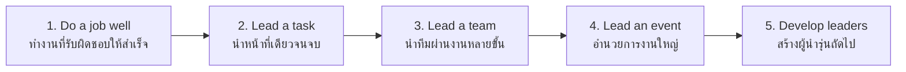

# Leadership Activities — กิจกรรมผู้นำ

> *"Leadership is not a position — it is the practice of planning, communicating, deciding, and taking responsibility so that a group succeeds."*

Leadership activities develop students' capacity to guide groups toward shared goals. In Thai schools, leadership is not taught as a lecture; it is built through progressive roles — class helper → activity leader → patrol leader → committee chair → event director — with reflection on each. The scout patrol system, club committees, and student councils (covered in sibling notes) are the main arenas; this note covers the underlying, transferable craft.

---

## 1 | Grade Band Breakdown

| Grade | Key Content |
|---|---|
| **ป.1–3** | Simple responsibilities (line leader, materials helper), doing a small job until it is done well, helping a friend |
| **ป.4–6** | Leading a small group for one activity; planning a simple task end-to-end; speaking so others can follow |
| **ม.1–3** | Leading events and teams; dividing work; running a meeting; representing a group; mentoring ป. students |
| **ม.4–6** | Strategic planning; leading leaders; project management; conflict resolution at scale; preparing juniors to take over |

---

## 2 | The Leadership Progression Ladder

| Rung | School example | The lesson at that rung |
|---|---|---|
| 1 | Library-book monitor (ป.3) | Reliability is the entry fee of leadership |
| 2 | Lead the cleanup rota (ป.5) | Clear instructions; check the result |
| 3 | Patrol leader at scout camp (ม.1) | Others' failures are yours to solve, not to blame |
| 4 | Sports-day station director (ม.4) | Plan B, timekeeping, delegation, stamina |
| 5 | Council president training the next board (ม.6) | Succession: the group must outlive you |

---

## 3 | Core Leadership Skills

### 3.1 Planning (การวางแผน)

| Element | Question | Tool |
|---|---|---|
| Goal | What does success look like? | One-sentence objective |
| Tasks | What must happen, in what order? | Task list / work-breakdown |
| People | Who does what? | Assignment table (task × owner × deadline) |
| Resources | What do we need (stuff, money, place, permission)? | Checklist |
| Risks | What could go wrong? What is Plan B? | Risk list with "if X, then Y" |
| Review | How will we know it worked? | Success criteria set BEFORE the event |

### 3.2 Delegation (การมอบหมายงาน)

| Principle | Meaning |
|---|---|
| Match the task to the person | Capability + a little stretch |
| Define done | "Set up 10 chairs in a U-shape by 8:00" not "help with setup" |
| Hand over authority with the task | The person decides how, within the goal |
| Check in, don't hover | Agree on checkpoints in advance |
| Credit publicly, correct privately | Praise in front of the group; fix mistakes one-on-one |

### 3.3 Running a Meeting (การประชุม)

| Phase | Leader behavior |
|---|---|
| Before | Circulate agenda, time, place; assign pre-reading |
| Opening | State purpose and time limit; appoint note-taker |
| During | One topic at a time; draw out the quiet; rein in the dominant; park off-topic items |
| Deciding | Call the question; note who does what by when |
| Closing | Summarize decisions; confirm next meeting |

### 3.4 Communication as a Leader

| Situation | Skill |
|---|---|
| Briefing a team | Instruction → demonstration → check-back ("tell me back the plan") |
| Motivating | Connect the boring task to the meaningful goal |
| Correcting | Describe the behavior, not the person: "the schedule slipped" not "you are lazy" |
| Representing | Speak for the group's agreed position, not your private opinion |

### 3.5 Conflict Resolution (การแก้ไขความขัดแย้ง)

| Step | Action |
|---|---|
| 1. Hear both sides separately | Facts and feelings, uninterrupted |
| 2. Name the interest under the position | "Both of you want the event to succeed" |
| 3. Generate options together | At least three before choosing |
| 4. Agree and record | Who does what; when to revisit |
| 5. Follow up | Check the agreement held |

---

## 4 | Leadership Models in Thai School Life

| Model | Thai | Where it appears |
|---|---|---|
| Role-based | ตามตำแหน่ง | Class leader, club president, council chair |
| Rotating | ผลัดเปลี่ยน | Duty rota, station leaders at camp |
| Project-based | ตามโครงงาน | Event director, project lead |
| Service-based | นำเพื่อบริการ | Volunteer leader, tutoring lead |
| Peer / mentor | พี่เลี้ยง | Senior-junior mentoring, big-buddy programs |

---

## 5 | A Worked Scenario

> **Situation:** Earth, ม.4, is directing the school's Teacher's Day ceremony — her first big event. Two committee leads stop replying in chat; the souvenir order is late; she is doing three people's jobs at 11 p.m. and furious.

**Coaching the leader (what her advisor does):**

| Step | Action | Principle |
|---|---|---|
| 1. Stabilize | List what is actually at risk (souvenirs late ≠ ceremony fails) | Separate fatal from annoying |
| 2. Re-contact, differently | Call, don't chat; ask what's blocking them | Silence usually means stuck, not lazy |
| 3. Re-delegate or take over | If a lead truly can't deliver, reassign with dignity | The event outranks the org chart |
| 4. Cut scope | Simplify the souvenir plan rather than miss the date | Leader chooses trade-offs consciously |
| 5. Build the checklist night | One shared run-sheet, times, owners | The tool that lets others help you |
| 6. Debrief after | What did Earth learn about early check-ins? | Failure becomes curriculum |

---

## 6 | Thai Terminology

| Thai | English |
|---|---|
| ความเป็นผู้นำ | Leadership |
| ผู้นำ | Leader |
| การวางแผน | Planning |
| การมอบหมายงาน | Delegation |
| ความรับผิดชอบ | Responsibility |
| การประชุม | Meeting |
| ประธาน | Chair / president |
| หัวหน้าหมู่ / หัวหน้าทีม | Patrol leader / team leader |
| การตัดสินใจ | Decision-making |
| การแก้ไขความขัดแย้ง | Conflict resolution |
| การสื่อสาร | Communication |
| พี่เลี้ยง | Mentor / big buddy |
| การส่งต่อ / การพัฒนาผู้นำรุ่นถัดไป | Succession / developing next leaders |
| ความคิดริเริ่ม | Initiative |

---

## 7 | Real-World Examples

- **Scout patrol system** — The oldest leadership laboratory in Thai schools: หัวหน้าหมู่ and รองหัวหน้าหมู่ rotate each term
- **Freshman orientation (รับน้อง)** — ม.4/ม.2 leaders organizing orientation for new students; good programs train them first
- **Sports day (วันกีฬา)** — Color-team captains manage chants, rosters, and morale across a full day
- **Camp committees** — Food, program, safety, PR sub-committees at school camps each chaired by a student
- **Big-buddy reading programs** — ม.4–6 students leading weekly reading sessions with ป.1–2 students

---

## 8 | Cross-Links

- [[00_overview|Student Activities Overview (BOK)]]
- [[01_Scouts_and_Girl_Guides|Scouts and Girl Guides]] — The patrol system
- [[03_Clubs|Clubs]] — Committee roles
- [[04_Student_Organizations|Student Organizations]] — Council leadership
- [[../01 Guidance/02_Career_Guidance|Career Guidance]] — Leadership as employability
