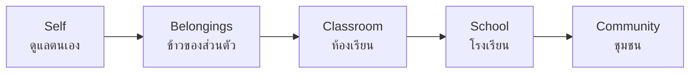

# Self and School Responsibility — ความรับผิดชอบต่อตนเองและโรงเรียน

> *"Responsibility begins small: your desk, your duty roster, your promise."*

Self and School Responsibility is the foundation level of กิจกรรมเพื่อสังคมและสาธารณประโยชน์. Before students can serve a community, they learn to care for themselves, their belongings, and their shared spaces — and, crucially, to keep small commitments reliably. The daily cleaning of Thai classrooms is not janitorial outsourcing; it is the country's most universal civic education ritual.

---

## 1 | Grade Band Breakdown

| Grade | Key Content |
|---|---|
| **ป.1–3** | Managing personal belongings, classroom cleanliness routines, following class schedules, caring for shared items |
| **ป.4–6** | Duty rosters done without reminders, school environment care, caring for younger students' spaces, environmental awareness |
| **ม.1–3** | Owning areas of school life (library, lab, garden), reliability in assigned roles, leading cleaning teams, setting class norms |
| **ม.4–6** | Leading school improvement projects, modeling responsibility for juniors, representing the school externally, maintenance planning |

---

## 2 | The Responsibility Ladder

Each rung uses the same three muscles — **notice** (เห็นสิ่งที่ต้องทำ), **act** (ลงมือทำโดยไม่ต้องเตือน), **follow through** (ทำจนจบ) — applied to a widening circle.

---

## 3 | The Thai Classroom Cleaning System (เวรทำความสะอาด)

| Element | Thai | How it works |
|---|---|---|
| Duty roster | ตารางเวร | Rotating assignment: sweeping, desks, board, trash, corridor |
| Duty leader | หัวหน้าเวร | Checks quality, reports completion |
| Daily clean | ทำความสะอาดประจำวัน | After lunch / before dismissal |
| Big clean | ทำความสะอาดใหญ่ | Before events, term end — whole class |
| Inspection | ตรวจความสะอาด | Teacher or student council checks |

**What it really teaches:** shared spaces belong to everyone when everyone cares for them — the direct experience behind the phrase พื้นที่ส่วนรวม.

---

## 4 | Key Concepts

| Concept | Thai | Description |
|---|---|---|
| Self-care | การดูแลตนเอง | Uniform, hygiene, punctuality, belongings in order |
| Shared spaces | พื้นที่ส่วนรวม | Spaces that belong to all must be kept by all |
| Reliability | ความน่าเชื่อถือ | Doing the agreed task without being reminded |
| Duty (เวร) | เวรประจำวัน | A rotating small responsibility |
| Stewardship | การดูแลรักษา | Leaving a place better than you found it |
| Environmental awareness | ความตระหนักรู้ด้านสิ่งแวดล้อม | Waste, water, energy as daily habits |
| Follow-through | ทำให้สำเร็จ | Finishing: the last 10% of the task is the habit |

---

## 5 | Daily Routines as Curriculum

| Routine | Thai | The hidden lesson |
|---|---|---|
| Morning duty | เวรเช้า | The day starts because someone prepared it |
| Tidy desk check | ตรวจโต๊ะเรียน | Order outside supports order inside |
| Trash separation | แยกขยะ | Every snack wrapper is a decision |
| Water/cup station care | ดูแลจุดน้ำดื่ม | Shared convenience needs shared upkeep |
| Lab/library rules | ระเบียบห้องปฏิบัติการ/ห้องสมุด | Equipment trust: return it as you received it |
| Lost and found | กล่องของหาย | Honesty when no one is watching |

---

## 6 | A Worked Scenario

> **Situation:** A ม.2 classroom is consistently messy after lunch despite the duty roster. The duty leader reports daily; nothing changes; the class teacher is tired of nagging.

**Turning a rule into a norm:**

| Step | Action |
|---|---|
| 1. Make the data visible | A week of photos: the same corner dirty every day |
| 2. Diagnose together | Class meeting: is the roster fair? Are tools available? Is 5 minutes enough? |
| 3. Fix the system, not the people | Rebalance the roster; buy 2 extra brooms; move the bin that everyone misses |
| 4. Set the class standard | "เวรจบ = เช็คกับหัวหน้าเวร" — done means checked |
| 5. Peer recognition | Weekly thanks to the best duty pair — status follows service |
| 6. Remove the teacher from enforcement | After a month, the roster runs on class norms, not teacher nagging — that is success |

---

## 7 | Thai Terminology

| Thai | English |
|---|---|
| ความรับผิดชอบ | Responsibility |
| เวร / ตารางเวร | Duty / duty roster |
| หัวหน้าเวร | Duty leader |
| ทำความสะอาด | Cleaning |
| ทำความสะอาดใหญ่ | Big clean |
| พื้นที่ส่วนรวม | Shared/common space |
| ความน่าเชื่อถือ | Reliability |
| การดูแลรักษา | Maintenance / stewardship |
| ข้าวของส่วนตัว | Personal belongings |
| ตรงเวลา | Punctual |
| สะเอียด / เรียบร้อย | Tidy / in order |
| แยกขยะ | Waste separation |
| กล่องของหาย | Lost and found |

---

## 8 | Real-World Examples

- **Daily เวร rotation** — The universal Thai school system: every student, every week, some duty
- **ห้องเรียนสะอาด ปลอดภัย (green room) evaluations** — Many schools run cleanliness scoring between classrooms
- **School garden plots** — Class-owned vegetable/herb beds; harvest goes to the canteen or cooking class
- **Saving electricity campaigns** — Class monitors for lights and fans; monthly comparison charts
- **Property hand-over ritual** — End-of-year checking of desks and chairs instills equipment accountability

---

## 9 | Cross-Links

- [[00_overview|Social and Public Benefit Overview (BOK)]]
- [[02_Community_Service|Community Service]] — The ladder extends outward
- [[03_Environmental_Service|Environmental Service]] — Waste and conservation habits at scale
- [[../02 Student Activities/04_Student_Organizations|Student Organizations]] — Council inspections and welfare
