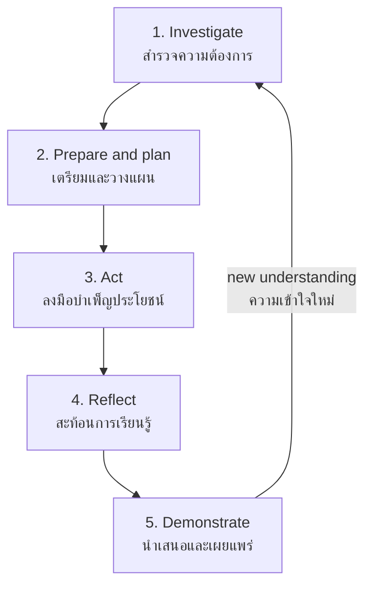

# Community Service — การบำเพ็ญประโยชน์ต่อชุมชน

> *"Community service turns care into action: students learn who their neighbors are by helping them."*

Community service moves student responsibility beyond the school gate. Students identify needs in the local community — the temple, the elderly, the canal, the daycare — and respond through planned, sustained, and reflected-upon service. Done well, it is service learning: the service is real, and so is the learning.

---

## 1 | Grade Band Breakdown

| Grade | Key Content |
|---|---|
| **ป.1–3** | Helping at school events, simple kindness tasks, visiting nearby community places with teachers |
| **ป.4–6** | Temple and public-space cleanup, helping elderly neighbors, community clean-up days, school fair support |
| **ม.1–3** | Community needs survey, planned service projects, partnership with local organizations, reflection |
| **ม.4–6** | Sustained community partnerships, project management with budgets, mentoring younger students in service, impact evaluation |

---

## 2 | Service Learning vs. Just Helping

| Dimension | Just helping (one-off charity) | Service learning (กิจกรรมบำเพ็ญประโยชน์ที่มีการเรียนรู้) |
|---|---|---|
| Need | Assumed by the helper | Discovered by asking the community |
| Duration | One morning | Recurring relationship |
| Student role | Labor | Planner, actor, reflector |
| Learning | Accidental | Designed: before / during / after |
| Outcome | Photos | Change + understanding of why the need existed |

**The golden rule:** never do *for* the community what the community should decide *with* you.

---

## 3 | The Service-Learning Cycle

| Stage | Student questions |
|---|---|
| Investigate | Who lives around our school? What do they say they need? What already exists? |
| Prepare | What exactly will we do? Who approves? What is safe? What do we need? |
| Act | Are we doing what we planned? Is it actually helping? |
| Reflect | What happened? What surprised us? What did we learn about the community — and ourselves? |
| Demonstrate | Who should hear what we learned? (school, parents, municipality) |

---

## 4 | Classic Thai Community Service Contexts

| Context | Thai | Typical service | Best-fit level |
|---|---|---|---|
| Temple / mosque / church | วัด สุเหร่า โบสถ์ | Grounds cleanup, festival assistance | ป.4 up |
| Elderly residents | ผู้สูงอายุ | Visits, chores, digital help (video calls), oral history | ม.1 up |
| Local environment | สิ่งแวดล้อมในชุมชน | Canal/street cleanup, tree planting | ป.4 up |
| Childcare centers | ศูนย์เด็กเล็ก | Reading to children, playground repair | ม.1 up |
| Local government | องค์การบริหารส่วนตำบล | Joint campaigns (dengue, waste) | ม.4 up |
| Disaster response | บรรเทาภัย | Fundraising, packing relief kits | ม.1 up |

---

## 5 | Planning a Service Project

| Element | Thai | Guiding question |
|---|---|---|
| Community partner | คู่ร่วมในชุมชน | Who from the community co-decides with us? |
| Need statement | ความต้องการ | What did *they* say they need (not what we assume)? |
| Goal | เป้าหมาย | What will be different after our service? |
| Plan | แผน | Tasks, people, dates, budget, permissions |
| Safety | ความปลอดภัย | Adult supervision, transport, tools, first aid |
| Evidence | หลักฐาน | Photos, counts, partner feedback |
| Reflection | การสะท้อนคิด | Structured debrief (see [[05_Reflection_and_Citizenship]]) |

---

## 6 | A Worked Scenario

> **Situation:** A ม.3 class wants to "help the elderly." Their first idea: perform dances at the local elderly daycare. The teacher asks one question first: "Have you asked them what they want?"

**Designing with, not for:**

| Step | Action | Discovery |
|---|---|---|
| 1. Visit and ask | Small team interviews the daycare director and 5 residents | Residents' top wish: someone to teach them video calls with grandchildren |
| 2. Redesign | Six Saturday sessions: "โทรหาหลาน" — phones, patience, Thai tea | Real need, real skill from students |
| 3. Plan | Pairs of students per session; phones borrowed; director approves schedule | Manageable, safe, sustainable |
| 4. Act | Sessions run; students learn residents' life stories between calls | Unexpected oral-history bonus |
| 5. Reflect | "We thought we would give performances. We gave connection. We received history." | The learning outcome no one planned |
| 6. Continue | Class trains the next ม.3 class to keep the program alive | Sustainability |

---

## 7 | Thai Terminology

| Thai | English |
|---|---|
| การบำเพ็ญประโยชน์ | Public benefit / service |
| ชุมชน | Community |
| ความต้องการของชุมชน | Community needs |
| การสำรวจ | Survey / investigation |
| คู่ร่วม / หน่วยงานร่วม | Partner / partner organization |
| การร่วมมือ | Cooperation |
| จิตอาสา / อาสาสมัคร | Volunteer spirit / volunteers |
| ผู้สูงอายุ | Elderly persons |
| การเยี่ยมเยียน | Visiting |
| บรรเทาทุกข์ / บรรเทาภัย | Relief / disaster relief |
| การสะท้อนคิด | Reflection |
| ความยั่งยืน | Sustainability |

---

## 8 | Real-World Examples

- **Temple cleanup before วันสงกรานต์ / วันเข้าพรรษา** — Schools near temples organize annual service
- **"โทรหาหลาน" style digital-inclusion programs** — Students teaching elderly to video-call family
- **Flood relief kit packing** — Northern and Northeastern schools assembling relief bags during flood season
- **Blood donation support** — ยุวกาชาด level 3–4 assisting สภากาชาดไทย drives
- **Local canal cleanup with อบต.** — Joint waste campaigns with subdistrict administration

---

## 9 | Cross-Links

- [[00_overview|Social and Public Benefit Overview (BOK)]]
- [[01_Self_and_School_Responsibility|Self and School Responsibility]] — The inner circle of service
- [[03_Environmental_Service|Environmental Service]] — Environmental contexts of community service
- [[05_Reflection_and_Citizenship|Reflection and Citizenship]] — The learning half of service learning
- [[../02 Student Activities/01_Scouts_and_Girl_Guides|Scouts]] — Service as scout method
