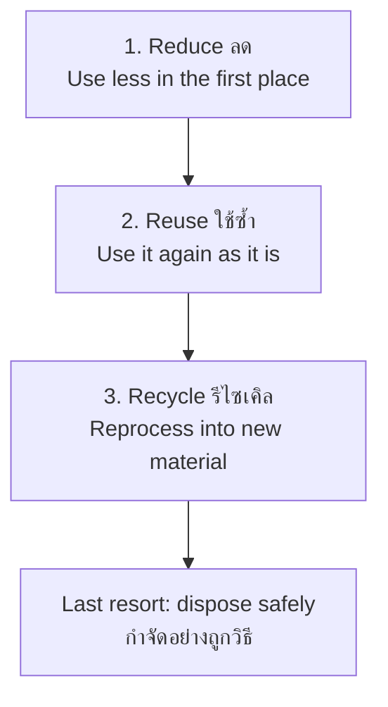

# Environmental Service — การอนุรักษ์สิ่งแวดล้อม

> *"Environmental service teaches students that caring for nature is caring for their own future — one waste bin, one tree, one canal at a time."*

Environmental service applies the service-learning method to the environment: waste, water, forests, energy, and biodiversity. It turns the science classroom's knowledge of ecosystems into habits and projects with measurable effects on the school and community. Thailand's environmental realities — seasonal haze, plastic-choked canals, coastal debris — make this the most visibly *needed* form of student service.

---

## 1 | Grade Band Breakdown

| Grade | Key Content |
|---|---|
| **ป.1–3** | Not littering, simple waste sorting, caring for classroom plants, water awareness at the tap |
| **ป.4–6** | Waste separation systems, tree planting and care, school garden, energy-saving habits, water conservation |
| **ม.1–3** | Environmental surveys, conservation projects (compost, refill stations), community education campaigns |
| **ม.4–6** | Sustainability research, long-term restoration projects, policy proposals to school/local government, mentoring juniors |

---

## 2 | The 3Rs Hierarchy

Reduce beats reuse; reuse beats recycle — because recycling still costs energy. Students learn the order, not just the words.

### Thai Waste Sorting in Practice

| Stream | Thai | Examples | Destination |
|---|---|---|---|
| Recyclables | ขยะรีไซเคิล | Plastic bottles, paper, cans, glass | Sold to ร้านรับซื้อของเก่า — often funds class activities |
| Organic | ขยะย่อยสลาย/ขยะเปียก | Food scraps, leaves | Compost for the school garden |
| General | ขยะทั่วไป | Foil packets, foam | Landfill — minimize this bin |
| Hazardous | ขยะอันตราย | Batteries, lamps, e-waste | Special collection points |

---

## 3 | Core Environmental Service Contexts

| Context | Thai | School-level activity | Measurable indicator |
|---|---|---|---|
| Waste | ขยะ | Separation system, waste audit, refill water stations | kg/week to landfill ↓ |
| Trees | ป่า/ต้นไม้ | Tree planting (Arbor Day), mapping and caring for school trees | Survival rate of planted trees |
| Water | น้ำ | Tap-leak patrol, rain harvesting, canal cleanup | Liters saved; bags of canal waste |
| Energy | พลังงาน | Light/fan monitors, "unplug" campaigns | School electricity bill ↓ |
| Biodiversity | ความหลากหลายทางชีวภาพ | Bird/insect count, school pond habitat | Species list grown |
| Food | อาหาร | Food-waste weighing, composting | Plate-waste kg ↓ |

---

## 4 | From Habit to Project: The Waste Audit

A signature ม.1–3 project — one week, whole class:

| Step | Action | Learning |
|---|---|---|
| 1. Predict | Each student predicts the class's weekly landfill waste (kg) | Baseline assumptions |
| 2. Collect and sort | One week: all class waste weighed by stream | Data collection discipline |
| 3. Analyze | Which stream dominates? Why? | Data → insight: "60% is snack foil from *us*" |
| 4. Act | Redesign: bulk snacks, refill bottles, better bins | Solution design |
| 5. Re-measure | Repeat audit in a month | Did the intervention work? |
| 6. Report | Present to school assembly; propose school-wide rollout | Advocacy |

---

## 5 | Key Concepts

| Concept | Thai | Description |
|---|---|---|
| Conservation | การอนุรักษ์ | Using wisely so resources last |
| Sustainability | ความยั่งยืน | Meeting today's needs without robbing tomorrow |
| Waste hierarchy | ลำดับการจัดการขยะ | Reduce → reuse → recycle → dispose |
| Carbon footprint | ปริมาณคาร์บอน | Greenhouse gas cost of activities |
| Biodiversity | ความหลากหลายทางชีวภาพ | Variety of life as an indicator of health |
| Watershed | ลุ่มน้ำ | Land and water are one system |
| Circularity | เศรษฐกิจหมุนเวียน | Waste of one process = input of another (compost, refill) |
| Environmental audit | การตรวจสอบสิ่งแวดล้อม | Measuring before changing |

---

## 6 | A Worked Scenario

> **Situation:** After every lunch break, the school's storm drain near the canteen is full of plastic bags and bottles. The ม.2 class council rep is embarrassed — the bags are from the school's own shop.

**A systems response:**

| Step | Action |
|---|---|
| 1. Trace the source | Photos over 3 days: most waste = single-use bags from the snack shop, discarded within 50 m |
| 2. Meet the stakeholder | Students + teacher meet the shop vendor: is a change feasible for her business? |
| 3. Design alternatives | "Bring your own bag" day + shop sells reusable bags at cost + price incentive (0.5 ฿ off for BYO) |
| 4. Run a pilot | Two weeks, one shop; measure drain waste daily |
| 5. Report and expand | Results to school administration; extend to all shops; install drain mesh as backup |
| 6. Sustain | Hand the monitoring to next year's ม.2 — with the data |

**The lesson:** the drain was never the problem; the system around the snack shop was.

---

## 7 | Thai Terminology

| Thai | English |
|---|---|
| สิ่งแวดล้อม | Environment |
| การอนุรักษ์สิ่งแวดล้อม | Environmental conservation |
| ขยะ / ขยะมูลฝอย | Waste / garbage |
| ขยะรีไซเคิล | Recyclable waste |
| ขยะย่อยสลาย / ขยะเปียก | Organic / wet waste |
| ขยะอันตราย | Hazardous waste |
| การแยกขยะ | Waste separation |
| การลดการใช้ / ใช้ซ้ำ / รีไซเคิล | Reduce / Reuse / Recycle |
| การปลูกป่า / ปลูกต้นไม้ | Reforestation / tree planting |
| วันต้นไม้แห่งชาติ | National Arbor Day |
| การอนุรักษ์น้ำ | Water conservation |
| ประหยัดพลังงาน | Energy saving |
| ความหลากหลายทางชีวภาพ | Biodiversity |
| ปุ๋ยหมัก / การทำปุ๋ยหมัก | Compost / composting |
| ความยั่งยืน | Sustainability |
| การตรวจสอบขยะ | Waste audit |

---

## 8 | Real-World Examples

- **วันต้นไม้แห่งชาติ (National Arbor Day)** — Annual school tree-planting; strong programs map and *care* for trees after planting, not just photograph them
- **Coastal cleanup schools** — Southern schools joining beach and mangrove cleanups with waste data reported to international databases
- **Refill water stations** — Schools installing refill points and discouraging single-use bottles — an infrastructure change students can propose
- **Compost from canteen scraps** — Food waste → school garden → vegetables back to the canteen: a visible circular loop
- **PM2.5 campaigns** — Northern schools' anti-burning education and mask drives during haze season

---

## 9 | Cross-Links

- [[00_overview|Social and Public Benefit Overview (BOK)]]
- [[02_Community_Service|Community Service]] — Environmental service is community service
- [[04_Public_Interest_Projects|Public-Interest Projects]] — Project design applied to environment
- [[../../body-of-knowledge/Science/00_Fundamental Science - Overview|Science (BOK)]] — Ecosystems, matter cycles
- [[../../body-of-knowledge/Social Studies/Social Studies - Overview|Social Studies (BOK)]] — Geography, climate change
