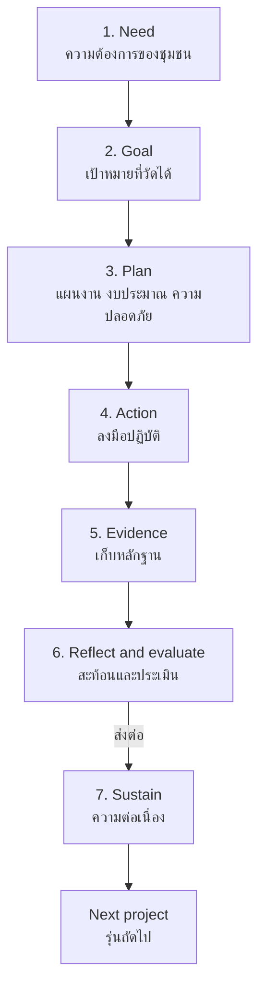

# Public-Interest Projects — โครงการเพื่อสาธารณประโยชน์

> *"A public-interest project is a promise made in public, kept in public, and learned from in public."*

Public-interest projects are the capstone form of กิจกรรมเพื่อสังคมและสาธารณประโยชน์: student-led, sustained initiatives that respond to a real social need with planning, evidence, and reflection. Where a cleanup morning is an activity, a project asks: *what is the need, what will we change, how will we know it changed, and who continues after us?*

---

## 1 | Grade Band Breakdown

| Grade | Key Content |
|---|---|
| **ป.1–3** | Joining teacher-led service activities; small class projects (a clean-week challenge) |
| **ป.4–6** | Small-group projects with guidance: one need, one plan, one event, one debrief |
| **ม.1–3** | Full project cycle: survey, plan, budget, act, evaluate, present; teams with roles |
| **ม.4–6** | Multi-term projects, partnerships with local organizations, impact evaluation, succession planning |

---

## 2 | The Project Cycle

### Stage Details

| Stage | Key questions | Tools |
|---|---|---|
| 1. Need | Who says this is needed? Did we ask? | Survey, interview, observation |
| 2. Goal | What will be different? How much, by when? | SMART goal |
| 3. Plan | Tasks, people, money, permissions, safety, Plan B | Gantt/task table, budget sheet |
| 4. Action | Are we doing what we planned? What is reality teaching us? | Duty rosters, checklists, photos |
| 5. Evidence | What counts as proof? (numbers, testimony, before/after) | Log sheet, before/after photos |
| 6. Reflect & evaluate | Did we reach the goal? What would we never do again? | Debrief, evaluation vs. goal |
| 7. Sustain | Who runs this next year? What do they inherit? | Handbook, hand-over meeting |

---

## 3 | SMART Goals for Student Projects

| Letter | Thai | Weak version | SMART version |
|---|---|---|---|
| S — Specific | ชัดเจน | "Help the environment" | "Cut canteen plastic-bag use" |
| M — Measurable | วัดได้ | "A lot less waste" | "From 5,000 to 2,000 bags/month" |
| A — Achievable | ทำได้จริง | "Make the whole province zero-waste" | "In our school's two shops" |
| R — Relevant | ตรงความต้องการ | Trending topic | Need confirmed by the shop vendors |
| T — Time-bound | มีกำหนด | "Sometime this year" | "By the end of term 2" |

---

## 4 | Project Roles

| Role | Thai | Responsibility |
|---|---|---|
| Project lead | หัวหน้าโครงการ | Overall direction, single point of contact |
| Admin/secretary | เลขานุการ | Records, permissions, correspondence |
| Finance | เหรัญญี | Budget tracking, receipts, transparency report |
| Logistics | ฝ่ายจัดหา/อุปกรณ์ | Materials, transport, setup |
| Communications | ฝ่ายประชาสัมพันธ์ | Posters, page, liaison with school/community |
| Documentation | ฝ่ายบันทึกหลักฐาน | Photos, data, before/after |
| Advisor | ครูที่ปรึกษา | Safety, feasibility, institutional memory |

---

## 5 | Budget and Transparency

| Practice | Why |
|---|---|
| Written budget before spending | Decisions precede money |
| Receipts for everything | Habit of accountability |
| Public report after | Money trusted to students is money reported |
| Zero personal benefit rule | Service ≠ income; prevents misuse early |

---

## 6 | A Full Worked Example

> **Project: "ห้องสมุดเด็กวัด" (Temple Children's Corner)** — ม.4 class, two terms

| Stage | What the students did |
|---|---|
| Need | Nearby temple hosts 20+ children after school; no books or activities; abbot confirms interest |
| Goal | A functioning reading corner: 150 books, 10 sessions of reading activities, ≥15 children/session by March |
| Plan | Team of 7; budget 3,000฿ (book drive + 800฿ from class fund); abbot provides the room; schedule on Saturdays |
| Action | Book drive at school (collected 210 books), shelf built with carpentry teacher, 10 Saturday sessions run |
| Evidence | Session attendance log (avg 17 children), photos, abbot's feedback letter |
| Reflect | "Reading aloud worked; worksheets flopped. Shelves too high for ป.1." |
| Sustain | Handbook + ม.3 juniors shadowed the last two sessions; abbot keeps the corner open daily |

The report to the school assembly ends with the sentence every project should earn: *"The corner is still running without us."*

---

## 7 | Thai Terminology

| Thai | English |
|---|---|
| โครงการ | Project |
| โครงการเพื่อสาธารณประโยชน์ | Public-interest project |
| ความต้องการของชุมชน | Community need |
| เป้าหมาย | Goal |
| แผนงาน | Work plan |
| งบประมาณ | Budget |
| ความปลอดภัย | Safety |
| การดำเนินกิจกรรม | Implementation |
| หลักฐาน / การเก็บหลักฐาน | Evidence / documentation |
| การประเมินผล | Evaluation |
| การสะท้อนคิด | Reflection |
| ความต่อเนื่อง / การส่งต่อ | Continuity / hand-over |
| รายงาน | Report |
| ผู้มีส่วนเกี่ยวข้อง | Stakeholders |
| ครูที่ปรึกษาโครงการ | Project advisor |

---

## 8 | Real-World Examples

- **โครงการจิตอาสาพัฒนา (Village development volunteering)** — The national tradition of student village-development camps (ค่ายอาสา), a rite of passage for many ม.4–6 and university students
- **Anti-dengue campaigns** — Student teams survey and destroy mosquito breeding sites with สสอ. (public health office) data
- **School-based recycling banks (ธนาคารขยะ)** — Ongoing student-run recyclable collection that funds class projects — a true sustained enterprise
- **"ห้องอ่านหนังสือชุมชน" community reading rooms** — Student-initiated mini-libraries in temples or mosques
- **Elderly oral-history books** — Students interview elders and publish a printed local-history booklet

---

## 9 | Cross-Links

- [[00_overview|Social and Public Benefit Overview (BOK)]]
- [[02_Community_Service|Community Service]] — The relational foundation
- [[03_Environmental_Service|Environmental Service]] — Environmental applications
- [[05_Reflection_and_Citizenship|Reflection and Citizenship]] — The learning payoff
- [[../02 Student Activities/05_Leadership_Activities|Leadership Activities]] — Project leadership
