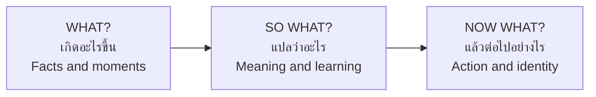

# Reflection and Citizenship — การสะท้อนการเรียนรู้และความเป็นพลเมือง

> *"Service without reflection is just work. Reflection turns action into learning, and learning into the kind of person who acts again."*

Reflection and Citizenship is the meaning-making half of กิจกรรมเพื่อสังคมและสาธารณประโยชน์. Every cleanup, camp, and project ends not when the brooms are racked but when students have asked: *What happened? What did it mean? What kind of citizen am I becoming because of it?* This is where service becomes civic identity — the quiet goal of all twelve years.

---

## 1 | Grade Band Breakdown

| Grade | Key Content |
|---|---|
| **ป.1–3** | Simple sharing circles: What did we do? How did it feel? Who did we help? |
| **ป.4–6** | Group discussion, simple reflection journals, connecting service to class values |
| **ม.1–3** | Structured debriefs, written reflection, project evaluation, connecting service to civic duty |
| **ม.4–6** | Critical reflection, civic identity formation, connecting service to social issues and policy, portfolio evidence |

---

## 2 | Why Reflection Is Not Optional

| Without reflection | With reflection |
|---|---|
| "We cleaned the canal." | "We cleaned the canal. We found the waste comes from the market upstream — cleaning alone won't fix it." |
| Students feel briefly good | Students understand the system that produced the need |
| Photos in a report | A changed question for next time |
| Service as event | Service as civic identity |

The experience is the raw material; reflection is the processing. Unprocessed experience evaporates.

---

## 3 | Reflection Methods by Age

| Method | Thai | Best for | Format |
|---|---|---|---|
| Sharing circle | วง sharing | ป.1–3, any age for quick debriefs | Sit in a circle; each answers 3 questions in turn |
| Emotion check-out | เช็กอารมณ์ | ป.1–3 | Thumbs up/sideways/down + one word |
| 3-2-1 | 3-2-1 | ป.4–6 | 3 things I did, 2 things I learned, 1 question I still have |
| Reflection journal | บันทึกการสะท้อนคิด | ป.4 up | Private written entry with prompts |
| Debrief triangle (What? So what? Now what?) | วงสนทนาถอดบทเรียน | ม.1 up | Structured group debrief (below) |
| Before/during/after photos + captions | ภาพบอกเรื่อง | All | Visual evidence + student-written captions |
| Critical incident analysis | วิเคราะห์เหตุการณ์สำคัญ | ม.4–6 | Pick one moment that changed your thinking; analyze why |

### The Debrief Triangle (วงถอดบทเรียน)

| Phase | Sample prompts |
|---|---|
| WHAT? | What actually happened — not the plan, the reality? What moment do you keep replaying? |
| SO WHAT? | What did that reveal about the community? About you? About how the world works? |
| NOW WHAT? | What will you do differently next time? What should the school change? What kind of citizen do you want to be? |

---

## 4 | Reflection Question Bank

| Category | Questions (select 2–3, never all) |
|---|---|
| Experience | What was the hardest moment? What surprised you? What was funny? |
| Others | Who did we meet? What did they teach you without meaning to? |
| Self | What did you discover you are good at? What did you discover you avoid? |
| Values | When did you have to choose between easy and right? What did you choose? |
| Systems | Why does this need exist at all? Who benefits from it staying this way? |
| Citizenship | What does this experience tell you about your duties as a member of this community? |
| Forward | If you led this next year, what would you change first? |

---

## 5 | From Reflection to Civic Identity

### The Citizenship Ladder

| Stage | Description | Example voice |
|---|---|---|
| 1. Bystander | "Not my business." | Someone else will pick it up |
| 2. Participant | "I join when asked." | I did my เวร |
| 3. Responsible member | "I act without being asked." | I separated the waste because it's right |
| 4. Contributor | "I initiate." | Our class should run a book drive — I'll propose it |
| 5. Civic leader | "I organize others and hand over." | We built it, and here's the handbook for next year |

Each service + reflection cycle nudges students one rung up — slowly, over twelve years.

### Connecting Service to the Wider Picture (ม.4–6)

| Service experience | The reflective bridge | Civic concept |
|---|---|---|
| Tutoring struggling juniors | Why do some students fall behind? | Educational equity |
| Canal cleanup | Where does the waste come from? | Shared commons, producer responsibility |
| Elderly visits | Who cares for the elderly when family works far away? | Aging society, welfare policy |
| Flood relief packing | Why do the same provinces flood yearly? | Land use, climate adaptation, state capacity |
| Temple fair support | Who keeps local culture alive? | Cultural citizenship, community institutions |

---

## 6 | Portfolio and Evidence of Learning

| Element | What goes in |
|---|---|
| Project record | Goal, plan, role, photos, evaluation |
| Reflection entries | 2–3 best reflections across the year |
| Third-party voice | Advisor or community partner's short feedback |
| Growth statement | One page: "How I changed this year" — written by the student, honestly |

For ม.4–6 this portfolio feeds university admissions (portfolio round) — but its primary audience is the student's future self.

---

## 7 | A Worked Scenario

> **Situation:** After a flood-relief kit-packing day, the ม.3 class debrief is flat: "Fine." "Tiring." "Fun." The teacher wants more but doesn't want to force deep-sounding lies.

**Raising the quality of reflection:**

| Step | Action |
|---|---|
| 1. Change the question | Not "how do you feel?" but "describe one specific object you packed and imagine the person opening it" |
| 2. Slow down | Two minutes of silence to remember; then speak in pairs before the circle |
| 3. Use an artifact | Pass around a photo of a family on a roof — what is in *their* moment that our kit answers? |
| 4. Ask the systems question | "This is the third year our school packed kits for the same district. What does *that* repetition mean?" |
| 5. Accept honest shallowness | "I mainly liked being with my friends" is a true starting point — ask "and is that okay? what else was there?" |
| 6. Close with identity, not guilt | Each student finishes one sentence: "Because of today, next time I will ___" |

---

## 8 | Thai Terminology

| Thai | English |
|---|---|
| การสะท้อนคิด / การสะท้อนการเรียนรู้ | Reflection / reflection on learning |
| การถอดบทเรียน | Debrief / lessons learned |
| ความเป็นพลเมือง | Citizenship |
| พลเมืองดี | Good citizen |
| จิตสาธารณะ | Public spirit / civic-mindedness |
| ความรับผิดชอบต่อสังคม | Social responsibility |
| อัตลักษณ์พลเมือง | Civic identity |
| หลักฐานการเรียนรู้ | Learning evidence |
| แฟ้มสะสมงาน | Portfolio |
| บันทึกการสะท้อนคิด | Reflection journal |
| วงสนทนา / วงแลกเปลี่ยน | Discussion circle |
| การประเมินผล | Evaluation |
| ความยั่งยืน | Sustainability |
| การส่งต่อ | Hand-over / passing on |

---

## 9 | Real-World Examples

- **Post-camp debrief circles (ถอดบทเรียนค่าย)** — The standard closing night of scout and service camps: candlelight, what?/so what?/now what?
- **Service journals in ม.1–3 homerooms** — Weekly one-page reflections graded for honesty, not eloquence
- **"แฟ้มจิตอาสา" volunteer portfolios** — ม.4–6 students documenting sustained service for admissions
- **Oral-history evenings** — After elderly-home visits, classes present "the story of one person we met" to parents
- **Class "now what?" boards** — One wall in the classroom collecting the sentence-completions: "Next time I will…"

---

## 10 | Cross-Links

- [[00_overview|Social and Public Benefit Overview (BOK)]]
- [[02_Community_Service|Community Service]] — Service feeds reflection
- [[04_Public_Interest_Projects|Public-Interest Projects]] — Evaluation as reflection
- [[../01 Guidance/04_Social_Guidance|Social Guidance]] — Participation and responsibility
- [[../../body-of-knowledge/Social Studies/Social Studies - Overview|Social Studies (BOK)]] — Civic rights, duties, democracy
