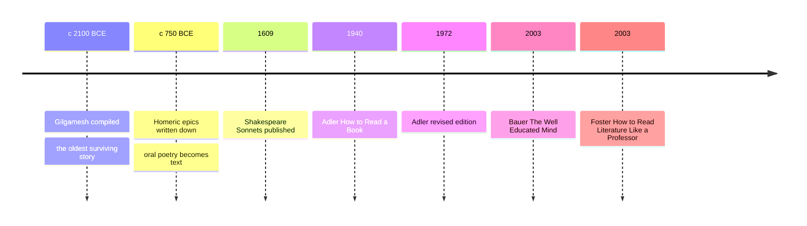

# 01 — How to Read Literature — วิธีอ่านวรรณกรรม

> *"A reader lives a thousand lives before he dies. The man who never reads lives only one."* : George R. R. Martin, A Dance with Dragons

This note is the front door of the World Literature folder. The notes that follow each look at specific works, from the oldest story we have to the modern novel; this one is about the reader. It lays out the four basic parts every story is built from, plot (โครงเรื่อง), character (ตัวละคร), theme (แก่นเรื่อง), and style (ลีลาการเขียน), then adds the deeper tools: symbolism (สัญลักษณ์), point of view (มุมมองการเล่าเรื่อง), and irony (การประชด). You need no degree and no course, only a handful of questions to ask a book and the habit of asking them.

Stories are not decoration. They are how human beings store experience: memory, empathy (ความเข้าอกเข้าใจ), and moral imagination (จินตนาการทางศีลธรรม) all run on narrative. The tools below work on everything in this folder, and on the novels, series, films, and news you already consume. Once you can see a story's skeleton, you never again read only with your eyes.

---

## 1 | The Works at a Glance

| Detail | Info |
|---|---|
| **Author** | This note distills the method of three guides: Mortimer J. Adler (1902 to 2001), Susan Wise Bauer (b. 1968), Thomas C. Foster (b. 1941) |
| **Published** | 1940 and revised 1972 (Adler); 2003 (Bauer); 2003 (Foster) |
| **Genre** | Reading guide (คู่มือการอ่าน): a toolkit, not a work of fiction |
| **Setting** | Everywhere: the toolkit travels with you into every note in this folder |
| **Famous translations** | Not applicable: each topic note lists the editions of its own works |

The three guides agree on the core and divide the labor. Adler wrote the classic ladder of reading levels and insisted that a great book deserves as much effort from the reader as it took to write. Bauer built a curriculum for adult self-education: read the classics chronologically and keep a commonplace journal. Foster wrote the friendly field guide to patterns: every quest, every meal, every rainstorm in fiction means something. Together they make one coherent method: read for the story first, read again for the meaning, and write down what you find.

## 2 | Story and Structure

### The Four Lenses

A story is a machine with four visible parts. The plot (โครงเรื่อง) is what happens, in the order the author arranges it, which is not always the order in which it happened. The characters (ตัวละคร) are who it happens to, and the best characters want something so badly that the plot is simply what gets in their way. The theme (แก่นเรื่อง) is what the whole machine is about when the plot is over: not a moral on a poster but the question the story keeps asking. The style (ลีลาการเขียน) is the voice telling it: the words, the rhythm, the choice of a long sentence or a short one. Read the [[02_Ancient_Epics|Iliad]] and you see plot built from rage; read [[06_Shakespeare|Hamlet]] and you see a character whose theme is his own delay.

### The Deeper Tools

Once the four lenses are in focus, the subtler machinery appears. A symbol (สัญลักษณ์) is an object that does double duty: it is itself and it means more. Point of view (มุมมองการเล่าเรื่อง) decides whose eyes you borrow: a first-person narrator can lie, an omniscient one can judge. Irony (การประชด) is the gap between what is said and what is meant, or between what a character expects and what arrives. Foreshadowing (การบอกใบ้ล่วงหน้า) plants the ending in the beginning, and tone (น้ำเสียง) tells you how seriously the author wants you to take it all.

### Reading for Plot, Reading for Meaning

Foster's advice is the shortest version of the whole method: read the first time for the story, then read again as a professional reader. First pass: what happens, and do I care? Second pass: why this order, this narrator, this symbol? The plot of Hamlet is a prince avenging a murder; the meaning is a study of conscience, delay, and the cost of thought itself. Most readers stop after pass one; everything in this folder assumes you will make pass two, at least once in a while.

### Why Stories Matter for Adults

Children read for adventure; adults read for the same reason and a few more. Stories are practice: they let us rehearse choices we have not yet faced. They are memory: a plot is a mnemonic device older than writing. And they are empathy (ความเข้าอกเข้าใจ): psychologists who measure it find that readers of literary fiction score higher on reading other people's minds. The moral imagination (จินตนาการทางศีลธรรม) is the habit of asking what I would do if I were her, and no lecture teaches it as well as a good novel.

| Tool | Role | One line |
|---|---|---|
| Plot | โครงเรื่อง | What happens, arranged for effect |
| Character | ตัวละคร | Who wants what, and what they will pay for it |
| Theme | แก่นเรื่อง | The question the story keeps asking |
| Style | ลีลาการเขียน | The voice: words, rhythm, sentence shape |
| Symbol | สัญลักษณ์ | An object that means more than itself |
| Point of view | มุมมองการเล่าเรื่อง | Whose eyes you borrow, and how much they see |
| Irony | การประชด | The gap between what is said and what is meant |
| Foreshadowing | การบอกใบ้ล่วงหน้า | The ending planted in the beginning |
| Tone | น้ำเสียง | How seriously the author means it |
| Genre | ประเภทวรรณกรรม | The contract between author and reader about what is possible |

## 3 | Key Passages

The method is best shown, not described. Three passages, each read with one tool:

> "Sing, goddess, the anger of Peleus' son Achilleus and its devastation, which put pains thousandfold upon the Achaians"

> > "เทพธิดาเอ๋ย จงขับขานความโกรธของอคิลลีส บุตรของเพเลอุส และความพินาศที่มันก่อ ยังความเจ็บปวดนับหมื่นนับพันแก่ชาวอาเคียน" (แปลอิสระ)

Homer, Iliad, Book 1, translated by Richmond Lattimore. Read for structure: the poet asks the Muse to sing, announces his subject, anger, not war, and its cost, all in one breath. The whole 24-book epic is inside these two lines.

> "Shall I compare thee to a summer's day? Thou art more lovely and more temperate"

> > "จะให้ฉันเปรียบเธอดั่งวันแห่งฤดูร้อนหรือ เธอนั้นงดงามและเยือกเย็นยิ่งกว่านัก" (แปลอิสระ)

William Shakespeare, Sonnet 18. Read for symbol and structure: the comparison starts as flattery, then quietly turns into the poem's real argument, that verse outlives both summer and the beloved.

> "Tell all the truth but tell it slant"

> > "จงบอกความจริงทั้งหมด แต่จงบอกอย่างเฉียง ๆ" (แปลอิสระ)

Emily Dickinson, poem 1263. Read for style: eight words that compress a whole philosophy of how difficult truths are told, which is also Dickinson's theory of poetry itself.

## 4 | Themes and Style

| Theme | Thai | How the work treats it |
|---|---|---|
| Plot | โครงเรื่อง | As arrangement, not just event: the order is the meaning |
| Character | ตัวละคร | As desire under pressure: want is what makes plot move |
| Theme | แก่นเรื่อง | As a question the work keeps asking, never a slogan |
| Style | ลีลาการเขียน | As choice: every word is a decision the author made |
| Symbol | สัญลักษณ์ | As double duty: thing and meaning at once |
| Point of view | มุมมองการเล่าเรื่อง | As a lens: it decides what you can and cannot know |
| Irony | การประชด | As a gap: between word and meaning, expectation and outcome |
| Foreshadowing | การบอกใบ้ล่วงหน้า | As architecture: the end is in the beginning |

The three guidebooks differ in voice, which is itself a lesson in style. Foster reads like a patient friend pointing at patterns: a quest is a quest, and every shared meal in fiction is a gathering of a community. Bauer reads like a headmistress with a plan: a journal, a schedule, a grammar of genres. Adler reads like a wrestling coach: mark the margins, argue with the author, and do not surrender the book until you can restate its argument. The common core is active reading: a book is a conversation, and the reader who says nothing gets nothing back.

## 5 | Timeline

## 6 | Thai Terminology

| Thai | English | Notes |
|---|---|---|
| โครงเรื่อง | Plot | The arranged sequence of events |
| ตัวละคร | Character | The people of the story, defined by desire |
| แก่นเรื่อง | Theme | The idea or question the work is about |
| ลีลาการเขียน | Style | The writer's voice and choices |
| สัญลักษณ์ | Symbol | An object carrying a larger meaning |
| มุมมองการเล่าเรื่อง | Point of view | Whose eyes and mind the story borrows |
| การประชด | Irony | The gap between saying and meaning |
| การบอกใบ้ล่วงหน้า | Foreshadowing | Hints of what will come |
| การอ่านแบบพินิจ | Close reading | Slow, attentive reading of the words themselves |
| จินตนาการทางศีลธรรม | Moral imagination | The habit of rehearsing choices through stories |
| ความเข้าอกเข้าใจ | Empathy | Feeling with another person, trained by fiction |
| ประเภทวรรณกรรม | Genre | The kind of work and its readerly contract |
| อุปมานิทัศน์ | Allegory | A story whose details each stand for something |
| อุปลักษณ์ | Metaphor | Saying one thing in terms of another |

## 7 | Why It Matters Today

- Thai television: once you can name a plot (โครงเรื่อง) and spot the foreshadowing (การบอกใบ้ล่วงหน้า), an evening of Thai television drama (ละคร) stops being passive and becomes a running exercise in story analysis, and you will see why some episodes grip and others bore.
- The empathy science: in a well-known 2013 experiment in the journal Science, readers of literary fiction scored higher on tests of reading other people's mental states than readers of nonfiction or popular fiction. Fiction is empathy training, measurable in a lab.
- Parenting and teaching: the four lenses give you questions, not lectures. Ask a child what this character wants and what is in the way, and you have a conversation that works for Harry Potter or the Ramakien alike.
- Working life: a meeting, a news cycle, a product pitch are all stories with plots and themes. Adults who can hear the theme behind a story are harder to mislead, and better at telling their own.

## 8 | Further Reading

- *The Well-Educated Mind: A Guide to the Classical Education You Never Had* by Susan Wise Bauer: the full curriculum this folder's notes echo, with a journaling method for each genre.
- *How to Read Literature Like a Professor* by Thomas C. Foster: the friendliest introduction to pattern-spotting, from quests to weather.
- *How to Read a Book* by Mortimer J. Adler and Charles Van Doren: the classic on levels of reading, from first pass to comparative study.
- *Proust and the Squid* by Maryanne Wolf: the science of how the reading brain develops, for readers curious about what reading actually is.

## Related

- [[World Literature/00_overview|← World Literature Overview]]
- [[02_Ancient_Epics]]
- [[06_Shakespeare]]
- [[ภาษาไทย/การอ่าน/07_การอ่านวิเคราะห์|การอ่านวิเคราะห์]]
- [[ภาษาไทย/การอ่าน/12_การอ่านวรรณคดีและวรรณกรรม|การอ่านวรรณคดีและวรรณกรรม]]
- [[ภาษาไทย/วรรณคดีและวรรณกรรม/การวิเคราะห์วรรณคดี/01_การวิเคราะห์องค์ประกอบ|การวิเคราะห์องค์ประกอบ]]
- [[ภาษาไทย/วรรณคดีและวรรณกรรม/การวิเคราะห์วรรณคดี/02_วรรณคดีวิจักษณ์|วรรณคดีวิจักษณ์]]
