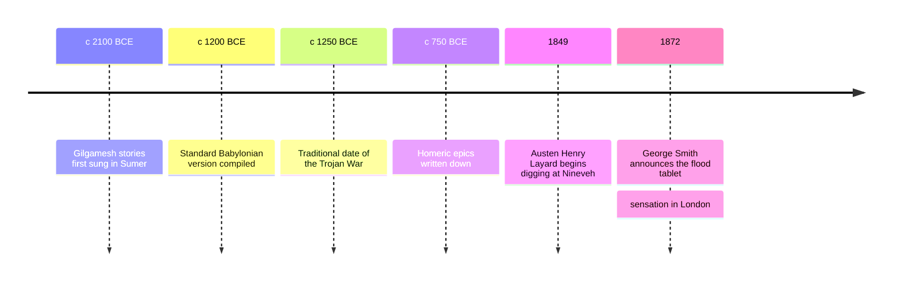

# 02 — Ancient Epics — มหากาพย์โบราณ

> *"Sing, goddess, the anger of Peleus' son Achilleus and its devastation, which put pains thousandfold upon the Achaians"* : Homer, Iliad, Book 1, translated by Richmond Lattimore

Three thousand years ago, in two corners of the ancient world, people sang long poems about heroes who had to die. The epic (มหากาพย์) is the oldest literary form we know: a long narrative poem, carried for centuries by oral tradition (มุขปาฐะ), about a hero whose deeds decide the fate of a people. This note covers the three founding epics of the Western shelf: the Epic of Gilgamesh, the first great story ever written down; the Iliad, the poem of rage and honor at Troy; and the Odyssey, the poem of the long way home. Together they invent most of what every story since has used: the quest, the friendship, the enemy, the return.

Read them for the pattern the twentieth-century scholar Joseph Campbell later named the hero's journey (เส้นทางของวีรบุรุษ): a hero leaves home, crosses into danger, and comes back changed. That pattern runs from these tablets to every film franchise you have ever watched. The Thai tradition has its own great epic bridge here too: the [[ภาษาไทย/วรรณคดีและวรรณกรรม/สมัยรัตนโกสินทร์/01_รามเกียรติ์|รามเกียรติ์]] descends from the Ramayana, and comparing Rama to Achilles is comparing two civilizations' answers to the same question of what a hero owes.

---

## 1 | The Works at a Glance

| Detail | Info |
|---|---|
| **Author** | Unknown poets: the poems are traditional, shaped over centuries. Homer (โฮเมอร์) is the traditional name attached to the Iliad and the Odyssey (c. 8th century BCE) |
| **Published** | Gilgamesh compiled c. 2100 to 1200 BCE in Akkadian on clay tablets; the Iliad and Odyssey written down c. 750 to 700 BCE in Greek |
| **Genre** | Epic (มหากาพย์): long narrative poems of heroes, gods, and destiny |
| **Setting** | Uruk in Mesopotamia for Gilgamesh; Troy and the Mediterranean in the legendary age of heroes for Homer |
| **Famous translations** | Gilgamesh: Andrew George, N. K. Sandars. Homer: Richmond Lattimore, Robert Fagles, Emily Wilson. Thai editions available for the Homeric epics |

Almost nothing is known about Homer, and scholars still argue whether one poet or many stand behind his name: this is the Homeric Question. What matters for reading is that these poems were composed for the ear, not the eye, built from reusable formulas and repeated scenes so that a singer could hold thousands of lines in memory. Gilgamesh we know better by archaeology than by biography: it was buried when the Assyrian city of Nineveh fell in 612 BCE, and dug up in the nineteenth century.

## 2 | Story and Structure

Spoilers follow: this note tells the whole story.

### Tablet by Tablet: Gilgamesh

Gilgamesh, king of Uruk, is two-thirds god and entirely unbearable: he exhausts his young men with labor and his women with his bed. The gods answer the people's prayer by creating Enkidu, a wild man who runs with the animals, until a temple woman teaches him the ways of bread and beer and city. Enkidu comes to Uruk to challenge Gilgamesh, they wrestle, and from the fight comes the deepest friendship in ancient literature. The two friends travel to the cedar forest and kill its guardian Humbaba, then kill the Bull of Heaven that the goddess Ishtar, scorned by Gilgamesh, sends against the city. The gods decree that one of the pair must die: it is Enkidu. Gilgamesh's grief is total. Fearing his own death, he abandons the city and walks to the edge of the world to find Utnapishtim, survivor of the great flood, and ask him the secret of eternal life. The answer is a story: the flood itself, which echoes down into every later flood tale, and a lesson: death is the lot of mankind, and the gods keep immortality for themselves. Gilgamesh fails the test of staying awake seven days, loses the plant of rejuvenation to a serpent, and returns to Uruk empty-handed, except for one thing: standing on the walls of his city, he finally sees them as his answer. The poem ends where it began, with the walls, the work that outlasts the man.

### The Iliad: The Rage of Achilles

The Iliad covers about fifty days in the tenth year of the Trojan War, and its first word is rage: the rage of Achilles, the greatest Greek warrior, whose honor is wounded when his commander Agamemnon takes his prize, the woman Briseis. Achilles withdraws from the war and asks his divine mother Thetis to make the Greeks suffer until they beg. They do: Hector, the Trojan prince who fights for his city and family, pushes the Greeks to their ships. Achilles refuses to return, but allows his beloved friend Patroclus to wear his armor; Patroclus is killed by Hector. Grief replaces wounded pride: Achilles returns to battle not for honor but for vengeance, kills Hector, and drags the body behind his chariot. The poem's last movement is not triumph but mercy: old king Priam, Hector's father, comes to Achilles' tent by night, kisses the hands of the man who killed his son, and asks for the body. Achilles gives it back, and the two enemies weep together. The epic ends with Hector's funeral, and a truce of eleven days.

### The Odyssey: The Long Way Home

The Odyssey is the sequel with a different hero: Odysseus, whose weapon is not rage but cunning. After the war it takes him ten years to cross a sea that others cross in weeks. His son Telemachus goes looking for news of him; Odysseus himself is held by the nymph Calypso, released by the gods, and sails into disaster: the Cyclops Polyphemus, whom he blinds after telling him his name is Nobody; the witch Circe; a visit to the underworld; the Sirens; the whirlpool and the monster. He loses every one of his men. He washes up alone on Ithaca, disguises himself as a beggar, and studies the suitors who have been devouring his house and courting his wife Penelope. The recognition scenes are the poem's heart: the old nurse knows him by a scar, the dog Argos by his voice. Penelope tests him with the bed he carved from a rooted olive tree, which no one but her husband could know. He strings the great bow, kills the suitors, and the long way home ends in a marriage that both of them had to earn.

| Character | Role | One line |
|---|---|---|
| Gilgamesh | King of Uruk | Two-thirds god, all grief, learns mortality through friendship |
| Enkidu | Wild man made friend | The counterweight who civilizes the king and dies for the friendship |
| Utnapishtim | Flood survivor | Holds the secret Gilgamesh wants: the story of the flood and the fact of death |
| Achilles | Greatest Greek warrior | Chooses immortal glory at the price of a short life, and pays it in grief |
| Hector | Trojan prince | The defender of city and family, killed for another man's quarrel |
| Patroclus | Achilles' beloved friend | His death turns rage into grief and grief into return |
| Priam | King of Troy | The father who crosses enemy lines to beg for his son's body |
| Odysseus | King of Ithaca | The survivor: cunning, patient, and ruthless when the bow is strung |
| Penelope | His wife | Holds a kingdom together with a loom and a trick |
| Telemachus | His son | Grows from boy to man by going looking for his father |

## 3 | Key Passages

> "He who saw the Deep, the country's foundation, who knew the proper ways, was wise in all matters!"

> > "เขาผู้เห็นห้วงลึก รากฐานของแผ่นดิน ผู้รู้หนทางอันถูกต้อง ผู้ชาญฉลาดในสรรพสิ่ง" (แปลอิสระ)

The Epic of Gilgamesh, opening lines, translated by Andrew George. The poem announces its hero not by his battles but by his knowledge, and knowledge, in this story, is bought with suffering. The Deep is the cosmic water under the earth, and the proper ways are civilization itself.

> "What is this sleep which holds you now? You are lost in the dark and cannot hear me."

> > "นี่คือความหลับใดที่ครอบงำเจ้าไว้ เจ้าหลงอยู่ในความมืดและไม่ได้ยินเสียงข้าแล้ว" (แปลอิสระ)

Gilgamesh mourning Enkidu, translated by N. K. Sandars. The oldest great story we have turns, at its exact center, on grief and friendship. The hero does not learn mortality from a god's decree; he learns it from the body of his friend.

> "Sing in me, Muse, and through me tell the story of that man skilled in all ways of contending, the wanderer, harried for years on end"

> > "เทพธิดาเอ๋ย จงขับขานผ่านข้า บอกเล่าเรื่องของบุรุษผู้ช่ำชองในทุกวิถีแห่งการต่อสู้ ผู้พเนจร ถูกไล่ต้อนมานานนับปี" (แปลอิสระ)

Homer, Odyssey, Book 1, translated by Robert Fitzgerald. Set beside the Iliad's first line about rage, this opening defines its hero by cunning and survival, and announces the poem's theme, the cost of getting home, before a single event happens.

## 4 | Themes and Style

| Theme | Thai | How the work treats it |
|---|---|---|
| Mortality | ความเป็นมรรตัย | Gilgamesh cannot escape death; he turns to building, and the walled city outlasts the man |
| Friendship | มิตรภาพ | Enkidu civilizes Gilgamesh; losing him is the engine of the poem |
| Honor | เกียรติยศ | Achilles chooses glory that costs his life, and knows it; Hector dies for the honor of home |
| Rage | ความโกรธเกรี้ยว | The Iliad's first word: rage as destructive, human, and the poem's true subject |
| Cunning | ปฏิภาณ | Odysseus survives by wit, lies, and patience, not strength |
| Homecoming | การกลับบ้าน | The Odyssey measures a man by whether he can return and be recognized |
| Hospitality | การต้อนรับแขก | To violate the guest bond is a cosmic crime in both epics; the suitors' feast is their doom |
| The hero's journey | เส้นทางของวีรบุรุษ | Departure, ordeal, return: the pattern these poems set and later stories repeat |

The style is born of the voice: these poems were sung before they were written. Homer builds in formulas and epithets, swift-footed Achilles, the wine-dark sea, stock phrases that let a singer improvise at speed in the six-beat line called dactylic hexameter (ฉันทลักษณ์หกจังหวะ). The poems begin in the middle, in medias res (การเริ่มเรื่องกลางเหตุการณ์), and use extended similes that pause the battle to show a mountain storm or a mother bird. Gilgamesh works by repetition and parallelism: dreams come true twice, journeys are doubled, and the poem's end mirrors its beginning. Both traditions treat the poet as a channel for the Muse, the divine memory without which no hero is remembered.

## 5 | Timeline

## 6 | Thai Terminology

| Thai | English | Notes |
|---|---|---|
| มหากาพย์ | Epic | A long narrative poem of a hero and a people |
| มุขปาฐะ | Oral tradition | Transmission by memory and voice before writing |
| เส้นทางของวีรบุรุษ | The hero's journey | Departure, ordeal, return: the pattern Campbell named |
| การเริ่มเรื่องกลางเหตุการณ์ | In medias res | Beginning in the middle of the action |
| คำขยายประจำตัว | Epithet | Stock phrase attached to a hero or god |
| ความเย่อหยิ่ง | Hubris | Overreaching pride that offends the gods |
| ไหวพริบปฏิภาณ | Cunning | The wit that outwits monsters, Odysseus' weapon |
| การต้อนรับแขก | Hospitality | The sacred guest bond of the ancient world |
| ความเป็นมรรตัย | Mortality | The human condition the epics measure glory against |
| ตำนานน้ำท่วมโลก | Flood myth | The deluge story shared across Mesopotamian and later traditions |
| มิวส์ | Muse | The divine source of memory and song |
| ฉันทลักษณ์หกจังหวะ | Dactylic hexameter | The six-beat line of Greek and Latin epic |

## 7 | Why It Matters Today

- The film Troy (2004) keeps the Iliad's battles and drops its gods: a useful comparison that shows what Hollywood thinks an epic is, and what it leaves out.
- The Coen brothers' O Brother, Where Art Thou? (2000) moves the Odyssey to Depression-era America, and the Cyclops, the Sirens, and the long road home all survive the move: proof of how durable the pattern is.
- The hero's journey maps onto Star Wars, The Lord of the Rings, and nearly every superhero film, which is why these old poems feel familiar on first reading.
- The Thai bridge: the รามเกียรติ์, the Thai telling descended from the Ramayana, sets a hero of duty beside a hero of rage. Rama endures exile to keep a promise; Achilles burns the world to keep his honor. Two civilizations, one epic question.
- Reading aloud: the Odyssey was built for the ear, and it is still the best adventure serial a parent can read to a child; the monsters are the child's, the homecoming is the parent's.

## 8 | Further Reading

- *Gilgamesh: A New Translation* by Andrew George (Penguin): the scholarly standard, with notes on how the tablets were pieced together.
- *The Epic of Gilgamesh* translated by N. K. Sandars (Penguin): short, clear prose, the classic first encounter.
- *The Iliad* translated by Robert Fagles (Penguin): muscular modern verse that reads well aloud.
- *The Odyssey* translated by Emily Wilson (Norton, 2017): crisp and direct, the first complete English Odyssey by a woman.

## Related

- [[World Literature/00_overview|← World Literature Overview]]
- [[01_How_to_Read_Literature]]
- [[03_Greek_Drama]]
- [[16_Mesopotamian_Mythology]]
- [[13_Greek_Mythology]]
- [[Social Studies/04 History/12_Ancient_Civilizations|Ancient Civilizations]]
- [[ภาษาไทย/วรรณคดีและวรรณกรรม/สมัยรัตนโกสินทร์/01_รามเกียรติ์|รามเกียรติ์]]
