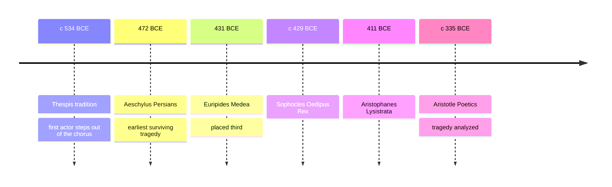

# 03 — Greek Drama — ละครกรีก

> *"Count no man happy till he dies, free of pain at last"* : Sophocles, Oedipus the King, closing lines, translated by Robert Fagles

Theatre as we know it was invented in Athens, in a religious festival, about two and a half thousand years ago. Greek drama gives us the two great shapes of all drama since: tragedy (โศกนาฏกรรม), the fall of a great person through a flaw, and comedy (สุขนาฏกรรม), the upending of the world through laughter. This note covers one of each from the great age of the fifth century BCE: Sophocles' Oedipus Rex, the most perfect tragedy ever built; Euripides' Medea, the tragedy of a woman's rage; and Aristophanes' Lysistrata, a sex-strike comedy that is still staged every time a war breaks out. From these three plays come most of the words we still use about drama: catharsis (การปลดปล่อยอารมณ์), the chorus (คณะขับร้อง), the three unities (สามเอกภาพ), and the tension between fate (ชะตากรรม) and choice (เจตจำนงเสรี) that no later playwright has escaped.

The plays were written for a specific ritual, the City Dionysia festival (เทศกาลไดโอนีเซีย) of Athens, where poets competed before thousands of citizens seated in an open-air theatre. Masks (หน้ากาก) hid the actors' faces and turned one performer into many characters; the gods were invoked, the city was addressed, and the audience watched its own anxieties played out at a safe distance.

---

## 1 | The Works at a Glance

| Detail | Info |
|---|---|
| **Author** | Sophocles (c. 496 to 406 BCE), Euripides (c. 480 to 406 BCE), Aristophanes (c. 446 to 386 BCE) |
| **Published** | Oedipus Rex c. 429 BCE; Medea 431 BCE; Lysistrata 411 BCE; all in Greek, performed at the City Dionysia in Athens |
| **Genre** | Tragedy (โศกนาฏกรรม) and old comedy (สุขนาฏกรรม) |
| **Setting** | Thebes, Corinth, and Athens, in the age of myth, long before the playwrights' own day |
| **Famous translations** | Robert Fagles, Richmond Lattimore, David Kovacs, Alan H. Sommerstein. Thai editions of the plays exist |

The three playwrights were near contemporaries and rivals. Sophocles won first prize at the Dionysia more often than any other writer and perfected the tight single-hero tragedy. Euripides was the experimenter, who brought women, slaves, and psychology to the center of the stage. Aristophanes wrote old comedy, a licensed riot of politics and obscenity that Athens allowed itself once a year. Aristotle, a generation later, analyzed tragedy in the Poetics and fixed its vocabulary, which is where catharsis and the famous unities come from.

## 2 | Story and Structure

Spoilers follow: this note tells the whole story.

### The Festival of Dionysus

Greek plays were not nightly entertainment: they were entries in a competition held during the City Dionysia, the spring festival of the god Dionysus, patron of wine and transformation. An open-air theatre of stone benches, holding perhaps fifteen thousand citizens, watched masked actors, never more than three on stage at once, while the chorus (คณะขับร้อง), a group of about fifteen, sang and danced between the episodes. Voice and gesture carried everything. Each tragic playwright entered three tragedies plus a satyr play, a bawdy after-piece, and the state subsidized the tickets of poor citizens. Drama was liturgy: a civic and religious act.

### Oedipus Rex: The Riddle Solved Too Late

A plague burns through Thebes. The oracle at Delphi says the city is polluted by the unpunished murder of its former king, Laius. Oedipus, the present king, the man who once saved Thebes by solving the riddle of the Sphinx, swears to find the killer and curses whoever he is. The blind prophet Tiresias hints the truth and is mocked; Oedipus suspects his brother-in-law Creon of conspiracy. Piece by piece, the story assembles itself: Oedipus was born to Laius and Jocasta, exposed as an infant because of a prophecy that he would kill his father and marry his mother, rescued, raised in Corinth, and on the road he killed a stranger at a crossroads, his father. The stranger he killed was Laius, and the woman he married, Jocasta, the queen whose husband's murder he is investigating, is his mother. The prophecy, which every character spent a lifetime fleeing, has been fulfilled for years. Jocasta hangs herself. Oedipus takes the brooches from her dress and blinds himself, then asks to be driven into exile. The chorus speaks the last words: count no man happy till he dies.

### Medea: The Rage of the Abandoned Wife

Jason, the hero who won the Golden Fleece with Medea's help, is discarding her to marry the daughter of King Creon of Corinth. Medea, a foreign princess, a sorcerer, and a woman who has burned every bridge for Jason, is ordered into exile with their two sons. She buys one day, then executes a revenge planned with terrible clarity: a poisoned robe and crown kill the new bride and the king who touches her. Then she does the unthinkable: she kills her own children, not in madness but in full knowledge, to wound Jason in the one place no time can heal. She escapes in a chariot drawn by dragons, leaving Jason to curse her. The audience's sympathy is the play's machine: Euripides makes us watch a woman pushed past every bond, and refuses to let us rest on a verdict.

### Lysistrata: The Sex Strike

Athens and Sparta have been at war for twenty years. Lysistrata, an Athenian woman, convenes the women of both cities with a plan: withhold sex from their husbands until the men make peace. The women seize the Acropolis and the treasury that funds the war; the play's comedy runs on the men's suffering, on the chorus of old women and old men brawling, and on one scene in which a husband named Cinesias arrives in agony and is teased to the edge of madness. It works: the men crack, envoys arrive, and Lysistrata lectures both sides as the common history of their sacrifices is recited. The play is both obscene and dead serious: its title means she who disbands armies, and its joke is aimed at the men who will not end a war.

| Character | Role | One line |
|---|---|---|
| Oedipus | King of Thebes | The solver of riddles who is himself the answer, and the last to know it |
| Jocasta | His wife and mother | Fights the truth line by line, then understands first |
| Tiresias | Blind prophet | Sees what the sighted king cannot |
| Creon | Oedipus' brother-in-law | The loyal official whom suspicion almost destroys |
| Medea | Abandoned wife and sorcerer | Pays any price to make Jason feel what she feels |
| Jason | Her husband | The hero of the Argo, now a calculating man of ambition |
| Lysistrata | Athenian woman | The strategist whose weapon is the one power men left her |
| The Chorus | Citizens, elders, women | The voice of the city: singing, judging, warning, mourning |

## 3 | Key Passages

> "You with your precious eyes, you're blind to the corruption of your life"

> > "เจ้าผู้มีดวงตาล้ำค่า กลับมืดบอดต่อความเสื่อมทรามในชีวิตของเจ้าเอง" (แปลอิสระ)

Tiresias to Oedipus, Oedipus Rex, translated by Robert Fagles. The play's central irony in one line: the king with eyes cannot see, the prophet without eyes sees everything. Oedipus' later self-blinding only makes literal what Tiresias says here.

> "I would rather stand three times with a shield in battle than give birth once"

> > "ข้ายอมยืนในสมรภูมิถือโล่สามครั้ง ดีกว่าคลอดบุตรเพียงครั้งเดียว" (แปลอิสระ)

Medea, lines 250-251, translated by David Kovacs. The most quoted line of the play: Medea measures the cost of being a woman in a world of men's wars, and the comparison sets the terms for everything she will do.

> "War shall be the concern of women!"

> > "สงครามจะเป็นธุระของผู้หญิง!" (แปลอิสระ)

Lysistrata, translated by Alan H. Sommerstein. The play's thesis in one line: when men fail at peace, the women take over the business of war and end it, with the one lever the city left them.

## 4 | Themes and Style

| Theme | Thai | How the work treats it |
|---|---|---|
| Fate and free will | ชะตากรรมกับเจตจำนงเสรี | The prophecy is fulfilled precisely because everyone runs from it: every choice is free and every step is fatal |
| Hubris | ความเย่อหยิ่ง | Overreaching pride that offends the gods: Oedipus' confidence is his undoing |
| Knowledge and blindness | ความรู้กับการมองไม่เห็น | Seeing is knowing's opposite in this play: the blind see, the king is blind |
| Justice and revenge | ความยุติธรรมกับการแก้แค้น | Medea asks whether a wronged woman has any recourse but horror |
| Gender and power | เพศกับอำนาจ | Both Medea and Lysistrata turn the household into the last weapon women have |
| The city | นครรัฐ | Drama is civic: the chorus is the city's voice, and the plays argue about what a city owes |
| Suffering that teaches | ความทุกข์ที่สอน | The chorus learns through suffering: pain as the only school of wisdom |

The machinery of Greek drama is economical and strange: three actors, masks, and the chorus as commentator and crowd, with the rapid one-line exchanges called stichomythia (บทโต้ตอบกระชั้น) at moments of crisis. The famous three unities of action, place, and time were codified by later critics from the Poetics, though Aristotle himself insisted only on unity of action. Catharsis (การปลดปล่อยอารมณ์) is his word for what tragedy does: it purges pity and fear by arousing them, and watching Oedipus is an emotional workout that leaves the audience lighter, an idea still quoted whenever we ask why sad stories feel good. Euripides added realism: ordinary speech, psychology, and doubt about the gods. Aristophanes added everything else: puns, obscenity, and jokes aimed at named politicians in the audience.

## 5 | Timeline

## 6 | Thai Terminology

| Thai | English | Notes |
|---|---|---|
| โศกนาฏกรรม | Tragedy | The fall of a great person through a flaw, told to purge pity and fear |
| สุขนาฏกรรม | Comedy | The world turned upside down and set right by laughter |
| การปลดปล่อยอารมณ์ | Catharsis | The purging of emotion that tragedy produces |
| ความเย่อหยิ่ง | Hubris | Pride that overreaches and offends the gods |
| ความผิดพลาดอันน่าเศร้า | Hamartia | The tragic flaw or fatal mistake, often a strength misapplied |
| การพลิกผัน | Peripeteia | The reversal of fortune that turns the plot |
| การรู้ความจริง | Anagnorisis | The moment of recognition, when the hero finally sees |
| คณะขับร้อง | Chorus | The singing group that comments, warns, and mourns |
| สามเอกภาพ | The three unities | Action, place, time: the discipline later critics read into Aristotle |
| เทพเจ้าจากเครื่องกล | Deus ex machina | The god lowered by crane to resolve the unresolvable |
| เทศกาลไดโอนีเซีย | The City Dionysia | The Athenian festival where the plays competed |
| บทโต้ตอบกระชั้น | Stichomythia | Rapid single-line exchanges at moments of crisis |

## 7 | Why It Matters Today

- The word catharsis now belongs to psychology and everyday speech: when people say a film or a good cry was cathartic, they are quoting Aristotle on tragedy.
- Sigmund Freud named the Oedipus complex after this play: whether or not one accepts his theory, its presence in our vocabulary shows how deep the play sank into Western thought.
- The film and play Incendies (2003) by Wajdi Mouawad transplants Oedipus' structure into a modern war zone: proof that the plot still carries the heaviest questions.
- School and community theatre in Thailand inherits this festival directly: every class that stages a play works with the mask, the chorus, and the stage Athens invented, as the vault's notes on [[Art/03 Performing Arts/03_Creative_Drama|Creative Drama]] and [[Art/03 Performing Arts/04_Performance_Production|Performance Production]] show.
- Thai news uses โศกนาฏกรรม for disaster headlines daily; the term's weight, of a fall that could have been prevented, is exactly the meaning these playwrights built.

## 8 | Further Reading

- *The Three Theban Plays* by Sophocles, translated by Robert Fagles (Penguin): Oedipus Rex with its sequels, Antigone and Oedipus at Colonus.
- *Medea and Other Plays* by Euripides, translated by John Davie (Penguin): Medea with Hippolytus and Electra.
- *Lysistrata and Other Plays* by Aristophanes, translated by Alan H. Sommerstein (Penguin): the comedy, with notes that explain the jokes.
- *The Poetics* by Aristotle, translated by Malcolm Heath (Penguin): short and readable, the first book of literary theory, still the starting point for how stories work.

## Related

- [[World Literature/00_overview|← World Literature Overview]]
- [[02_Ancient_Epics]]
- [[04_Roman_Literature]]
- [[13_Greek_Mythology]]
- [[Art/03 Performing Arts/03_Creative_Drama|Creative Drama]]
- [[Art/03 Performing Arts/04_Performance_Production|Performance Production]]
