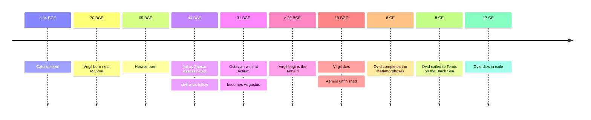

# 04 — Roman Literature — วรรณกรรมโรมัน

> *"I sing of warfare and a man at war"* : Virgil, Aeneid, Book 1, translated by Robert Fitzgerald

Rome conquered Greece and was conquered by it: the Roman legions took the Greek world by force, and Greek literature took the Roman mind by beauty. Roman literature is the Greek inheritance re-forged for an empire, written not for a city festival but for a state, a patron, and posterity. This note covers its two great pillars: Virgil's Aeneid, the empire's founding story, and Ovid's Metamorphoses, the vast poem of myth and change, with a nod to two lyric poets, Catullus and Horace, whose short poems still speak with an intimacy nothing else in Latin matches. Roman literature is also the first literature to be openly an instrument of power: the Aeneid flatters an emperor, and Ovid was exiled by one. Propaganda (การโฆษณาชวนเชื่อ) and resistance (การต่อต้านผ่านงานเขียน) both entered literature here, and never left.

---

## 1 | The Works at a Glance

| Detail | Info |
|---|---|
| **Author** | Virgil (70 to 19 BCE); Ovid (43 BCE to 17 CE); Catullus (c. 84 to 54 BCE); Horace (65 to 8 BCE) |
| **Published** | Aeneid c. 29 to 19 BCE, unfinished at Virgil's death; Metamorphoses completed 8 CE; the lyric poems in the mid-first century BCE; all in Latin |
| **Genre** | Epic (มหากาพย์), mythological narrative, lyric (กวีนิพนธ์ลีลา), elegy, and satire |
| **Setting** | The fall of Troy, Carthage, and Italy in the legendary past; Rome itself for the lyric poets |
| **Famous translations** | Aeneid: Robert Fitzgerald, Robert Fagles, Sarah Ruden. Metamorphoses: David Raeburn, A. D. Melville. Thai editions are scarce; English editions plentiful |

Virgil was born near Mantua and lived through a century of civil war that ended with Augustus as sole ruler of Rome. He was already the author of the Eclogues and Georgics when Augustus' circle commissioned him to give Rome its answer to Homer: an epic explaining why Rome existed and what it was for. He worked eleven years on the Aeneid and asked on his deathbed that it be burned, unfinished; Augustus ordered it saved. Ovid, a generation younger and a metropolitan wit, completed the Metamorphoses the same year the emperor banished him to a Black Sea port, where he died, still writing.

## 2 | Story and Structure

Spoilers follow: this note tells the whole story.

### The Aeneid: From the Ashes of Troy

Aeneas, a Trojan prince of the royal house, escapes the burning city carrying his father Anchises on his back and holding his son Ascanius by the hand. The gods have a plan for him: Juno hates the Trojans, but Jupiter has decreed that Aeneas will found the race that founds Rome. Book by book he sails west, storm-tossed, grieving, driven. He lands at Carthage, where Queen Dido is building her own new city, and the gods, to test him, let them fall in love. The affair is the poem's great cost: when Jupiter's messenger reminds Aeneas of his duty, he obeys, and Dido, abandoned, builds her own pyre, curses his descendants, and dies on a sword. The curse explains the later Punic Wars between Rome and Carthage. Aeneas sails on to Sicily, holds funeral games, and descends into the underworld to meet his father, who shows him the future: the line of Roman heroes and the destiny of empire. The poem ends in Italy, in war against Turnus and the Latins, with Aeneas wearing armor forged by Vulcan, on whose shield are scenes of Rome's coming greatness, down to Augustus himself.

### The Underworld and the Mission Statement

The underworld book is the poem's center. Anchises tells his son what Rome is for, in lines every Roman schoolchild learned: Rome's arts are not sculpture or astronomy or oratory but government itself, to rule peoples, impose the peace of law, spare the conquered, and humble the proud. This is the Roman answer to Greek glory: not the individual hero but the ordered state. Aeneas is not Achilles: he is pietas (ความจงรักภักดีต่อหน้าที่) made flesh, duty to gods, family, and country, often against his own wishes.

### Metamorphoses: Myth as Change

Ovid's Metamorphoses is fifteen books of around 250 myths, linked by one thread: transformation (การกลายร่าง). It runs from the creation of the world out of chaos to the deification of Julius Caesar, and along the way retells the stories later artists could not stop stealing: Daphne becoming a laurel, Narcissus and his pool, Pyramus and Thisbe, Daedalus and Icarus, Orpheus and Eurydice. Ovid is not a believer but a virtuoso: he tells the myths with wit, sympathy, and skepticism, and the poem's real subject is how anything, body or story or empire, turns into something else. Shakespeare took Pyramus and Thisbe for A Midsummer Night's Dream, and the painters of the Renaissance took nearly everything else.

### The Lyric Poets: Catullus and Horace

Two short forms outlived the empire. Catullus wrote poems to and against his lover Lesbia, including the two-line poem 85, I hate and I love, the most compressed account of a divided heart ever written. Horace, freedman's son and friend of Augustus, polished the Latin lyric until every word weighed its due, and left phrases still in daily use: carpe diem, seize the day, and dulce et decorum est pro patria mori, the patriotic line that later war poets would quote with bitter irony.

| Character | Role | One line |
|---|---|---|
| Aeneas | Trojan prince | Duty made flesh: he obeys the gods' plan at the cost of his own wishes |
| Dido | Queen of Carthage | Builds a city, loves, is left, and dies cursing his descendants |
| Anchises | Aeneas' father | Carried from Troy, and in death the prophet who shows Rome its future |
| Turnus | King of the Rutuli | The defender of Italy, brave and doomed, who fights the future |
| Juno | Queen of the gods | The poem's antagonist, forced in the end to accept Rome |
| Venus | Aeneas' mother | The divine protector forever pulling her son toward his fate |
| Ovid | The poet | The guide who retells myth with wit and watches everything change |
| Catullus | Lyric poet | The lover who hates and loves in the same breath |
| Horace | Lyric poet | The craftsman of the perfect phrase, patronized but independent |

## 3 | Key Passages

> "Let him not enjoy his kingdom or the light he loves, but let him fall before his time and lie unburied on the sand!"

> > "ขออย่าให้เขาได้ชื่นชมอาณาจักรหรือแสงสว่างที่เขารัก แต่จงล้มลงก่อนวัยอันควร และนอนไร้คนฝังบนผืนทราย!" (แปลอิสระ)

Dido's dying curse, Aeneid, Book 4, translated by Robert Fitzgerald. The poem's most human moment: the wronged queen's curse reaches out of the story and explains centuries of real history, the wars between Rome and Carthage.

> "Roman, remember by your strength to rule Earth's peoples, for your arts are to be these: to pacify, to impose the rule of law, to spare the conquered, battle down the proud"

> > "ชาวโรมันเอ๋ย จงจำไว้ว่าหน้าที่ของเจ้าคือปกครองชนชาติต่าง ๆ แห่งแผ่นดินด้วยพลังของเจ้า ศิลป์ของเจ้าคือการสร้างสันติ การสถาปนากฎหมาย การเมตตาผู้พ่ายแพ้ และการปราบผู้ยโส" (แปลอิสระ)

Anchises to Aeneas in the underworld, Aeneid, Book 6, translated by Robert Fitzgerald. The mission statement of the poem and of the empire: Rome's gift is order, and its genius is government, not art or freedom.

> "I hate and I love. Why do I do this, perhaps you ask? I do not know, but I feel it happening and I am tortured"

> > "ข้าเกลียดและข้ารัก เจ้าอาจถามว่าทำไมข้าจึงทำเช่นนั้น ข้าไม่รู้ แต่ข้ารู้สึกว่ามันเกิดขึ้น และข้าถูกทรมาน" (แปลอิสระ)

Catullus, poem 85, translated by Peter Green. Two lines in Latin that compress the whole psychology of a divided heart, as fresh as a text message and two thousand years old.

## 4 | Themes and Style

| Theme | Thai | How the work treats it |
|---|---|---|
| Duty | ความจงรักภักดีต่อหน้าที่ | Pietas: the Roman virtue, obedience to gods, family, and state, even against the heart |
| Fate and empire | ชะตากับจักรวรรดิ | The Aeneid reads history backward: everything that happened, happened to make Rome |
| Love and duty | ความรักกับหน้าที่ | Dido is the price of the future: the poem mourns what empire costs |
| Transformation | การกลายร่าง | Ovid's subject: bodies, stories, and empires all change, and nothing stays itself |
| The Greek inheritance | มรดกกรีก | Rome borrows Greek forms and outbids them: Homer's epic becomes an epic of the state |
| Power and the artist | อำนาจกับศิลปิน | Literature as flattery of the powerful and as the victim of power: patronage, then exile |
| War's cost | ราคาของสงคราม | The Aeneid never lets victory feel clean: the losers, Dido and Turnus, are its best characters |

The Aeneid is Latin dactylic hexameter, denser and more sculptural than Homer's Greek; every line was polished, which is why the poem, even unfinished, feels finished. Its set pieces, the fall of Troy, the underworld, the shield, are the parts painters and composers kept mining. Ovid's elegiac couplet moves with speed and surprise, and his tone, mocking, tender, bored by piety, is the first unmistakably modern voice in Latin. Catullus' plain words and Horace's carpentered odes mark the two poles of lyric: raw feeling and perfect form.

## 5 | Timeline

## 6 | Thai Terminology

| Thai | English | Notes |
|---|---|---|
| ความจงรักภักดีต่อหน้าที่ | Pietas | Roman duty to gods, family, and state, the virtue Aeneas embodies |
| การกลายร่าง | Metamorphosis | The change of form that links Ovid's myths |
| งานโฆษณาชวนเชื่อ | Propaganda | Literature in service of a ruler's image |
| การต่อต้านผ่านงานเขียน | Resistance | Writing against power from within or from exile |
| ระบบอุปถัมภ์ | Patronage | The system by which the rich funded the poets |
| กวีนิพนธ์ลีลา | Lyric | Short poems of personal feeling, often sung |
| บทกวีไว้อาลัย | Elegy | Poems of mourning, and Ovid's meter of choice |
| บทกวีสดุดี | Ode | Horace's polished form of public and private praise |
| ยุคออกัสตัส | The Augustan Age | The golden age of Latin letters under Augustus |
| อุปมาแบบมหากาพย์ | Epic simile | The extended comparison Homer invented and Virgil perfected |

## 7 | Why It Matters Today

- Henry Purcell's opera Dido and Aeneas (1689) keeps the abandoned queen at the center of the repertoire: Dido's Lament is the most famous farewell in opera.
- The Metamorphoses is the sourcebook of European art: Titian's Diana, Bernini's Apollo and Daphne, and countless galleries of Icarus and Narcissus all retell Ovid.
- Shakespeare raided the Metamorphoses for A Midsummer Night's Dream, and Dante made Virgil his guide: Roman literature is the underground river feeding everything after it.
- Empires and leaders keep borrowing Rome's story of founding and destiny: understanding the Aeneid is understanding how power narrates itself, which is a skill for reading any political era.
- For adults, the Aeneid's central question never expires: what do we owe to duty when duty costs us love, and is Dido's anger not exactly right?

## 8 | Further Reading

- *The Aeneid* translated by Robert Fagles (Penguin, 2006): vigorous, readable verse with a good introduction.
- *The Aeneid* translated by Sarah Ruden (Yale, 2021): a crisp modern version by a classicist, praised for line-by-line fidelity.
- *Metamorphoses* translated by David Raeburn (Penguin, 2004): lively and accessible, with the myths in full.
- *The Poems of Catullus* translated by Peter Green (California, 2005): the whole poet, tender and obscene, with notes.

## Related

- [[World Literature/00_overview|← World Literature Overview]]
- [[03_Greek_Drama]]
- [[05_Dante_and_the_Medieval_World]]
- [[13_Greek_Mythology]]
- [[Social Studies/04 History/12_Ancient_Civilizations|Ancient Civilizations]]
