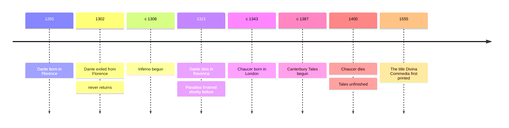

# 05 — Dante and the Medieval World — ดันเตกับโลกยุคกลาง

> *"Abandon all hope, ye who enter here"* : Dante, Inferno, Canto 3, in the traditional English rendering

One poem taught Europe to see the universe as an ordered whole, with everything, every soul, every sin, every love, in its place. Dante's Divine Comedy is a journey through Hell, Purgatory, and Paradise, and it is also the medieval world's complete self-portrait: its theology, its politics, its astronomy, its grudges, and its love. Written in Italian, not Latin, it made the language of the people a language of literature. This note pairs Dante with the other great medieval voice, Geoffrey Chaucer, whose Canterbury Tales, a pilgrimage of storytellers, catches the same world from street level, laughing. Between them, the two poets show the medieval cosmos (จักรวาลวิทยายุคกลาง): a universe where everything has its proper place, and sin and virtue are questions of where you stand.

---

## 1 | The Works at a Glance

| Detail | Info |
|---|---|
| **Author** | Dante Alighieri (1265 to 1321); Geoffrey Chaucer (c. 1343 to 1400) |
| **Published** | Divine Comedy c. 1308 to 1321, in Italian; Canterbury Tales c. 1387 to 1400, unfinished, in Middle English |
| **Genre** | Allegorical epic (มหากาพย์เชิงอุปมานิทัศน์); frame narrative (เรื่องเล่ากรอบนอก) of tales |
| **Setting** | Hell, Purgatory, and Paradise, reached through the Florence and Rome of the year 1300; a pilgrimage to Canterbury in the 1380s |
| **Famous translations** | Dante: John Ciardi, Robin Kirkpatrick, Dorothy L. Sayers. Chaucer: Nevill Coghill. Thai editions are rare; English editions plentiful |

Dante was a Florentine politician and poet who backed the losing faction, was exiled in 1302, and never saw Florence again; the Comedy was written in exile, and it settles scores with his enemies by placing them in Hell while it argues for a political order he never lived to see. The poem is also built around a personal story: the poet, lost in a dark wood in midlife, is rescued and guided home. Chaucer, by contrast, was a London civil servant and courtier, a customs official and diplomat, who wrote the Canterbury Tales in the margins of a busy public career, and died with it unfinished.

## 2 | Story and Structure

Spoilers follow: this note tells the whole story.

### The Architecture of the Poem

The Comedy has 100 cantos (บท), and the number three rules it: three realms, each in 33 cantos, plus an opening canto, in a rhyming chain of three-line stanzas called terza rima (สัมผัสสามบรรทัด), the form Dante invented. He called the poem simply the Comedy, because it begins in misery and ends in joy; the word Divine was added by a later editor. In 1300, at the midpoint of his life, the poet finds himself lost in a dark wood; three beasts block his way; the Roman poet Virgil, sent by Beatrice, the woman he loved, becomes his guide. Virgil is reason, Beatrice is grace: the pilgrim needs both.

### Inferno: The Descent

The gate of Hell carries the inscription the world knows: the Italian says leave every hope, you who enter, and the famous English abandon all hope is the translator's phrasing, with the words belonging to the gate and addressed to the souls, not to the reader. Hell is a funnel of nine circles, each sin punished by its own logic, the punishment mirroring the crime: the lustful blown forever on the wind their passions were, the flatterers sunk in filth, the sowers of discord split by a sword. The two most famous encounters come early and late. In Canto 5, Paolo and Francesca, lovers killed by Francesca's husband, are swept together forever, and her speech to Dante is the poem's great study of how we tell our own story to excuse ourselves. Deep below, Ulysses appears in a flame, damned not for the Trojan war but for his last voyage, when he urged his men past every boundary to follow virtue and knowledge. At the bottom, the traitors are frozen in ice, and at the center, Lucifer, three-faced, chews forever on Judas, Brutus, and Cassius, the three great traitors.

### Purgatorio: The Mountain of Healing

Purgatory is the medieval church's most hopeful invention: a mountain of seven terraces, rising from the southern hemisphere, where sins are not punished but purged, slowly, by discipline, with the souls singing as they climb. Pride is cured by carrying stones, envy by having the eyes sewn shut, anger by walking in blinding smoke. Here the direction of the poem reverses: in Hell the pilgrim goes down, in Purgatory he climbs, and the climb is the poem's real argument, that moral life is purification, not punishment.

### Paradiso: Light and Love

Beatrice takes over as guide, and the poem ends in light: nine spheres of heaven, each more radiant, until the pilgrim sees, in the final canto, the vision that cannot be told, the love that moves the sun and the other stars. Theology becomes physics becomes poetry: the medieval universe, with the earth as the still center and the spheres turning around it, is the stage for a love story between the soul and God.

### The Other Medieval Voice: Chaucer

Chaucer's frame is a joke the Middle Ages played on itself. Thirty pilgrims, a knight, a miller, a prioress, a merchant, a wife from Bath, a pardoner selling fake relics, meet at a London inn and agree to tell tales on the road to Canterbury, two each way. The tales are the medieval world in review: high romance from the knight, filthy comedy from the miller, satire of church corruption from the pardoner. The Wife of Bath, Alisoun, married five times, argues for female experience against clerical authority, and is the first great female voice in English literature. The frame is the genre called estates satire (การเสียดสีชนชั้น): every rank of society, those who pray, those who fight, those who work, gets its portrait and its comeuppance.

| Character | Role | One line |
|---|---|---|
| Dante | The pilgrim | The lost soul who must see the whole universe to find his way home |
| Virgil | His guide | Reason itself, the pagan poet who can lead only so far |
| Beatrice | His other guide | Grace and love, who takes over where reason stops |
| Francesca | A soul in the wind | The lover whose self-told story damns and moves us at once |
| Ulysses | A flame in Hell | The explorer whose hunger for knowledge overstepped every limit |
| Lucifer | The center of Hell | Frozen, three-faced, chewing the great traitors: evil as ice, not fire |
| The Wife of Bath | A pilgrim | Five husbands and a case for experience over authority |
| The Pardoner | A pilgrim | Sells fake relics and admits it: satire of the church's corruption |

## 3 | Key Passages

> "Abandon all hope, ye who enter here"

> > "จงละทิ้งความหวังทุกอย่าง เจ้าผู้ก้าวเข้ามา" (แปลอิสระ)

Inferno, Canto 3, line 9, in the traditional rendering; the Italian, "Lasciate ogne speranza, voi ch'intrate", says leave every hope, you who enter. The famous phrase is an inscription over Hell's gate, not Dante's address to the reader, a detail worth keeping: Hell is a place you enter, and the warning is its welcome sign.

> "There is no greater sorrow than thinking back upon a happy time in misery"

> > "ไม่มีความเศร้าใดยิ่งใหญ่ไปกว่าการหวนนึกถึงช่วงเวลาแห่งความสุขในยามทุกข์ระทม" (แปลอิสระ)

Francesca to Dante, Inferno, Canto 5, translated by John Ciardi. The most quoted line in the poem: memory itself becomes the deepest punishment, and the joy of the past is the measure of present pain.

> "You were not made to live your lives as brutes, but to be followers of worth and knowledge"

> > "เจ้าไม่ได้เกิดมาเพื่อใช้ชีวิตเยี่ยงสัตว์เดรัจฉาน แต่เพื่อแสวงหาคุณค่าและความรู้" (แปลอิสระ)

Ulysses, Inferno, Canto 26, translated by John Ciardi. Dante puts a favorite motto of later centuries in the mouth of a damned soul: the hunger for knowledge is magnificent, and, if it oversteps its bounds, fatal. Later ages quoted the line approvingly, forgetting who says it.

## 4 | Themes and Style

| Theme | Thai | How the work treats it |
|---|---|---|
| Order | ความเป็นระเบียบ | The medieval cosmos: every soul in its proper place, and sin as disorder |
| Justice as poetry | ความยุติธรรมฉันกวี | Contrapasso (การลงโทษสาสมกับบาป): the punishment is the sin, made visible |
| Love that moves all | ความรักที่ขับเคลื่อนสรรพสิ่ง | The poem ends in the love that moves the sun: love as the cosmic engine |
| Exile | การเนรเทศ | Written by an exile: home, city, and belonging are the poem's wound |
| The vernacular | ภาษาสามัญชน | Choosing Italian over Latin made literature a public, popular thing |
| Sin and self-deception | บาปกับการหลอกตัวเอง | Francesca's speech shows how we narrate our own sins into excuses |

Dante's style is machinery made music: terza rima, the three-line chain that pulls the reader forward like a walk, and allegory (อุปมานิทัศน์) in the medieval habit of layered meaning, so that the poem is at once a journey, a theology, and a political pamphlet. Chaucer's style is the opposite of Dante's severity: the iambic pentameter couplet, a narrator who pretends to be a fool, and a genius for voices, the knight noble, the miller coarse, each tale told in its teller's accent.

## 5 | Timeline

## 6 | Thai Terminology

| Thai | English | Notes |
|---|---|---|
| สัมผัสสามบรรทัด | Terza rima | Dante's interlocking three-line rhyme, invented for this poem |
| บท | Canto | The chapter-unit of a long poem |
| อุปมานิทัศน์ | Allegory | A story whose every detail carries a further meaning |
| การลงโทษสาสมกับบาป | Contrapasso | The punishment mirrors the sin |
| ภาษาสามัญชน | Vernacular | The people's language, against learned Latin |
| การจาริกแสวงบุญ | Pilgrimage | A journey to a holy place, the poem's whole shape |
| การเสียดสีชนชั้น | Estates satire | Mocking each rank of society by its own portrait |
| เรื่องเล่ากรอบนอก | Frame narrative | A story that contains other stories, like Chaucer's pilgrimage |
| จักรวาลวิทยายุคกลาง | Medieval cosmos | The universe as ordered spheres around a still earth |
| รักฉันราชสำนัก | Courtly love | The idealized love of the knight for a distant lady |
| การเนรเทศ | Exile | Banishment from home, the wound behind the Comedy |

## 7 | Why It Matters Today

- Buddhist readers will recognize the genre: the Thai tradition's own atlas of the afterlife, the Traibhumikatha (ไตรภูมิพระร่วง), maps the worlds the soul may pass through, as Dante maps the three realms. Two cultures, one ancient habit: making the invisible order visible as a map.
- The word Dantean still means a punishment that fits the crime, and nearly every pop-culture vision of a tiered afterlife, from video games to horror films, stands on the Inferno's nine circles.
- Dan Brown's novel Inferno (2013) sold millions by borrowing the poem's geography, whatever liberties it takes: Dante is still box office.
- The Purgatorio's idea, that most souls are not damned but healing, is one of literature's most humane arguments, worth meeting on its own terms whether or not one shares its theology.
- For adults, the poem is the great study of midlife: it begins with a man lost in a dark wood at the midpoint of life, which is exactly where its adult readers usually are.

## 8 | Further Reading

- *The Divine Comedy* translated by John Ciardi: readable verse with clear notes, the standard first version for decades.
- *The Divine Comedy* translated by Robin Kirkpatrick (Penguin): fine modern verse with the Italian on facing pages.
- *Inferno* translated by Dorothy L. Sayers (Penguin): the detective novelist's version, with brilliant notes on the theology.
- *The Canterbury Tales* translated by Nevill Coghill (Penguin): plain modern verse that keeps the stories' pace and jokes.

## Related

- [[World Literature/00_overview|← World Literature Overview]]
- [[04_Roman_Literature]]
- [[06_Shakespeare]]
- [[02_Christianity]]
- [[Philosophy/07_Medieval_Philosophy|Medieval Philosophy]]
- [[Social Studies/04 History/02_World_History_and_Civilizations|World History and Civilizations]]
