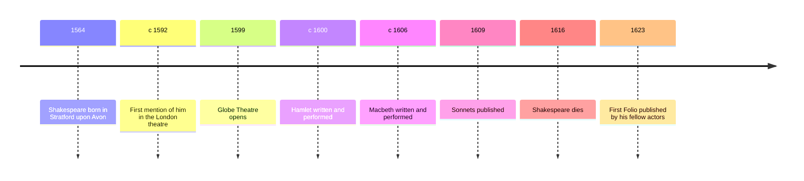

# 06 — Shakespeare — เชกสเปียร์

> *"To be, or not to be: that is the question"* : William Shakespeare, Hamlet, Act 3, Scene 1

Four hundred years after his death, William Shakespeare is still the most performed playwright on earth, in more languages than any writer except perhaps the scriptures. No theatre season and no list of great books is complete without him, and his lines have leaked so deep into English that people quote him without knowing it. This note goes deep into Hamlet, the play about a mind at war with itself; visits Macbeth, the play about ambition and blood; and looks at the sonnets, where the same voice turns to love and time. Along the way it introduces the tools Shakespeare put in every playwright's hands after him: blank verse (กลอนเปล่า), the soliloquy (บทพูดเดี่ยว), and a stage, the Globe, built for him and rebuilt in our century.

Thailand has a century-old tradition of Shakespeare on stage and page: King Vajiravudh (Rama VI) translated The Merchant of Venice as เวนิสวาณิช and As You Like It as ตามใจท่าน, and Thai theatre troupes and schools have staged the plays ever since. Reading him in any language is watching the modern mind being invented.

---

## 1 | The Works at a Glance

| Detail | Info |
|---|---|
| **Author** | William Shakespeare (1564 to 1616), Stratford-upon-Avon and London |
| **Published** | Hamlet c. 1600; Macbeth c. 1606; Sonnets 1609; in English |
| **Genre** | Tragedy (โศกนาฏกรรม) and lyric poetry; the plays are in blank verse and prose |
| **Setting** | Medieval Denmark for Hamlet; medieval Scotland for Macbeth; the sonnets have no single setting, only a speaker |
| **Famous translations** | Every major language has many; Thai editions include King Vajiravudh's เวนิสวาณิช and ตามใจท่าน, among others |

Shakespeare was a provincial glover's son with a grammar-school education who went to London, acted, wrote about 39 plays, became a shareholder in his company, the Lord Chamberlain's Men, and retired rich enough to buy the second-largest house in Stratford. He wrote for a specific machine: the Globe, a wooden open-air theatre holding around three thousand people, where the groundlings stood in the yard, the wealthy sat in galleries, and every rank of London watched the same stage. After his death, two fellow actors collected his plays into the First Folio of 1623, without which half of them, including Macbeth, would be lost.

## 2 | Story and Structure

Spoilers follow: this note tells the whole story.

### Hamlet: The Prince Who Thinks Too Much

Something is rotten in the state of Denmark. Prince Hamlet, home from university for his father's funeral, finds his mother Gertrude already married to his uncle Claudius, now king. The ghost of his father appears on the castle battlements and tells him the truth: Claudius poured poison in the king's ear. The ghost demands revenge. Hamlet, the most intelligent man ever put on a stage, swears to it, then delays, for four acts, thinking: he feigns madness, berates his love Ophelia, stages a play, The Mousetrap, that reenacts the murder to watch Claudius flinch (it works: the king's guilt is now certain), and then, in the one moment he could kill Claudius at prayer, he stops, because killing him at prayer would send his soul to heaven. His inaction kills everyone else first: Polonius, spying behind a curtain, is stabbed by mistake; Ophelia, mad with grief, drowns; her brother Laertes returns for vengeance. The final scene is a duel rigged by Claudius: Laertes' poisoned blade cuts Hamlet, Gertrude drinks the poisoned cup meant for her son, and Hamlet, dying, kills Claudius at last. The last words are the rest is silence.

### The Play Within the Play

The Mousetrap is the most famous device in drama, the play within the play: art used as a trap and a mirror, the king watching his own crime performed. The scene is also Shakespeare's theory of theatre: the purpose of playing, Hamlet says, is to hold the mirror up to nature. When Claudius flinches, the play has done its work.

### Macbeth: The Blood That Will Not Wash Off

Macbeth, a brave Scottish general, meets three witches on a heath who hail him as king to be. His wife, Lady Macbeth, receives the news and does the rest: she steels him to murder King Duncan in his sleep, their guest, and smear the guards with blood. The deed is done, but the deed undoes them. Macbeth becomes king and descends into tyranny and paranoia: his friend Banquo is murdered (his ghost appears at the banquet), Macduff's family is slaughtered. Lady Macbeth, who once scolded her husband that a little water clears them of the deed, sleepwalks through the night trying to wash a spot from her hands. The witches' riddles trap Macbeth: no man born of woman can harm him (Macduff was born by caesarean section), and he is safe until Birnam Wood comes to Dunsinane (the attacking army advances under branches cut from the wood). The last act is a horror story told with terrifying economy, ending with Macduff's entrance carrying Macbeth's head.

### The Sonnets: Love and Time

The 154 sonnets, published 1609, are a private world beside the public stage: a speaker addressing a beautiful young man, urging him to marry and so defeat time, and a dark lady of tangled desire. Sonnet 18 asks shall I compare thee to a summer's day and answers no, because verse outlasts summer; Sonnet 116 defines love as an ever-fixed mark that does not alter. The sonnet form, fourteen lines of iambic pentameter (ฉันทลักษณ์ห้าจังหวะ), became the shape English poets used to think about love for four centuries.

| Character | Role | One line |
|---|---|---|
| Hamlet | Prince of Denmark | The mind too full of thought to act, and the stage's first modern man |
| Claudius | King, his uncle | The murderer whose guilt is certain after the play within the play |
| Gertrude | His mother | The woman caught between son and husband, punished by the poisoned cup |
| Ophelia | His love | Driven to madness and drowning by the men around her |
| Polonius | The king's counsellor | The meddler who dies behind the curtain |
| Horatio | Hamlet's friend | The witness who lives to tell the story |
| Macbeth | Scottish general | Brave, suggestible, and hollowed out by ambition |
| Lady Macbeth | His wife | The steel of the first murder, broken by the memory of it |
| Banquo | His friend | Murdered for the prophecy, and returns as the banquet's ghost |
| The Witches | The weird sisters | The riddles that trap the ambitious in their own hopes |

## 3 | Key Passages

> "To be, or not to be: that is the question: whether 'tis nobler in the mind to suffer the slings and arrows of outrageous fortune, or to take arms against a sea of troubles, and by opposing end them"

> > "จะเป็น หรือไม่เป็น นั่นคือคำถาม จะประเสริฐกว่าหรือที่ใจจะทนรับลูกศรและก้อนหินแห่งโชคชะตาอันบ้าคลั่ง หรือจะชักอาวุธต่อกรกับทะเลแห่งความทุกข์ และยุติมันด้วยการต่อต้าน" (แปลอิสระ)

Hamlet, Act 3, Scene 1. The most famous soliloquy in the world, and a study in structure: Hamlet cannot say outright what he means, so he circles it with alternatives, weighing being against not being until the thought of what comes after death freezes him.

> "Out, out, brief candle! Life's but a walking shadow, a poor player that struts and frets his hour upon the stage, and then is heard no more"

> > "ดับเสียเถิด เทียนอันช่างสั้นนัก ชีวิตก็เพียงเงาที่เดินได้ นักแสดงยากจนที่วางท่าและเร่าร้อนอยู่บนเวทีเพียงชั่วครู่ แล้วก็เงียบหายไปตลอดกาล" (แปลอิสระ)

Macbeth, Act 5, Scene 5, on hearing of his wife's death. The play's darkest insight, delivered at the moment of maximum emptiness: the tyrant sees his whole life as a bad actor's performance, brief, loud, and meaningless.

> "Let me not to the marriage of true minds admit impediments. Love is not love which alters when it alteration finds"

> > "ขออย่าให้ฉันยอมรับว่ามีอุปสรรคใดในพิธีสมรสของดวงใจที่แท้จริง ความรักไม่ใช่ความรัก หากมันแปรเปลี่ยนเมื่อพบความเปลี่ยนแปลง" (แปลอิสระ)

Sonnet 116. The sonnet's argument in its first lines: real love is defined by what it does not do, not alter, not bend, not admit impediment, which is also the poem's definition of the poem itself.

## 4 | Themes and Style

| Theme | Thai | How the work treats it |
|---|---|---|
| Revenge and conscience | การแก้แค้นกับมโนธรรม | Hamlet's delay: a revenge plot run by a man who cannot stop thinking |
| Ambition | ความทะเยอทะยาน | Macbeth: the throne bought with murder, and the price paid in sleep and sanity |
| Appearance and reality | สิ่งที่ปรากฏกับความจริง | Feigned madness, a play as a trap, a ghost: nothing on this stage is what it seems |
| Mortality | ความเป็นมรรตัย | The skull of Yorick, the brief candle, the rest is silence |
| Love and time | ความรักกับกาลเวลา | The sonnets: verse as the only thing that outlives beauty |
| Madness | ความบ้า | Ophelia's real madness beside Hamlet's feigned: the play weighs both |

Blank verse, unrhymed iambic pentameter, is Shakespeare's engine: close enough to speech for realism, rhythmic enough for grandeur, and he breaks it deliberately at moments of crisis. The soliloquy (บทพูดเดี่ยว), a character alone, thinking aloud, is his great invention of interiority: before Hamlet's soliloquies, stage characters announced; after them, they thought. The aside (บทกระซิบข้างเวที) lets a character step out of the scene to whisper to us. And everywhere there is wordplay: puns, double meanings, and coinages, hundreds of which, eyeball, bedazzled, lonely, are still in daily English.

## 5 | Timeline

## 6 | Thai Terminology

| Thai | English | Notes |
|---|---|---|
| กลอนเปล่า | Blank verse | Unrhymed iambic pentameter, the engine of the plays |
| บทพูดเดี่ยว | Soliloquy | A character alone on stage, thinking aloud |
| บทกระซิบข้างเวที | Aside | A line spoken to the audience, unheard by the other characters |
| ฉันทลักษณ์ห้าจังหวะ | Iambic pentameter | The five-beat line of English poetry |
| โคลงสิบสี่บรรทัด | Sonnet | The fourteen-line form of the love poems |
| โศกนาฏกรรม | Tragedy | The fall of a great person through a fatal flaw |
| โศกนาฏกรรมแก้แค้น | Revenge tragedy | The genre Hamlet inherits and transforms |
| ตัวตลกผ่อนคลาย | Comic relief | The grave-diggers and porters who break the darkness |
| ความทะเยอทะยาน | Ambition | The appetite that unmakes Macbeth |
| โรงละครโกลบ | The Globe | Shakespeare's wooden open-air theatre, rebuilt in London |
| ฉบับพิมพ์รวมครั้งแรก | First Folio | The 1623 collected edition that saved the plays |

## 7 | Why It Matters Today

- The Lion King is Hamlet with lions: usurping uncle, ghost father, exiled prince, and a conscience. The plot has moved into animation, and no child who watches it is a stranger to Shakespeare.
- Akira Kurosawa's Throne of Blood (1957) moves Macbeth to feudal Japan, and it is one of the greatest Shakespeare films ever made in any language: the plays transplant because the psychology travels.
- Kenneth Branagh's Hamlet (1996) plays the full text uncut, four hours of proof that a 400-year-old revenge play can still hold a cinema.
- The Thai tradition: King Vajiravudh's translations (เวนิสวาณิช, ตามใจท่าน) and a century of Thai stage adaptations show the plays settling into every culture that meets them, without losing their engine.
- Everyday language: to be or not to be, the green-eyed monster, break the ice, and wild-goose chase all come from these plays. Quoting Shakespeare is something most English speakers do by accident.

## 8 | Further Reading

- *Hamlet*, the Arden Shakespeare or Folger edition: either gives a readable text with notes that explain the puns and the politics.
- *Macbeth*, Arden Shakespeare: the shortest of the great tragedies, and the best place to start reading the plays whole.
- *Will in the World* by Stephen Greenblatt (2004): a biography that reconstructs how a glover's son became the world's playwright.
- *Shakespeare: The Invention of the Human* by Harold Bloom: the great argument that Shakespeare invented our idea of personality.

## Related

- [[World Literature/00_overview|← World Literature Overview]]
- [[05_Dante_and_the_Medieval_World]]
- [[07_Cervantes_and_the_Early_Novel]]
- [[Art/03 Performing Arts/03_Creative_Drama|Creative Drama]]
- [[Art/03 Performing Arts/04_Performance_Production|Performance Production]]
