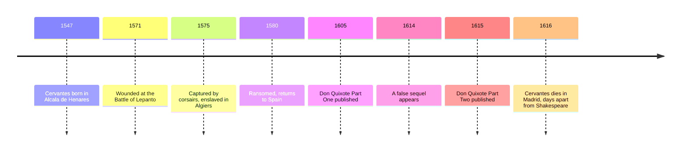

# 07 — Cervantes and the Early Novel — เซร์บันเตสกับนวนิยายยุคแรก

> *"What giants?" said Sancho Panza. "Those you see over there," replied his master, "with their long arms: some of them are nearly two leagues long."*
>
> *Don Quixote*, Part One, Chapter 8

Four hundred years before almost every novel you have read, a Spanish soldier in his late fifties wrote the first one. *Don Quixote* (ดอนกิโฆเต้) is the story of a man who reads too many knightly romances and sets out to live inside one: the book that invented the modern novel (นวนิยาย) by putting a deluded hero on a real road with real inns, real bruises, and a hungry, talkative squire. It is the funniest and one of the most moving books in any language, and it asks a question every adult faces, the question of reality versus illusion (โลกจริงกับจินตนาการ): how much of our world is really there, and how much do we make up as we go?

---

## 1 | The Works at a Glance

| Detail | Info |
|---|---|
| **Author** | Miguel de Cervantes Saavedra (1547 to 1616) |
| **Published** | 1605 (Part One) and 1615 (Part Two), in Spanish |
| **Genre** | Novel (นวนิยาย), parody (วรรณกรรมล้อเลียน) of the chivalric romance (นิยายรักอัศวิน) |
| **Setting** | La Mancha and the roads of Spain, around 1600 |
| **Famous translations** | Edith Grossman (2003), John Rutherford (Penguin Classics), Tobias Smollett (1755); Thai editions available |

Cervantes lived the adventures he would later laugh at. He fought at the Battle of Lepanto in 1571, where a wound left his left hand useless, as he put it, "for the greater glory of the right". In 1575 he was captured by pirates and spent five years as a slave in Algiers, ransomed at last in 1580. He returned to Spain to work as a tax collector and went to prison more than once for debt, and he began writing late: *Don Quixote* appeared when he was fifty-seven. He died in Madrid in April 1616, days apart from Shakespeare.

## 2 | Story and Structure

Spoilers follow: this note tells the whole story.

### Part 1: A Knight Errant Rides Out (1605)

Alonso Quijano, a gentleman of about fifty in a village of La Mancha, reads so many books of chivalry that his brain dries up. He sells land to buy more books, then resolves to become a knight errant (อัศวินพเนจร): he polishes his great-grandfather's armor, renames his bony horse Rocinante, and calls himself Don Quixote de la Mancha. A knight needs a lady, so he chooses a farm girl he has barely seen, Aldonza Lorenzo, and renames her Dulcinea del Toboso. At a roadside inn he mistakes for a castle, he has himself dubbed a knight by a bemused innkeeper. Then the world starts correcting him: he frees a boy being beaten by his master (who beats the boy worse once the knight leaves) and attacks merchants he takes for knights, who beat him senseless. A neighbor carries him home, where the priest and the barber burn his library and brick up the study door, blaming an enchanter: an explanation Quixote finds entirely believable.

He sets out again with a neighbor as his squire (ผู้ติดตาม): Sancho Panza, a farmer lured by a promise of an island to govern. Now the book finds its rhythm. Quixote sees the world through his romances, Sancho through his hunger, and reality keeps breaking in: the windmills Quixote takes for giants (the passage quoted above), an inn for a castle, sheep for armies, a barber's basin for the legendary helmet of Mambrino, a chain of galley slaves whom he frees because men should not be chained. The pair reaches the Sierra Morena, where Quixote does ridiculous penance for Dulcinea's sake, and the novel suddenly opens up: other characters appear with their own stories, among them a captive who escaped from Algiers, telling the story of Cervantes's own captivity. Everyone converges at an inn; disguises collapse; and the priest and barber bring Quixote home in a wooden cage, pretending he is enchanted. Part One ends with the narrator claiming the rest of the history may be lost.

### Part 2: The Wise Madman (1615)

Quixote rides out a third time, and everything has changed: Part Two's characters have all read Part One. This is the book's great invention, a novel whose world contains its own first volume, fiction aware of itself as fiction (อภิวนิยาย). The student Sansón Carrasco plans to defeat Quixote and send him home; disguised as the Knight of the Mirrors he loses, but as the Knight of the White Moon on the beach at Barcelona he wins. Along the way a Duke and Duchess who have read Part One stage cruel entertainments at the knight's expense, and give Sancho his promised island, the village of Barataria, where the peasant governor judges disputes with astonishing common sense before renouncing power. Defeated, Quixote must abandon knight-errantry for a year. He falls ill, and on his deathbed the dream dissolves: he is Alonso Quijano the Good again, the books are nonsense, and he dies forgiven and sane, while Sancho, who has spent a thousand pages growing wiser and kinder, weeps and begs him to live. The narrator ends by warning the writers of false sequels to leave the knight in his grave.

| Character | Role | One line |
|---|---|---|
| Don Quixote | The knight | A gentleman who chooses to live inside the story of knighthood |
| Sancho Panza | The squire | Peasant, realist, and one of the best friends in literature |
| Dulcinea del Toboso | The lady | A farm girl transformed by imagination into the perfect lady |
| Sansón Carrasco | The rival | The student who defeats Quixote to bring him home |
| The Duke and Duchess | The cruel readers | Rich idlers who stage Part One as entertainment |
| Rocinante | The horse | As bony and stubborn as his master's quest |

## 3 | Key Passages

> "What giants?" said Sancho Panza. "Those you see over there," replied his master, "with their long arms: some of them are nearly two leagues long."
>
> *Don Quixote*, Part One, Chapter 8

> > "ยักษ์อะไรกันหรือ" ซันโช ปันซาถาม "ก็เจ้าที่เห็นอยู่ตรงนั้นไง" นายของเขาตอบ "ตัวที่มีแขนยาวๆ บางตัวแขนยาวเกือบสองลีกเชียวนะ" (แปลอิสระ)

Why it matters: two men look at the same thing and see different worlds, and the novel never quite decides which one is right.

> "Freedom, Sancho, is one of the most precious gifts that heaven has bestowed upon men; no treasures that the earth holds buried or the sea conceals can compare with it."
>
> *Don Quixote*, Part Two, Chapter 58

> > "อิสรภาพ ซันโช คือของขวัญล้ำค่าที่สุดที่สวรรค์มอบให้มนุษย์ ทรัพย์สมบัติใดๆ ที่ฝังอยู่ในดินหรือซ่อนอยู่ในทะเลก็เทียบไม่ได้" (แปลอิสระ)

Why it matters: the madman who fights windmills speaks the book's sanest sentences.

> "I was mad, and now I am in my senses; I was Don Quixote of La Mancha, and now I am, as I have said, Alonso Quijano the Good."
>
> *Don Quixote*, Part Two, Chapter 74

> > "ข้าเคยบ้า บัดนี้ข้าได้สติแล้ว ข้าเคยเป็นดอนกิโฆเต้แห่งลามันชา บัดนี้ข้าคืออลอนโซ กิฮาโนผู้ใจดี อย่างที่ข้าบอกแล้ว" (แปลอิสระ)

Why it matters: the ending dares the reader to ask which self was the truer one, and which world we would rather keep.

## 4 | Themes and Style

| Theme | Thai | How the work treats it |
|---|---|---|
| Reality and illusion | โลกจริงกับจินตนาการ | Quixote sees giants and castles where others see windmills and inns; the novel asks which vision is truer |
| Chivalry and honor | อุดมคติอัศวิน | The old code of honor, tested against a world that has outgrown it |
| Class and justice | ชนชั้นกับความยุติธรรม | Quixote frees prisoners and speaks for the poor; Sancho the peasant becomes a wise governor |
| Friendship | มิตรภาพ | Master and servant slowly become equals, and each is the better for the other |
| Madness and wisdom | ความบ้ากับปัญญา | The madman often speaks the sanest truths |
| Reading and living | การอ่านกับการใช้ชีวิต | Reading too much warps the mind, yet stories are what make life bearable |
| Freedom | อิสรภาพ | Quixote calls freedom heaven's most precious gift |

The book's style is conversation. Quixote speaks in the high-flown formulas of the romances while the narrator and Sancho speak in proverbs and plain prose, and the collision of the two registers is the comedy. Cervantes borrows the machinery of the chivalric books, inns as castles, enchanters as the explanation for everything, and bends it toward the real. The novel even pretends to be a translation of an Arabic manuscript by one Cide Hamete Benengeli, with narrators who disagree and correct each other: fiction aware of itself as fiction, centuries before the term existed.

## 5 | Timeline

## 6 | Thai Terminology

| Thai | English | Notes |
|---|---|---|
| นวนิยาย | novel | Long prose fiction about everyday people; Don Quixote is called the first modern one |
| นิยายรักอัศวิน | chivalric romance | The knightly adventure books Quixote reads too many of |
| อัศวินพเนจร | knight errant | A knight who rides out seeking adventures and wrongs to right |
| ผู้ติดตาม | squire | Sancho's role: servant, companion, and the voice of common sense |
| วรรณกรรมล้อเลียน | parody | Imitating a genre to expose its absurdity |
| การเสียดสี | satire | Ridicule aimed at folly; here gentler and warmer than Swift's |
| โลกจริงกับจินตนาการ | reality versus illusion | The novel's central tension |
| อภิวนิยาย | metafiction | Fiction that knows itself to be fiction |
| นวนิยายพเนจร | picaresque novel | A rogue's episodic adventures, an ancestor of Quixote |
| สัจนิยม | realism | The everyday, the physical, and the unromantic rendered plainly |

## 7 | Why It Matters Today

- **The word "quixotic":** idealistic beyond reality; and "tilting at windmills" for fighting imaginary enemies. The book's own hero became an adjective in half the world's languages.
- **The musical:** *Man of La Mancha* (1965) turned Quixote into the singer of "The Impossible Dream", and every generation re-stages him as the patron of noble failure.
- **The metafiction move:** characters who have read the book they appear in are now standard television: Cervantes did it first, in 1615.
- **A Thai resonance:** nearly every family knows an elder who lives partly inside a beloved ละคร. Cervantes asks us to see the dignity in that world, and the courage, rather than only the unreality.

## 8 | Further Reading

- *Don Quixote* translated by Edith Grossman: the modern standard, lively and faithful.
- *Don Quixote* translated by John Rutherford (Penguin Classics): an excellent, reader-friendly alternative.
- *The Man Who Invented Fiction* by William Egginton: how Cervantes created the modern novel, told as a biography.

## Related

- [[World Literature/00_overview|← World Literature Overview]]
- [[06_Shakespeare]]
- [[08_Enlightenment_Literature]]
- [[01_How_to_Read_Literature]]
- [[Philosophy/15_Existentialism|Existentialism]]
