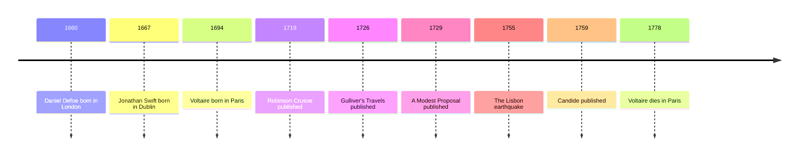

# 08 — Enlightenment Literature — วรรณกรรมยุคเรืองปัญญา

> *"All that is very well," answered Candide, "but let us cultivate our garden."*
>
> *Candide*, final chapter

The eighteenth century trusted reason (เหตุผล) the way our century trusts data, and its writers aimed the new faith at the old abuses: war, poverty, arrogance, and comfortable cruelty. This note follows three of them: Voltaire, who demolished the doctrine that everything is for the best; Swift, whose deadpan satire (วรรณกรรมเสียดสี) still stings three centuries on; and Defoe, whose castaway built a whole civilization with his own two hands. Between them they forged the modern weapons of the essay, the satire, and the novel.

---

## 1 | The Works at a Glance

| Detail | Info |
|---|---|
| **Author** | Voltaire (1694 to 1778), Jonathan Swift (1667 to 1745), Daniel Defoe (c. 1660 to 1731) |
| **Published** | *Robinson Crusoe* 1719; *Gulliver's Travels* 1726; *A Modest Proposal* 1729; *Candide* 1759 |
| **Genre** | Satire (วรรณกรรมเสียดสี), philosophical tale (นิทานปรัชญา), early novel (นวนิยาย) |
| **Setting** | Europe and imagined worlds: Lisbon, Lilliput, a desert island, El Dorado |
| **Famous translations** | *Candide*: Peter Constantine, Roger Pearson; *Gulliver's Travels*: Oxford World's Classics; Thai editions of *Candide* and *Robinson Crusoe* exist |

Three very different lives, one shared instinct: laughter as a weapon. Voltaire was imprisoned in the Bastille, exiled, and hounded all over Europe, and never stopped writing. Swift was a Dublin clergyman whose fury at English policy toward Ireland produced the most dangerous pamphlet ever written. Defoe was a merchant, bankrupt, spy, and journalist who wrote his first novel near the age of sixty and never looked back.

## 2 | Story and Structure

Spoilers follow: this note tells the whole story.

### Candide (1759)

Candide, a trusting young man, grows up in a Westphalian castle where his tutor Pangloss teaches that all is for the best in the best of all possible worlds: optimism (การมองโลกในแง่ดี) raised into a philosophy, one that can justify any disaster. When Candide is caught kissing the baron's daughter Cunégonde, he is thrown out, and the world begins teaching him at brutal speed: he is beaten, conscripted into an army, and driven through a Europe at war. He reaches Lisbon just as the 1755 earthquake destroys the city, and he and Pangloss are punished at an auto-da-fé meant to appease God; Pangloss is hanged. Candide finds Cunégonde alive, loses her again, is robbed, and travels on with the pessimist Martin. He reaches El Dorado, a hidden kingdom of perfect happiness where gold lies around like pebbles, and leaves it, because he wants Cunégonde more than perfection. At the end he finds her, now old and ugly, and buys a small farm near Constantinople. Pangloss, somehow alive, still spins his philosophy; Candide answers with the book's last words: we must cultivate our garden. The point is not despair. It is that after every philosophy has been weighed, honest work on a human scale is what remains.

### Gulliver's Travels (1726)

Lemuel Gulliver, a ship's surgeon, reports four voyages in the flat, exact voice of a traveler's journal. In Lilliput, a kingdom of people six inches tall, he watches a war fought over which end of an egg should be broken: an absurdity that mirrors Europe's religious wars. In Brobdingnag, the land of giants, he is the tiny one, and his proud account of England's wars, politics, and gunpowder leads the giant king to a verdict on Gulliver's countrymen that stings three centuries later (quoted below). In Laputa, a floating island, he meets scientists so lost in abstraction that their projects, extracting sunbeams from cucumbers among them, feed no one: science without common sense. The last voyage is the bitter one. In the land of the Houyhnhnms, rational talking horses live in plain virtue while the human-shaped Yahoos are filthy and brutal, and Gulliver comes home preferring horses to his own family. Swift is not recommending misanthropy; he is holding up a mirror and asking us to be stung into decency.

### Robinson Crusoe (1719)

Shipwrecked alone on an island off South America, Crusoe salvages what he can from the wreck and spends twenty-eight years building a life: a shelter, a calendar, crops, goats, a stockade. The novel is a hymn to reason, labor, and inventory; everything is counted, scheduled, and improved. Crusoe reads the Bible, converts his terror into faith, and names himself king of the island. After years of solitude he finds a single footprint in the sand, and the fear of the other nearly undoes him. He rescues a captive from cannibals, names him Friday, and makes him servant, convert, and friend. When mutineers bring a ship to the island, Crusoe takes it and sails home a rich man. Often called the first English novel, the book carries a double legacy on every page: the dignity of self-reliance, and the arrogance of empire, the man who tames the wild island and assumes Friday is his to name.

| Character | Role | One line |
|---|---|---|
| Candide | The student | Innocence tested by disaster, from castle to Constantinople garden |
| Pangloss | The teacher | The optimist who never stops proving that all is well |
| Lemuel Gulliver | The traveler | The narrator whose voyages turn him against his own species |
| Robinson Crusoe | The castaway | Reason and labor turned into a life |
| Friday | The rescued man | Crusoe's servant, convert, and companion, named by his captor |

## 3 | Key Passages

> "All that is very well," answered Candide, "but let us cultivate our garden."
>
> *Candide*, final chapter

> > "ที่ท่านพูดมาก็ดีทั้งนั้นแหละ" ก็องดิดตอบ "แต่เรามาปลูกสวนของเราเถิด" (แปลอิสระ)

Why it matters: the French original, "Il faut cultiver notre jardin", became one of the most quoted endings in literature: philosophy ends, gardening begins.

> "I have been assured by a very knowing American of my acquaintance in London, that a young healthy child well nursed is, at a year old, a most delicious, nourishing, and wholesome food, whether stewed, roasted, baked, or boiled."
>
> *A Modest Proposal*

> > "ชาวอเมริกันผู้เจนจัดคนหนึ่งที่ข้ารู้จักในลอนดอนยืนยันกับข้าว่า เด็กทารกสุขภาพดีที่เลี้ยงดูมาดีเมื่ออายุได้หนึ่งขวบ เป็นอาหารที่อร่อย มีคุณค่า และมีประโยชน์ ไม่ว่าจะตุ๋น ย่าง อบ หรือต้ม" (แปลอิสระ)

Why it matters: the deadpan (ท่าทีเรียบเฉย) is total: a monstrous proposal delivered in the calm voice of an economist, and the horror is left entirely to the reader.

> "I cannot but conclude the bulk of your natives to be the most pernicious race of little odious vermin that nature ever suffered to crawl upon the surface of the earth."
>
> *Gulliver's Travels*, Part Two, Chapter 6

> > "ข้าพเจ้าอดไม่ได้ที่จะสรุปว่า คนส่วนใหญ่ของชาตินั้นเป็นเผ่าพันธุ์ที่ชั่วร้ายที่สุด ประหนึ่งแมลงตัวเล็กน่ารังเกียจที่ธรรมชาติปล่อยให้คลานอยู่บนพื้นโลก" (แปลอิสระ)

Why it matters: the giant king's verdict on England, and the reader feels both its sting and its justice.

## 4 | Themes and Style

| Theme | Thai | How the work treats it |
|---|---|---|
| Satire | วรรณกรรมเสียดสี | The age's weapon: absurd voyages and calm proposals expose real cruelty |
| Optimism versus experience | การมองโลกในแง่ดีกับประสบการณ์จริง | Candide tests "all is for the best" against war, earthquake, and slavery |
| Reason and its limits | เหตุผลกับขอบเขตของมัน | Reason is the age's faith, and its blind spot: reason can serve cruelty |
| Empire and the other | จักรวรรดิกับคนอื่น | Crusoe's island and Gulliver's Yahoos show Europe meeting the wider world |
| Society and corruption | สังคมกับความเสื่อมทราม | Courts, churches, and parliaments shown as absurd systems |
| Work and resilience | การงานกับความทรหด | Candide's garden and Crusoe's island: honest labor as the answer |

The shared instrument is the deadpan (ท่าทีเรียบเฉย): Swift proposes eating children in the tone of a civil servant, and the shock lives in the gap between the calm voice and the monstrous content. *Candide* moves at picaresque speed, a new catastrophe per chapter, told in crisp sentences that refuse to mourn. *Robinson Crusoe* invents the realism of the list and the journal: the novel as a document of survival. Together these books handed the next century the Enlightenment's double gift: reason as a tool for reform, and satire as its watchdog.

## 5 | Timeline

## 6 | Thai Terminology

| Thai | English | Notes |
|---|---|---|
| ยุคเรืองปัญญา | the Enlightenment | The eighteenth-century movement trusting reason, science, and reform |
| วรรณกรรมเสียดสี | satire | Ridicule used as a weapon against injustice and folly |
| การประชดประชัน | irony | Saying one thing while meaning its opposite |
| ท่าทีเรียบเฉย | deadpan | Delivering absurdity with a perfectly straight face |
| การมองโลกในแง่ดี | optimism | Here, the doctrine that all is for the best, which Candide tests to destruction |
| เหตุผล | reason | The age's highest value, and its blind spot |
| ยูโทเปีย | utopia | An imagined perfect society, like El Dorado |
| นิทานปรัชญา | philosophical tale | A story built to carry a philosophical argument |
| จุลสาร | pamphlet | A short printed essay: the era's viral post |
| ความเกลียดชังมนุษย์ | misanthropy | Disgust with humankind: Gulliver's endpoint, Swift's warning |

## 7 | Why It Matters Today

- **The joke taken literally:** *A Modest Proposal* is the ancestor of every satirical piece that gets believed, shared, and denounced online, which is itself part of Swift's point about comfortable cruelty.
- **Cultivating the garden after disaster:** after tsunamis, earthquakes, and wars, rebuilding is done by ordinary people doing ordinary work; Candide's quiet answer is the one that lasts.
- **Laughter against power:** Thai political cartoons, stand-up, and หมอลำ continue the same tradition: satire flourishes wherever direct criticism is costly.
- **The best-of-all-possible-worlds test:** whenever a politician or an advertisement insists that everything is fine as it is, Candide is the ready reply.

## 8 | Further Reading

- *Candide* translated by Roger Pearson (Oxford World's Classics): crisp, with excellent notes.
- *Gulliver's Travels* (Oxford World's Classics): the full four voyages, not the children's abridgement.
- *Robinson Crusoe* (Penguin Classics): the original survival story, still gripping.
- *The Enlightenment: The Pursuit of Happiness* by Ritchie Robertson: a readable survey of the era that produced these books.

## Related

- [[World Literature/00_overview|← World Literature Overview]]
- [[07_Cervantes_and_the_Early_Novel]]
- [[09_Goethe_and_German_Literature]]
- [[Philosophy/12_Enlightenment_and_Social_Contract|Enlightenment and Social Contract]]
- [[Social Studies/04 History/02_World_History_and_Civilizations|World History and Civilizations]]
