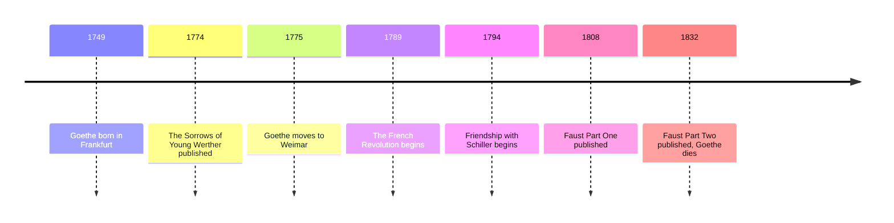

# 09 — Goethe and German Literature — เกอเทอกับวรรณกรรมเยอรมัน

> *"Two souls, alas, are dwelling in my breast, and one is striving to forsake its brother."*
>
> *Faust*, Part One

One German poet cast the longest shadow over European literature. Goethe (เกอเทอ) wrote the century's most famous novel of doomed love, *The Sorrows of Young Werther*, and the greatest German play, *Faust* (เฟาสต์): the story of the scholar who sells his soul to the devil for one moment worth eternity. Between those two works lies the birth of Romanticism (จินตนิยม), and a bargain that every later generation has re-signed: knowledge at a price, love at a cost.

---

## 1 | The Works at a Glance

| Detail | Info |
|---|---|
| **Author** | Johann Wolfgang von Goethe (1749 to 1832) |
| **Published** | *The Sorrows of Young Werther* 1774; *Faust, Part One* 1808; *Faust, Part Two* 1832, in German |
| **Genre** | Tragedy (โศกนาฏกรรม), epistolary novel (นวนิยายจดหมาย) |
| **Setting** | *Faust*: a scholar's study and a German town, around 1500; *Werther*: a small German town, 1771 |
| **Famous translations** | *Faust*: Walter Kaufmann, David Luke; *Werther*: David Constantine; Thai editions available |

Goethe was the last universal man: poet, playwright, novelist, statesman at the Weimar court, and a serious scientist who studied light and plants. *Werther* made him Europe's first celebrity author at twenty-five; he spent sixty more years as Germany's cultural center, in long friendship and rivalry with the poet Schiller. Late in life he coined the idea of world literature (วรรณกรรมโลก): the literatures of all nations enriching one another, which is the idea behind this very vault.

## 2 | Story and Structure

Spoilers follow: this note tells the whole story.

### Faust, Part One (1808)

In the Prologue in Heaven, God and Mephistopheles wager over one man: the scholar Faust, who has mastered law, medicine, philosophy, and theology and found that all his knowledge has given him nothing. God bets that Faust will not be lost; Mephistopheles bets he can lead him astray. Faust, alone in his study at night, is ready to renounce everything: he has conjured spirits and found them unbearable, and he lifts a cup of poison. Church bells and a choir call him back. Mephistopheles then appears, first as a poodle, then as a gentleman, and offers the contract of contracts: he will serve Faust in this life, and if Faust is ever so satisfied that he says to a moment, "Stay, you are so beautiful!", then Faust's soul is his. Faust agrees, is made young, and the devil takes him out into the world.

The world, for Faust, becomes Gretchen: a modest young woman whom Mephistopheles helps him seduce with jewels and flattery. The tragedy then unfolds at village scale. To visit Gretchen at night, Faust gives her mother a sleeping potion that kills her. Her brother Valentin challenges Faust and dies in the duel, cursing his sister in public. Gretchen, pregnant, drowns her newborn child and is imprisoned, condemned to death. Faust comes to rescue her, but Gretchen, half-mad, refuses to flee, entrusts herself to God's judgment, and is saved: a voice from above declares it. Faust is dragged away by Mephistopheles, and the first part ends. The deal's price has been paid in full by someone else: the reader is left asking what Faust's striving has bought.

*Part Two* (1832), published after Goethe's death, moves from the small world to the great. Faust serves an emperor, conjures Helen of Troy, and at last, blind and old, imagines a land reclaimed from the sea where free people live by their work. He calls the vision beautiful, speaks the fatal words, and falls dead. Mephistopheles claims the contract; angels carry the soul away. The wager is won not because Faust was perfect, but because he never stopped striving: for Goethe, striving itself is what saves.

### The Sorrows of Young Werther (1774)

Werther, a passionate young artist, writes letters to his friend Wilhelm from a small town where he falls in love with Lotte, a serene young woman already promised to the steady Albert. The novel is nothing but Werther's letters: the rising temperature of an infatuation that no duty can cool. Lotte is kind, Albert is decent, and Werther is consumed. He tries leaving, takes a dull job, fails, and returns. On a last visit he reads to Lotte from his translation of Ossian, the book's emotional summit, and declares himself; she sends him away. He borrows Albert's pistols on a pretext, writes a long farewell, and shoots himself. The book swept Europe: young men dressed like Werther, suicides were blamed on it, and several cities banned it. Goethe, who wrote it at twenty-five to survive his own unrequited love, spent the rest of his long life at a distance from it, calling the novel's fever a sickness he had needed to get out of his system.

| Character | Role | One line |
|---|---|---|
| Faust | The scholar | The man who knows everything and will risk his soul for more |
| Mephistopheles | The tempter | Wit, cynicism, and the devil's own honesty |
| Gretchen | The beloved | Innocence destroyed by Faust's desire, saved by her own faith |
| Werther | The lover | Feeling without limits: the century's romantic hero and warning |
| Lotte | The beloved | Kind, dutiful, and unreachable |

## 3 | Key Passages

> "Two souls, alas, are dwelling in my breast, and one is striving to forsake its brother."
>
> *Faust*, Part One, scene "Outside the City Gate"

> > "อนิจจา ในอกของข้ามีสองวิญญาณอาศัยอยู่ และดวงหนึ่งพยายามจะพรากจากอีกดวง" (แปลอิสระ)

Why it matters: the most famous self-diagnosis in German literature: the divided heart that became Romanticism's signature.

> "If ever I say to the passing moment: 'Stay, you are so beautiful!', then you may put me in chains, and I will gladly be destroyed."
>
> *Faust*, Part One, the pact scene

> > "หากวันใดข้าเอ่ยกับช่วงเวลาที่ผ่านไปว่า 'หยุดก่อนเถิด ช่างงดงามนัก!' เมื่อนั้นจงล่ามโซ่ข้า และข้ายินยอมให้ถูกทำลายได้เลย" (แปลอิสระ)

Why it matters: the whole contract in one sentence: the soul is staked on the ability to be satisfied.

> "How glad I am that I am gone!"
>
> *The Sorrows of Young Werther*, first letter, 4 May 1771

> > "ข้าดีใจเหลือเกินที่ได้จากที่นั่นมา!" (แปลอิสระ)

Why it matters: one sentence opens the epistolary novel (นวนิยายจดหมาย), and the reader is inside a stranger's heart from the first line.

## 4 | Themes and Style

| Theme | Thai | How the work treats it |
|---|---|---|
| The bargain | สัญญากับปีศาจ | Faust trades his soul for one moment of true satisfaction |
| Knowledge and its limits | ความรู้กับขีดจำกัดของมัน | The scholar who knows everything discovers that knowing is not enough |
| Love and guilt | ความรักกับความรู้สึกผิด | Gretchen pays for Faust's desire; her salvation is grace, not merit |
| Feeling versus duty | ความรู้สึกกับหน้าที่ | Werther's passion against Lotte's engagement |
| Romanticism | จินตนิยม | Sturm und Drang: feeling, nature, and the individual heart over polite rules |
| Redemption | การไถ่บาป | Both Gretchen and Faust are saved in the end, by striving and by grace |

Goethe's range is the whole point. *Werther* is a single voice at fever pitch; *Faust* is a cathedral of registers, folk song next to church rite next to philosophical debate, with the verse changing for each speaker: Gretchen sings simple songs, Mephistopheles deals in epigrams, Faust thunders. Sturm und Drang (พายุและแรงขับ), storm and stress, is the name of the 1770s movement of which young Goethe was the star: feeling against rules. The older Goethe turned toward balance, what critics call Weimar classicism (คลาสสิกนิยม), and toward the idea that the world's literatures belong to everyone.

## 5 | Timeline

## 6 | Thai Terminology

| Thai | English | Notes |
|---|---|---|
| จินตนิยม | romanticism | The movement valuing feeling, nature, and the individual heart |
| พายุและแรงขับ | Sturm und Drang | "Storm and stress": the 1770s German revolt of feeling against rules |
| นวนิยายจดหมาย | epistolary novel | A novel told entirely through letters |
| สัญญากับปีศาจ | pact with the devil | The bargain at the heart of Faust |
| โศกนาฏกรรม | tragedy | The genre Faust is written in |
| การไถ่บาป | redemption | Being saved from sin or ruin |
| คลาสสิกนิยม | classicism | Balance and restraint: Goethe's later phase at Weimar |
| วรรณกรรมโลก | world literature | Goethe's own coinage: the literatures of all nations in conversation |

## 7 | Why It Matters Today

- **The Faustian bargain:** journalism's shorthand for trading integrity for power or fame; every modern deal-with-the-devil story, from the blues legend of Robert Johnson at the crossroads to *Breaking Bad*, re-signs Faust's contract.
- **The Werther effect:** the copycat suicides after 1774 gave the phenomenon its name, and modern media guidelines for reporting suicide follow the lesson Goethe learned painfully young.
- **The Gretchen question:** German still calls a question that tests your conscience a *Gretchenfrage*, from her line asking Faust whether he believes in God.
- **World literature is this vault's idea:** Goethe's belief that nations' literatures enrich each other is the reason a Thai reader meets a German scholar on these pages.

## 8 | Further Reading

- *Faust, Part One* translated by David Luke (Oxford World's Classics): clear, stage-ready, and well annotated.
- *Faust* translated by Walter Kaufmann: the famous bilingual edition.
- *The Sorrows of Young Werther* translated by David Constantine (Oxford World's Classics): the fever in modern English.

## Related

- [[World Literature/00_overview|← World Literature Overview]]
- [[08_Enlightenment_Literature]]
- [[10_Russian_Literature]]
- [[Philosophy/13_Kant_and_German_Idealism|Kant and German Idealism]]
