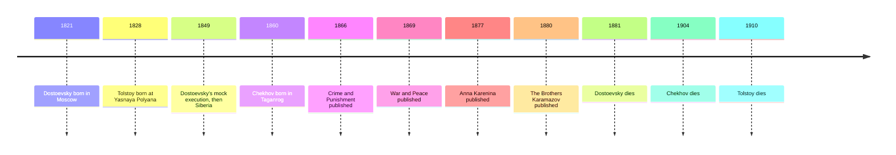

# 10 — Russian Literature — วรรณกรรมรัสเซีย

> *"All happy families are alike; each unhappy family is unhappy in its own way."*
>
> *Anna Karenina*, Part One, Chapter 1

No literature looks more directly into the soul at war with itself than Russia's. In a single generation, Tolstoy, Dostoevsky, and Chekhov wrote the novels that became the world's measure of psychological depth (นวนิยายจิตวิทยา): murder as a test of ideas, love as a social crime, and the quiet ache of ordinary trapped lives. If you have ever wanted to know what a person truly feels before and after a terrible act, these are the books that answer.

---

## 1 | The Works at a Glance

| Detail | Info |
|---|---|
| **Author** | Leo Tolstoy (1828 to 1910), Fyodor Dostoevsky (1821 to 1881), Anton Chekhov (1860 to 1904) |
| **Published** | *Crime and Punishment* 1866, *War and Peace* 1869, *Anna Karenina* 1877, *The Brothers Karamazov* 1880, in Russian; Chekhov's stories from the 1880s onward |
| **Genre** | Realism (สัจนิยม), psychological novel (นวนิยายจิตวิทยา), short story (เรื่องสั้น) |
| **Setting** | Nineteenth-century Russia: St Petersburg, Moscow, and the country estates |
| **Famous translations** | Richard Pevear and Larissa Volokhonsky; Constance Garnett; Rosamund Bartlett (*Anna Karenina*); Thai editions available |

The three lives are themselves Russian novels. Dostoevsky was sentenced to death in 1849 for reading forbidden books, stood before a firing squad, was reprieved at the last moment, and spent four years in a Siberian prison camp; his epilepsy and gambling debts never left him. Tolstoy was a count who wrote two of the greatest novels ever written, then renounced his property, and died in 1910 in a railway stationmaster's house, having walked away from home. Chekhov was a doctor who treated the poor for free and wrote his stories in snatched hours, dying of tuberculosis at forty-four.

## 2 | Story and Structure

Spoilers follow: this note tells the whole story.

### Crime and Punishment (1866)

Raskolnikov, a former student in St Petersburg, hungry, proud, and crushed by poverty, has written an essay with a dangerous idea: that extraordinary men, the Napoleons of history, may step over ordinary morality. He decides to test whether he is such a man by murdering a pawnbroker, Alyona Ivanovna, a woman he considers useless. He kills her with an axe, and then must kill her sister Lizaveta, who walks in on the crime. He is not caught; the police have no proof. What follows is the novel: the punishment begins the moment the axe falls, inside the man. Raskolnikov burns with fever, faints, provokes suspicion, and is slowly circled by Porfiry Petrovich, the detective who seems to guess everything and says nothing. Into his collapse comes Sonya Marmeladova, a young woman forced into prostitution to feed her stepmother's children, whose father dies in the street under a cart. Sonya believes; Raskolnikov cannot. She reads him the story of Lazarus and makes the book's demand: confess, and accept your suffering. In the end he goes to the police station and confesses, and is sentenced to Siberia. The epilogue, with Sonya waiting in the prison town, shows the ice in him beginning to break: this is a novel about rebirth, not detection.

### The Brothers Karamazov (1880)

Dostoevsky's last and largest novel is a murder mystery, a courtroom drama, and a religious argument in one. The father, Fyodor Pavlovich Karamazov, is a buffoon and a sensualist. His sons are the believer Alyosha, the tormented intellectual Ivan, and the passionate soldier Dmitri, who has quarreled with his father over money and over the same woman, Grushenka. When the father is found murdered, Dmitri is arrested: every clue points to him, though the killer is actually the fourth brother, the servant Smerdyakov, acting on ideas Ivan has put into circulation: if God does not exist, everything is permitted. The book's most famous chapter is not the trial but Ivan's poem of the Grand Inquisitor: Christ returns to Seville during the Inquisition and is arrested, and the Inquisitor explains that humanity cannot bear freedom, so the Church has taken it away out of kindness, giving bread instead. Ivan's case against God, built from the suffering of children, is never fully answered; Alyosha's answer is a kiss, and a life. The novel ends with Alyosha at a boy's funeral, telling a ring of children to remember their kindness to one another, and they answer with the book's last cry: hurrah for Karamazov.

### Anna Karenina and War and Peace

Tolstoy's two summits face opposite directions. *Anna Karenina* (1877): Anna, a Petersburg wife and mother, falls in love with the officer Vronsky, leaves her husband Karenin, and is slowly destroyed by a society that will not forgive her what it silently does itself. The novel's other half follows Levin, a landowner who marries Kitty and works out his own salvation in farming and family; the famous first sentence quoted above is a thesis over both stories. The end is the railway: the train that met her at the start receives her at the last. *War and Peace* (1869) is the opposite scale: five families across the Napoleonic invasion of 1812, the battles of Austerlitz and Borodino, the burning of Moscow, and hundreds of characters, with Napoleon and the generals shown as small figures inside a storm no one steers. Where Dostoevsky tunnels into one tormented mind, Tolstoy spreads out over a whole society and asks the same question: how should a life be lived?

Chekhov, the third name, worked smaller. In *The Lady with the Dog* (1899), two adulterers meet at Yalta expecting a holiday affair and find themselves caught in a love with no exit: the ache of ordinary trapped lives, rendered without judgment. His economy became a rule: if a gun hangs on the wall in the first act, it must go off by the last.

| Character | Role | One line |
|---|---|---|
| Raskolnikov | The murderer | The student who tests an idea against a life |
| Sonya | The believer | The woman whose faith asks for Raskolnikov's confession |
| Porfiry Petrovich | The detective | The investigator who waits for the truth to surface |
| Alyosha Karamazov | The monk | The brother who loves where others argue |
| Ivan Karamazov | The skeptic | The mind that wages war on God's world |
| Dmitri Karamazov | The accused | Passion that will not plead its own case well |
| Anna Karenina | The adulteress | Love against a society that forgives nothing |
| Levin | The landowner | The man building meaning in work and family |
| Gurov | Chekhov's lover | The holiday affair that becomes a life sentence |

## 3 | Key Passages

> "All happy families are alike; each unhappy family is unhappy in its own way."
>
> *Anna Karenina*, Part One, Chapter 1

> > "ครอบครัวที่มีความสุขย่อมเหมือนกันหมด แต่ครอบครัวที่ไม่มีความสุขนั้นทุกข์ไม่เหมือนกัน" (แปลอิสระ)

Why it matters: one sentence is a whole theory of unhappiness, and scientists have borrowed it ever since.

> "For man nothing is more seductive than his freedom of conscience, but nothing is a greater cause of suffering."
>
> *The Brothers Karamazov*, Book Five, Chapter 5, the Grand Inquisitor

> > "ไม่มีสิ่งใดยั่วยวนใจมนุษย์ได้เท่ากับอิสรภาพแห่งมโนธรรมของตน แต่ก็ไม่มีสิ่งใดเป็นต้นเหตุแห่งความทุกข์ได้มากเท่านั้น" (แปลอิสระ)

Why it matters: the strongest argument ever written for trading freedom for comfort, left unanswered on purpose.

> "I did not bow down to you, I bowed down to all the suffering of humanity."
>
> *Crime and Punishment*, Part Four, Chapter 4

> > "ข้ามิได้กราบเจ้า แต่ข้ากราบความทุกข์ทั้งมวลของมนุษยชาติ" (แปลอิสระ)

Why it matters: Raskolnikov to Sonya, the moment the murderer finds the one person who can hear his confession.

## 4 | Themes and Style

| Theme | Thai | How the work treats it |
|---|---|---|
| Guilt and conscience | ความรู้สึกผิดกับมโนธรรม | Raskolnikov's crime is punished first from within |
| Suffering and redemption | ความทุกข์กับการไถ่บาป | Sonya and the epilogue: suffering can lead back to life |
| Faith versus doubt | ศรัทธากับความเคลือบแคลง | Ivan's rebellion against God's world; Alyosha's answer is a kiss |
| Society and hypocrisy | สังคมกับความหน้าซื่อใจคด | Petersburg society condemns Anna for what it does in secret |
| Love and family | ความรักกับครอบครัว | Anna's forbidden love set against the happiness of Levin's home |
| Free will | เจตจำนงเสรี | Can we choose? Tolstoy's history and Dostoevsky's tormented choosers |

Dostoevsky's technique, in the critic Bakhtin's word, was polyphony (พหุเสียง): each character argues a full philosophy at full strength, and the author refuses to referee. Tolstoy's realism is physical and social: he notices the exact movement of a hand, the exact texture of an estate, until a whole society stands before you. Chekhov wrote by omission: the ache lives in what is not said. Together they defined the novel as the art of the inner life.

## 5 | Timeline

## 6 | Thai Terminology

| Thai | English | Notes |
|---|---|---|
| นวนิยายจิตวิทยา | psychological novel | Fiction centered on inner states: guilt, motive, belief |
| มโนธรรม | conscience | The inner moral voice, Raskolnikov's tormentor |
| ความรู้สึกผิด | guilt | The crime's true punishment in *Crime and Punishment* |
| การไถ่บาป | redemption | Suffering and love leading back to life |
| สุญนิยม | nihilism | The belief that nothing matters, argued inside these novels |
| สัจนิยม | realism | Fiction as truthful social observation |
| พหุเสียง | polyphony | Dostoevsky's many voices, each argued in full |
| เรื่องสั้น | short story | Chekhov's form: one quiet moment, a whole life |
| มหากาพย์ | epic | The scale of *War and Peace* |

## 7 | Why It Matters Today

- **The ancestor of serious crime drama:** every crime story that cares about motive, guilt, and confession rather than the whodunit descends from *Crime and Punishment*.
- **The Grand Inquisitor in modern debate:** the chapter is quoted in every serious argument about freedom versus security, because it states the case for trading liberty for comfort more strongly than anyone has since.
- **Chekhov's gun:** the screenwriting rule, no wasted detail, comes from Chekhov's letters.
- **A Thai resonance:** readers raised with Buddhist ideas of guilt, consequence, and compassion will recognize Raskolnikov's rebirth and Sonya's mercy; these novels travel into Thai hearts unusually well.

## 8 | Further Reading

- *Crime and Punishment* translated by Richard Pevear and Larissa Volokhonsky: sharp, modern, and widely loved.
- *Anna Karenina* translated by Rosamund Bartlett (Oxford World's Classics): readable and well annotated.
- *The Brothers Karamazov* translated by Richard Pevear and Larissa Volokhonsky: the last and largest novel.
- *Selected Stories* by Anton Chekhov: start with *The Lady with the Dog*.

## Related

- [[World Literature/00_overview|← World Literature Overview]]
- [[09_Goethe_and_German_Literature]]
- [[11_French_19th_Century]]
- [[Philosophy/15_Existentialism|Existentialism]]
