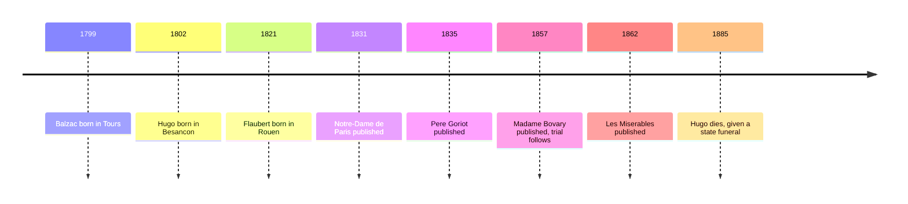

# 11 — French 19th Century — วรรณกรรมฝรั่งเศสศตวรรษที่ 19

> *"Jean Valjean, my brother, you no longer belong to evil, but to good. It is your soul that I buy back from black thoughts and the spirit of perdition, and I give it to God."*
>
> *Les Misérables*, Volume One, Book Two, Chapter 12

Nineteenth-century France gave the novel its two great jobs: to expose society's injustice, and to study its textures. Hugo wrote the century's largest novel of mercy; Balzac tried to catalog the whole of French society like a zoologist; Flaubert polished realism (สัจนิยม) into an art. Between them: a bishop's candlesticks, a barricade in 1832, a boarding house full of ruined fathers, and the most famous provincial dreamer in fiction.

---

## 1 | The Works at a Glance

| Detail | Info |
|---|---|
| **Author** | Victor Hugo (1802 to 1885), Honoré de Balzac (1799 to 1850), Gustave Flaubert (1821 to 1880) |
| **Published** | *Père Goriot* 1835, *Madame Bovary* 1857, *Les Misérables* 1862, in French |
| **Genre** | Realism (สัจนิยม), social novel (นวนิยายสังคม), melodrama (เรื่องประโลมโลก) |
| **Setting** | France: Paris, Rouen and its provinces, and the barricades of June 1832 |
| **Famous translations** | *Les Misérables*: Christine Donougher, Julie Rose; *Madame Bovary*: Lydia Davis; *Père Goriot*: Olivia McCannon; Thai editions available |

Three very different workrooms. Hugo wrote *Les Misérables* in exile on the island of Guernsey, having fled Napoleon III, and published it in 1862 to instant sensation. Balzac worked up to sixteen hours a day on a torrent of coffee, planning nearly a hundred linked novels. Flaubert spent days on single sentences, hunting the exact word, and was put on trial in 1857 for the frankness of *Madame Bovary*; he was acquitted, and the scandal made the book.

## 2 | Story and Structure

Spoilers follow: this note tells the whole story.

### Les Misérables (1862)

In 1815, in the town of Digne, an ex-convict named Jean Valjean, freed after nineteen years in the galleys, five for stealing bread for his sister's starving children and the rest added for escape attempts, is turned away by every inn until the bishop Myriel takes him in. In the night Valjean steals the bishop's silver and is caught. The bishop tells the police the silver was a gift, adds the candlesticks, and speaks the words quoted above: Valjean's soul has been bought for God. The man the law made bitter becomes the man mercy makes good. Years later he is a respected mayor and factory owner under a false name, Monsieur Madeleine. But his past pursues him in the person of Javert, the police inspector for whom the law is God. To save a stranger wrongly arrested in his name, Valjean walks into a courtroom and confesses his identity. Before he is retaken, he promises the dying Fantine, a factory worker destroyed by poverty, to rescue her daughter. He buys the child Cosette from the monstrous innkeepers, the Thénardiers, and the novel becomes a long flight through the years, with Javert always one step behind.

In 1832 the novel gathers everyone at the barricades of the June Rebellion in Paris: the student revolutionaries led by Enjolras; Marius, the young man in love with the grown Cosette; Éponine, the Thénardiers' daughter, who dies for Marius; and Javert himself, captured and spared by Valjean, the man he hunts. Valjean carries the wounded Marius through the sewers of Paris. Javert, shown mercy by the man he should arrest, and unable to reconcile law with grace, walks into the Seine. Marius and Cosette marry; Valjean confesses his past and withdraws. The novel ends with the old man dying at peace, the bishop's candlesticks on the mantel. The vault's musical notes for *Les Misérables*, the songs and the staging, live in the oralita_md vault (personal/musical/Les Miserable/).

### Père Goriot (1835)

Balzac set out to do for society what zoologists did for species: catalog it. His Comédie humaine (the Human Comedy) links about ninety novels and stories through recurring characters, a financier met in one book walking through another. *Père Goriot* is the keystone. In a shabby Paris boarding house, old Goriot, a retired vermicelli merchant, has ruined himself to give his two daughters, Anastasie and Delphine, money and status. They take everything and are ashamed of him; he dies while they attend a ball, and the student Rastignac, who has watched the whole economy of Paris operate, pays for the burial. The novel ends at the cemetery: from the heights of Père Lachaise, Rastignac looks down on glittering Paris and declares that the war is on. Balzac's point is systematic: money is the fluid of society, and love, marriage, and rank are its transactions.

### Madame Bovary (1857)

Emma Rouault, raised on romantic novels, marries Charles Bovary, a decent and dull country doctor, expecting passion and finding wallpaper. Life in the provincial town of Yonville is one long flat note. She takes a lover, the landowner Rodolphe, and plans to run away with him; he abandons her. She takes another, the clerk Léon, and to live beyond their means she falls into the hands of the merchant Lheureux, who lends until the debts collapse. Deserted, facing ruin and public shame, Emma swallows arsenic and dies in agony: the romantic death she always imagined, arriving as a fact. Charles, learning the truth, dies broken; their daughter goes to work in a cotton mill. Flaubert famously said that Madame Bovary was himself: the provincial dreamer is every reader who has mistaken books for life.

| Character | Role | One line |
|---|---|---|
| Jean Valjean | The redeemed man | Nineteen years of prison, one act of mercy, a life rebuilt |
| Javert | The law | The inspector who cannot believe mercy outranks law |
| Fantine | The fallen worker | Poverty's arithmetic in one life |
| Cosette | The rescued child | The girl who gets the childhood her mother lost |
| Père Goriot | The father | A fortune spent on daughters who will not claim him |
| Eugène de Rastignac | The student | The provincial boy who declares war on Paris |
| Emma Bovary | The dreamer | Romantic reading against provincial reality |
| Charles Bovary | The husband | The decent man who is not enough |

## 3 | Key Passages

> "Jean Valjean, my brother, you no longer belong to evil, but to good. It is your soul that I buy back from black thoughts and the spirit of perdition, and I give it to God."
>
> *Les Misérables*, Volume One, Book Two, Chapter 12

> > "ฌ็อง วัลฌ็อง น้องเอ๋ย เจ้าไม่ได้เป็นของความชั่วอีกต่อไปแล้ว เจ้าเป็นของความดี ข้าไถ่วิญญาณของเจ้าคืนมาจากความคิดดำมืดและวิญญาณแห่งความพินาศ และมอบมันแด่พระเจ้า" (แปลอิสระ)

Why it matters: the hinge of the whole novel: one act of mercy that outbids nineteen years of prison.

> "Before marriage she thought herself in love; but the happiness that should have resulted from that love not having come, she must, she thought, have been mistaken."
>
> *Madame Bovary*, Part One, Chapter 5

> > "ก่อนแต่งงานเธอคิดว่าตนกำลังมีความรัก แต่เมื่อความสุขที่ควรเกิดจากความรักนั้นไม่มาถึง เธอจึงคิดว่าตนคงเข้าใจผิด" (แปลอิสระ)

Why it matters: Flaubert's free indirect style: we are inside Emma's dreaming mind before we have been told.

> "And then he spoke these sublime words: 'Now it is between you and me!'"
>
> *Père Goriot*, closing scene

> > "แล้วเขาก็เอ่ยถ้อยคำอันสูงส่งนั้นว่า 'ต่อไปนี้ มันเป็นเรื่องระหว่างเธอกับข้า!'" (แปลอิสระ)

Why it matters: the last words of the novel that invented the linked fictional universe: the provincial boy declares war on Paris.

## 4 | Themes and Style

| Theme | Thai | How the work treats it |
|---|---|---|
| Justice and mercy | ความยุติธรรมกับความเมตตา | Javert the law and Valjean the forgiven: the novel argues for mercy |
| Poverty and society | ความยากจนกับสังคม | Fantine's fall shows society grinding the poor, not just bad luck |
| Redemption | การไถ่บาป | The bishop's candlesticks: one act of kindness can rebuild a life |
| Dreams versus reality | ความฝันกับความจริง | Emma's romantic reading ruins her, measured against the real |
| Money and class | เงินกับชนชั้น | Balzac: society as a system where money decides everything |
| Revolution and progress | การปฏิวัติกับความก้าวหน้า | The barricades: Hugo's hope that history moves toward justice |

Hugo works in grand melodrama (เรื่องประโลมโลก): coincidence, disguise, moral extremes, and a narrator who will stop for fifty pages on Waterloo or the Paris sewers because everything matters. Balzac's realism (สัจนิยม) is systematic: the recurring characters turn the Human Comedy into the first fictional universe. Flaubert is the stylist of the three: he hunted le mot juste, the exact word, and perfected the free indirect voice (การเล่าแบบแทรกเสียงตัวละคร), so the narration slides into Emma's dreaming mind without warning.

## 5 | Timeline

## 6 | Thai Terminology

| Thai | English | Notes |
|---|---|---|
| สัจนิยม | realism | The novel as a truthful study of society |
| จินตนิยม | romanticism | Feeling and grandeur, Hugo's inheritance |
| เรื่องประโลมโลก | melodrama | Big emotions, coincidence, and moral extremes |
| การไถ่บาป | redemption | The bishop's gift, and Valjean's whole life |
| นวนิยายสังคม | social novel | Fiction arguing about poverty, law, and justice |
| นวนิยายรายตอน | serialized novel | Published in installments, the century's standard |
| การลี้ภัย | exile | Hugo wrote *Les Misérables* in exile |
| การเล่าแบบแทรกเสียงตัวละคร | free indirect discourse | Narration that slips into a character's inner voice |
| ความยุติธรรมกับความเมตตา | justice versus mercy | The argument between Javert and Valjean |

## 7 | Why It Matters Today

- **The musical:** *Les Misérables* has run since 1985, in dozens of languages, and the 2012 film carried it to a new generation; the songs made Valjean's prayer and Éponine's rain into anthems.
- **Mercy versus law:** every modern argument about second chances, criminal records, and rehabilitation replays the collision of Javert and Valjean.
- **Bovarysme:** French coined the word for chronic dissatisfaction with one's own life, fed by images of better ones: the condition social media now mass-produces.
- **The melodrama connection:** Thai television dramas built on hidden identities, sacrifice, and moral extremes speak the same grammar Hugo perfected; the difference is that Hugo aimed it at real injustice.

## 8 | Further Reading

- *Les Misérables* translated by Christine Donougher (Penguin Classics): complete and readable, with fine notes.
- *Madame Bovary* translated by Lydia Davis: crisp, exact, and modern.
- *Père Goriot* translated by Olivia McCannon (Oxford World's Classics): the keystone of the Human Comedy.

## Related

- [[World Literature/00_overview|← World Literature Overview]]
- [[10_Russian_Literature]]
- [[12_English_19th_Century]]
- [[Social Studies/04 History/02_World_History_and_Civilizations|World History and Civilizations]]
