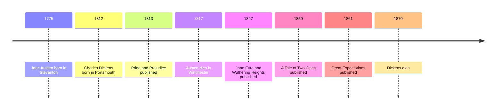

# 12 — English 19th Century — วรรณกรรมอังกฤษศตวรรษที่ 19

> *"It is a truth universally acknowledged, that a single man in possession of a good fortune, must be in want of a wife."*
>
> *Pride and Prejudice*, Chapter 1

The nineteenth century is when the novel took over England. Austen taught it irony; Dickens gave it London's streets, prisons, and orphans; the Brontë sisters gave it the storm inside the heart. Between the marriage plot (โครงเรื่องการแต่งงาน) of *Pride and Prejudice* and the moors of *Wuthering Heights* lies the full range of what the novel could do, and these books still run the modern imagination.

---

## 1 | The Works at a Glance

| Detail | Info |
|---|---|
| **Author** | Jane Austen (1775 to 1817), Charles Dickens (1812 to 1870), Charlotte Brontë (1816 to 1855), Emily Brontë (1818 to 1848) |
| **Published** | *Pride and Prejudice* 1813, *Jane Eyre* and *Wuthering Heights* 1847, *Great Expectations* 1861 |
| **Genre** | Novel of manners, bildungsroman (นวนิยายการเติบโต), gothic romance (นวนิยายกอทิก) |
| **Setting** | England: country estates, London, and the Yorkshire moors |
| **Famous translations** | Written in English; well-annotated editions abound, and Thai translations of the major novels exist |

Austen never married and wrote her six novels quietly in a Hampshire village. Dickens worked in a blacking factory at twelve, and never forgot the child labor he saw; he became the most famous man in England. The Brontë sisters published under male pen names from a Haworth parsonage on the moors, and died young: Emily at thirty, Anne at twenty-nine, Charlotte at thirty-eight. For language learners, this vault's English Skill folder links out to a separate GitHub repository for English study; this note is about the literature itself, which Thai readers also enjoy in translation.

## 2 | Story and Structure

Spoilers follow: this note tells the whole story.

### Pride and Prejudice (1813)

Elizabeth Bennet, the second of five daughters, lives in a world where a woman of her class has one great decision: whom she marries. The plot is the most imitated in English fiction. Mr Bingley rents the nearby estate of Netherfield and brings his friend Mr Darcy, who is rich and proud; at a ball Darcy refuses to dance with Elizabeth and calls her tolerable but not handsome enough to tempt him. Elizabeth, laughing, decides to dislike him forever. The charming officer Wickham tells her Darcy wronged him, and when Darcy proposes, insultingly and honestly, she refuses with fury. Then comes the letter: Darcy explains himself, and the novel's center of gravity shifts. Elizabeth visits his estate, Pemberley, and sees him differently. Her sister Lydia elopes with Wickham, and Darcy quietly pays to force a marriage, saving the family's honor. When his formidable aunt, Lady Catherine de Bourgh, orders Elizabeth not to marry him, Elizabeth refuses to promise, and the refusal itself tells Darcy there is hope. The second proposal is accepted. The engine of the novel is Elizabeth's judgment: she is wrong, then right, and the reader is wrong with her.

### Great Expectations (1861)

Pip, an orphan raised by his sister and her husband, Joe the blacksmith, the kindest man in the book, is summoned as a boy to the house of Miss Havisham: a bride jilted decades ago who stopped all the clocks and still wears her wedding dress. There he loves her ward, the beautiful cold Estella, who is being trained to break men's hearts as Miss Havisham's revenge. Pip grows ashamed of his rough home and longs to be a gentleman. Then a lawyer arrives with great expectations: an unknown benefactor will fund his education in London. Pip assumes it is Miss Havisham, spends beyond his means, and drifts away from Joe. The benefactor turns out to be Abel Magwitch, the escaped convict Pip helped in the marshes as a child: the money is the gratitude of a transported man. When Magwitch returns illegally to see his gentleman, Pip must hide him, and discovers that the gentleman was made by a criminal and the lady by a broken heart: his world's categories collapse. Magwitch is captured and dies; Pip falls ill and is nursed by Joe, whose unshakeable decency he finally understands. In the ending Dickens published, Pip meets Estella years later at the ruined Satis House, and sees no shadow of another parting from her. *A Tale of Two Cities* (1859), Dickens's novel of the French Revolution, ends with the wastrel Sydney Carton going to the guillotine in another man's place: the passage quoted below.

### Jane Eyre (1847) and Wuthering Heights (1847)

Two sisters, one year. *Jane Eyre* is the autobiography of an orphan: a neglected childhood, the cruel school of Lowood, then a post as governess at Thornfield Hall, where she falls in love with her employer, Mr Rochester. The novel's secret lives on the third floor: Rochester's mad wife Bertha, whom he has kept locked away. Jane, learning this on her wedding morning, refuses the bigamous marriage and flees rather than compromise her conscience: the plain, poor, small woman who insists she has a soul. She nearly marries the cold clergyman St John Rivers, then hears Rochester's voice calling across the miles, and returns to find Thornfield burned and Rochester blind. Now equal, they marry: reader, I married him. *Wuthering Heights* is the opposite weather. On the Yorkshire moors (ทุ่งมัวร์), the foundling Heathcliff and Catherine Earnshaw grow up in one violent attachment. Catherine marries the gentleman Edgar Linton instead; Heathcliff returns rich and spends his life taking revenge on both families and their children. Catherine dies young; Heathcliff's revenge empties into a longing for her ghost, and he dies, some say, walking the moors with her forever. No novel before it had tried passion so absolute that it burns up the book's whole moral world.

| Character | Role | One line |
|---|---|---|
| Elizabeth Bennet | The judge | The woman whose misjudgments drive the plot |
| Mr Darcy | The proud man | The suitor who must learn to deserve her |
| Pip | The orphan | The boy who learns what a gentleman is |
| Miss Havisham | The jilted bride | A stopped clock training a heart to break hearts |
| Joe Gargery | The blacksmith | The unbreakable decency of home |
| Jane Eyre | The narrator | The plain woman with a conscience and a soul |
| Mr Rochester | The master | The man with a locked third floor |
| Heathcliff | The revenant | Passion that outlives everyone it burns |
| Catherine Earnshaw | The beloved | The woman who says she is Heathcliff |

## 3 | Key Passages

> "It is a truth universally acknowledged, that a single man in possession of a good fortune, must be in want of a wife."
>
> *Pride and Prejudice*, Chapter 1

> > "เป็นความจริงที่ทั่วโลกรับรู้กันว่า ชายโสดผู้มีทรัพย์สมบัติมหาศาล ย่อมต้องปรารถนาภรรยา" (แปลอิสระ)

Why it matters: the most famous first sentence in English fiction, and a perfect sample of Austen's irony (การประชดประชัน).

> "Do you think, because I am poor, obscure, plain, and little, I am soulless and heartless? You think wrong!"
>
> *Jane Eyre*, Chapter 23

> > "ท่านคิดว่าเพราะข้าจน ต่ำต้อย หน้าตาธรรมดา และตัวเล็ก ข้าจึงไร้วิญญาณไร้หัวใจหรือ ท่านคิดผิด!" (แปลอิสระ)

Why it matters: the plain heroine's declaration of selfhood, the sentence that changed what a novel's heroine could demand.

> "It is a far, far better thing that I do, than I have ever done; it is a far, far better rest that I go to than I have ever known."
>
> *A Tale of Two Cities*, closing lines

> > "สิ่งที่ข้าทำในครานี้ดียิ่งกว่าสิ่งใดที่ข้าเคยทำมา และการพักผ่อนที่ข้ากำลังจะไปถึงก็สุขสงบยิ่งกว่าที่ข้าเคยรู้จัก" (แปลอิสระ)

Why it matters: Sydney Carton's last words, the most quoted exit line in English fiction.

## 4 | Themes and Style

| Theme | Thai | How the work treats it |
|---|---|---|
| Marriage and money | การแต่งงานกับเงิน | Austen: marriage as the great economic and moral decision of a woman's life |
| Class and snobbery | ชนชั้นกับการดูหมิ่น | Darcy's pride, Lady Catherine, Pip's shame at Joe: class as the invisible wall |
| Injustice | ความอยุติธรรม | Dickens: prisons, child labor, and the cruelty of the courts |
| Passion versus morality | ตัณหากับศีลธรรม | Wuthering Heights: love that refuses every rule; Jane Eyre: passion held to conscience |
| The self-worth of women | คุณค่าในตัวเองของผู้หญิง | Jane and Elizabeth insist on being judged as minds and souls |
| Orphanhood and home | ความเป็นเด็กกำพร้ากับบ้าน | Pip, Jane, Heathcliff: the search for a place to belong |

Austen's instrument is irony (การประชดประชัน), and her technique lets us share Elizabeth's mistaken thoughts while the author smiles at them. Dickens serialized his novels in monthly parts with cliffhangers, and made characters so vivid they became folklore; his comedy and his fury about child labor, prisons, and debtors are the same energy. The Brontës wrote from inside: first-person narrators (ผู้เล่าเรื่องบุรุษที่หนึ่ง) with raw nerves, turning the gothic machinery of locked rooms and storms into psychology. Between the three, the novel took over England.

## 5 | Timeline

## 6 | Thai Terminology

| Thai | English | Notes |
|---|---|---|
| การประชดประชัน | irony | Austen's instrument: saying one thing, meaning another |
| โครงเรื่องการแต่งงาน | marriage plot | Courtship as the engine of the novel |
| นวนิยายรายตอน | serialized novel | Dickens published in monthly parts |
| นวนิยายการเติบโต | bildungsroman | A novel of growing up, like *Great Expectations* |
| นวนิยายกอทิก | gothic novel | Dark houses, secrets, and storms: the Brontës' inheritance |
| เด็กกำพร้า | orphan | The classic Victorian protagonist |
| การวิพากษ์สังคม | social criticism | Dickens's novels as campaigns for reform |
| ผู้เล่าเรื่องบุรุษที่หนึ่ง | first-person narrator | Jane Eyre's "I", which changed the novel's intimacy |
| ทุ่งมัวร์ | moor | The wild Yorkshire landscape of *Wuthering Heights* |

## 7 | Why It Matters Today

- **The rom-com industry:** *Pride and Prejudice* is the ancestor of the entire modern romantic comedy, and *Bridget Jones's Diary* is the novel retold; the 1995 BBC and 2005 film versions are the standard reference points.
- **Dickens and Christmas:** *A Christmas Carol* (1843) helped create the modern Christmas of family and giving, and his novels campaigned visibly for real reforms in workhouses, schools, and courts.
- **The Brontës in pop culture:** Kate Bush's 1978 song *Wuthering Heights* and endless film versions; Jean Rhys's *Wide Sargasso Sea* (1966) finally gave Bertha a voice of her own.
- **A Thai resonance:** the marriage-pressure conversation is universal; Elizabeth's refusal to marry without respect has ended many family arguments since 1813, and Thai readers will recognize the plot engine in their own novels and ละคร.

## 8 | Further Reading

- *Pride and Prejudice* by Jane Austen: any well-annotated edition; the irony rewards rereading.
- *Great Expectations* by Charles Dickens: the tightest of the big novels, and the funniest.
- *Jane Eyre* by Charlotte Brontë: the novel itself, still electrifying.
- *Wide Sargasso Sea* by Jean Rhys: the madwoman's side of the story.

## Related

- [[World Literature/00_overview|← World Literature Overview]]
- [[11_French_19th_Century]]
- [[13_American_Classics]]
- [[Social Studies/04 History/02_World_History_and_Civilizations|World History and Civilizations]]
