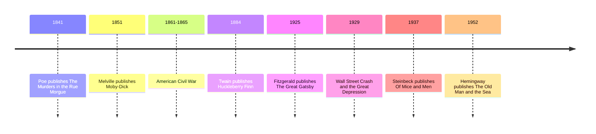

# 13 — American Classics — วรรณกรรมอเมริกันคลาสสิก

> *"So we beat on, boats against the current, borne back ceaselessly into the past."*
> F. Scott Fitzgerald, *The Great Gatsby*

This note gathers the books that gave the United States its literary voice. In the 19th century the young nation produced a whaling epic bigger than its subject, a boy's river journey that changed how novels could sound, and the short stories of Edgar Allan Poe, which invented both the detective story (เรื่องสืบสวนสอบสวน) and modern horror (เรื่องสยองขวัญ). In the 20th century came the novels of money and longing: F. Scott Fitzgerald's jazz age tragedy, Ernest Hemingway's plain-spoken endurance, and John Steinbeck's Depression-era friendship.

Why should an adult reader care? Because these books map the American Dream (ความฝันแบบอเมริกัน): the promise that anyone can rise, and the shadow the promise casts. They are also the source of images the whole world quotes: the white whale, the green light, a raft on the Mississippi. And several of them are among the most banned books in American schools, which keeps them alive in a living argument.

---

## 1 | The Works at a Glance

| Work | Author | Year | Genre | Setting |
|---|---|---|---|---|
| *Moby-Dick* | Herman Melville (1819-1891) | 1851, English | Novel, sea epic (มหากาพย์แห่งท้องทะเล) | The whaling ship *Pequod*, world oceans, 1840s |
| *The Adventures of Huckleberry Finn* | Mark Twain (1835-1910) | 1884, English | Novel (นวนิยาย) | The Mississippi River, 1840s American South |
| *The Tell-Tale Heart* and other tales | Edgar Allan Poe (1809-1849) | 1841-1849, English | Short stories (เรื่องสั้น) | Rooms, houses, and minds, mostly at night |
| *The Great Gatsby* | F. Scott Fitzgerald (1896-1940) | 1925, English | Novel | Long Island and New York, summer 1922 |
| *Of Mice and Men* | John Steinbeck (1902-1968) | 1937, English | Novel, novella (นวนิยายขนาดสั้น) | A California farm, the Great Depression |
| *The Old Man and the Sea* | Ernest Hemingway (1899-1961) | 1952, English | Novel, novella | The Gulf Stream off Cuba, mid-20th century |

Thai editions exist for the most famous titles.

The lives behind the books matter because America's classics were mostly written by outsiders and wanderers. Melville sailed on whalers as a young man, then faded into obscurity after *Moby-Dick* failed; the novel was rediscovered only after his death. Twain (Samuel Clemens) was a riverboat pilot, and the river gave him both his pen name and his material. Poe, orphaned and alcoholic, died at 40 after a lifetime in which poverty and fame chased each other. Fitzgerald wrote *Gatsby* at 28 about a rich world he could only visit. Hemingway's boxing, fishing, and war injuries made him famous as much as his sentences did. Steinbeck worked as a ranch hand and fruit picker among the people he wrote about.

## 2 | Story and Structure

*Spoilers follow: this note tells the whole story.*

### Moby-Dick: the whale hunt that became a universe

Ishmael, the narrator, signs onto the whaler *Pequod* with Queequeg, a harpooner from the South Seas. Only after the ship is at sea does Captain Ahab appear: a leg of whalebone, a scar like a lightning strike, and one purpose. The white whale Moby Dick took his leg, and Ahab will chase the whale through every ocean to destroy it. Between chapters of action, Melville pauses for essays on whale anatomy and the color white. The final three-day chase ends with the whale smashing the ship; Ahab, tangled in his own harpoon line, is dragged under. Only Ishmael survives, floating on a coffin built for his friend, to tell the tale.

### Huckleberry Finn: the boy who would rather go to hell

Huck Finn, a boy of about thirteen, escapes his drunk and violent father by faking his own death and lighting out on a raft down the Mississippi. His companion is Jim, a runaway slave (ทาสที่หลบหนี) heading for freedom. On the way they meet feuding families, the con men called the Duke and the King, and every kind of small-town swindle. The book's true drama is internal: Huck has been taught that helping a slave escape is a sin. At the climax he decides he will help Jim anyway, and says, "All right, then, I'll go to hell," choosing his own conscience over his society's moral code. A comic detour follows: Tom Sawyer stages an absurd escape for a Jim who, it turns out, was already free. The journey down the river is the point, not the destination.

### Poe: the birth of dread and detection

Poe's short stories work like traps. In *The Tell-Tale Heart*, a murderer insists on his sanity while describing a crime committed for no reason; he hears the dead man's heart beating under the floorboards until he confesses. In *The Murders in the Rue Morgue* (1841), the detective C. Auguste Dupin solves a locked-room double murder by pure reasoning, a pattern copied by every detective since, including Sherlock Holmes. *The Raven* (1845), the poem, is grief set to meter: a bird that says one word, "Nevermore," until the word fills the room. Poe took readers inside guilty, frightened, obsessive minds, and gave horror and detection their modern shapes.

### The Great Gatsby: money, love, and the green light

Nick Carraway, a young bond salesman, rents a cottage on Long Island next to the mansion of Jay Gatsby, who throws lavish parties for strangers. Gatsby, it turns out, was born poor; five years earlier, as an army officer, he loved the rich Daisy Buchanan and lost her. He has spent the years since building a fortune to win her back, and the parties were meant to lure her. Daisy, now married to the brutal Tom Buchanan, does come back to him, briefly. At the novel's turning point, in a suite at the Plaza Hotel, Tom exposes Gatsby's criminal business; Daisy, driving Gatsby's car home, hits and kills Tom's mistress Myrtle Wilson. Gatsby takes the blame, and Myrtle's husband shoots Gatsby in his pool, then himself. Almost no one attends Gatsby's funeral. Nick, disgusted, returns to the Midwest. Across the bay, Gatsby used to stand at night stretching his arms toward the green light at the end of Daisy's dock: the dream, always just out of reach.

### Of Mice and Men: a dream that fits in one sentence

George and Lennie are migrant workers in Depression-era California. George is small and sharp; Lennie is huge, strong, and childlike, and loves to stroke soft things. They share one dream: a little farm of their own, with rabbits for Lennie to tend. On a new ranch, trouble follows them: the boss's son Curley hates Lennie, and Curley's lonely wife drifts toward the men. Lennie, frightened, accidentally kills her. George finds Lennie first, sits him down by the river, tells him about the farm one last time, and shoots him in the back of the head to spare him from the mob.

### The Old Man and the Sea: a man and a fish, alone

Santiago is an old Cuban fisherman who has gone 84 days without a catch, and his apprentice, the boy Manolin, has been sent to fish elsewhere. Alone, Santiago rows far into the Gulf Stream and hooks a marlin bigger than his boat. For two days the fish tows the skiff while Santiago holds the line, his hands cut, talking to the fish as to a brother. When he finally harpoons it and lashes it alongside, the sharks come and reduce it to a skeleton. He returns with the bones, goes to sleep, and the boy brings him coffee. The line everyone remembers: "A man can be destroyed but not defeated."

| Character | Work | Role | One line |
|---|---|---|---|
| Ishmael | *Moby-Dick* | Narrator | The survivor who tells the tale |
| Captain Ahab | *Moby-Dick* | Captain of the *Pequod* | Obsession made flesh and purpose |
| Huck Finn | *Huckleberry Finn* | Narrator, runaway | A boy whose conscience outgrows his society |
| Jim | *Huckleberry Finn* | Runaway slave | The man Huck learns to call a friend |
| Nick Carraway | *The Great Gatsby* | Narrator | The honest witness to a dishonest world |
| Jay Gatsby | *The Great Gatsby* | Self-made millionaire | The dreamer who mistook a woman for a dream |
| George and Lennie | *Of Mice and Men* | Migrant workers | The sharp mind and the gentle giant, each incomplete alone |
| Santiago | *The Old Man and the Sea* | Old fisherman | Endurance in its purest form |

## 3 | Key Passages

> "Call me Ishmael."
>
> From *Moby-Dick*, the opening line.
>
> > "เรียกฉันว่าอิชมาเอล" (แปลอิสระ)
>
> Three words that turn a stranger into a confidant. The whole book is spoken from that intimacy.

> "So we beat on, boats against the current, borne back ceaselessly into the past."
>
> From *The Great Gatsby*, the closing line.
>
> > "แล้วเราก็ยังพายเรือต่อไป ต้านกระแสน้ำ พลางถูกพัดพาย้อนกลับสู่อดีตอย่างไม่หยุดหย่อน" (แปลอิสระ)
>
> The American Dream in one sentence: effort, direction, and a current that never lets up.

> "True! nervous, very, very dreadfully nervous I had been and am; but why will you say that I am mad?"
>
> From *The Tell-Tale Heart*, the opening line.
>
> > "จริงนะ! ผมประหม่ามาก ประหม่าอย่างรุนแรง แต่ทำไมพวกคุณต้องบอกว่าผมบ้าล่ะ" (แปลอิสระ)
>
> Poe's genius in one breath: the murderer protests before confessing to anything.

## 4 | Themes and Style

| Theme | Thai | How the works treat it |
|---|---|---|
| The American Dream | ความฝันแบบอเมริกัน | Gatsby rises and loses everything; George and Lennie's farm stays a sentence |
| Obsession | ความหมกมุ่น | Ahab's whale, Gatsby's Daisy: a single goal that devours the goal-seeker |
| Freedom | อิสรภาพ | Huck's raft and the river as the country's original promise |
| Race and conscience | เชื้อชาติกับมโนธรรม | Huck chooses friendship over the law of his time; Jim is the book's most dignified figure |
| Money and class | เงินกับชนชั้น | Gatsby's parties and Tom's old money: wealth without entry to the club |
| Man and nature | มนุษย์กับธรรมชาติ | The whale, the marlin, the river: nature as enemy, teacher, and equal |
| Endurance | ความทรหด | Santiago's hands and the code: lose with dignity, never give up |

The American voice is the real subject. Twain wrote *Huckleberry Finn* in a boy's spoken dialect, the first great American novel in the language people actually spoke, and Hemingway credited it as the beginning of modern American prose. Hemingway's own style is famous as the iceberg theory (ทฤษฎีภูเขาน้ำแข็ง): leave seven-eighths of the meaning below the surface, and let plain words carry hidden weight. Poe's first-person dread gave us the unreliable narrator. Fitzgerald wrote one lyrical sentence after another, each doing three jobs at once. Melville mixed a whaling manual, a Shakespearean tragedy, and a sermon into one book, and the mix is why readers still argue about what *Moby-Dick* means: is the whale God, evil, nature, or just a whale?

## 5 | Timeline

## 6 | Thai Terminology

| Thai | English | Notes |
|---|---|---|
| วรรณกรรมอเมริกัน | American literature | วรรณกรรม = literature |
| ความฝันแบบอเมริกัน | The American Dream | The promise of rise and renewal, and its shadow |
| นวนิยาย | Novel | A long fictional narrative in prose |
| เรื่องสืบสวนสอบสวน | Detective fiction | Born with Poe's Dupin in 1841 |
| การเล่าเรื่องแบบบุคคลที่หนึ่ง | First-person narration | Ishmael, Huck, Nick: "I" as the reader's friend |
| ภาษาถิ่น | Vernacular, dialect | Huck's spoken voice; the sound of real speech in fiction |
| การประชดประชัน | Irony | Saying one thing while meaning its opposite, as Twain does constantly |
| สัญลักษณ์ | Symbol | The white whale, the green light: things that stand for more |

## 7 | Why It Matters Today

1. **The Great Gatsby and the economics of inequality.** Economists today use the term "Gatsby curve" for the finding that countries with high inequality make it harder for children to rise above their parents: Fitzgerald's novel as a measure of the American Dream's health. The 2013 film with Leonardo DiCaprio restarted the conversation for a new generation.
2. **The white whale in business and technology.** "Chasing the white whale" is standard language for a project that has become an obsession: the startup pivot nobody will abandon, the rewrite that eats the company. Ahab is the cautionary image of focus turned into self-destruction.
3. **Huckleberry Finn and the banned-books debate.** The novel is still challenged in American schools for its racial language, and parents argue on both sides of it: a live example of how a classic stays current, and a good book to read aloud with teenagers and discuss honestly.
4. **Hemingway's plain style everywhere.** The iceberg theory is taught in writing classrooms around the world, and Hemingway's short declarative sentences shaped modern advertising, journalism, and fiction. Reading him explains why so much good modern prose sounds the way it does.

## 8 | Further Reading

- *The Great Gatsby* by F. Scott Fitzgerald: under 200 pages, the perfect entry point to American classics.
- *The Adventures of Huckleberry Finn* by Mark Twain: the Norton Critical Edition adds useful historical context on race and language.
- *The Old Man and the Sea* by Ernest Hemingway: one sitting, plain and deep, ideal for a first Hemingway.
- *Moby-Dick* by Herman Melville: save it for when the whale calls; it rewards the patient reader most.

## Related

- [[World Literature/00_overview|← World Literature Overview]]
- [[12_English_19th_Century]]
- [[14_Modernism]]
- [[Social Studies/04 History/02_World_History_and_Civilizations|World History and Civilizations]]
