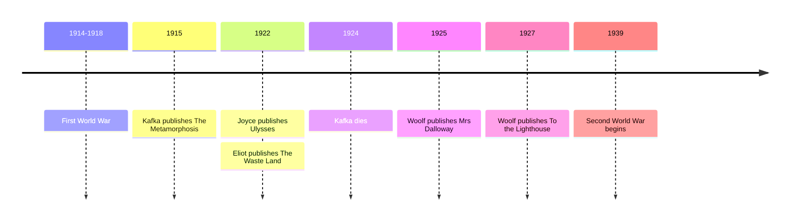

# 14 — Modernism — วรรณกรรมสมัยใหม่นิยม

> *"April is the cruellest month."*
> T. S. Eliot, *The Waste Land*

Around 1910 to 1930, after the First World War had burned up the old certainties, writers rebuilt literature from the inside out. Modernism (วรรณกรรมสมัยใหม่นิยม) turned the novel inward, toward the mind's actual flow: Kafka's man who wakes up as an insect, Joyce's single Dublin day, Woolf's party day and lighthouse, Eliot's shattered poem. These books are famous for being difficult, and the difficulty is the point: the modern mind, these writers believed, does not move in straight lines.

Why read them now? Because almost every inner voice you meet in modern film, television, and fiction, the camera inside a character's head, descends from these experiments. And because the questions they ask have not aged a day: what is it like to be trapped in a body and a job you did not choose, what does a day of ordinary life actually contain, and how do you rebuild meaning from fragments?

---

## 1 | The Works at a Glance

| Work | Author | Year | Genre | Setting |
|---|---|---|---|---|
| *The Metamorphosis* | Franz Kafka (1883-1924) | 1915, German | Novella (นวนิยายขนาดสั้น) | A family apartment in Prague |
| *Ulysses* | James Joyce (1882-1941) | 1922, English | Novel | Dublin, a single day: 16 June 1904 |
| *The Waste Land* | T. S. Eliot (1888-1965) | 1922, English | Long poem (กวีนิพนธ์) | London and a mythic landscape, after the war |
| *Mrs Dalloway* | Virginia Woolf (1882-1941) | 1925, English | Novel | London, one June day, five years after the war |
| *To the Lighthouse* | Virginia Woolf | 1927, English | Novel | The Isle of Skye, before and after the war |

Kafka's stories and Woolf's novels exist in Thai translation; *Ulysses* remains a mountain in any language.

The lives matter because modernism was a movement of exiles and outsiders. Kafka, a German-speaking Jew in Prague, worked all his life in an insurance office and asked his friend Max Brod to burn his manuscripts after his death; Brod published them instead. Joyce left Dublin but spent his life writing about it, in self-imposed exile in Trieste, Zurich, and Paris. Woolf, the center of the Bloomsbury circle in London, suffered from mental illness all her life and drowned herself in 1941. Eliot, an American banker in London, became the most English of poets. Each of them wrote from the edge of things, and the edge is where their books live.

## 2 | Story and Structure

*Spoilers follow: this note tells the whole story.*

### The Metamorphosis: a man wakes up as a problem

Gregor Samsa, a traveling salesman who supports his parents and sister, wakes one morning to find himself transformed into a giant insect. His first worry is not the horror of his body but that he will miss the train to work. His family's reactions move from horror to tolerance to disgust. His sister Grete feeds him; his father wounds him with an apple; the family takes in lodgers to pay the rent. Gregor, hidden in his room, listens to the household going on without him. When the lodgers see him, the family decides he must go, and he dies quietly of starvation and neglect, having wished them well. The family takes a tram ride in the sunshine, relieved, and the parents notice that Grete has grown up. The story is told with the calm of a business report, which makes it far worse.

### Ulysses: one ordinary day, the size of an epic

On 16 June 1904, in Dublin, two men wander: Stephen Dedalus, a young writer still haunted by his mother's death, and Leopold Bloom, a middle-aged Jewish advertising canvasser whose wife Molly will sleep with her concert manager that afternoon. The novel follows them hour by hour: a funeral, a newspaper office, a bar, a brothel, a birth, and finally a late-night meeting in Bloom's kitchen. Its 18 episodes secretly follow the episodes of Homer's *Odyssey*: Bloom is a wandering Odysseus, Stephen a son in search of a father, Molly a Penelope who is not waiting. The book ends not with the hero but with Molly, half-asleep, remembering her first kiss with Bloom in a long, unpunctuated rush that ends: "yes I said yes I will Yes." The epic has come home, and it is made of an ordinary day.

### The Waste Land: the poem of the broken world

Eliot's poem is a collage of voices: a fortune teller, a pub conversation, a drowned sailor, a game of chess, the thunder speaking Sanskrit. Behind the fragments is the myth of the Fisher King, a wounded ruler whose land will not revive until he is healed: Europe after the war, a waste land waiting for rain. The poem begins with April, the month of rebirth, as the cruelest of all, because it stirs life in a world too tired for it. It ends with a scattering of quotations in many languages and the line: "These fragments I have shored against my ruins."

### Mrs Dalloway: a party and a suicide, one London day

Clarissa Dalloway, a society hostess in her fifties, spends a June day preparing for her evening party, buying flowers, mending a dress, remembering a summer at Bourton when she refused to marry Peter Walsh. Across London the same morning, Septimus Warren Smith, a young veteran shattered by shell shock (ความบอบช้ำจากสงคราม), hears the birds speaking and is advised by his doctors to rest; in the afternoon, rather than be taken away, he jumps from a window. At the party that evening, a doctor mentions the suicide of a young man, and Clarissa, alone for a moment, feels "somehow very like him." The two strangers never meet; the novel is the web that connects them, with Big Ben tolling the hours through it.

### To the Lighthouse: a family, a house, a painting

The Ramsay family spends summers in a house on the Isle of Skye. Mrs Ramsay, mother of eight, holds the family together by attention alone; Mr Ramsay, a philosopher, demands sympathy he cannot return. In the middle section, "Time Passes," the house empties, the war comes, and deaths are reported in square brackets: Mrs Ramsay dies, a son dies in the war, a daughter in childbirth. Ten years later the survivors return, and Mr Ramsay finally takes the children to the lighthouse. The painter Lily Briscoe, who all her life has been told women cannot paint, finishes her picture with a line down the middle: "I have had my vision."

| Character | Work | Role | One line |
|---|---|---|---|
| Gregor Samsa | *The Metamorphosis* | Traveling salesman | The provider who becomes a burden and then a corpse |
| Grete Samsa | *The Metamorphosis* | Gregor's sister | The caretaker whose kindness runs out |
| Leopold Bloom | *Ulysses* | Advertising canvasser | An everyday Odysseus, heroically ordinary |
| Molly Bloom | *Ulysses* | Bloom's wife | The final voice: life's unpunctuated yes |
| Stephen Dedalus | *Ulysses* | Young writer | The son in search of a father |
| Clarissa Dalloway | *Mrs Dalloway* | Hostess | The surface of society with a deep current underneath |
| Septimus Warren Smith | *Mrs Dalloway* | War veteran | The war's casualty inside a civilized city |
| Mrs Ramsay | *To the Lighthouse* | Mother of eight | The center that holds the world by attention |
| Lily Briscoe | *To the Lighthouse* | Painter | The artist who finishes her vision at last |

## 3 | Key Passages

> "As Gregor Samsa awoke one morning from uneasy dreams he found himself transformed in his bed into a gigantic insect."
>
> From *The Metamorphosis*, the opening sentence (tr. Willa and Edwin Muir).
>
> > "เช้าวันหนึ่ง เกรกอร์ ซัมซาตื่นจากความฝันอันไม่สงบ แล้วพบว่าตัวเองกลายร่างเป็นแมลงขนาดยักษ์อยู่บนเตียง" (แปลอิสระ)
>
> The most famous first sentence in modern fiction: the impossible announced in the tone of a weather report, and the whole story already loaded into it.

> "April is the cruellest month, breeding Lilacs out of the dead land, mixing Memory and desire, stirring Dull roots with spring rain."
>
> From *The Waste Land*, the opening.
>
> > "เดือนเมษายนคือเดือนที่โหดร้ายที่สุด เพาะดอกไลแล็กจากแผ่นดินที่ตายแล้ว ผสมความทรงจำกับความปรารถนา ปลุกรากที่เฉื่อยชาด้วยฝนฤดูใบไม้ผลิ" (แปลอิสระ)
>
> Rebirth as pain: the poem's first four lines announce that in a broken world even hope hurts.

> "yes I said yes I will Yes."
>
> From *Ulysses*, the final words, spoken by Molly Bloom.
>
> > "ได้ ฉันบอกว่าได้ ฉันจะตอบตกลงว่าได้" (แปลอิสระ)
>
> One unpunctuated breath of affirmation closes the most experimental novel in English, and it is not an idea: it is a woman remembering love.

## 4 | Themes and Style

| Theme | Thai | How the works treat it |
|---|---|---|
| Alienation | ความแปลกแยก | Gregor wakes up already estranged; his insect body only makes it visible |
| The inner life | ชีวิตภายใน | The real events of *Mrs Dalloway* happen behind faces, between two chimes of Big Ben |
| Time and memory | เวลากับความทรงจำ | Joyce's one day; Woolf's ten-year leap; memory as the place where life actually happens |
| Fragmentation | การแตกกระจาย | The Waste Land's collage; a broken world told in broken form |
| Myth beneath the everyday | ตำนานใต้ชีวิตประจำวัน | Bloom as Odysseus, the Fisher King behind London: old stories holding up new ones |
| The trauma of war | บาดแผลจากสงคราม | Septimus carries the trenches into a flower shop; Eliot's waste land is postwar Europe |
| The artist's task | หน้าที่ของศิลปิน | Lily Briscoe's painting: to hold the moment against time and be told it cannot be done |

The style is the message. Stream of consciousness (กระแสสำนึก) tries to transcribe thought as it actually moves, in fragments and associations, not in tidy sentences. Joyce pushes it furthest: the last 60-odd pages of *Ulysses* are Molly's mind with almost no punctuation. Kafka's opposite technique is the deadpan: the more calmly the narrator reports the impossible, the more disturbing it becomes. Eliot built *The Waste Land* as a collage of quotations, some in foreign languages, with notes at the end; the reader assembles the meaning, the way the age had to assemble itself. These books ask more of the reader than the 19th century did. The work is the reward: no other writing gets so close to what it feels like to be a mind.

## 5 | Timeline

## 6 | Thai Terminology

| Thai | English | Notes |
|---|---|---|
| วรรณกรรมสมัยใหม่นิยม | Modernism | The movement this note covers |
| กระแสสำนึก | Stream of consciousness | Writing the mind's flow: fragments, associations, no tidy order |
| บทพูดในใจ | Interior monologue | A character thinking on the page, as Molly Bloom does |
| ความแปลกแยก | Alienation | The feeling of being a stranger in your own life |
| การแตกกระจาย | Fragmentation | Broken form for a broken world, as in *The Waste Land* |
| การพาดพิง | Allusion | A reference to another text; Joyce alludes to Homer constantly |
| นวนิยายขนาดสั้น | Novella | *The Metamorphosis* is one: longer than a story, shorter than a novel |
| กวีนิพนธ์ | Poetry | Eliot's medium: verse that looks like the age it describes |
| ตำนาน | Myth | The old stories used as scaffolding: Odysseus, the Fisher King |
| จิตใต้สำนึก | The unconscious | Freud's idea, contemporary with modernism: the mind below the surface |
| การทดลองทางรูปแบบ | Formal experiment | The willingness to break the form to tell the truth |

## 7 | Why It Matters Today

1. **The inner voice on screen.** Woolf's and Joyce's technique became film's default tool: the voice-over inside a character's head, from classic films to series like *Fleabag*, which breaks the fourth wall to speak directly to us, is stream of consciousness inherited from 1922.
2. **"Kafkaesque" is everyday vocabulary.** When someone describes a bureaucratic nightmare, a system with no human inside it, they are quoting Kafka without knowing it. The worker versus the senseless machine is the most modern feeling there is.
3. **Bloomsday, every 16 June.** Dublin celebrates Joyce's single day with festivals, costumes, readings, and pub crawls. No other novel has its own annual holiday in its own city.
4. **Fragments and sampling.** Eliot's collage anticipated the logic of the age of sampling: the DJ, the remix, the cut-up. The Waste Land is a remix of world literature, and it still sounds like now.

## 8 | Further Reading

- *The Metamorphosis* by Franz Kafka (tr. Susan Bernofsky): the entry point to modernism, under 100 pages, unforgettable.
- *Mrs Dalloway* by Virginia Woolf: the most readable of the experimental novels, one day long.
- *The Waste Land and Other Poems* by T. S. Eliot: short enough to read in an afternoon, with notes that help.
- *Ulysses* by James Joyce: the mountain; climb it with a guide or an audiobook, and let it wash over you.

## Related

- [[World Literature/00_overview|← World Literature Overview]]
- [[13_American_Classics]]
- [[15_Dystopian_Fiction]]
- [[16_Magical_Realism_and_Latin_America]]
- [[Philosophy/17_Analytic_Philosophy|Analytic Philosophy]]
