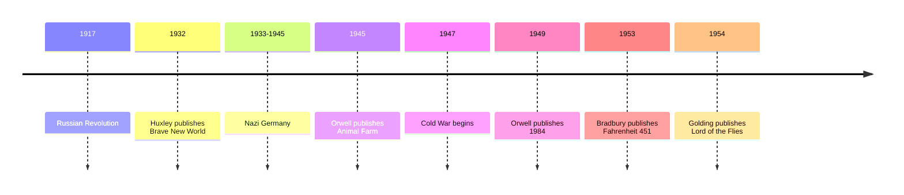

# 15 — Dystopian Fiction — วรรณกรรมดิสโทเปีย

> *"War is Peace. Freedom is Slavery. Ignorance is Strength."*
> George Orwell, *1984*

A dystopia (ดิสโทเปีย) is an imagined society that looks like an answer and behaves like a nightmare: the mirror image of a utopia (ยูโทเปีย), the perfect world. The 20th century's great dystopian novels were written as warnings, each one starting from a real tendency of its time: the police state, the pleasure machine, the burning of books, the thinness of civilization itself. Their authors had watched tyranny up close, and they wrote to make the reader feel what they had learned.

Why do these books refuse to die? Because the questions they ask are permanently current: who watches the watchers, what happens when a society controls the words people can think with, and how thin is the layer of rules that keeps a schoolyard from becoming a battlefield. They are also among the most banned books in history, which is, as readers keep noticing, exactly what they predicted.

---

## 1 | The Works at a Glance

| Work | Author | Year | Genre | Setting |
|---|---|---|---|---|
| *Brave New World* | Aldous Huxley (1894-1963) | 1932, English | Novel | London of the World State, around the year 2540 |
| *Animal Farm* | George Orwell (1903-1950) | 1945, English | Political fable (นิทานการเมือง) | Manor Farm, England |
| *1984* | George Orwell | 1949, English | Novel | London of Oceania, a future of perpetual war |
| *Fahrenheit 451* | Ray Bradbury (1920-2012) | 1953, English | Novel | An unnamed American city of the near future |
| *Lord of the Flies* | William Golding (1911-1993) | 1954, English | Novel | An uninhabited Pacific island |

All five exist in Thai translation and in cheap English editions; *1984* and *Animal Farm* are among the most translated novels ever written.

The authors earned their warnings. Orwell fought against the fascists in the Spanish Civil War and was shot in the throat; *Animal Farm* and *1984* distilled what he saw of totalitarianism (ระบอบเผด็จการเบ็ดเสร็จ) and its admirers. Huxley, from a family of scientists, satirized the industrial future being assembled. Bradbury wrote *Fahrenheit 451* during the McCarthy era, when American writers were under investigation. Golding commanded a landing craft in the Second World War and wrote *Lord of the Flies* after watching what schoolboys, left to themselves, were capable of.

## 2 | Story and Structure

*Spoilers follow: this note tells the whole story.*

### 1984: the last man who remembered

Winston Smith works for the Ministry of Truth in Oceania, one of three superstates locked in permanent war. His job is to rewrite old newspapers and records so that the Party has always been right; the past is a continuously edited lie. He keeps a secret diary, falls in love with Julia, and rents a room above a junk shop where they hide from the telescreens, which watch and listen in every home. He is drawn to O'Brien, a Party official he believes to be a fellow rebel; O'Brien is in fact an interrogator, and Winston's diary, his love affair, and even his hatred of Big Brother have been watched from the start. In the Ministry of Love he is broken, not by torture alone but by Room 101, where each prisoner meets the thing he fears most; Winston's is rats. When he is released he is a shell. The novel ends with the words: "He loved Big Brother." The book's appendix, on Newspeak, the Party's shrinking language, explains how a language can be designed so that rebellion becomes literally unthinkable.

### Animal Farm: the revolution that ate itself

The animals of Manor Farm, tired of the farmer's drunken neglect, revolt behind the slogan "Four legs good, two legs bad," and the pigs, as the cleverest animals, take charge. The commandments of Animalism are painted on the barn: no animal shall sleep in a bed, drink alcohol, or kill another animal, and all animals are equal. Then the pigs move into the farmhouse. Napoleon, the ruthless pig, drives out his rival Snowball and has the dogs, whom he has trained from puppyhood, enforce his rule. Boxer, the loyal cart horse whose answer to every hardship is "I will work harder," is sold to the knacker. One by one the commandments are quietly amended, until a single one remains: "All animals are equal, but some animals are more equal than others." The story ends with the pigs and the neighboring humans playing cards in the farmhouse, and the animals outside cannot tell which face is pig and which is man.

### Brave New World: the happy prison

In the World State, babies are grown in bottles and conditioned from infancy to love their place in the social order; unhappiness is treated with soma, a government-issued pleasure drug, and the state motto is "Community, Identity, Stability." The novel follows Bernard Marx, an outsider by temperament, and Lenina, a perfectly conditioned citizen, on a visit to a Savage Reservation, where old-style humans still live. There they find John, the Savage, raised on Shakespeare and his mother's stories of the world outside. Brought to London as a curiosity, John is first thrilled, then horrified, then mobbed by sightseers who want to watch his suffering as entertainment. In the last scene, alone in a lighthouse, John hangs himself while the crowd below waits for the whipping to resume.

### Fahrenheit 451: the firemen who light fires

Guy Montag is a fireman, and in his world firemen do not put out fires: they burn books. Books, in this society, only make people unhappy and unequal, so the firemen burn them, and the people watch television on wall-sized screens and listen to their radios through shell-like "seashells" in their ears. A teenage neighbor named Clarisse asks Montag simple questions: are you happy, do you notice the world. When his own wife turns him in for hoarding books, Montag runs. He joins a loose network of book people: each of them has memorized a book, word for word, to keep it alive until the world is ready to read again. Behind him, a war has been brewing through the whole novel, and as he flees, the city is destroyed by bombs. The book ends with the book people walking toward the ruined city to begin rebuilding, each carrying a book inside his head.

### Lord of the Flies: the island with no grown-ups

A plane carrying a group of English schoolboys crashes on an uninhabited island. Ralph, elected leader, tries to keep a signal fire burning and hold meetings, with the conch shell granting the right to speak; Jack, the head choirboy, wants to hunt. The sensible Piggy, mocked for his glasses and his asthma, is the group's only voice of reason. Fear of a "beast" on the island grows, and the boys' painted faces become masks behind which cruelty is easier. Simon, who learns that the beast is not in the jungle but in the boys themselves, is killed by the hunters in a frenzy. Piggy is crushed by a boulder, the conch smashed with him. Jack's tribe hunts Ralph with fire across the island, and he is saved only when a naval officer lands, drawn by the smoke. The officer sees "a semicircle of little boys, their bodies streaked with colored clay, sharp sticks in their hands"; Ralph weeps "for the end of innocence, the darkness of man's heart."

| Character | Work | Role | One line |
|---|---|---|---|
| Winston Smith | *1984* | Records clerk | The last man who tries to remember |
| Julia | *1984* | Winston's lover | A rebel of the body, not of ideas |
| O'Brien | *1984* | Party official | The torturer who plays the friend |
| Big Brother | *1984* | The face on the posters | Not a person at all: a slogan with a face |
| Napoleon | *Animal Farm* | Pig, dictator | The revolution that becomes the old master |
| Boxer | *Animal Farm* | Cart horse | Loyalty exploited until the knacker's van |
| John the Savage | *Brave New World* | Outsider from the Reservation | Shakespeare in a world with no tragedy |
| Guy Montag | *Fahrenheit 451* | Fireman | The burner who learns to read |
| Clarisse McClellan | *Fahrenheit 451* | Teenage neighbor | The questions that start the fire |
| Ralph, Piggy, Jack | *Lord of the Flies* | The boys | Order, reason, and the appetite for power |

## 3 | Key Passages

> "War is Peace. Freedom is Slavery. Ignorance is Strength."
>
> From *1984*, the Party's three slogans.
>
> > "สงครามคือสันติภาพ เสรีภาพคือความเป็นทาส ความเขลาคือพลัง" (แปลอิสระ)
>
> Three sentences that contradict themselves and are chanted until they are believed: language bending reality into shape.

> "All animals are equal, but some animals are more equal than others."
>
> From *Animal Farm*, the final commandment.
>
> > "สัตว์ทั้งหลายเท่าเทียมกันหมด แต่สัตว์บางชนิดเท่าเทียมกว่าชนิดอื่น" (แปลอิสระ)
>
> The entire history of broken revolutions in one sentence, printed on the barn wall.

> "It was a pleasure to burn."
>
> From *Fahrenheit 451*, the opening line.
>
> > "การเผาหนังสือเป็นความสุขอย่างยิ่ง" (แปลอิสระ)
>
> A sentence that makes the reader recoil and understand at once: this is a world where destruction feels like joy.

## 4 | Themes and Style

| Theme | Thai | How the works treat it |
|---|---|---|
| Totalitarianism | ระบอบเผด็จการเบ็ดเสร็จ | The Party that owns the past, the present, and the future |
| Surveillance | การสอดส่อง | Telescreens in every room: being watched changes what it is possible to be |
| Language control | การควบคุมภาษา | Newspeak shrinks the dictionary so rebellion loses its words |
| Pleasure as control | ความสุขเป็นเครื่องมือควบคุม | Huxley's soma: a society that seduces is harder to resist than one that beats |
| Censorship and book burning | การเซ็นเซอร์และการเผาหนังสือ | Bradbury's firemen: the state fears what readers might become |
| Civilization as a thin skin | อารยธรรมคือเปลือกบาง | Golding's island: remove the grown-ups and the paint comes off |
| The corruption of revolutions | การปฏิวัติที่เสื่อมทรามลง | Animal Farm: every revolution so far, in one farmyard |

Orwell's style is the plain style as a moral position: he said good prose is like a windowpane, and the clearness of his sentences is part of the accusation. His invented Newspeak works by subtraction: words like "freedom" and "justice" are removed, and what cannot be said, he argues, cannot easily be thought. Huxley writes satire by catalogue, describing the World State's conditioning in the cheerful tone of a brochure. Bradbury's prose is lyrical, almost poetry, about fire and books: the paradox that the book about burning books is itself a love letter to books. Golding keeps his island story spare and symbolic: the conch is order, Piggy's glasses are knowledge, the painted face is the mask that lets the beast out.

## 5 | Timeline

## 6 | Thai Terminology

| Thai | English | Notes |
|---|---|---|
| ดิสโทเปีย | Dystopia | A nightmare society presented as a solution |
| ยูโทเปีย | Utopia | The perfect society: the word Thomas More coined in 1516, from Greek for "no place" |
| ระบอบเผด็จการเบ็ดเสร็จ | Totalitarianism | Rule over every part of life, including thought |
| การสอดส่อง | Surveillance | Watching as a tool of power: the telescreen |
| การเซ็นเซอร์ | Censorship | Control of what may be printed, said, or read |
| โฆษณาชวนเชื่อ | Propaganda | Information shaped to persuade, not to inform |
| นิวส์พีก | Newspeak | Orwell's invented language that shrinks to prevent thought |
| ดับเบิลธิงก์ | Doublethink | Believing two contradictory things at once, as the Party requires |
| นิยายเตือนภัย | Cautionary tale | A story written as a warning, which is what these all are |
| นิทานการเมือง | Political fable | Animal Farm: politics told through animals |
| ห้อง 101 | Room 101 | The torture room that holds your personal worst fear |

## 7 | Why It Matters Today

1. **"Orwellian" as daily vocabulary.** Politicians, journalists, and ordinary people reach for the word whenever language is bent to mean its opposite. Sales of *1984* have spiked repeatedly whenever surveillance and "alternative facts" dominate the news, as after the Snowden revelations in 2013.
2. **Big Brother became entertainment.** The name of the all-seeing tyrant now titles one of the longest-running reality TV formats on earth: the panopticon as game show. The fact that we volunteer for it is the twist Orwell might have appreciated most grimly.
3. **These books keep being banned, exactly as they predicted.** *1984*, *Animal Farm*, *Brave New World*, and *Fahrenheit 451* appear constantly on banned and challenged book lists in schools around the world. A book about burning books being removed from a library is the joke that writes itself.
4. **The wall screens were right.** Bradbury's parlor walls predicted flat-screen television and, more disturbingly, the feed: endless passive watching instead of reading, talking, noticing. His cure was not heroic, just attentive: the book people memorize, one book each, and walk.

For the practical skill these novels argue for, see the vault's [[Social Studies/02 Civics/12_Media_Literacy|Media Literacy]] note.

## 8 | Further Reading

- *1984* by George Orwell: the essential one; read the appendix on Newspeak too.
- *Brave New World* by Aldous Huxley: read it back to back with *1984*; fear of pain versus fear of pleasure, the two futures that still compete.
- *Fahrenheit 451* by Ray Bradbury: the shortest and most poetic, and the one about reading itself.
- *Lord of the Flies* by William Golding: for parents of teenagers, the most discussable book in the set.

## Related

- [[World Literature/00_overview|← World Literature Overview]]
- [[14_Modernism]]
- [[16_Magical_Realism_and_Latin_America]]
- [[13_American_Classics]]
- [[Social Studies/02 Civics/12_Media_Literacy|Media Literacy]]
