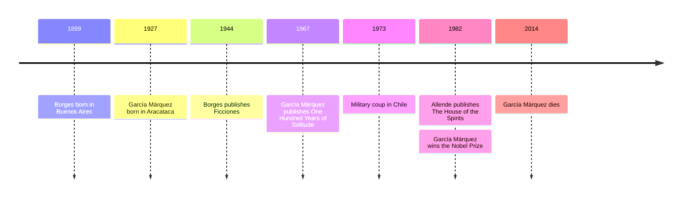

# 16 — Magical Realism and Latin America — สัจนิยมมหัศจรรย์กับลาตินอเมริกา

> *"Many years later, as he faced the firing squad, Colonel Aureliano Buendía was to remember that distant afternoon when his father took him to discover ice."*
> Gabriel García Márquez, *One Hundred Years of Solitude*

Magical realism (สัจนิยมมหัศจรรย์) is the art of telling the impossible in the tone of the weather report. In these books a girl rises to heaven while folding sheets, a library contains every book ever written, and a house holds the dead as politely as guests: and the narrator never raises an eyebrow. The style flowered in Latin America in the middle of the 20th century, in the generation called the Boom (กระแสวรรณกรรมบูม), and its great works are family sagas and labyrinths: Gabriel García Márquez's Macondo, Jorge Luis Borges's infinite libraries, Isabel Allende's haunted house.

Why should a Thai reader care? Because this deadpan way of telling wonders is closer to Thai storytelling than most European fiction: ghosts, spirits, and portents told matter-of-factly, no explanation offered. Latin American fiction shows what a tradition of oral storytelling (การเล่าแบบปากเปล่า) can become when it enters the modern novel, and it has reshaped world literature more than any other movement since modernism.

---

## 1 | The Works at a Glance

| Work | Author | Year | Genre | Setting |
|---|---|---|---|---|
| *Ficciones* | Jorge Luis Borges (1899-1986) | 1944, Spanish | Short stories and essays (เรื่องสั้นและความเรียง) | Libraries, labyrinths, imaginary worlds |
| *One Hundred Years of Solitude* | Gabriel García Márquez (1927-2014) | 1967, Spanish | Novel, family saga (นวนิยายตระกูล) | Macondo, a fictional town on Colombia's Caribbean coast |
| *The House of the Spirits* | Isabel Allende (born 1942) | 1982, Spanish | Novel, family saga | An unnamed Latin American country, 20th century |

*One Hundred Years of Solitude* and *The House of the Spirits* are widely available in Thai translation; Borges's stories exist in Thai in several collections. The standard English versions are by translators nearly as famous as their authors: Gregory Rabassa and Andrew Hurley.

The lives behind the books are as strange as the books. Borges, blind from middle age, directed Argentina's National Library, a blind librarian presiding over almost a million books, and wrote his most famous stories never longer than a few pages. García Márquez worked as a journalist before the novels, and Macondo is modeled on his grandmother's storytelling and his hometown of Aracataca; he insisted there was nothing fantastic in the books, only the way Caribbean people actually tell the news. Allende began *The House of the Spirits* as a letter to her dying grandfather and finished it in exile in Venezuela after the 1973 military coup in Chile, which overthrew her cousin, President Salvador Allende.

## 2 | Story and Structure

*Spoilers follow: this note tells the whole story.*

### One Hundred Years of Solitude: the family that repeats itself

José Arcadio Buendía founds the town of Macondo at a river crossing, led there by a dream. Gypsies arrive with magnets and telescopes, and one day with a block of ice, which the founder touches and declares "the greatest invention of our time." From this founding couple the novel follows seven generations of Buendías, all repeating a small set of names and, with the names, their fates. Colonel Aureliano Buendía fights 32 civil wars and loses them all, then spends his old age making and melting little gold fishes. Remedios the Beauty, too pure for the world, rises to heaven while folding a sheet. A massacre of striking banana workers is followed by years of rain, and the government insists the massacre never happened. Beneath everything runs the manuscript of Melquíades, the gypsy sage, who wrote the family's entire history in Sanskrit a century in advance. In the final pages the last Aureliano deciphers it and discovers that the parchment contains this very moment of reading, and that the first of the line was always fated to be bound to a tree and the last to be eaten by ants, as the prophecy ends: races condemned to one hundred years of solitude "do not have a second opportunity on earth." As he reads, the wind erases Macondo from the face of the earth, and the book ends at the same instant the reader reaches its last line.

### Ficciones: Borges's labyrinths and libraries

Borges never wrote a novel; his stories are puzzle boxes the size of a page. In "The Library of Babel," the universe is an infinite library of hexagonal rooms containing every possible book: every book ever written, and every book that could be written, most of them gibberish, and the librarians search forever for the one book that explains all the others. In "The Garden of Forking Paths," a spy story becomes a theory of time: the novel of the title is a labyrinth in which all futures happen at once, and the story ends with the sentence "Time forks perpetually toward innumerable futures." In "Tlön, Uqbar, Orbis Tertius," an imaginary planet invented in a fake encyclopedia entry gradually replaces the real world, as scholars and publishers prefer the fiction. Borges's recurring props are mirrors, mazes, tigers, and the idea that the world may itself be a book.

### The House of the Spirits: four generations, one house

The novel opens with the sentence "Barrabás came to us by sea," written by the child Clara, who can move objects with her mind, predict deaths, and converse with spirits, and who records everything in notebooks "that bear witness to life." She marries the violent, landowning Esteban Trueba, whose rape of the farm girl Pancha starts a hidden branch of the family tree. Their daughter Blanca loves Pedro Tercero, the peasant boy who grows up to be a folk singer and a revolutionary; their granddaughter Alba becomes the novel's storyteller, the one who assembles the notebooks. Politics run through the house like weather: land reform, elections, and finally the military coup, the secret police, and the prison where Alba is tortured. The novel ends with Alba writing the story down, and the house, full of spirits, outlasting its patriarch. The women's memory, Allende says in the closing pages, is the thing that defeats oblivion.

| Character | Work | Role | One line |
|---|---|---|---|
| José Arcadio Buendía | *One Hundred Years of Solitude* | Founder of Macondo | The dreamer who touches ice and goes mad for knowledge |
| Úrsula Iguarán | *One Hundred Years of Solitude* | Matriarch | The family's backbone through a century of disasters |
| Colonel Aureliano Buendía | *One Hundred Years of Solitude* | Soldier and goldfish maker | The revolutionary who learns that war changes nothing |
| Melquíades | *One Hundred Years of Solitude* | Gypsy sage | The author of the family's fate, writing a century ahead |
| The narrator of *Ficciones* | *Ficciones* | Storyteller | The voice that treats the infinite as a small fact |
| Clara | *The House of the Spirits* | Clairvoyant wife | The notebook keeper: memory made flesh |
| Esteban Trueba | *The House of the Spirits* | Patriarch | Violence and will, punished by his own children's love |
| Alba | *The House of the Spirits* | Granddaughter, storyteller | The one who writes it all down so it cannot be erased |

## 3 | Key Passages

> "Many years later, as he faced the firing squad, Colonel Aureliano Buendía was to remember that distant afternoon when his father took him to discover ice."
>
> From *One Hundred Years of Solitude*, the opening sentence (tr. Gregory Rabassa).
>
> > "หลายปีต่อมา ขณะที่ยืนอยู่ตรงหน้าหน่วยยิงเป้า พันเอกเอาเรลิอาโน บูเอนเดียจะหวนคิดถึงยามบ่ายอันแสนไกลครั้งนั้น ตอนที่พ่อพาเขาไปค้นพบน้ำแข็ง" (แปลอิสระ)
>
> One sentence that stands in the future, the past, and the present at once: the whole novel's way of doing time is already here, and so is its wonder.

> "Time forks perpetually toward innumerable futures."
>
> From "The Garden of Forking Paths," in *Ficciones*.
>
> > "เวลาแตกกิ่งก้านสาขาออกไปสู่อนาคตอันนับไม่ถ้วนอย่างไม่สิ้นสุด" (แปลอิสระ)
>
> Borges in one line: every moment is a crossroads, and every road happens.

> "Barrabás came to us by sea."
>
> From *The House of the Spirits*, the opening line.
>
> > "บาร์ราบัสมาหาเราทางทะเล" (แปลอิสระ)
>
> A child's diary begins a hundred-year story: the plainest possible sentence, and the reader is already inside the house.

## 4 | Themes and Style

| Theme | Thai | How the works treat it |
|---|---|---|
| Solitude | ความโดดเดี่ยว | The Buendías' century: each generation loved, and each dies alone |
| Time as a cycle | เวลาแบบวัฏจักร | Names repeat, fates repeat, history turns like a wheel |
| Memory against oblivion | ความทรงจำต่อการลืมเลือน | Clara's notebooks, Alba's writing, the massacre nobody admits |
| The family as the nation | ครอบครัวในฐานะชาติ | A hundred years of one house, and the continent's history moves through its rooms |
| The fantastic as the real | มหัศจรรย์ที่เล่าอย่างจริงจัง | Ascensions, spirits, and prophecies told in the same voice as the laundry |
| Fate and prophecy | ชะตากรรมกับคำทำนาย | Melquíades' parchment: the book contains its own ending |
| Political violence | ความรุนแรงทางการเมือง | The banana massacre, the coup, the disappeared |
| The library and the labyrinth | ห้องสมุดกับเขาวงกต | Borges: the universe as book, the book as maze |

The signature technique is the straight face. The narrator reports a woman ascending to heaven with the same calm as a character drinking coffee, and this is the whole trick: in a world where wonders are not wonders, the everyday becomes wondrous too. García Márquez said he learned the tone from his grandmother, who told the wildest stories with a completely natural face. Beneath the magic, the realism is exact: the banana massacre in the novel follows a real strike and massacre in 1928 Colombia. Borges's style is the opposite extreme: essay-like, dry, exact, compressing a metaphysics into ten pages. Allende's voice is warm and oral, the sound of a grandmother telling the family story, which is why her book, begun as a letter to a dying grandfather, is the easiest door into the whole tradition.

## 5 | Timeline

## 6 | Thai Terminology

| Thai | English | Notes |
|---|---|---|
| สัจนิยมมหัศจรรย์ | Magical realism | The impossible told in a deadpan, everyday voice |
| ลาตินอเมริกา | Latin America | The Spanish- and Portuguese-speaking Americas |
| กระแสวรรณกรรมบูม | The Latin American Boom | The 1960s-70s explosion of Latin American fiction worldwide |
| ความโดดเดี่ยว | Solitude | The condition García Márquez names in his title |
| นวนิยายตระกูล | Family saga | A novel following one family across generations |
| เวลาแบบวัฏจักร | Cyclical time | Time that returns, as in the repeating Buendía names |
| เขาวงกต | Labyrinth | Borges's favorite image: the maze, the infinite |
| ห้องสมุด | Library | For Borges, the model of the universe itself |
| คำทำนาย | Prophecy | Melquíades' parchment: fate written in advance |
| ผู้มีญาณทิพย์ | Clairvoyant | Clara: the one who sees what others cannot |
| รางวัลโนเบลสาขาวรรณกรรม | Nobel Prize in Literature | García Márquez won it in 1982 |
| การเล่าแบบปากเปล่า | Oral storytelling | The grandmother's voice behind the written novel |

## 7 | Why It Matters Today

1. **Macondo on screen at last.** The Netflix adaptation of *One Hundred Years of Solitude* (2024) is the first authorized screen version, filmed in Colombia in Spanish. García Márquez refused film rights all his life, fearing the story could not be told in two hours; the series settles the argument in 16 episodes.
2. **"Magical realism" is now everyday criticism.** The term is applied to films like *Pan's Labyrinth*, to novels from every continent, and to writers visibly influenced by García Márquez: Toni Morrison, Salman Rushdie, Mo Yan, Haruki Murakami. One movement became a world language.
3. **Disney learned the trick.** The 2021 film *Encanto*, about a Colombian family in a magical house where each member has a gift, is magical realism in the form of a family musical: the Madrigals are the Buendías, softened for children.
4. **A Thai door into the style.** Thai readers raised on ghost stories, on spirits and omens told with a straight face, will find Macondo familiar: the deadpan wonder is the register of Thai folklore too. Reading *One Hundred Years of Solitude* is like meeting a distant relative who tells the family stories the same way your grandmother did, in another language.

## 8 | Further Reading

- *One Hundred Years of Solitude* by Gabriel García Márquez (tr. Gregory Rabassa): the masterpiece; keep a family tree handy.
- *Ficciones* by Jorge Luis Borges (tr. Anthony Kerrigan or Andrew Hurley): ten-page puzzles you will think about for years.
- *The House of the Spirits* by Isabel Allende (tr. Magda Bogin): the warmest and most accessible door into the tradition.
- *Love in the Time of Cholera* by Gabriel García Márquez: the same magic applied to a love story, lighter and funnier.

## Related

- [[World Literature/00_overview|← World Literature Overview]]
- [[15_Dystopian_Fiction]]
- [[17_Asian_Literature]]
- [[14_Modernism]]
- [[18_African_and_Middle_Eastern_Literature]]
- [[19_Universal_Mythic_Archetypes]]
