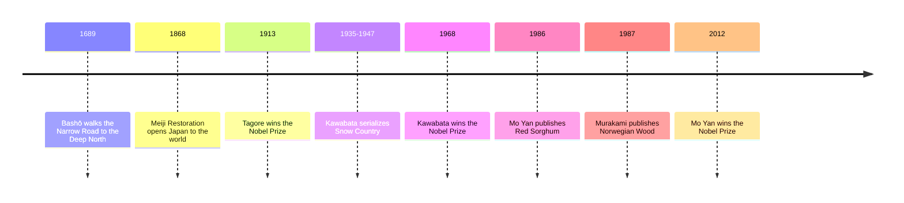

# 17 — Asian Literature — วรรณกรรมเอเชีย

> *"The old pond: a frog jumps in, the sound of water."*
> Matsuo Bashō, haiku of 1686

Asia's literary traditions are the oldest and largest on earth, and the pieces in this note are doors into four of them: Japan's disciplined beauty and its postwar loneliness, India's devotional songs, and China's violent lyricism. These traditions grew up next door to Thai letters, shaped by the same Buddhism and the same seasons, and yet their voices are unmistakably their own. Reading them is the fastest way to hear how differently a Japanese, an Indian, and a Chinese writer can see the same moon.

The note pairs each work with the idea behind it: the haiku's (ไฮกุ) one-breath form, the Japanese novel of beauty and distance, the Indian poet's song-offering, the Chinese novel of blood and sorghum, and the global voice of Haruki Murakami. Together they show how Asian writers modernized without losing their own accents.

---

## 1 | The Works at a Glance

| Work | Author | Year | Genre | Setting |
|---|---|---|---|---|
| *The Narrow Road to the Deep North* | Matsuo Bashō (1644-1694) | Journey 1689, published 1702, Japanese | Travel journal with haiku (บันทึกเดินทางกับไฮกุ) | Northern Japan, 1689 |
| *Gitanjali* | Rabindranath Tagore (1861-1941) | 1910 in Bengali; 1912 in English by the author | Song-poems (กวีนิพนธ์) | Bengal, a poet's inner landscape |
| *Snow Country* | Yasunari Kawabata (1899-1972) | 1935-1947, Japanese | Novel | A hot-spring town in western Japan, 1930s |
| *Red Sorghum* | Mo Yan (born 1955) | 1986, Chinese | Novel | Gaomi County, Shandong, China, 1920s-1940s |
| *Norwegian Wood* | Haruki Murakami (born 1949) | 1987, Japanese | Novel | Tokyo, 1968-1970 |

Murakami and Kawabata are widely available in Thai translation; Tagore's *Gitanjali* and Bashō's haiku exist in Thai in several editions. In English, *Snow Country* lives in Edward Seidensticker's translation, *Norwegian Wood* in Jay Rubin's, and *Red Sorghum* in Howard Goldblatt's, which the Nobel committee singled out for praise.

The lives matter here because these writers are national institutions. Bashō was a wandering monk-poet who walked the deep north of Japan for five months, and his journey became Japan's most beloved travel book. Tagore, a Bengali aristocrat and school founder, was the first non-European to win the Nobel Prize in Literature, in 1913, for a book he translated into English himself. Kawabata was the first Japanese Nobel laureate, in 1968, and wrote with the aesthetics of the tea ceremony. Mo Yan, a farmer's son, told the history of his village in the voice of tall tales. Murakami, who ran a jazz bar before he wrote, has become the most read Japanese novelist in the world.

## 2 | Story and Structure

*Spoilers follow: this note tells the whole story.*

### The Narrow Road to the Deep North: a poet walks, and the walk becomes a book

In 1689, at 45, Bashō walked for five months through the deep north of Japan with his friend Sora: mountains, shrines, islands, the places where old poems had happened. The book alternates prose and haiku, a form called haibun: the journey's facts, then the poem the moment distilled. The opening is one of the most quoted sentences in Japanese: "The months and days are the travellers of eternity." The most famous haiku in the book, and perhaps in the language, is the old pond: a frog jumps in, and the sound of water. The whole journey is that poem at scale: a man paying attention, and the smallest event becoming the whole world.

### Gitanjali: song-offerings to the one beloved

*Gitanjali* means "song offerings," and its 103 poems are addressed to a beloved who is at once a king, a friend, a beggar, and God. The poet waits for the beloved's gift, sings when he is silent, and accepts death as the boatman who will carry him home. The poems are short, plain, and devotional (ภาวนา), closer to the hymns of India than to European verse. The most famous, poem 35, begins: "Where the mind is without fear and the head is held high." When Tagore's own English version reached Europe in 1912, W. B. Yeats introduced it, and within a year Tagore had the Nobel Prize. The West had found, at the height of empire, the voice of a colonized Asia that asked for nothing but light.

### Snow Country: beauty at a distance

Shimamura, a well-off Tokyo dilettante with a wife and a fine art of idleness, takes the train through a long tunnel into the snow country of western Japan, where the geisha (เกอิชา) Komako waits. Over three visits he drifts in and out of her life: she loves him absolutely, he watches her the way he watches the mountains. The novel is built from such watching: the reflection of a woman's face in a train window against the evening landscape, the Milky Way over a burning building, the phrase Komako's rival Yoko repeats, that this love is "wasted effort." In the final pages a fire breaks out in the village, Yoko falls, and Shimamura is left staring at the Milky Way as if he had never truly arrived. Nothing is resolved; everything is seen. The novel was serialized across twelve years, and its quiet is Kawabata's whole point: distance is the condition of beauty, and beauty does not save.

### Red Sorghum: the family war told in tall tales

The narrator tells his grandmother's story in a voice that exaggerates, glorifies, and mourns. In 1923, in the sorghum fields of Gaomi County, the young Dai Fenglian is being carried to an arranged marriage with a leper when bandits attack her sedan chair; the sedan bearer Yu Zhan'ao kills them, and becomes her man and the narrator's grandfather. From the sorghum distillery they build, the story spirals out to the war against the Japanese invaders, guerrilla ambushes, atrocity and revenge, and the red sorghum itself, which grows tall and wild and becomes the family's blood memory. Mo Yan's novel is brutal, comic, and hallucinatory; the 1987 film of it by Zhang Yimou introduced Chinese cinema to the world.

### Norwegian Wood: memory and the ones who did not make it

Toru Watanabe is 37, and the song "Norwegian Wood" on a landing airplane throws him back to 1968-1970, his student years in Tokyo. His best friend Kizuki has killed himself at 17; Kizuki's girlfriend Naoko is broken by it, and Toru and Naoko drift into a love that is mostly grief. Naoko enters a mountain sanatorium; Toru meets Midori, a girl so alive she seems to belong to another species. The novel is Toru's memory of choosing: the pull of Naoko's world, where the dead stay present, against Midori's world of food, jokes, and stubborn life. It ends with Naoko's suicide and Toru alone in a phone booth, calling Midori, asking her to come back to the world with him: "Where are you now?"

| Character | Work | Role | One line |
|---|---|---|---|
| Bashō | *The Narrow Road* | The traveler-poet | The man who walked north to find the poem |
| The singer of *Gitanjali* | *Gitanjali* | The poet, the speaker | A beggar singing to the king of the world |
| Shimamura | *Snow Country* | Tokyo visitor | The watcher who cannot commit to what he sees |
| Komako | *Snow Country* | Geisha | The woman who loves completely, and knows it is wasted |
| Dai Fenglian | *Red Sorghum* | Grandmother | The sorghum-field matriarch of a family at war |
| Toru Watanabe | *Norwegian Wood* | Student, narrator | The survivor, choosing between the dead and the living |
| Naoko | *Norwegian Wood* | Kizuki's girlfriend | Grief so deep it becomes a country |
| Midori | *Norwegian Wood* | Student | Life itself: loud, hungry, funny, insisting |

## 3 | Key Passages

> "The old pond: a frog jumps in, the sound of water."
>
> From Matsuo Bashō, haiku of 1686 (translation after many English versions).
>
> > "บ่อน้ำเก่าแก่ กบตัวหนึ่งกระโดดลงไป เสียงน้ำดัง" (แปลอิสระ)
>
> Seventeen syllables that contain a whole philosophy: stillness, one small event, and the sound that makes the silence audible.

> "Where the mind is without fear and the head is held high; where knowledge is free."
>
> From *Gitanjali*, poem 35, in Tagore's own English.
>
> > "ที่ซึ่งจิตใจปราศจากความกลัว และศีรษะเชิดขึ้นสูง ที่ซึ่งความรู้เป็นอิสระ" (แปลอิสระ)
>
> Written for India before independence, and now quoted around the world: the poem as a country's dream of itself.

> "The train came out of the long tunnel into the snow country."
>
> From *Snow Country*, the opening sentence (tr. Edward Seidensticker).
>
> > "รถไฟแล่นพ้นอุโมงค์ยาวออกมาสู่ดินแดนหิมะ" (แปลอิสระ)
>
> One sentence does everything Kawabata wants: a threshold crossed, a world transformed, and a man who only watches.

## 4 | Themes and Style

| Theme | Thai | How the works treat it |
|---|---|---|
| Beauty and transience | ความงามกับความไม่เที่ยง | Kawabata's snow, Bashō's pond: beauty exists because it passes |
| Memory and loss | ความทรงจำกับการสูญเสีย | *Norwegian Wood*: the dead remain present in the living |
| Distance and unconsummated love | ระยะห่างกับรักที่ไม่สมหวัง | Shimamura's watching: longing kept at arm's length |
| Nature and the seasons | ธรรมชาติกับฤดูกาล | The haiku's season word; the snow country's white silence |
| Devotion | ความศรัทธา | *Gitanjali*: love for the divine told as love for a friend |
| War and survival | สงครามกับการดิ้นรน | *Red Sorghum*: the family that fights, drinks, and endures |
| The individual and the collective | ปัจเจกกับส่วนรวม | Mo Yan's villagers against history; Murakami's student against 1960s politics |

The styles are as distinct as the lands. The haiku is form as discipline: seventeen syllables in Japanese (the 5-7-5 count is approximate in English), a season word (คำแสดงฤดูกาล) that anchors the poem in nature, and a pause that lets the two halves resonate. Kawabata's prose is sparse and visual, full of what is not said: the Japanese aesthetic of understatement, which leaves the reader to complete the feeling. Tagore's English is simple to the point of translation from song: his poems were meant to be sung. Mo Yan writes in the register of village tall tales: exaggeration, appetite, and sudden lyricism. Murakami's first-person voice is casual and clean, full of brand names and jazz, which is why he reads so easily in translation, and why purists complain he is not very Japanese: both claims are true.

## 5 | Timeline

## 6 | Thai Terminology

| Thai | English | Notes |
|---|---|---|
| วรรณกรรมเอเชีย | Asian literature | The neighbor traditions this note samples |
| ไฮกุ | Haiku | A seventeen-syllable Japanese poem, one breath long |
| คำแสดงฤดูกาล | Season word (kigo) | The word that anchors a haiku in a season, such as the frog for spring |
| ความไม่เที่ยง | Impermanence | The Buddhist truth behind Kawabata's and Bashō's beauty |
| เกอิชา | Geisha | The professional entertainer Komako is, and resents being |
| บันทึกการเดินทาง | Travel journal | Bashō's form: the journey written as it happens |
| กวีนิพนธ์ | Poetry collection | *Gitanjali*: 103 song-offerings |
| ความทรงจำ | Memory | Murakami's true subject: the past that will not stay past |
| ระยะห่าง | Distance | Kawabata's condition of beauty: seeing without touching |
| รางวัลโนเบลสาขาวรรณกรรม | Nobel Prize in Literature | Tagore 1913, Kawabata 1968, Mo Yan 2012 |
| การแปล | Translation | Tagore's self-translation; Rubin's and Goldblatt's: how these books travel |

## 7 | Why It Matters Today

1. **Murakami is the global bookstore.** His novels are translated into more than 50 languages, and Thai readers know him well. The 2010 film of *Norwegian Wood* and the Oscar-winning 2021 film *Drive My Car*, based on his stories, show how thoroughly his voice has entered world cinema.
2. **The haiku discipline in the age of feeds.** Haiku is taught in schools worldwide, including Thai classrooms, and its rule is still the best writing exercise there is: see one thing, name its season, stop. In a world of endless scrolling, a form that fits in one breath is not outdated: it is a survival skill.
3. **Tagore still sings two nations.** The national anthems of India and Bangladesh are both Tagore's poems: "Jana Gana Mana" and "Amar Shonar Bangla." No other poet on earth has written two national anthems, which makes *Gitanjali*'s poet a living political fact, not a museum piece.
4. **Snow Country's "wasted effort" as life advice.** In the novel's most famous scene, Komako calls her love for Shimamura wasted effort, and he replies that the mountain view from the train window is also wasted effort. For Thai readers raised with Buddhist ideas of impermanence (ความไม่เที่ยง), the scene lands naturally: beauty and love need no result to be worth everything.

## 8 | Further Reading

- *Norwegian Wood* by Haruki Murakami (tr. Jay Rubin): the easiest door into Murakami and into modern Japanese fiction.
- *Snow Country* by Yasunari Kawabata (tr. Edward Seidensticker): short, quiet, and unforgettable; read it in one snowed-in evening.
- *Gitanjali* by Rabindranath Tagore: Tagore's own English, 103 short poems, one a night for a season.
- *The Narrow Road to the Deep North* by Matsuo Bashō: a pocket-sized classic of walking, seeing, and writing.

## Related

- [[World Literature/00_overview|← World Literature Overview]]
- [[16_Magical_Realism_and_Latin_America]]
- [[18_African_and_Middle_Eastern_Literature]]
- [[19_Poetry_of_the_World]]
- [[18_East_Asian_Mythology]]
- [[17_Hindu_Mythology]]
- [[ภาษาไทย/การอ่าน/12_การอ่านวรรณคดีและวรรณกรรม|การอ่านวรรณคดีและวรรณกรรม]]
