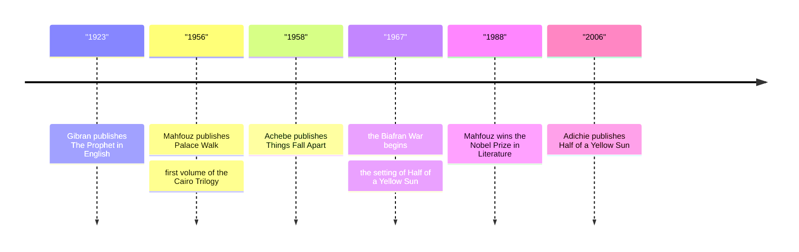

# 18 — African and Middle Eastern Literature — วรรณกรรมแอฟริกาและตะวันออกกลาง

> *"Work is love made visible." Kahlil Gibran, The Prophet.*

This note gathers four voices from Africa and the Middle East that changed how the world reads those regions. Chinua Achebe's Things Fall Apart (1958) told the story of colonialism (ลัทธิอาณานิคม) from inside an Igbo village, and became the most widely read African novel ever written. Naguib Mahfouz's Cairo Trilogy made him the first Arabic-language writer to win the Nobel Prize in Literature (รางวัลโนเบลสาขาวรรณกรรม), in 1988. Chimamanda Ngozi Adichie's Half of a Yellow Sun turned the Biafran War into intimate human drama, and her talk "The Danger of a Single Story" gave modern readers a name for an old habit. Kahlil Gibran's The Prophet, a slim book of aphorisms (คำพังเพย) written in English by a Lebanese immigrant, has been read at weddings and funerals for a century. Together they raise the question that runs through all postcolonial literature (วรรณกรรมยุคหลังอาณานิคม): who gets to tell the story, and from where?

---

## 1 | The Works at a Glance

| Work | Author | Published | Genre | Setting |
|---|---|---|---|---|
| Things Fall Apart | Chinua Achebe, 1930-2013, Nigeria | 1958, English | Novel (นวนิยาย); tragedy (โศกนาฏกรรม) | Umuofia, an Igbo village in eastern Nigeria, in the 1890s, as British rule arrives |
| The Cairo Trilogy | Naguib Mahfouz, 1911-2006, Egypt | 1956-1957, Arabic | Family saga (นวนิยายชุดครอบครัว); realism (สัจนิยม) | Cairo, 1917-1944: the 1919 revolution, British occupation, two world wars |
| Half of a Yellow Sun | Chimamanda Ngozi Adichie, b. 1977, Nigeria | 2006, English | Historical novel (นวนิยายอิงประวัติศาสตร์) | Nigeria, the hopeful early 1960s and the Biafran War, 1967-1970 |
| The Prophet | Kahlil Gibran, 1883-1931, Lebanon | 1923, English | Prose poetry (ร้อยแก้วเชิงกวี); aphorisms | Orphalese, a timeless seaside city |

Achebe was the son of a Christian convert in an Igbo village, educated in English but raised inside the oral culture he describes; he wrote Things Fall Apart partly to answer colonial books that turned Africa into silent scenery. Mahfouz spent his working life as a civil servant in Cairo and wrote before dawn; the trilogy made his name across the Arab world. Adichie grew up in the university town of Nsukka in a family scarred by Biafra. Gibran emigrated from Lebanon to Boston at twelve and chose English for The Prophet, his distilled book of counsel. Famous translations: the Cairo Trilogy in English by William Maynard Hutchins, Olive Kenny, and Lorne Kenny; Achebe, Adichie, and Gibran each wrote their own English. Thai editions of The Prophet and Things Fall Apart are available.

## 2 | Story and Structure

Spoilers follow: this note tells the whole story.

### Things Fall Apart

Things Fall Apart is the door into this whole region of the vault: start here. Okonkwo is the most famous man in the nine villages of Umuofia: a wrestler who threw the Cat, a yam farmer, a man of three wives and two titles. His whole life is a refusal of his father, Unoka, a gentle debtor and flute player who died disgraced. Okonkwo rules his household with his fists and measures love in discipline. When a girl of Umuofia is killed by the neighboring village of Mbaino, the price is a boy, Ikemefuna, who comes to live in Okonkwo's compound; the boy becomes a beloved elder brother to Okonkwo's son Nwoye, though Okonkwo never shows warmth. The oracle decrees that Ikemefuna must die, and an old friend warns Okonkwo not to take part; he takes part anyway, cutting the boy down himself, because he cannot bear to look weak. From that point things fall apart. Okonkwo accidentally kills a clansman at a funeral and is exiled for seven years to his mother's village. While he is away, white missionaries arrive in Umuofia; Nwoye joins them and takes the name Isaac. Okonkwo returns to find a court, a church, and a trading store, and his son gone. When Okonkwo kills a court messenger, no one rises with him; he understands that the village will not fight, and he hangs himself, an abomination by his own tradition. The novel's famous cold ending: the District Commissioner plans to write Okonkwo up as "a reasonable paragraph" in his planned book, The Pacification of the Primitive Tribes of the Lower Niger.

### The Cairo Trilogy

Three novels: Palace Walk, Palace of Desire, Sugar Street. Al-Sayyid Ahmad Abd al-Jawad rules his Cairo household with a severity his wife and children dread, yet spends his nights with wine, music, and mistresses. His wife Amina waits at the latticed window. Their children choose different roads: Fahmy, the nationalist, dies in a demonstration; Yasin inherits the father's appetites; Kamal, the youngest, loses his faith in everything, including the faith itself, and becomes the trilogy's sceptical conscience. Across three generations, from 1917 to 1944, the family weathers revolution, occupation, and war, and the reader watches Egypt learn to ask what it wants to be.

### Half of a Yellow Sun

The novel opens in the early 1960s with Ugwu, a village houseboy, arriving at the home of Odenigbo, a firebrand professor who loves argument, football, and his revolutionary dreams. Around them circle the glamorous twin sisters Olanna and Kainene, and Richard, an English writer in love with Nigeria. The first half is the hopeful Nigeria of independence (เอกราช): parties, ideas, books. Then the Eastern Region secedes as the republic of Biafra in 1967, and the second half is war: air raids, blockade, famine, and the slow collapse of every promise the first half made. The novel ends with the war lost in 1970 and the survivors beginning, barely, to write it down.

### The Prophet

Not a novel but a frame story (เรื่องเล่ากรอบ). The prophet Almustafa has waited twelve years in the city of Orphalese for the ship that will carry him home. Before he sails, the people gather and ask him to speak: on love, marriage, children, work, joy and sorrow, freedom, pain, death. Each answer is a short prose poem, twenty-six in all. His counsel is calm and paradoxical: your children are not your children; work is love made visible; the cup of your joy is carved by sorrow.

| Character | Role | One line |
|---|---|---|
| Okonkwo | Hero of Things Fall Apart | Strength so afraid of weakness that it destroys what it loves. |
| Nwoye | Okonkwo's son | Joins the missionaries: a quiet rebellion, and a grief. |
| Ikemefuna | The boy from Mbaino | Loved like a son, killed on the oracle's order. |
| Obierika | Okonkwo's friend | The thoughtful voice who asks the questions the village cannot. |
| Al-Sayyid Ahmad | Head of the Abd al-Jawad house | Pious tyrant at home, pleasure-seeker by night. |
| Kamal | His youngest son | The trilogy's conscience: doubt as a way of life. |
| Olanna | Twin sister in Half of a Yellow Sun | Beauty, education, and loyalty tested by war. |
| Ugwu | The houseboy who becomes a writer | Sees the war from the ground, and ends the novel writing it. |
| Almustafa | The Prophet's speaker | Answers the city's questions before sailing home. |

## 3 | Key Passages

> "You talk when you cease to be at peace with your thoughts." Kahlil Gibran, The Prophet, "On Talking".

> > (แปลอิสระ) "คนเราพูด เมื่อความคิดในใจไม่สงบอีกต่อไป"

Gibran's whole method in one sentence: one quiet observation, no sermon, the reader left to finish it.

> "The consequence of the single story is this: it robs people of dignity." Chimamanda Ngozi Adichie, "The Danger of a Single Story", 2009.

> > (แปลอิสระ) "ผลของเรื่องเล่าด้านเดียวคือ มันพรากศักดิ์ศรีของผู้คนไป"

From the TED talk that made Adichie famous; the thesis of this entire note, and of postcolonial literature.

> "He had already chosen the title of the book, after much thought: The Pacification of the Primitive Tribes of the Lower Niger." Chinua Achebe, Things Fall Apart, closing page.

> > (แปลอิสระ) "เขาคิดชื่อหนังสือไว้ล่วงหน้าแล้ว หลังจากครุ่นคิดอยู่นาน: การทำให้ชนเผ่าดึกดำบรรพ์แห่งไนเจอร์ตอนล่างสงบลง"

The colonial pen has the last word: a man's whole life reduced to a paragraph in someone else's book.

## 4 | Themes and Style

| Theme | Thai | How the work treats it |
|---|---|---|
| The colonial encounter | การเผชิญหน้ากับเจ้าอาณานิคม | Achebe shows the arrival from inside the village; Mahfouz shows it as occupation of a whole society. |
| Tradition and change | ประเพณีกับการเปลี่ยนแปลง | The old order is not idealized: Achebe keeps the village's cruelties alongside its dignity. |
| Who tells the story | ใครเป็นผู้เล่าเรื่อง | Adichie's "single story" names the danger of one-sided telling. |
| Masculinity and pride | ความเป็นชายกับศักดิ์ศรี | Okonkwo's strength is his pride, and his pride is his ruin. |
| Women's lives | ชีวิตของผู้หญิง | Amina's window, Olanna's choices, the brothel and the kitchen: women carry the families the men govern. |
| Faith and doubt | ศรัทธากับความกังขา | Kamal loses his faith slowly; the missionaries gain converts quickly; Gibran offers faith without dogma. |

Achebe writes an English that is deliberately Igbo: proverbs (สุภาษิต) sit in every argument, drum language and ritual enter untranslated, and the rhythm imitates oral storytelling. Mahfouz writes plain, warm realism; his Cairo is a city you can smell. Adichie moves the narration between characters so the same war looks different from each life. Gibran's English carries the cadence of the King James Bible, which he loved; it is part sermon, part lullaby.

## 5 | Timeline

## 6 | Thai Terminology

| Thai | English | Notes |
|---|---|---|
| นวนิยาย | novel | Long prose fiction; the form of the first three works here. |
| โศกนาฏกรรม | tragedy | Okonkwo's fall follows the old pattern of a great man undone by his own nature. |
| ลัทธิอาณานิคม | colonialism | One country ruling and reshaping another. |
| วรรณกรรมยุคหลังอาณานิคม | postcolonial literature | Writing from formerly colonized societies that answers the colonizers' version. |
| เอกราช | independence | Nigeria 1960, Egypt 1922: the horizon these novels look toward. |
| สุภาษิต | proverb | Short traditional saying; Achebe's prose leans on Igbo ones. |
| คำพังเพย | aphorism | Short wise saying; Gibran's entire method. |
| เรื่องเล่ากรอบ | frame story | A story that contains other stories, as in The Prophet. |
| สงครามกลางเมือง | civil war | War inside one country; Biafra, 1967-1970. |
| ร้อยแก้วเชิงกวี | prose poetry | Prose with a poem's rhythm and image; Gibran's form. |
| รางวัลโนเบลสาขาวรรณกรรม | Nobel Prize in Literature | Mahfouz was the first Arabic-language writer to win it, in 1988. |

## 7 | Why It Matters Today

- The single story: Adichie's 2009 TED talk, with tens of millions of views, is the modern statement of an idea this whole folder keeps meeting: every community deserves to tell its own story. It pairs naturally with the vault's [[Social Studies/02 Civics/12_Media_Literacy|Media Literacy]] note.
- Things Fall Apart is standard reading in schools on every continent and the natural first step for any adult beginning African fiction; the Cairo Trilogy, in turn, is the vault's richest study of fathers, sons, and the long shadow of family authority.
- The Prophet at life's hinges: Gibran's little book is read at weddings and funerals worldwide, and often given as a gift; it is the rare classic that people actually keep by the bed.
- On screen: Half of a Yellow Sun became a 2013 film with Chiwetel Ejiofor and Thandie Newton; Nigerian television made a famous 1987 miniseries of Things Fall Apart. Both reward a reader who comes to them after the books.

## 8 | Further Reading

- *Things Fall Apart* by Chinua Achebe: the Heinemann African Writers Series edition, with its orange covers, is the classic; read it in one sitting.
- *The Cairo Trilogy* by Naguib Mahfouz, tr. William Maynard Hutchins, Olive Kenny, and Lorne Kenny: Everyman's Library prints all three novels in one volume; a winter's project that repays itself.
- *Half of a Yellow Sun* by Chimamanda Ngozi Adichie: her most celebrated novel; also read her short essay "We Should All Be Feminists".
- *The Prophet* by Kahlil Gibran: Gibran's own English; one evening's reading and a lifetime of returns.

## Related

- [[World Literature/00_overview|← World Literature Overview]]
- [[17_Asian_Literature]]
- [[19_Poetry_of_the_World]]
- [[Social Studies/04 History/02_World_History_and_Civilizations|World History and Civilizations]]
- [[Social Studies/02 Civics/12_Media_Literacy|Media Literacy]]
- [[16_Magical_Realism_and_Latin_America]]
- [[15_Dystopian_Fiction]]
