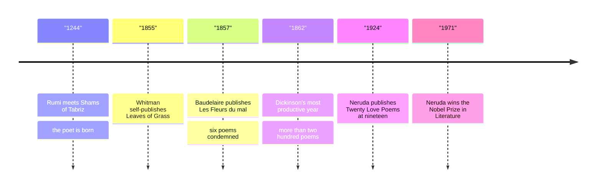

# 19 — Poetry of the World — กวีนิพนธ์ของโลก

> *"I am large, I contain multitudes." Walt Whitman, Song of Myself.*

Poetry (กวีนิพนธ์) is the oldest literature we have, older than prose and older than writing itself: verses were built to be remembered, and their shape is memory's shape. This note visits five poets in five languages: Rumi, the thirteenth-century Persian mystic whose love poems now fill American bookshops; Walt Whitman, who freed English verse from rhyme; Emily Dickinson, who compressed whole storms into four lines; Charles Baudelaire, who found beauty in the modern city's dirt; and Pablo Neruda, who wrote odes to the tomato. Along the way the note shows how poetry actually works: meter (ฉันทลักษณ์), rhyme (สัมผัส), image (ภาพพจน์), and the brave, imperfect art of translation (การแปล).

---

## 1 | The Works at a Glance

| Poet | Lived | Language | Famous for |
|---|---|---|---|
| Rumi | 1207-1273 | Persian | Ecstatic poems of love and longing; the Masnavi, six books of teaching stories |
| Walt Whitman | 1819-1892 | English | Leaves of Grass (1855); free verse (กลอนเปล่า) with long, breathless lines |
| Emily Dickinson | 1830-1886 | English | Nearly 1,800 short, compressed poems; fewer than a dozen published in her lifetime |
| Charles Baudelaire | 1821-1867 | French | Les Fleurs du mal (1857); beauty discovered in the modern city |
| Pablo Neruda | 1904-1973 | Spanish | Twenty Love Poems (1924); later the Elemental Odes to ordinary things |

Rumi was a respected scholar in Konya, in today's Turkey, until the wandering dervish Shams of Tabriz arrived in 1244 and turned him into a poet of ecstasy; after Shams vanished, Rumi poured out tens of thousands of lines. Whitman was a Brooklyn printer and journalist who spent the American Civil War nursing wounded soldiers, and who spent his life expanding one book. Dickinson stayed mostly in her room in Amherst, Massachusetts, writing letters and poems of astonishing pressure. Baudelaire was prosecuted for six poems in Les Fleurs du mal and fined for offense to public morals; he also translated Poe into French. Neruda was Chile's most famous poet and a diplomat, a Nobel laureate of 1971. Famous translations: Rumi by Coleman Barks and by Jawid Mojaddedi; Dickinson in the standard Franklin reading edition; Neruda's Twenty Love Poems by W. S. Merwin; Baudelaire by Richard Howard. Thai editions of Rumi and Neruda are available.

## 2 | Story and Structure

Spoilers follow: this note tells the whole story.

### Rumi: the ecstatic poet

Rumi's story is a conversion: from law and preaching to music and verse. Meeting Shams, he said, turned him from a book into fire. His two great works are the Masnavi, six books of teaching stories in rhyming couplets, and the Divan of Shams, shorter poems of raw longing. His subject never varies: the soul is homesick, separated from its source like a reed cut from the reedbed, and love is the way home. His followers founded the Mevlevi order, the whirling dervishes, who turn in circles as a bodily prayer.

### Whitman: the self that contains multitudes

Leaves of Grass appeared in 1855, self-published, twelve untitled poems; Whitman kept adding to it through nine editions until his death. "Song of Myself" opens with a celebration, then catalogues America: carpenters, ferrymen, a runaway slave, the grass itself. The verse has no rhyme and no fixed meter; it moves in long lines like breathing. His subject is the democratic self, the "I" large enough to hold everyone, which is why he says it contains multitudes. The poems shocked contemporaries and changed English poetry permanently.

### Dickinson: compressed lightning

Dickinson wrote almost 1,800 poems, mostly in the four-line hymn form she grew up with, but charged with her own abrupt punctuation and slant rhymes. Her subjects are death, nature, the soul, and the enormous inner life of a small room. She published almost nothing while alive; her sister found the poems after her death, and the first selection appeared in 1890. Today she is read as one of the great originals of any language.

### Baudelaire: beauty in the modern city

Les Fleurs du mal (The Flowers of Evil) is the book that made modern poetry possible: not fields and ruins, but Paris with its crowds, beggars, and gaslight. Baudelaire compared the poet to an albatross: magnificent in the sky, clumsy and mocked on the ship's deck. Six poems were condemned in 1857 as offenses to public morals; he was fined and the book censored, which made it famous. His word for the modern mood, spleen, means a grey nausea of the soul.

### Neruda: odes to ordinary things

Neruda became famous at nineteen with Twenty Love Poems and a Song of Despair. Decades later, in the Elemental Odes, he turned his full voice on the humblest objects: the onion, the tomato, the artichoke, salt. The move is his signature: the grand manner applied to the small and daily, and the small and daily shown to be grand. He kept writing for workers and for Chile to the end of his life, which came in 1973, days after the military coup that overthrew his friend, the president Salvador Allende.

| Character | Role | One line |
|---|---|---|
| The ecstatic lover | Rumi's voice | Longs for the source; turns loss into song. |
| The cosmic I | Whitman's voice | Contains multitudes; speaks for the whole democracy. |
| The recluse | Dickinson's voice | A small room, and storms inside it. |
| The city walker | Baudelaire's voice | Strolls Paris and finds beauty in its dirt. |
| The odist | Neruda's voice | Sings the tomato and the worker with equal love. |

## 3 | Key Passages

> "This being human is a guest house. Every morning a new arrival." Rumi, "The Guest House", tr. Coleman Barks.

> > (แปลอิสระ) "การเป็นมนุษย์นี้คือเรือนรับแขก ทุกเช้ามีแขกใหม่มาถึง"

Rumi's counsel in miniature: meet every feeling as a guest, since each has something to teach.

> "I celebrate myself, and sing myself, / And what I assume you shall assume, / For every atom belonging to me as good belongs to you." Walt Whitman, Song of Myself, opening.

> > (แปลอิสระ) "ข้าพเจ้าฉลองตัวตนของข้าพเจ้า และขับขานถึงตัวตนของข้าพเจ้า สิ่งใดที่ข้าพเจ้ายึดถือ ท่านก็จะยึดถือ อะตอมทุกอะตอมที่เป็นของข้าพเจ้า ย่อมเป็นของท่านเช่นกัน"

Whitman's great democratic gesture: the self is not private property but common ground.

> "Hope is the thing with feathers / That perches in the soul, / And sings the tune without the words, / And never stops at all." Emily Dickinson, poem 314, c. 1861.

> > (แปลอิสระ) "ความหวังคือสิ่งที่มีปีก เกาะพักอยู่ในจิตวิญญาณ และขับขานท่วงทำนองที่ไร้ถ้อยคำ และไม่เคยหยุดเลย"

Four lines, one extended metaphor (อุปมา): Dickinson's compression at full power.

> "Là, tout n'est qu'ordre et beauté, / Luxe, calme et volupté." Charles Baudelaire, "L'Invitation au voyage", Les Fleurs du mal. In English: "There, all is nothing but order and beauty, luxury, calm, and pleasure."

> > (แปลอิสระ) "ที่นั่น ทุกสิ่งล้วนเป็นระเบียบและความงาม ความหรูหรา ความสงบ และความรื่นรมย์"

Baudelaire's dream of a perfect elsewhere; the sound of the French is itself the luxury it names.

> "Love is so short, forgetting is so long." Pablo Neruda, "Tonight I Can Write", tr. W. S. Merwin.

> > (แปลอิสระ) "ความรักนั้นสั้นนัก แต่การลืมนั้นยาวนาน"

One of the most quoted lines in modern poetry: grief measured in two speeds.

## 4 | Themes and Style

| Theme | Thai | How the work treats it |
|---|---|---|
| Love | ความรัก | Rumi's love opens toward the divine; Neruda's stays human and mortal; Dickinson's is mostly refused. |
| The self | ตัวตน | Whitman's self expands to contain the crowd; Dickinson's contracts to a room. |
| Death | ความตาย | Dickinson's great subject; Baudelaire's city smells of it; Neruda mourns and keeps writing. |
| Nature and the everyday | ธรรมชาติกับสิ่งสามัญ | Whitman's grass, Neruda's tomato: the small thing as the sacred thing. |
| The modern city | เมืองสมัยใหม่ | Baudelaire's Paris: crowds, gaslight, and the beauty that survives them. |
| The divine | สิ่งศักดิ์สิทธิ์ | Rumi's poems are prayers; his longing for Shams is longing for God. |

How poetry works, briefly: meter is the pattern of stressed and unstressed beats, rhyme the echo at line ends, image the picture that carries feeling, and the line itself is the unit of attention. Each language plays differently: Persian glides through long rhymes, French measures syllables, Spanish and English argue about stress. That is why translation is a negotiation, not a copy: the translator keeps the sense or the music, rarely both. Thai verse works its own way, with tones doing work that English rhyme cannot; the vault's notes on กาพย์, กลอน, and ฉันท์ show the contrast in detail.

## 5 | Timeline

## 6 | Thai Terminology

| Thai | English | Notes |
|---|---|---|
| กวีนิพนธ์ | poetry | Verse as an art form; the subject of this note. |
| บทกวี | poem | One work of verse. |
| กวี | poet | The maker of poems. |
| กลอนเปล่า | free verse | Verse without fixed rhyme or meter; Whitman's gift to English. |
| ฉันทลักษณ์ | meter, prosody | The pattern of beats that verse is built on. |
| สัมผัส | rhyme | Echo at the ends of lines; Dickinson's slant rhymes bend it. |
| ภาพพจน์ | imagery | Word pictures that carry feeling. |
| อุปมา | metaphor | Saying one thing is another; Dickinson's hope-as-bird. |
| การแปล | translation | The art of carrying a poem across languages: loss and gain in one move. |
| กาพย์ | kap, a Thai verse form | The singing meter of Thai classical verse, as in กาพย์เห่เรือ. |
| กลอน | klon, a Thai verse form | The standard Thai meter with internal rhymes. |
| ฉันท์ | chan, a Thai verse form | The demanding meter borrowed from Pali and Sanskrit, counting long and short syllables. |

## 7 | Why It Matters Today

- Rumi is one of the best-selling poets in the modern United States, a thirteenth-century Sufi read at yoga studios and hospitals alike; "The Guest House" has become a standard text of mindfulness practice.
- Poems at life's hinges: people who never open a poetry book still reach for Neruda at a wedding or Dickinson at a funeral. A quiet practice follows: one short poem read aloud (การอ่านออกเสียง) each evening teaches more about literature than a year of theory, and these five poets are built for exactly that.
- On screen: Dead Poets Society (1989) made Whitman's "O Captain! My Captain!" a classroom battle cry, and Il Postino (1994) dramatizes Neruda teaching a shy postman what metaphor is; both are gentle doors into poetry for adults.
- The Thai angle: reading world verse beside Thai verse, as in [[ภาษาไทย/วรรณคดีและวรรณกรรม/สมัยอยุธยา/04_กาพย์เห่เรือ|กาพย์เห่เรือ]]'s boat rhythm, shows what each language can do that the others cannot; trying to translate between them is the best training in both.

## 8 | Further Reading

- *The Essential Rumi* tr. Coleman Barks: the friendliest door into Rumi; also try Jawid Mojaddedi's Masnavi for the scholarly voice.
- *Leaves of Grass* by Walt Whitman: the 1855 first edition, published by Penguin, is short enough for a weekend.
- *The Poems of Emily Dickinson: Reading Edition* ed. R. W. Franklin: the cleanest modern text; read ten poems slowly rather than fifty quickly.
- *Twenty Love Poems and a Song of Despair* by Pablo Neruda, tr. W. S. Merwin: one of the great bilingual editions, Spanish beside English.

## Related

- [[World Literature/00_overview|← World Literature Overview]]
- [[18_African_and_Middle_Eastern_Literature]]
- [[20_Childrens_Classics_and_Folk_Tales]]
- [[ภาษาไทย/หลักการใช้ภาษาไทย/19_กาพย์|กาพย์]]
- [[ภาษาไทย/หลักการใช้ภาษาไทย/20_กลอน|กลอน]]
- [[ภาษาไทย/หลักการใช้ภาษาไทย/22_ฉันท์|ฉันท์]]
- [[ภาษาไทย/วรรณคดีและวรรณกรรม/สมัยอยุธยา/04_กาพย์เห่เรือ|กาพย์เห่เรือ]]
- [[17_Asian_Literature]]
