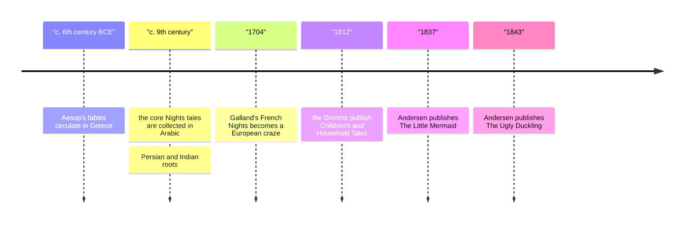

# 20 — Children's Classics and Folk Tales — วรรณกรรมเยาวชนคลาสสิกและนิทานพื้นบ้าน

> *"I never dreamed of so much happiness when I was the ugly duckling!" Hans Christian Andersen, The Ugly Duckling.*

Four great storehouses of stories, and the shortest distance between an adult and a child: Aesop's fables (นิทานอีสป), the moral tale in miniature; the Grimms' collected folktales (นิทานพื้นบ้าน), the dark originals behind the Disney versions; Andersen's literary fairy tales (เทพนิยาย), written by a shoemaker's son who made the form his own; and the Arabian Nights, the thousand-and-one strategy of Scheherazade. These are the stories every generation tells its children, and the ones adults return to in order to understand what they were told. This is the note for reading aloud (การอ่านออกเสียง).

---

## 1 | The Works at a Glance

| Collection | Author or collector | Published | Genre | Setting |
|---|---|---|---|---|
| Aesop's Fables | Aesop, a legendary storyteller of ancient Greece | collected from c. 4th century BCE | Fable (นิทานคติสอนใจ) | Timeless villages, fields, and forests |
| Children's and Household Tales | Jacob Grimm, 1785-1863, and Wilhelm Grimm, 1786-1859, Germany | 1812, expanded to 1857 | Folktale (นิทานพื้นบ้าน) | German villages, forests, castles |
| Andersen's Fairy Tales | Hans Christian Andersen, 1805-1875, Denmark | 1835-1872, Danish | Literary fairy tale (เทพนิยาย) | Denmark and imagined lands |
| The Thousand and One Nights | Anonymous, Arab and Persian tradition | first European translation 1704-1717, French | Frame tale cycle (นิทานซ้อนนิทาน) | Baghdad, Basra, Cairo, legendary seas |

Aesop himself is a shadow: tradition makes him a slave on the island of Samos in the sixth century BCE, famous for wit, and his tales were retold by the Roman Phaedrus and the French La Fontaine before they reached the Thai schoolroom. The Grimms were university philologists, not village grannies; they collected the tales from oral tellers for scholarship, and Wilhelm softened the later editions, which is why the first edition is darker than the one most people know. Andersen wrote his tales himself, as literature for all ages, from a childhood of real poverty in Odense. The Nights grew over centuries from Persian and Indian roots through Baghdad's golden age; Antoine Galland's French translation made Europe fall in love, and the English versions of Edward Lane and Richard Burton followed. Thai editions of all four exist, and Aesop and Thai folktales are part of the Thai school curriculum.

## 2 | Story and Structure

Spoilers follow: this note tells the whole story.

### Aesop: morals in miniature

A fox sees grapes hanging high, jumps, fails, and walks away declaring them sour. A hare races a tortoise and loses through overconfidence. A shepherd boy cries wolf for fun until no one comes. That is the whole form: one situation, one twist, one moral (คติสอนใจ), under a page. The fox's line has become a proverb in a dozen languages; the fable is the smallest complete story we have, and the ancestor of every sermon illustration and business anecdote.

### The Grimms: the dark originals

The first edition of 1812 keeps the tales' teeth. Cinderella's stepsisters cut off toes and heel to fit the slipper, and doves peck out their eyes at the wedding. Hansel and Gretel are abandoned by parents in a famine and bake the witch in her own oven. Snow White's stepmother wants the girl's lungs and liver for dinner and is made to dance in red-hot iron shoes. These are survival stories, told by adults to adults as much as to children: hunger, stepmothers, and the forest were real dangers, and the tales are how people talked about them. The Grimms' genius was fidelity: they wrote down what tellers said, about two hundred tales in the final edition, and created the modern idea of the folktale.

### Andersen: the author's own tears

The Little Mermaid (1837) gives up her voice for legs, and every step she takes feels like walking on knives; if the prince marries another, she will dissolve into sea foam. Her sisters trade their hair for a knife with which she might save herself by killing the prince; she cannot do it, and dissolves, but becomes a daughter of the air with the chance to win an immortal soul through good deeds. The Ugly Duckling (1843) is the swan who grows up among ducks, mocked until the day he sees his own reflection; it is Andersen's autobiography in feathers. The Emperor's New Clothes (1837) ends with the one true voice in the story, a child's: the emperor has nothing on. Andersen's endings are quiet, sometimes sad, and earned; he never flatters his readers.

### The Arabian Nights: the storyteller's strategy

The frame story (เรื่องเล่ากรอบ) is the masterpiece. King Shahryar, betrayed by his wife, marries a new bride each night and has her executed at dawn. Scheherazade, the vizier's daughter, volunteers, and each night tells a story that breaks off at the most dangerous moment; the king postpones her death to hear the ending. Night after night: Sinbad's seven voyages, Aladdin's lamp, Ali Baba and the forty thieves, the ebony horse. After a thousand and one nights she has borne him three children and he has fallen in love with her. The lesson is the form itself: a story that never ends cannot be silenced, and the teller lives as long as the tale.

| Character | Role | One line |
|---|---|---|
| The fox | Aesop's fox | Fails at the grapes and saves face with sourness. |
| Cinderella | Grimms' heroine | Patient and ash-smeared, helped by birds rather than a fairy godmother. |
| The little mermaid | Andersen's heroine | Pays for love with her voice, then with her life, and still does not take revenge. |
| The ugly duckling | Andersen's swan | Learns he was never ugly; he was in the wrong flock. |
| The emperor | Andersen's emperor | Naked, and only a child will say so. |
| Shahryar | King of the Nights | Wounded into cruelty; healed by a thousand unfinished tales. |
| Scheherazade | The teller | Stays alive one interrupted story at a time. |
| Aladdin | The Nights' hero | A poor boy, a lamp, and the wish economy of folklore. |

## 3 | Key Passages

> "It is easy to despise what you cannot get." The moral of Aesop's The Fox and the Grapes.

> > (แปลอิสระ) "ของที่เอื้อมไม่ถึง ย่อมดูแคลนได้ง่าย"

Two millennia of retellings in one sentence; the human habit it names has not changed.

> "And Scheherazade perceived the dawn of day and ceased saying her permitted say." The frame of the Arabian Nights, tr. Richard Burton.

> > (แปลอิสระ) "และชาห์ราซาดแลเห็นแสงอรุณ จึงหยุดถ้อยคำที่ได้รับอนุญาตให้เอ่ย"

The refrain that carries the whole book: the cliffhanger as a survival device, night after night.

> "Rapunzel, Rapunzel, let down your hair." The Brothers Grimm, Rapunzel.

> > (แปลอิสระ) "ราพันเซล ราพันเซลเอ๋ย จงปล่อยผมของเจ้าลงมา"

One of the most quoted lines in all folklore: the story's whole magic in seven words.

## 4 | Themes and Style

| Theme | Thai | How the work treats it |
|---|---|---|
| The moral in miniature | คติสอนใจในเรื่องสั้น | Aesop: one twist, one lesson, no preaching beyond the final line. |
| Danger and canniness | อันตรายกับไหวพริบ | The Grimms: the forest, the wolf, the witch; survival by wit and kindness. |
| Transformation | การเปลี่ยนรูป | Andersen: the duckling to swan, the mermaid to spirit; change as identity's secret. |
| Wit against force | ปัญญาโต้กำลัง | Scheherazade holds off death with words; the fables outsmart the strong. |
| Kindness rewarded | ความเมตตาได้รับรางวัล | Andersen's heroes win by refusing revenge. |
| Storytelling as survival | การเล่าเรื่องเพื่อความอยู่รอด | The Nights' frame: the tale itself is the life raft. |

The style of oral story is everywhere: formula openings, threefold repetition, flat characters who stand for one thing. Aesop speaks one plain sentence at a time. The Grimms preserve the tellers' clipped, brutal syntax. Andersen writes literary prose with melancholy and jokes woven in, and his endings ache on purpose. The Nights stack stories inside stories like boxes, and its refrains mark time like drumbeats.

## 5 | Timeline

## 6 | Thai Terminology

| Thai | English | Notes |
|---|---|---|
| นิทาน | tale, story | The general word; the umbrella over this note. |
| นิทานพื้นบ้าน | folktale | Traditional tale passed down orally; the Grimms' material. |
| เทพนิยาย | fairy tale | Wonder tale with magic; Andersen's art form. |
| นิทานอีสป | Aesop's fables | The moral tales taught in Thai schools; see the vault's นิทานอีสป note. |
| นิทานคติสอนใจ | fable with a moral | The form Aesop perfected. |
| คติสอนใจ | moral, lesson | The point a fable carries. |
| เรื่องเล่ากรอบ | frame story | A story that contains others, as in the Nights. |
| นิทานซ้อนนิทาน | story within a story | The Nights' nested boxes. |
| การเล่าซ้ำ | retelling | Every generation retells these stories; the versions differ. |
| การอ่านออกเสียง | reading aloud | The mode these stories were built for. |
| วรรณกรรมเยาวชน | children's literature | The modern shelf these classics now occupy. |

## 7 | Why It Matters Today

- Reading aloud is the strongest predictor of early literacy, and these texts were built for the ear: short sentences, repetition, refrains. A parent who reads ten minutes of the Nights or Andersen a night is doing the most proven thing in education.
- The Thai classroom bridge: Aesop's fables and Thai folktales are in the Thai curriculum, so these notes connect directly to what Thai students already know; see the vault's notes on [[ภาษาไทย/วรรณคดีและวรรณกรรม/นิทานและตำนาน/03_นิทานอีสป|นิทานอีสป]] and [[ภาษาไทย/วรรณคดีและวรรณกรรม/นิทานและตำนาน/01_นิทานพื้นบ้าน|นิทานพื้นบ้าน]].
- The dark-original debate: should children meet the Grimms' 1812 versions or the softened ones? Parents differ, and reasonable adults disagree; knowing the originals makes you a better chooser of editions for your own family. Andersen repays the same return: his tales read differently at forty than at seven, when the little mermaid's choice becomes a question about what love costs.
- The adaptation industry: Disney's The Little Mermaid (1989) gave Andersen's tale the happy ending he withheld, and Shrek (2001) plays ping-pong with every folktale trope; comparing the originals with the films is the best first lesson in adaptation (การดัดแปลง).

## 8 | Further Reading

- *Aesop's Fables* tr. Laura Gibbs, Oxford World's Classics: six hundred fables with sharp modern notes; the reference edition.
- *The Classic Fairy Tales* ed. Maria Tatar, Norton: the Grimms and their relatives with Tatar's superb commentary for adults.
- *Hans Christian Andersen: The Complete Fairy Tales*, Everyman's Library: all 150-plus tales in clean translations.
- *The Arabian Nights: Tales of 1,001 Nights* tr. Malcolm C. Lyons, Penguin Classics: three volumes, the modern standard, with the frame restored.

## Related

- [[World Literature/00_overview|← World Literature Overview]]
- [[19_Poetry_of_the_World]]
- [[21_ASEAN_and_Southeast_Asian_Literature]]
- [[ภาษาไทย/วรรณคดีและวรรณกรรม/นิทานและตำนาน/03_นิทานอีสป|นิทานอีสป]]
- [[ภาษาไทย/วรรณคดีและวรรณกรรม/นิทานและตำนาน/01_นิทานพื้นบ้าน|นิทานพื้นบ้าน]]
- [[12_What_Is_Mythology]]
- [[02_Ancient_Epics]]
