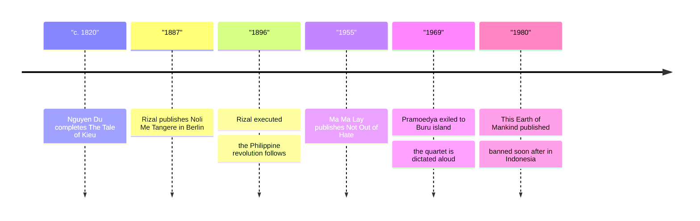

# 21 — ASEAN and Southeast Asian Literature — วรรณกรรมอาเซียนและเอเชียตะวันออกเฉียงใต้

> *"The youth is the fair hope of my motherland." José Rizal, To the Filipino Youth.*

Thailand's neighbors have literatures as old and as proud as its own, and a Thai reader who knows them gains more than book knowledge: in the ASEAN (อาเซียน) era these are colleagues, trading partners, and relatives. This note visits four neighbor classics: Vietnam's The Tale of Kieu, the national poem every Vietnamese schoolchild knows; Myanmar's Not Out of Hate, a colonial-era novel by the pioneering woman writer Ma Ma Lay; Indonesia's This Earth of Mankind, the novel Pramoedya Ananta Toer dictated aloud in prison; and the Philippines' Noli Me Tangere, the novel by José Rizal that helped prepare a revolution. It closes with the shared epic inheritance (มรดกมหากาพย์ร่วม) that ties the region together: one Ramayana, many tellings.

---

## 1 | The Works at a Glance

| Work | Author | Published | Genre | Setting |
|---|---|---|---|---|
| The Tale of Kieu | Nguyen Du, 1766-1820, Vietnam | c. 1820, Vietnamese | Verse epic (มหากาพย์), 3,254 lines | Ming-dynasty China, seen through a Vietnamese lens |
| Not Out of Hate | Ma Ma Lay, 1917-1982, Myanmar | 1955, Burmese | Colonial-era novel | Rangoon and provincial Burma under British rule |
| This Earth of Mankind | Pramoedya Ananta Toer, 1925-2006, Indonesia | 1980, Indonesian | Historical novel; first of the Buru Quartet | Surabaya, Java, 1898, under Dutch colonial rule |
| Noli Me Tangere | José Rizal, 1861-1896, Philippines | 1887, Spanish | Novel of social protest | Manila and Laguna province, Philippines, 1880s |

Nguyen Du was a mandarin who served both the dynasty he was born into and the one that replaced it, and who wrote Kieu in the vernacular Nôm script rather than classical Chinese, a quiet revolution in itself. Ma Ma Lay was one of Myanmar's first prominent women writers and publishers; her husband edited the journal she wrote for. Pramoedya was imprisoned by the Dutch and, decades later, by Indonesia's Suharto regime; on the prison island of Buru, denied pen and paper, he dictated the quartet aloud to fellow prisoners. Rizal was a doctor, novelist, and reformer; his novel was banned by the Spanish authorities, and a decade later he was executed by firing squad, and within months of his death the revolution his novels had helped prepare swept the islands. Famous translations: Kieu by Huỳnh Sanh Thông; Noli Me Tangere by León Ma. Guerrero and by Harold Augenbraum; the Buru Quartet by Max Lane; Not Out of Hate by Margaret Aung-Thwin. Thai editions of The Tale of Kieu exist.

## 2 | Story and Structure

Spoilers follow: this note tells the whole story.

### The Tale of Kieu

Thuy Kieu, a girl of rare beauty and talent, is betrothed to the scholar Kim Trong. Then her family is ruined by a false accusation; to ransom her father, Kieu sells herself into what she believes is marriage, and is instead sold to a brothel. Fifteen years of wandering follow: a suicide attempt, a failed escape, a second brothel, and finally rescue by Tu Hai, a rebel hero who loves her and makes her his queen. When Tu Hai is persuaded by a lying official's promises to surrender, he is killed by trickery, and Kieu throws herself into a river. She is saved, as a ghost once foretold she would be, by a Buddhist nun, and at last reunited with her family and with Kim Trong, whom she marries in name only, her heart spent. The poem's opening announces its argument: talent (tài) and fate (mệnh) are at war in every human life.

### Not Out of Hate

Way Way, a dutiful young Burmese woman, marries U Saw Han, a westernized civil servant, against her father's wishes. Her husband has modeled himself on his English employers: their manners, their priorities, their distance. The marriage empties out; Way Way falls ill with tuberculosis and dies young, and the novel closes on the father's grief. The title carries the author's argument: her quarrel with blind imitation of the West is not hatred of the West, but love of what is one's own. It is one of the first great novels of the Burmese colonial experience.

### This Earth of Mankind

Minke is one of the few native students at an elite Dutch high school in Surabaya in 1898: brilliant, ambitious, and beginning to write. He falls in love with Annelies, the mixed-race daughter of Nyai Ontosoroh, a concubine who has taken over her Dutch master's estate and run it into a model business. Minke is drawn into their world, and into its exposure: the colonial courts take Annelies away to the Netherlands, and Minke learns exactly where the law draws the line around a native. The novel is the first of four; the others follow Minke into journalism and the awakening of Indonesian national consciousness.

### Noli Me Tangere

Crisostomo Ibarra returns to Manila after seven years in Europe, full of plans, and learns that his father died in prison, falsely accused by the friar Father Damaso. At a dinner, Damaso insults the father's memory; Ibarra nearly kills him and is excommunicated. His school project is sabotaged, he is framed for an uprising he did not start, and his fiancée, Maria Clara, is revealed to be Damaso's own daughter; she enters a convent. Ibarra escapes with the help of Elias, a boatman and reformer who dies of his wounds so Ibarra can live. The title means "touch me not", the risen Christ's words in the Gospel of John: the novel asks Spain not to touch the open wound of its colony, and shows the wound anyway.

| Character | Role | One line |
|---|---|---|
| Thuy Kieu | Heroine of The Tale of Kieu | Beauty and talent sold to save her family; fifteen years of wandering. |
| Kim Trong | Kieu's first love | The betrothed she returns to after everything. |
| Tu Hai | The rebel hero | Loves Kieu, trusts the wrong promise, dies for it. |
| Way Way | Heroine of Not Out of Hate | A daughter's love against a husband's imitation of the West. |
| Minke | Narrator of This Earth of Mankind | A native student who learns what colonial law will allow him. |
| Nyai Ontosoroh | The concubine who becomes a force | Runs the estate and speaks the novel's hardest truths. |
| Crisostomo Ibarra | Rizal's hero | Returns to build, is framed, and is lost to his country. |
| Maria Clara | Ibarra's beloved | The ideal maiden trapped by the truth of her birth. |

## 3 | Key Passages

> "Trăm năm trong cõi người ta, chữ tài chữ mệnh khéo là ghét nhau." The Tale of Kieu, opening lines. In English: "Within the span of a hundred years of human existence, what a bitter struggle goes on between genius and destiny!" tr. Huỳnh Sanh Thông.

> > (แปลอิสระ) "ในร้อยปีแห่งชีวิตของคน พรสวรรค์กับโชคชะตาช่างเป็นศัตรูกันนัก"

The two most famous lines in Vietnamese literature; recited by heart across Vietnam for two centuries.

> "I die without seeing the dawn break over my native land. You who have it to see, welcome it, and forget not those who have fallen during the night." José Rizal, Noli Me Tangere, Elias's dying words, tr. León Ma. Guerrero.

> > (แปลอิสระ) "ข้าพเจ้าตายโดยไม่ได้เห็นรุ่งอรุณทอแสงเหนือแผ่นดินเกิด ท่านผู้จะได้เห็นมัน จงต้อนรับมัน และอย่าลืมผู้ที่ล้มลงในยามค่ำคืน"

Written by a man who was himself executed before the dawn he predicted; the passage became a national inheritance.

> "Writing is working for immortality." Pramoedya Ananta Toer, on why he kept writing on Buru island.

> > (แปลอิสระ) "การเขียนคือการทำงานเพื่อความเป็นอมตะ"

A prisoner with no pen, dictating to fellow prisoners: literature as the one thing they could not take from him.

## 4 | Themes and Style

| Theme | Thai | How the work treats it |
|---|---|---|
| Colonial rule and its costs | การปกครองแบบอาณานิคม | Four books, three empires: the Dutch, Spanish, and British systems seen from underneath. |
| Nation and identity | ชาติกับอัตลักษณ์ | Rizal and Pramoedya: writing as the seedbed of national consciousness. |
| Women's sacrifice | การเสียสละของผู้หญิง | Kieu sells herself for her father; Way Way dies of a marriage; the novels count the cost. |
| Tradition and modernity | จารีตกับความสมัยใหม่ | Way Way's husband and Minke's school: the colonial bargain and its price. |
| Censorship and exile | การเซ็นเซอร์กับการเนรเทศ | Rizal banned and executed; Pramoedya banned and imprisoned; both still read. |
| Shared epic heritage | มรดกมหากาพย์ร่วม | One Ramayana told as Ramakien, Reamker, Phra Lak Phra Lam, and Hikayat Seri Rama. |

Kieu's verse form, lục bát, alternates six- and eight-syllable lines with rhymes that link one couplet to the next, so the whole poem is one unbreakable chain; the effect survives translation only in mood. Rizal writes realism with the satire of the Spanish and Filipino classics behind it, and his friars are unforgettable villains. Pramoedya's prose is plain, warm, and humane even about its oppressors. Not Out of Hate is told with a housewife's eye for the small betrayals of a marriage. And across all four, the epic background: the Ramayana and Mahabharata travelled from India through the region for a thousand years, and each kingdom retold them in its own language, which is why Thailand's รามเกียรติ์ has cousins in every neighboring country.

## 5 | Timeline

## 6 | Thai Terminology

| Thai | English | Notes |
|---|---|---|
| มหากาพย์ | epic | Long verse narrative of a people's story; Kieu's form. |
| วรรณกรรมประจำชาติ | national literature | A work a nation claims as its own; Kieu, Noli. |
| อาณานิคม | colony | A country ruled by another; the setting of all four works. |
| เอกราช | independence | The goal that runs under every plot here. |
| ชาตินิยม | nationalism | The awakening these novels both describe and helped cause. |
| การปฏิวัติ | revolution | Rizal's death tipped the Philippines into one in 1896. |
| การเซ็นเซอร์ | censorship | Rizal's book banned in 1887; Pramoedya's for decades after 1980. |
| นักโทษการเมือง | political prisoner | Pramoedya, in prison from 1965 and on Buru island from 1969. |
| อาเซียน | ASEAN | The regional community these literatures now belong to. |
| ฉันทลักษณ์ | prosody, meter | The six-eight chain of Vietnamese lục bát. |

## 7 | Why It Matters Today

- Knowing the neighbors: in the ASEAN era, the cheapest and deepest introduction to Vietnam, Myanmar, Indonesia, and the Philippines is their literature; one novel teaches more than a hundred news clips.
- Rizal as the model of the writer-citizen: a novelist on the currency, a national holiday in his name (30 December), and a novel required reading in every Philippine school; the clearest modern proof that literature can move a country. The landmark 1998 film José Rizal dramatizes the life behind the book.
- Pramoedya and banned books: the Buru Quartet was banned in its own country for two decades and is now taught there; the strongest case study in the vault for why censorship (การเซ็นเซอร์) always fails. The 2019 film This Earth of Mankind brought the first volume to new audiences.
- One Ramayana, many homes: watching Cambodia's Reamker, Laos's Phra Lak Phra Lam, or Thailand's [[ภาษาไทย/วรรณคดีและวรรณกรรม/สมัยรัตนโกสินทร์/01_รามเกียรติ์|รามเกียรติ์]] and seeing the same story in a new language is the region's shared memory at work; see also [[17_Hindu_Mythology]] for the Indian source.

## 8 | Further Reading

- *The Tale of Kiều* tr. Huỳnh Sanh Thông, Yale University Press: the standard English text, with the Vietnamese facing.
- *Noli Me Tangere* tr. Harold Augenbraum, Penguin Classics: the modern, readable version; Guerrero's older translation is beloved in the Philippines.
- *This Earth of Mankind* tr. Max Lane, Penguin: the first and best-known volume of the Buru Quartet.
- *Not Out of Hate* tr. Margaret Aung-Thwin: a short, lucid novel; the rare English window into Burmese colonial fiction.

## Related

- [[World Literature/00_overview|← World Literature Overview]]
- [[20_Childrens_Classics_and_Folk_Tales]]
- [[22_Literary_Movements_Overview]]
- [[Social Studies/04 History/13_SE_Asian_History|SE Asian History]]
- [[ภาษาไทย/วรรณคดีและวรรณกรรม/สมัยรัตนโกสินทร์/01_รามเกียรติ์|รามเกียรติ์]]
- [[17_Hindu_Mythology]]
- [[17_Asian_Literature]]
