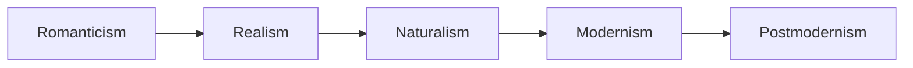
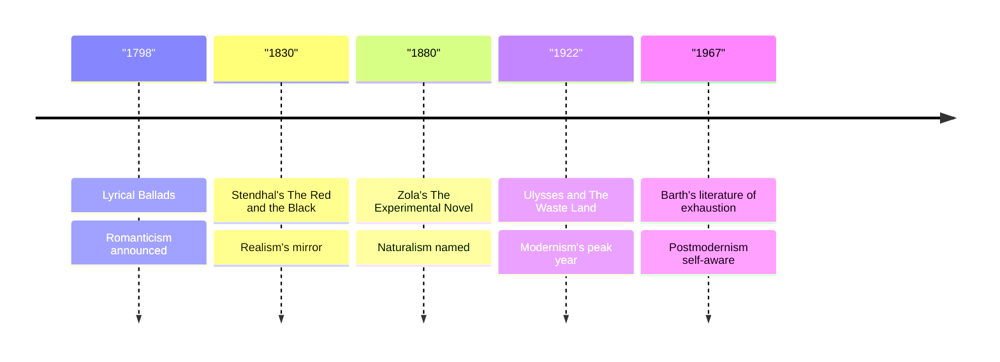

# 22 — Literary Movements Overview — แผนที่ขบวนการวรรณกรรม

> *"Poetry is the spontaneous overflow of powerful feelings: it takes its origin from emotion recollected in tranquillity." William Wordsworth, Preface to Lyrical Ballads.*

Writers do not work alone. In every generation they read each other, argue, and settle on shared bets about what literature should do; those shared bets are a literary movement (ขบวนการวรรณกรรม). This note is the map of the five great modern movements: Romanticism (จินตนิยม), Realism (สัจนิยม), Naturalism (ธรรมชาตินิยม), Modernism (สมัยใหม่นิยม), and Postmodernism (หลังสมัยใหม่นิยม). It is also the chronological spine of the whole World Literature folder: each movement below points to the notes where its works live, and a reader who follows the chain can read the vault as one long story.

---

## 1 | The Works at a Glance

| Movement | Thai | When | One-line definition |
|---|---|---|---|
| Romanticism | จินตนิยม | c. 1790-1850 | Feeling, nature, and the individual against cold reason. |
| Realism | สัจนิยม | c. 1830-1900 | Ordinary life observed closely, told without idealizing. |
| Naturalism | ธรรมชาตินิยม | c. 1870-1900 | Realism plus the claim that heredity and environment drive us. |
| Modernism | สมัยใหม่นิยม | c. 1890-1945 | The mind turned inward, and the old forms broken and rebuilt. |
| Postmodernism | หลังสมัยใหม่นิยม | c. 1945 onward | Play, irony, and doubt about grand stories; everything mixes. |

Movements overlap and quarrel; the dates are signposts, not walls. Note also what came before this map: the epics, Greek drama, Dante, Shakespeare, and the Enlightenment occupy notes 02 to 08 of this folder, and the five movements here are answers to them. The movements themselves are the story of two centuries of writers passing one question down the line: what is literature for?

## 2 | Story and Structure

The story of the movements is a relay race, each generation handing the baton to the next by disagreeing with it.

### Romanticism: the heart's counterattack

After the Enlightenment put its faith in reason, the Romantics answered with feeling. Wordsworth and Coleridge announced the program in Lyrical Ballads (1798): poetry should speak the language of ordinary people about ordinary life, charged with emotion. Goethe's young Werther (1774) had already shown the new hero: passionate, sensitive, at odds with society. Hugo, Shelley, and Keats enlarged the claim: nature, the sublime (ความงามอันน่าเกรงขาม), the solitary genius, the storm. Romanticism is where the modern cult of the individual artist begins.

### Realism: the mirror

Around 1830 the novel turned toward ordinary life without makeup. Stendhal defined the project as a mirror carried along the road; Balzac set out to catalogue all of French society; Flaubert's Madame Bovary (1857) showed a provincial dreamer punished not by fate but by facts. Dickens documented London's injustice, Tolstoy the movement of whole societies. The realist bet: truth lives in detail, and ordinary lives deserve the full apparatus of art.

### Naturalism: the laboratory

Émile Zola pushed realism further: if heredity and environment shape us, the novel should test us like an experiment. His twenty-novel Rougon-Macquart cycle follows one family's inherited flaws through mines, markets, and slums; Germinal (1885) makes a coal miners' strike a full catastrophe. Naturalism is realism with a scientific program, and its heirs are everywhere in modern documentary art.

### Modernism: the broken mirror

After the First World War, the old forms seemed to have failed along with the old certainties. The Modernists turned inward: Joyce rebuilt a whole novel from the inside of one day (Ulysses, 1922), Woolf followed thought's drift, Kafka made bureaucratic nightmares literal, and Eliot's The Waste Land (1922) fragmented poetry and reassembled it on the bones of myth. Pound's command was "Make it new". Modernism is difficult on purpose: the surface is broken to show the mind underneath.

### Postmodernism: play and doubt

After 1945, writers began to doubt the doubting: if every grand story is suspect, what is left but play? Borges turned libraries into labyrinths; Barth declared the old plots exhausted and began writing novels about novels; Eco revisited the past with irony. Postmodernism mixes high and low, borrows everything, and winks. Magical realism is its Latin American cousin, and dystopian fiction one of its darker children.

| Character | Role | One line |
|---|---|---|
| Romanticism | The heart | Feeling, nature, the rebel self; runs hot. |
| Realism | The eye | Records ordinary life exactly; no makeup. |
| Naturalism | The laboratory | Treats people as experiments of heredity and place. |
| Modernism | The mind | Breaks the sentence to show thought; hard but luminous. |
| Postmodernism | The wink | Quotes everything, believes provisionally, plays. |

## 3 | Key Passages

> "Poetry is the spontaneous overflow of powerful feelings: it takes its origin from emotion recollected in tranquillity." William Wordsworth, Preface to Lyrical Ballads, 1800.

> > (แปลอิสระ) "กวีนิพนธ์คือการไหลทะลักของความรู้สึกอันทรงพลัง ซึ่งกำเนิดจากอารมณ์ที่หวนระลึกได้ในยามสงบ"

The Romantic program in one sentence: feeling first, shaped afterward by reflection.

> "A novel is a mirror carried along a high road." Stendhal, The Red and the Black, 1830.

> > (แปลอิสระ) "นวนิยายคือกระจกที่เดินทางไปตามถนนหลวง"

Realism's founding image: the writer's job is to reflect, not to flatter.

> "We are, in a word, experimental moralists, showing by experiment in what way a passion acts in a certain social environment." Émile Zola, The Experimental Novel, 1880.

> > (แปลอิสระ) "เราคือนักศีลธรรมเชิงทดลอง ผู้แสดงให้เห็นด้วยการทดลองว่า อารมณ์หนึ่ง ๆ กระทำอย่างไรในสภาพแวดล้อมทางสังคมหนึ่ง ๆ"

Naturalism's claim at full volume: the novel as a laboratory of human behavior.

> "The postmodern reply to the modern consists of recognizing the past, since it cannot really be destroyed, because its destruction leads to silence, must be revisited: but with irony, not innocently." Umberto Eco, Postscript to The Name of the Rose, 1984.

> > (แปลอิสระ) "คำตอบของหลังสมัยใหม่ต่อสมัยใหม่คือการยอมรับอดีต เมื่อทำลายไม่ได้จริง เพราะการทำลายนำไปสู่ความเงียบ ก็ต้องหวนกลับไปเยือน แต่เยือนด้วยการประชดประชัน ไม่ใช่ด้วยความไร้เดียงสา"

The clearest definition of postmodernism, by one of its masters.

## 4 | Themes and Style

| Movement | Thai | When | What it believed | Key works in this vault |
|---|---|---|---|---|
| Romanticism | จินตนิยม | c. 1790-1850 | Deep feeling, nature, and the individual imagination are truer than cold reason. | [[09_Goethe_and_German_Literature]], [[11_French_19th_Century]], [[12_English_19th_Century]], [[19_Poetry_of_the_World]] |
| Realism | สัจนิยม | c. 1830-1900 | Ordinary life honestly observed deserves art; truth lives in detail. | [[10_Russian_Literature]], [[11_French_19th_Century]], [[12_English_19th_Century]], [[13_American_Classics]] |
| Naturalism | ธรรมชาตินิยม | c. 1870-1900 | Heredity and environment shape fate; the novel is a social laboratory. | [[10_Russian_Literature]], [[11_French_19th_Century]], [[13_American_Classics]] |
| Modernism | สมัยใหม่นิยม | c. 1890-1945 | The old forms failed; turn inward, fragment the surface, build on myth. | [[14_Modernism]], [[19_Poetry_of_the_World]] |
| Postmodernism | หลังสมัยใหม่นิยม | c. 1945 onward | Grand stories are suspect; play, irony, mixing, and second glances. | [[15_Dystopian_Fiction]], [[16_Magical_Realism_and_Latin_America]] |

Each movement has a style to match its beliefs. The Romantics write lyricism and storm; the realists write plain, patient sentences; the naturalists write documentation with nerves; the modernists break the sentence to follow thought; the postmodernists quote, mix, and wink. One habit threads through all five: each movement began as an accusation against the previous one, and ended as part of the language the next one spoke.

### The chain as a diagram

## 5 | Timeline

## 6 | Thai Terminology

| Thai | English | Notes |
|---|---|---|
| ขบวนการวรรณกรรม | literary movement | A generation of writers sharing bets about what literature should do. |
| จินตนิยม | Romanticism | Feeling, nature, the individual; c. 1790-1850. |
| สัจนิยม | Realism | The mirror on ordinary life; c. 1830-1900. |
| ธรรมชาตินิยม | Naturalism | Realism with a scientific program; c. 1870-1900. |
| สมัยใหม่นิยม | Modernism | The broken mirror, the inward turn; c. 1890-1945. |
| หลังสมัยใหม่นิยม | Postmodernism | Irony, play, and mixing; c. 1945 onward. |
| กระแส | current, trend | A movement as a wave moving through a culture. |
| การทดลอง | experiment | The naturalist and modernist laboratories. |
| วรรณกรรมสะท้อนสังคม | social-mirror literature | The realist tradition of literature as a mirror of society. |
| วรรณกรรมเพื่อชีวิต | literature for life | Thailand's own twentieth-century realist wave; a local echo of the same debates. |

## 7 | Why It Matters Today

- Read the vault as one spine: this note is the folder's reading order. Start at 01, follow the movements chronologically through the notes they point to, and the whole domain turns into one story; knowing a book's movement also tells you what it is trying to do before you open it.
- A working vocabulary for what you watch: period dramas run on Romanticism, true-crime documentaries on Naturalism, arthouse cinema on Modernism, and meta-comedies on Postmodernism; naming the mode is the first step to judging it.
- The sincerity debate: our era's argument between irony and sincerity is the postmodern question still being settled; Eco's "revisited with irony" is as good a starting point as any.
- The Thai angle: Thai literature has its own movement map, including the 1970s "literature for life" (วรรณกรรมเพื่อชีวิต) wave that echoed realism in Thai; comparing the two maps shows movements are local weather, not foreign imports.

## 8 | Further Reading

- *Beginning Theory* by Peter Barry: the friendliest short introduction to literary movements and theory, organized so a beginner can read it straight through.
- *A Little History of Literature* by John Sutherland: forty short chapters covering the whole story this folder tells.
- *Literary Theory: A Very Short Introduction* by Jonathan Culler: compact and clear on what movements and theories actually do.

## Related

- [[World Literature/00_overview|← World Literature Overview]]
- [[21_ASEAN_and_Southeast_Asian_Literature]]
- [[01_How_to_Read_Literature]]
- [[Social Studies/04 History/02_World_History_and_Civilizations|World History and Civilizations]]
