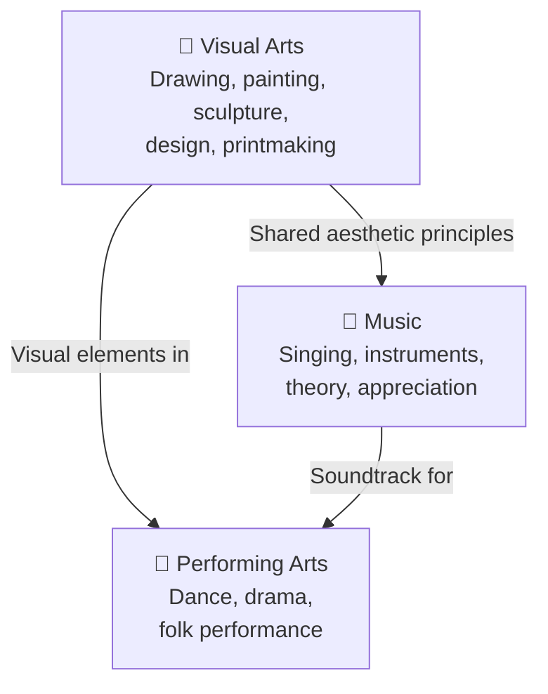

# Arts — ศิลปะ

> **Learning Area:** Arts (ศิลปะ) — Basic Education Core Curriculum B.E. 2551 (revised 2560)
> **Total Concept Areas:** ~19 | **Duration:** 12 years (ป.1–ม.6)
> **Source:** Ministry of Education

## Overview

Arts education in Thailand covers three interconnected domains: **visual arts** (ทัศนศิลป์), **music** (ดนตรี), and **performing arts** (นาฏศิลป์). Students develop creativity, aesthetic appreciation, technical skills, and cultural understanding through progressively more complex artistic experiences across all grade bands.

---

## The Three Domains

| # | Domain | Thai | Concept Areas | Focus |
|---|---|---|---|---|
| 1 | 🎨 **Visual Arts** | ทัศนศิลป์ | ~8 | Drawing, painting, sculpture, design, printmaking, art appreciation |
| 2 | 🎵 **Music** | ดนตรี | ~6 | Singing, instruments, music theory, Thai & international music |
| 3 | 💃 **Performing Arts** | นาฏศิลป์ | ~5 | Thai classical dance, folk dance, drama, creative movement |

---

## 🎨 Visual Arts (ทัศนศิลป์)

| # | Concept Area | Thai | ป.1–3 | ป.4–6 | ม.1–3 | ม.4–6 |
|---|---|---|---|---|---|---|
| 01 | [[Drawing]] | การวาดภาพ | Basic shapes, lines, coloring | Shading, perspective, observation | Figure drawing, composition | Portfolio, advanced techniques |
| 02 | [[Painting]] | การระบายสี | Primary colors, finger painting | Color mixing, watercolor | Acrylic, Thai traditional painting | Oil painting, mixed media |
| 03 | [[Sculpture]] | การปั้น | Play-dough, clay shapes | Paper mâché, simple clay | Plaster, relief sculpture | Advanced sculpture techniques |
| 04 | [[Design]] | การออกแบบ | Basic patterns | Elements & principles | Graphic design, product design | Professional design projects |
| 05 | [[Printmaking]] | ภาพพิมพ์ | Stamping, potato prints | Block printing | Screen printing basics | Advanced printmaking |
| 06 | [[Art Appreciation]] | การเห็นคุณค่าศิลปะ | Looking at pictures | Describing artworks | Art history (Thai & world) | Art criticism, gallery visits |

---

## 🎵 Music (ดนตรี)

| # | Concept Area | Thai | ป.1–3 | ป.4–6 | ม.1–3 | ม.4–6 |
|---|---|---|---|---|---|---|
| 07 | [[Singing]] | การร้องเพลง | Simple songs, nursery rhymes | Thai & international songs | Choral singing, harmony | Solo performance, vocal techniques |
| 08 | [[Music Theory]] | ทฤษฎีดนตรี | High/low, loud/soft, fast/slow | Basic notation, rhythm reading | Scales, chords, key signatures | Advanced theory, composition |
| 09 | [[Thai Musical Instruments]] | เครื่องดนตรีไทย | Recognizing sounds | Basic playing (angklung, recorder) | Ensembles (วงดนตรีไทย) | Advanced performance, preservation |
| 10 | [[International Instruments]] | เครื่องดนตรีสากล | Percussion basics | Recorder, keyboard, ukulele | Guitar, band instruments | Orchestra, ensemble performance |
| 11 | [[Music Appreciation]] | การฟังดนตรี | Listening to different music | Genres and styles | Music history, composers | Critical listening, analysis |

---

## 💃 Performing Arts (นาฏศิลป์)

| # | Concept Area | Thai | ป.1–3 | ป.4–6 | ม.1–3 | ม.4–6 |
|---|---|---|---|---|---|---|
| 12 | [[Thai Classical Dance]] | นาฏศิลป์ไทย | Simple gestures, moving to rhythm | Basic postures (รำวงมาตรฐาน) | Khon/Lakhon basics | Advanced performance |
| 13 | [[Folk Dance]] | รำพื้นเมือง | Regional dance games | Folk dance basics | Regional dance mastery | Folk dance preservation |
| 14 | [[Creative Drama]] | ละครสร้างสรรค์ | Role-play, storytelling | Simple plays, puppetry | Drama production | Directing, scriptwriting |
| 15 | [[Performance Production]] | การจัดการแสดง | Participating in shows | Stage basics | Costume, makeup, lighting | Full production management |

---

## Grade Band Progression

| Grade Band | Visual Arts | Music | Performing Arts |
|---|---|---|---|
| **ป.1–3** | Explore colors, shapes, materials | Sing, clap rhythms, recognize sounds | Move to music, simple role-play |
| **ป.4–6** | Basic techniques, observation skills | Read notation, play simple instruments | Thai dance basics, creative drama |
| **ม.1–3** | Design principles, art history intro | Ensemble playing, music theory | Classical dance, drama production |
| **ม.4–6** | Portfolio, advanced techniques | Advanced performance, composition | Professional-level production |

---

## How the Three Domains Connect

---

## Key Thai Terminology

| Thai | English |
|---|---|
| ทัศนศิลป์ | Visual Arts |
| ดนตรี | Music |
| นาฏศิลป์ | Performing Arts |
| การวาดภาพ | Drawing |
| การระบายสี | Painting |
| การปั้น | Sculpture |
| เครื่องดนตรีไทย | Thai musical instruments |
| รำวงมาตรฐาน | Standard Thai dance |
| โขน / ละคร | Khon / Lakhon (Thai classical drama) |
| ศิลปะการแสดง | Performance art |

---

## Related

- [[Body of Knowledge - Overview|← Back to Body of Knowledge]]
