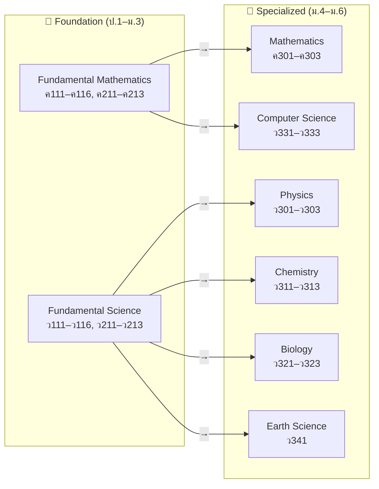
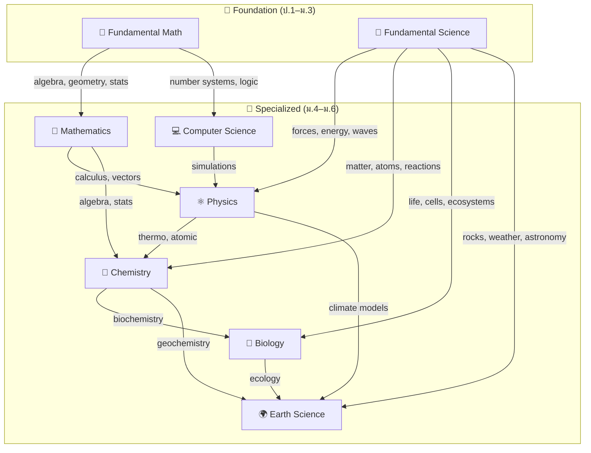

# Body of Knowledge — Overview (Math-Sci)

> **Purpose:** A curated collection of eight knowledge areas covering the full Thai math-science education journey — from ป.1 through ม.6. Two foundation areas (Fundamental Mathematics, Fundamental Science) cover the integrated ป.1–ม.3 curriculum, while six specialized areas cover the วิทย์-คณิต ม.4–ม.6 track.
>
> **Source:** IPST (สสวท.) Basic Education Core Curriculum B.E. 2551 (2008), revised 2560 (2017)
> **IPST Textbooks:** [ipst.ac.th](https://www.ipst.ac.th) — Free PDF textbooks for all subjects

## Education Levels

## The Eight Knowledge Areas

### 📗 Foundation Level (ป.1–ม.3)

| Area | Thai Name | Course Codes | Concept Areas | Focus |
|---|---|---|---|---|
| 🔢 **Fundamental Mathematics** | คณิตศาสตร์พื้นฐาน | ค111–ค116, ค211–ค213 | ~20 | Arithmetic, fractions, geometry, algebra intro, stats |
| 🔬 **Fundamental Science** | วิทยาศาสตร์พื้นฐาน | ว111–ว116, ว211–ว213 | ~22 | Integrated: life, physical, earth & space science |

**Total foundation: ~42 concept areas**

### 📘 Specialized Level (ม.4–ม.6, วิทย์-คณิต track)

| Area | Thai Name | Course Codes | Topics | Focus |
|---|---|---|---|---|
| 🔢 **Mathematics** | คณิตศาสตร์ | ค301–ค303 | ~23 | Calculus, Probability & Stats, Discrete Math, Trig, Vectors |
| ⚛️ **Physics** | ฟิสิกส์ | ว301–ว303 | ~23 | Mechanics, Thermo, Waves, Optics, E&M, Modern Physics |
| 🧪 **Chemistry** | เคมี | ว311–ว313 | ~20 | Atomic Structure, Bonding, Stoichiometry, Organic, Electrochemistry |
| 🧬 **Biology** | ชีววิทยา | ว321–ว323 | ~20 | Cell Bio, Genetics, Evolution, Ecology, Human Systems, Biotech |
| 💻 **Computer Science** | วิทยาการคำนวณ | ว331–ว333 | ~12 | Computational Thinking, Programming, Algorithms, AI |
| 🌍 **Earth Science** | วิทยาศาสตร์โลก | ว341 (elective) | ~10 | Geology, Meteorology, Astronomy, Environmental Science |

**Total specialized: ~108 topics**

**Grand total: ~150 concept areas & topics across the full ป.1–ม.6 journey**

---

## 📗 Foundation Level (ป.1–ม.3)

### Fundamental Mathematics — คณิตศาสตร์พื้นฐาน

[[Fundamental Mathematics - Overview|→ Full Overview]]

Integrated mathematics covering ป.1 through ม.3 — the numerical fluency, geometric intuition, and algebraic thinking that everything else rests on:

| Category | Concept Areas |
|---|---|
| **Numbers & Operations** | Numbers & Numeration, Arithmetic, Factors/Multiples, Integers, Fractions, Decimals, Rational Numbers, Percentages, Ratios & Proportions |
| **Algebra & Patterns** | Patterns & Algebraic Thinking, Basic Algebra |
| **Geometry & Measurement** | Shapes, Measurement, Area & Perimeter, Volume & Surface Area, Coordinate Plane |
| **Data & Chance** | Sets, Statistics & Data Handling, Probability |
| **Thinking** | Mathematical Processes & Problem Solving |

**Vault:** `Fundamental Mathematics\` — ~20 concept area files | **Course codes:** ค111–ค116 (ป.1–6), ค211–ค213 (ม.1–3)

### Fundamental Science — วิทยาศาสตร์พื้นฐาน

[[Fundamental Science - Overview|→ Full Overview]]

Integrated science covering ป.1 through ม.3 — physics, chemistry, biology, and earth science taught as one connected subject:

| Category | Concept Areas |
|---|---|
| **Process** | Scientific Method |
| **Life Science** | Living Things, Cells, Human Body Systems, Plants, Animals, Ecosystems, Heredity & Evolution |
| **Chemistry** | Matter & Properties, Atoms/Elements/Compounds, Chemical Reactions, Acids/Bases/Salts |
| **Physics** | Forces & Motion, Energy, Heat & Temperature, Light, Sound, Electricity & Magnetism |
| **Earth & Space** | Rocks/Minerals/Soil, Weather/Climate, Solar System/Astronomy, Technology/Engineering |

**Vault:** `Fundamental Science\` — ~22 concept area files | **Course codes:** ว111–ว116 (ป.1–6), ว211–ว213 (ม.1–3)

---

## 📘 Specialized Level (ม.4–ม.6)

### Mathematics — คณิตศาสตร์

[[Mathematics - Overview|→ Full Overview]]

| Year | Code | Core Topics |
|---|---|---|
| **ม.4** | ค301 | Sets, Logic, Real Numbers, Functions, Exp/Log, Trigonometry, Sequences |
| **ม.5** | ค302 | Complex Numbers, Matrices, Analytic Geometry, Vectors, Limits, Calculus, Probability |
| **ม.6** | ค303 | Probability Distributions, Statistics, Discrete Math, Proofs, Linear Programming, Diff Eq |

**Vault:** `Mathematics\` — ~23 topic files

### Physics — ฟิสิกส์

[[Physics - Overview|→ Full Overview]]

| Year | Code | Core Topics |
|---|---|---|
| **ม.4** | ว301 | Measurement, Kinematics, Dynamics, Energy, Momentum, Rotation, Oscillations, Waves, Sound, Thermo |
| **ม.5** | ว302 | Electrostatics, DC Circuits, Magnetism, EM Induction, EM Waves, Optics, Wave Optics |
| **ม.6** | ว303 | Special Relativity, Quantum Physics, Atomic Physics, Nuclear Physics, Particle Physics, Astrophysics |

**Vault:** `Physics\` — ~23 topic files

### Chemistry — เคมี

[[Chemistry - Overview|→ Full Overview]]

| Year | Code | Core Topics |
|---|---|---|
| **ม.4** | ว311 | Atomic Structure, Periodic Table, Bonding, IMFs, Stoichiometry, Solutions, Gases |
| **ม.5** | ว312 | Acids & Bases, Equilibrium, Ionic Equilibrium, Thermochemistry, Kinetics, Electrochemistry |
| **ม.6** | ว313 | Organic Chemistry, Polymers, Biochemistry, Qualitative Analysis, Industrial Chemistry |

**Vault:** `Chemistry\` — ~20 topic files

### Biology — ชีววิทยา

[[Biology - Overview|→ Full Overview]]

| Year | Code | Core Topics |
|---|---|---|
| **ม.4** | ว321 | Cell Biology, Membrane Transport, Biomolecules, Cell Energy, Cell Division, Molecular Bio, Genetics |
| **ม.5** | ว322 | Evolution, Diversity, Microbiology, Plant Bio, Animal Bio, Human Body Systems |
| **ม.6** | ว323 | Immune System, Reproduction, Ecology, Environmental Science, Biotechnology, Bioethics |

**Vault:** `Biology\` — ~20 topic files

### Computer Science — วิทยาการคำนวณ

[[Computer Science - Overview|→ Full Overview]]

| Year | Code | Core Topics |
|---|---|---|
| **ม.4** | ว331 | Computational Thinking, Data Representation, Boolean Logic, Programming |
| **ม.5** | ว332 | Functions, Algorithms, Data Structures, OOP |
| **ม.6** | ว333 | Computer Systems, Networks, Databases, AI, Digital Citizenship |

**Vault:** `Computer Science\` — ~12 topic files

### Earth Science — วิทยาศาสตร์โลก

[[Earth Science - Overview|→ Full Overview]]

| Category | Topics |
|---|---|
| **Geosphere** | Minerals/Rocks, Plate Tectonics, Earthquakes/Volcanoes, Weathering/Erosion, Earth History |
| **Atmosphere & Hydrosphere** | Weather/Climate, Oceanography, Water Cycle |
| **Astronomy & Environment** | Solar System, Climate Change |

**Vault:** `Earth Science\` — ~10 topic files

---

## How All Eight Areas Connect

## Reading Paths

- **Complete journey (ป.1→ม.6):** Foundation Math → Foundation Science → then specialized subjects
- **Engineering track:** Fundamental Math → Mathematics → Physics → Computer Science
- **Medicine track:** Fundamental Science → Biology → Chemistry → Mathematics (Stats)
- **Science research:** Fundamental Math + Science → Mathematics → Physics → Chemistry → Biology
- **Tech/CS track:** Fundamental Math → Mathematics → Computer Science → Physics

## Curriculum Notes

- **Foundation level (ป.1–ม.3):** Science is **integrated** (not split into physics/chemistry/biology). Math covers arithmetic through intro algebra.
- **Specialized level (ม.4–ม.6):** Science **splits** into Physics, Chemistry, Biology, Earth Science. Math advances to calculus and beyond.
- **Course codes**: "ค" = Mathematics, "ว" = Science. 1xx = primary, 2xx = lower secondary, 3xx = upper secondary.
- **IPST** (สสวท.) develops textbooks and curriculum standards for all subjects.
- **Free textbooks:** [ipst.ac.th](https://www.ipst.ac.th)

## Related

- [[English Skill\English Skill Content|English Skill]] — English language foundation for Thai learners
