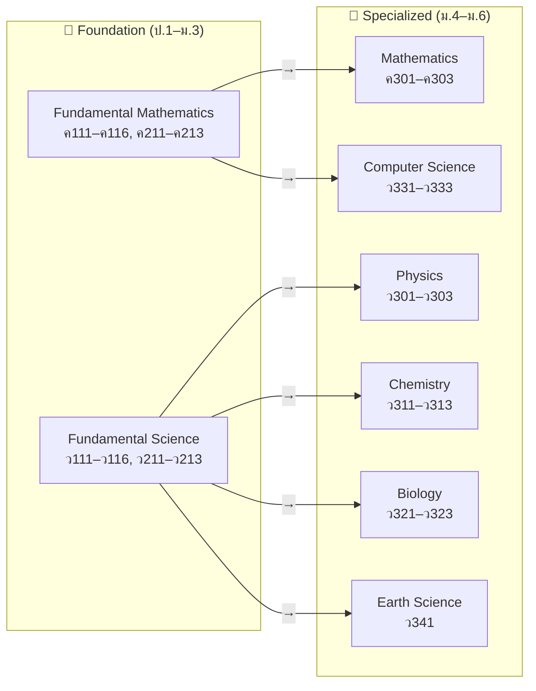
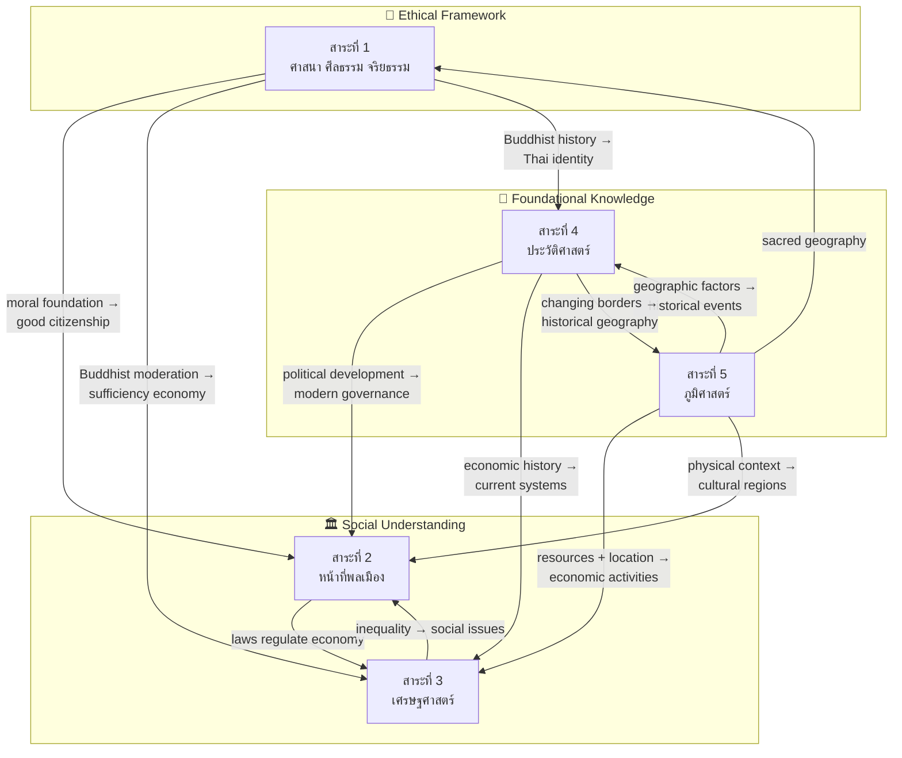
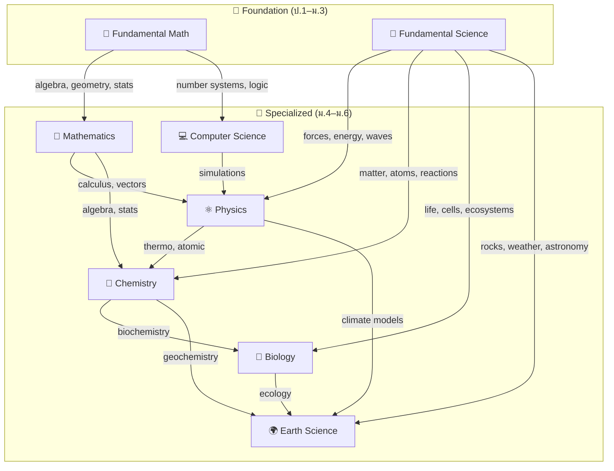

# Body of Knowledge — Overview

> **Purpose:** A curated collection covering all 8 learning areas of the Thai basic education curriculum:
> - **Mathematics (คณิตศาสตร์):** 2 areas (fundamental + advanced) from ป.1 through ม.6
> - **Science (วิทยาศาสตร์):** 6 areas (fundamental + 5 specialized) from ป.1 through ม.6
> - **Thai Language (ภาษาไทย):** 5 learning strands from ป.1 through ม.6
> - **English (ภาษาอังกฤษ):** 4 learning strands from ป.1 through ม.6
> - **Social Studies (สังคมศึกษา):** 5 learning strands from ป.1 through ม.6
> - **Arts (ศิลปะ):** 3 domains from ป.1 through ม.6
> - **Health & PE (สุขศึกษาและพลศึกษา):** 2 strands from ป.1 through ม.6
> - **Career & Technology (การงานอาชีพ):** 5 strands from ป.1 through ม.6
>
> **Learner Development Activities (กิจกรรมพัฒนาผู้เรียน):** A separate curriculum component with Guidance and Counseling, Student Activities (including Scouts/Girl Guides), and Social and Public Benefit Activities from ป.1 through ม.6
>
> **Source:** Basic Education Core Curriculum B.E. 2551 (2008), revised 2560 (2017)
> **IPST Textbooks:** [ipst.ac.th](https://www.ipst.ac.th) — Free PDF math-sci textbooks

---

## 📗 ภาษาไทย (Thai Language)

[[Thai Language - Overview|→ Full Overview]]

The Thai language curriculum organized into **5 learning strands (สาระการเรียนรู้)**:

| สาระ | Strand | หัวข้อ | Focus |
|---|---|---|---|
| 📖 **สาระที่ ๑** | การอ่าน (Reading) | ~15 | การอ่านออกเสียง อ่านจับใจความ อ่านวิเคราะห์ |
| ✍️ **สาระที่ ๒** | การเขียน (Writing) | ~15 | คัดลายมือ เขียนสื่อสาร เขียนเรียงความ |
| 🗣️ **สาระที่ ๓** | การฟัง การดู และการพูด | ~10 | การฟังอย่างมีวิจารณญาณ การพูดในโอกาสต่างๆ |
| 📚 **สาระที่ ๔** | หลักการใช้ภาษาไทย | ~20 | ชนิดของคำ การสร้างคำ ระดับภาษา ฉันทลักษณ์ |
| 📜 **สาระที่ ๕** | วรรณคดีและวรรณกรรม | ~15 | วรรณคดีไทยสมัยต่างๆ การวิเคราะห์วรรณกรรม |

**Total: ~75 concept areas** | **Vault:** `Thai\`

---

## 🌏 ภาษาอังกฤษ (English)

[[English - Overview|→ Full Overview]]

The English curriculum organized into **4 learning strands (สาระการเรียนรู้)**:

| สาระ | Strand | หัวข้อ | Focus |
|---|---|---|---|
| 🗣️ **สาระที่ ๑** | ภาษาเพื่อการสื่อสาร | ~12 | ฟัง พูด อ่าน เขียน ไวยากรณ์ คำศัพท์ |
| 🎭 **สาระที่ ๒** | ภาษาและวัฒนธรรม | ~6 | วัฒนธรรมเจ้าของภาษา มารยาทสังคม |
| 🔗 **สาระที่ ๓** | ภาษากับกลุ่มสาระอื่น | ~4 | เชื่อมโยงคณิต วิทย์ สังคม ผ่านภาษาอังกฤษ |
| 🌏 **สาระที่ ๔** | ภาษากับชุมชนและโลก | ~6 | อาชีพ อาเซียน สื่อออนไลน์ การสอบ |

**Total: ~28 concept areas** | **Vault:** `English\`**
**Supplementary:** [[English Skill Content|English Skill]] — teaching-ordered grammar/skills reference

---

## 🏛️ สังคมศึกษา ศาสนา และวัฒนธรรม (Social Studies, Religion, and Culture)

[[Social Studies - Overview|→ Full Overview]]

The Social Studies curriculum organized into **5 learning strands (สาระการเรียนรู้)**, compulsory for all students ป.1–ม.6:

| # | Strand (สาระ) | English | Concept Areas | Core Focus |
|---|---|---|---|---|
| 🛐 **สาระที่ 1** | ศาสนา ศีลธรรม จริยธรรม | Religion, Morality, Ethics | ~18 | Buddhism (doctrine, meditation, ceremonies), other religions (Islam, Christianity, Hinduism, Sikhism), moral reasoning, interfaith tolerance |
| 🏛️ **สาระที่ 2** | หน้าที่พลเมือง วัฒนธรรม และการดำเนินชีวิตในสังคม | Civics, Culture, and Living in Society | ~22 | Democracy under constitutional monarchy, rights/duties, criminal/civil/constitutional law, Thai culture (4 regions), social institutions, ASEAN studies, human rights |
| 💰 **สาระที่ 3** | เศรษฐศาสตร์ | Economics | ~16 | Scarcity/choice, supply/demand, sufficiency economy (King Bhumibol's philosophy), personal finance, money/banking, international trade, economic systems |
| 📜 **สาระที่ 4** | ประวัติศาสตร์ | History | ~20 | Historical method, Thai history periods (Sukhothai, Ayutthaya, Thonburi, Rattanakosin), important monarchs, world civilizations, Southeast Asian history |
| 🌏 **สาระที่ 5** | ภูมิศาสตร์ | Geography | ~18 | Maps/GIS/remote sensing, physical geography (landforms, climate), human geography (population, settlement, economy), environment, Thailand's 6 regions, natural disasters |

**Total: ~94 concept areas across 5 strands** | **Vault:** `Social Studies\\`

---

## 🧭 Learner Development Activities (กิจกรรมพัฒนาผู้เรียน)

[[Student Development Activities - Overview|→ Full Overview]]

Learner Development Activities are a **separate required curriculum component**, not a ninth academic learning area. They support whole-person development through three forms:

| # | Form | Thai | Focus |
|---|---|---|---|
| 01 | Guidance and Counseling | กิจกรรมแนะแนว | Education, career, personal, social development, and life skills |
| 02 | Student Activities | กิจกรรมนักเรียน | Scouts/Girl Guides, Red Cross Youth, clubs, leadership, participation |
| 03 | Social and Public Benefit | กิจกรรมเพื่อสังคมและสาธารณประโยชน์ | Service, responsibility, community and environmental contribution |

**Scope:** ป.1–ม.6 | **Implementation:** The three forms are national framework components; exact hours and activities vary by school.

---

## The Knowledge Areas

### 📗 Foundation Level (ป.1–ม.3)

| Area | Thai Name | Course Codes | Concept Areas | Focus |
|---|---|---|---|---|
| 🔢 **Fundamental Mathematics** | คณิตศาสตร์พื้นฐาน | ค111–ค116, ค211–ค213 | ~20 | Arithmetic, fractions, geometry, algebra intro, stats |
| 🔬 **Fundamental Science** | วิทยาศาสตร์พื้นฐาน | ว111–ว116, ว211–ว213 | ~22 | Integrated: life, physical, earth & space science |

**Total foundation (math-sci): ~42 concept areas**

### 📘 Specialized Level (ม.4–ม.6, วิทย์-คณิต track)

| Area | Thai Name | Course Codes | Topics | Focus |
|---|---|---|---|---|
| 🔢 **Mathematics** | คณิตศาสตร์ | ค301–ค303 | ~23 | Calculus, Probability & Stats, Discrete Math, Trig, Vectors |
| ⚛️ **Physics** | ฟิสิกส์ | ว301–ว303 | ~23 | Mechanics, Thermo, Waves, Optics, E&M, Modern Physics |
| 🧪 **Chemistry** | เคมี | ว311–ว313 | ~20 | Atomic Structure, Bonding, Stoichiometry, Organic, Electrochemistry |
| 🧬 **Biology** | ชีววิทยา | ว321–ว323 | ~20 | Cell Bio, Genetics, Evolution, Ecology, Human Systems, Biotech |
| 💻 **Computer Science** | วิทยาการคำนวณ | ว331–ว333 | ~12 | Computational Thinking, Programming, Algorithms, AI |
| 🌍 **Earth Science** | วิทยาศาสตร์โลก | ว341 (elective) | ~10 | Geology, Meteorology, Astronomy, Environmental Science |

**Total specialized (math-sci): ~108 topics**

**Grand total: ~150 math-sci concept areas + ~169 language and social studies concept areas across the full ป.1–ม.6 journey**

---

## 🏛️ สังคมศึกษา ศาสนา และวัฒนธรรม (Social Studies) — Connection Map

**Key:** Social Studies strands form an integrated whole. Geography and History provide the **physical and temporal context** for understanding society. Economics and Civics build **social understanding** on that foundation. Religion provides the **ethical framework** that guides civic behavior, economic choices, and shapes Thai historical identity.

---

## 📗 Foundation Level (ป.1–ม.3)

### Fundamental Mathematics — คณิตศาสตร์พื้นฐาน

[[00_Fundamental Mathematics - Overview|→ Full Overview]]

Integrated mathematics covering ป.1 through ม.3 — the numerical fluency, geometric intuition, and algebraic thinking that everything else rests on:

| Category | Concept Areas |
|---|---|
| **Numbers & Operations** | Numbers & Numeration, Arithmetic, Factors/Multiples, Integers, Fractions, Decimals, Rational Numbers, Percentages, Ratios & Proportions |
| **Algebra & Patterns** | Patterns & Algebraic Thinking, Basic Algebra |
| **Geometry & Measurement** | Shapes, Measurement, Area & Perimeter, Volume & Surface Area, Coordinate Plane |
| **Data & Chance** | Sets, Statistics & Data Handling, Probability |
| **Thinking** | Mathematical Processes & Problem Solving |

**Vault:** `Fundamental Mathematics\` — ~20 concept area files | **Course codes:** ค111–ค116 (ป.1–6), ค211–ค213 (ม.1–3)

### Fundamental Science — วิทยาศาสตร์พื้นฐาน

[[00_Fundamental Science - Overview|→ Full Overview]]

Integrated science covering ป.1 through ม.3 — physics, chemistry, biology, and earth science taught as one connected subject:

| Category | Concept Areas |
|---|---|
| **Process** | Scientific Method |
| **Life Science** | Living Things, Cells, Human Body Systems, Plants, Animals, Ecosystems, Heredity & Evolution |
| **Chemistry** | Matter & Properties, Atoms/Elements/Compounds, Chemical Reactions, Acids/Bases/Salts |
| **Physics** | Forces & Motion, Energy, Heat & Temperature, Light, Sound, Electricity & Magnetism |
| **Earth & Space** | Rocks/Minerals/Soil, Weather/Climate, Solar System/Astronomy, Technology/Engineering |

**Vault:** `Fundamental Science\` — ~22 concept area files | **Course codes:** ว111–ว116 (ป.1–6), ว211–ว213 (ม.1–3)

---

## 📘 Specialized Level (ม.4–ม.6)

### Mathematics — คณิตศาสตร์

[[01_Advance Mathematics (Sci-Math) - Overview|→ Full Overview]]

| Year | Code | Core Topics |
|---|---|---|
| **ม.4** | ค301 | Sets, Logic, Real Numbers, Functions, Exp/Log, Trigonometry, Sequences |
| **ม.5** | ค302 | Complex Numbers, Matrices, Analytic Geometry, Vectors, Limits, Calculus, Probability |
| **ม.6** | ค303 | Probability Distributions, Statistics, Discrete Math, Proofs, Linear Programming, Diff Eq |

**Vault:** `Mathematics\` — ~23 topic files

### Physics — ฟิสิกส์

[[01_Physics - Overview|→ Full Overview]]

| Year | Code | Core Topics |
|---|---|---|
| **ม.4** | ว301 | Measurement, Kinematics, Dynamics, Energy, Momentum, Rotation, Oscillations, Waves, Sound, Thermo |
| **ม.5** | ว302 | Electrostatics, DC Circuits, Magnetism, EM Induction, EM Waves, Optics, Wave Optics |
| **ม.6** | ว303 | Special Relativity, Quantum Physics, Atomic Physics, Nuclear Physics, Particle Physics, Astrophysics |

**Vault:** `Physics\` — ~23 topic files

### Chemistry — เคมี

[[02_Chemistry - Overview|→ Full Overview]]

| Year | Code | Core Topics |
|---|---|---|
| **ม.4** | ว311 | Atomic Structure, Periodic Table, Bonding, IMFs, Stoichiometry, Solutions, Gases |
| **ม.5** | ว312 | Acids & Bases, Equilibrium, Ionic Equilibrium, Thermochemistry, Kinetics, Electrochemistry |
| **ม.6** | ว313 | Organic Chemistry, Polymers, Biochemistry, Qualitative Analysis, Industrial Chemistry |

**Vault:** `Chemistry\` — ~20 topic files

### Biology — ชีววิทยา

[[03_Biology - Overview|→ Full Overview]]

| Year | Code | Core Topics |
|---|---|---|
| **ม.4** | ว321 | Cell Biology, Membrane Transport, Biomolecules, Cell Energy, Cell Division, Molecular Bio, Genetics |
| **ม.5** | ว322 | Evolution, Diversity, Microbiology, Plant Bio, Animal Bio, Human Body Systems |
| **ม.6** | ว323 | Immune System, Reproduction, Ecology, Environmental Science, Biotechnology, Bioethics |

**Vault:** `Biology\` — ~20 topic files

### Computer Science — วิทยาการคำนวณ

[[05_Computer Science - Overview|→ Full Overview]]

| Year | Code | Core Topics |
|---|---|---|
| **ม.4** | ว331 | Computational Thinking, Data Representation, Boolean Logic, Programming |
| **ม.5** | ว332 | Functions, Algorithms, Data Structures, OOP |
| **ม.6** | ว333 | Computer Systems, Networks, Databases, AI, Digital Citizenship |

**Vault:** `Computer Science\` — ~12 topic files

### Earth Science — วิทยาศาสตร์โลก

[[04_Earth Science - Overview|→ Full Overview]]

| Category | Topics |
|---|---|
| **Geosphere** | Minerals/Rocks, Plate Tectonics, Earthquakes/Volcanoes, Weathering/Erosion, Earth History |
| **Atmosphere & Hydrosphere** | Weather/Climate, Oceanography, Water Cycle |
| **Astronomy & Environment** | Solar System, Climate Change |

**Vault:** `Earth Science\` — ~10 topic files

---

## How All Areas Connect

### Math-Science Connection

### Thai Language Connection

Thai language skills underpin learning in ALL subjects — students read textbooks, write answers, listen to teachers, and discuss ideas in Thai. The 5 strands interconnect:

- **สาระที่ 4 (Language Principles)** → foundation for all other strands
- **สาระที่ 1 and 3 (Reading + Listening/Viewing)** → receptive skills, develop in parallel
- **สาระที่ 2 and 3 (Writing + Speaking)** → productive skills
- **สาระที่ 5 (Literature)** → capstone integrating all four strands

## Reading Paths

### Math-Science (วิทย์-คณิต)
- **Complete journey (ป.1→ม.6):** Foundation Math → Foundation Science → then specialized subjects
- **Engineering track:** Fundamental Math → Mathematics → Physics → Computer Science
- **Medicine track:** Fundamental Science → Biology → Chemistry → Mathematics (Stats)
- **Science research:** Fundamental Math + Science → Mathematics → Physics → Chemistry → Biology
- **Tech/CS track:** Fundamental Math → Mathematics → Computer Science → Physics

### Thai Language (ภาษาไทย)
- **Full sequence (ป.1→ม.6):** All 5 strands in spiral progression — same skills, deepening complexity
- **Primary focus (ป.1–6):** สาระ 4 (พื้นฐานภาษา) → สาระ 1 (การอ่าน) → สาระ 2 (การเขียน) → สาระ 3 (การฟัง/พูด) → สาระ 5 (วรรณคดีพื้นฐาน)
- **Secondary focus (ม.1–6):** สาระ 4 (หลักภาษา) → สาระ 5 (วรรณคดี) → สาระ 1 (การอ่านวิเคราะห์) → สาระ 2 (การเขียนเชิงวิชาการ) → สาระ 3 (การพูดและการอภิปราย)
- **Language analysis track:** สาระ 4 → สาระ 1 (วิเคราะห์/วิจารณ์) → สาระ 5 (วรรณกรรมวิจารณ์)
- **Creative writing track:** สาระ 5 (literary models) → สาระ 2 (creative writing) → สาระ 4 (poetic forms/ฉันทลักษณ์)

### Social Studies (สังคมศึกษา)
- **Full sequence (ป.1→ม.6):** All 5 strands in spiral progression — each strand deepens across 4 grade bands
- **Law/Political Science track:** Civics (02) → History (04) → Religion (01) for moral foundations of law
- **Economics/Business track:** Economics (03) → Geography (05) for economic geography → Civics (02) for business law
- **History/Archaeology track:** History (04) → Religion (01) for Buddhist art → Geography (05) for historical geography
- **Geography/Environment track:** Geography (05) → Economics (03) for development → Civics (02) for environmental policy
- **Teaching/Civil Service track:** All 5 strands equally — balanced knowledge required for ก.พ. exams

## Curriculum Notes

### Math-Science
- **Foundation level (ป.1–ม.3):** Science is **integrated** (not split into physics/chemistry/biology). Math covers arithmetic through intro algebra.
- **Specialized level (ม.4–ม.6):** Science **splits** into Physics, Chemistry, Biology, Earth Science. Math advances to calculus and beyond.
- **Course codes**: "ค" = Mathematics, "ว" = Science. 1xx = primary, 2xx = lower secondary, 3xx = upper secondary.
- **IPST** (สสวท.) develops textbooks and curriculum standards for math-science subjects.
- **Free textbooks:** [ipst.ac.th](https://www.ipst.ac.th)

### Thai Language
- **Compulsory for all students:** Thai is required from ป.1–ม.6 for all tracks (วิทย์-คณิต, ศิลป์-ภาษา, ศิลป์-คำนวณ, etc.)
- **Spiral curriculum:** Same 5 strands throughout, deepening in complexity each grade band
- **Course codes:** "ท" = Thai language. 1xx = primary, 2xx = lower secondary, 3xx = upper secondary
- **OBEC** (สพฐ.) develops curriculum standards; textbooks by various publishers (อักษรเจริญทัศน์, สถาบันภาษาไทย, etc.)
- **Standardized tests:** NT (ป.3), O-NET (ป.6, ม.3, ม.6), A-Level ภาษาไทย (ม.6 university entrance)

### Social Studies
- **Compulsory for all students:** Social Studies is required from ป.1–ม.6 for all tracks (วิทย์-คณิต, ศิลป์-ภาษา, ศิลป์-คำนวณ, etc.)
- **Spiral curriculum:** All 5 strands taught every year, deepening in complexity across 4 grade bands (ป.1–3, ป.4–6, ม.1–3, ม.4–6)
- **Course codes:** "ส" = Social Studies. 1xx = primary, 2xx = lower secondary, 3xx = upper secondary. ส11101–ส16101 (ป.1–6), ส21101–ส23102 (ม.1–3), ส31101–ส33102 (ม.4–6)
- **OBEC** (สพฐ.) develops curriculum standards; textbooks by various publishers (อักษรเจริญทัศน์, พ.ศ.พัฒนา, สกสค., etc.)
- **Standardized tests:** NT (ป.3), O-NET (ป.6, ม.3, ม.6 — covers all 5 strands), A-Level สังคมศึกษา (ม.6 university entrance), ก.พ. (civil service exam)
- **Unique emphasis:** Sufficiency Economy Philosophy (ปรัชญาเศรษฐกิจพอเพียง) of King Bhumibol is integrated throughout the Economics strand and connects to Buddhist principles in the Religion strand

## Related

- [[Social Studies - Overview|Social Studies]] — Full Social Studies BOK with all 5 strands
- [[Thai Language - Overview|Thai Language]] — Full Thai language BOK with all 5 strands
- [[English Skill\\English Skill Content|English Skill]] — English language foundation for Thai learners
