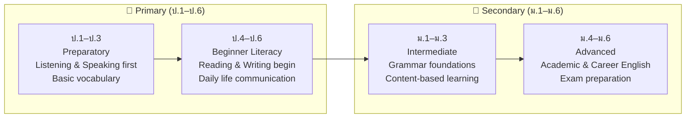
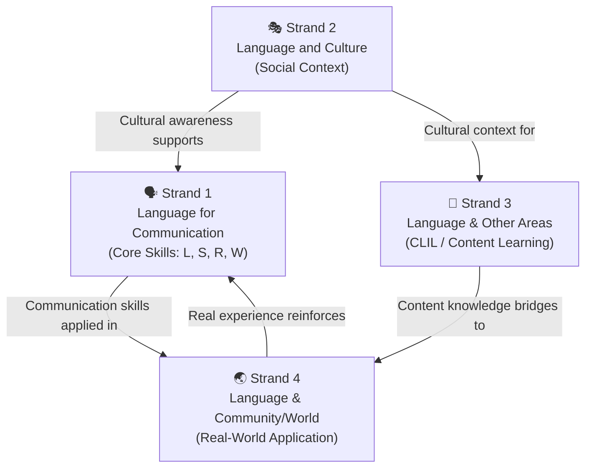

# English — Body of Knowledge

> **Purpose:** A comprehensive map of the English subject curriculum for Thai students from Prathom 1 to Matthayom 6, organized by the 4 official learning strands of the Basic Education Core Curriculum B.E. 2551 (revised 2560).
>
> **Source:** Ministry of Education, Basic Education Core Curriculum B.E. 2551
>
> **Supplementary Notes:** [[English Skill Content|English Skill]] — a practical teaching reference organized by skill level (grammar → skills → exams), not by curriculum strand

## The 4 Learning Strands

The English curriculum is built around **4 strands (สาระการเรียนรู้)** that develop learners from basic communication to real-world application:

| Strand | Name | Topics | Focus |
|---|---|---|---|
| 1 | 🗣️ **Language for Communication** | ~12 | Listening, Speaking, Reading, Writing, Grammar, Vocabulary |
| 2 | 🎭 **Language and Culture** | ~6 | Native-speaker cultures, Social etiquette, Customs |
| 3 | 🔗 **Language and Other Learning Areas** | ~4 | English across math, science, social studies, arts |
| 4 | 🌏 **Language and Community & the World** | ~6 | Careers, ASEAN, online media, exams, lifelong learning |

**Total: ~28 concept areas across 12 years (ป.1–ม.6)**

---

## Grade Band Progression

| Level | Hours/Week | Emphasis | English Skill Reference |
|---|---|---|---|
| **ป.1–ป.3** | 1–2 | Listening & Speaking first, songs, games, basic vocabulary | — |
| **ป.4–ป.6** | 2–3 | Reading & Writing begin, simple conversations, vocabulary building | — |
| **ม.1–ม.3** | 3 | Grammar foundations, balanced 4 skills, content-based learning | Sections 01–08 (Grammar) |
| **ม.4–ม.6** | 3–4 | Academic English, exam prep, career English | Sections 09–15 (Academic, Exams, TOEIC) |

---

## Strand 1: Language for Communication 🗣️

> The core strand — using English to listen, speak, read, and write in various situations, from daily life to academic and professional contexts.

### Topic Areas

| Skill Group | Topics | Grade Range |
|---|---|---|
| **Listening** | Following instructions, understanding conversations, listening to news and documentaries | ป.1–ม.6 |
| **Speaking** | Greetings, self-introduction, daily conversation, presentations, expressing opinions | ป.1–ม.6 |
| **Reading** | Reading aloud, reading for main ideas, analytical reading, literature | ป.3–ม.6 |
| **Writing** | Basic sentences, paragraphs, essays, reports, creative writing | ป.4–ม.6 |
| **Grammar** | Parts of Speech, Tenses, Sentence Structure, Modals, Conditionals, Passive Voice | ม.1–ม.6 |
| **Vocabulary** | Core vocabulary, Academic Word List, idioms, collocations | ป.1–ม.6 |

### Cross-Reference to English Skill Notes

| Skill Group | English Skill Sections |
|---|---|
| **Grammar** | [[English Skill Content#01 Foundation\|01 Foundation]] — Parts of Speech, Articles, Subject-Verb Agreement, Countable/Uncountable |
| **Grammar** | [[English Skill Content#02 Tenses & Time\|02 Tenses & Time]] — 12 Tenses, Active/Passive Voice, Verb Forms |
| **Grammar** | [[English Skill Content#03 Sentence Building\|03 Sentence Building]] — Sentence Structure, Clauses, Questions, Negatives |
| **Grammar** | [[English Skill Content#04 Verbs Deep Dive\|04 Verbs Deep Dive]] — Modals, Gerunds/Infinitives, Phrasal Verbs, Causative Verbs |
| **Grammar** | [[English Skill Content#05 Conditionals & Reported Speech\|05 Conditionals]] — Conditionals, Wish/If Only, Reported Speech |
| **Grammar** | [[English Skill Content#06 Connecting Ideas\|06 Connecting Ideas]] — Conjunctions, Prepositions, Transition Words |
| **Writing** | [[English Skill Content#07 Writing & Style\|07 Writing & Style]] — Punctuation, Capitalization, Parallel Structure |
| **Reading** | [[English Skill Content#10 Reading Skills\|10 Reading Skills]] — Skimming/Scanning, Inference, Question Strategies |
| **Listening** | [[English Skill Content#11 Listening Skills\|11 Listening Skills]] — Note-Taking, Discourse Markers, Accent Recognition |
| **Speaking** | [[English Skill Content#12 Speaking Skills\|12 Speaking Skills]] — Response Organization, Fluency & Self-Correction |
| **Writing** | [[English Skill Content#13 Academic Writing\|13 Academic Writing]] — Essay Structure, IELTS Task 1, TOEFL Integrated Writing |
| **Vocabulary** | [[English Skill Content#09 Vocabulary Building\|09 Vocabulary Building]] — Academic Word List, Word Families, Collocations, Register |

---

## Strand 2: Language and Culture 🎭

> Understanding the relationship between language and the culture of native speakers — using language with appropriate social etiquette for time, place, and occasion.

### Topic Areas

| Topic | Content | Grade Range |
|---|---|---|
| **Native-Speaker Cultures** | Holidays and festivals (Christmas, Thanksgiving, Halloween), food, clothing, activities | ป.1–ม.6 |
| **Social Etiquette** | Saying thank you, apologizing, asking permission, using please/excuse me appropriately | ป.1–ม.6 |
| **Cultural Customs** | Direct vs indirect communication, small talk, personal space, eye contact norms | ม.1–ม.6 |
| **World Englishes** | British, American, Australian, Singaporean — how they differ | ม.4–ม.6 |
| **Language & Thai Culture** | Comparing Thai cultural norms with English-speaking cultures | ม.1–ม.6 |
| **Digital Etiquette** | Netiquette — email writing, social media posting, online communication norms | ม.1–ม.6 |

---

## Strand 3: Language and Other Learning Areas 🔗

> Using English as a tool to learn content from other subject areas — mathematics, science, social studies, arts, and health education.

### Topic Areas

| Subject Area | Topics | Grade Range |
|---|---|---|
| **Mathematics** | Reading numbers, math operations vocabulary, graphs and charts terminology | ป.4–ม.6 |
| **Science** | Scientific vocabulary, describing experiments, lab report language | ม.1–ม.6 |
| **Social Studies** | Geography vocabulary, history timelines, ASEAN knowledge in English | ม.1–ม.6 |
| **Arts & Music** | Describing art, music genres, colors and shapes vocabulary | ป.1–ม.6 |
| **Health Education** | Body parts, health vocabulary, sports and exercise terminology | ป.1–ม.6 |
| **Technology** | Computer vocabulary, coding basics, online communication in English | ม.1–ม.6 |

---

## Strand 4: Language and Community & the World 🌏

> Using English in real-world situations — in the community, online, for careers, and for lifelong learning. This is where classroom English meets the outside world.

### Topic Areas

| Topic | Content | Grade Range |
|---|---|---|
| **English in the Community** | Giving directions to tourists, providing local information, reading signs and announcements | ม.1–ม.6 |
| **English Online** | Searching English websites, using online dictionaries, self-study resources, language learning apps | ม.1–ม.6 |
| **English for Careers** | Resume/CV writing, job interviews, business emails, meeting vocabulary | ม.4–ม.6 |
| **English for Exams** | O-NET, A-Level English, TOEFL, IELTS, TOEIC, CU-TEP, TU-GET | ม.4–ม.6 |
| **ASEAN English** | Cross-cultural communication in ASEAN, English as a lingua franca in Southeast Asia | ม.1–ม.6 |
| **Lifelong English** | Self-study strategies, consuming English media, maintaining and improving English after school | ม.1–ม.6 |

### Cross-Reference to English Skill (Exams & Career)

| Topic | English Skill Sections |
|---|---|
| **TOEIC** | [[English Skill Content#15 TOEIC\|15 TOEIC]] — Business Vocabulary, Listening/Reading Strategies, Scoring & Study Plans |
| **IELTS** | [[English Skill Content#13 Academic Writing\|13 Academic Writing]] + [[English Skill Content#10 Reading Skills\|10 Reading]] + [[English Skill Content#11 Listening Skills\|11 Listening]] + [[English Skill Content#12 Speaking Skills\|12 Speaking]] |
| **TOEFL** | [[English Skill Content#13 Academic Writing\|13 Academic Writing]] (Integrated Writing) + Sections 10–12 |
| **Exam Strategy** | [[English Skill Content#14 Exam Strategies\|14 Exam Strategies]] — Time Management, Scoring Criteria |
| **Thai-Speaker Issues** | [[English Skill Content#08 Thai Speaker Challenges\|08 Thai Speaker Challenges]] — Common Mistakes, Pronunciation Guide, False Friends |

---

## How the 4 Strands Connect

- **Strand 1** is the engine — listening, speaking, reading, and writing are practiced every day
- **Strand 2** provides context — grammatically correct but culturally inappropriate = communication failure
- **Strand 3** connects English to other subjects — learn math in English, read science news in English
- **Strand 4** is real-world application — from giving directions to a tourist to acing a job interview in English

---

## Standardized Tests

| Test | Level | Content |
|---|---|---|
| **O-NET ป.6** | Upper Primary | Listening, Reading, Basic vocabulary and grammar |
| **O-NET ม.3** | Lower Secondary | Listening, Reading, Grammar, Vocabulary, Conversation |
| **O-NET ม.6** | Upper Secondary | Listening, Reading, Grammar, Vocabulary, Conversation |
| **A-Level English** | ม.6 (optional) | Advanced reading, writing, grammar for university admission |
| **TOEFL** | ม.4–ม.6 | Academic English — Reading, Listening, Speaking, Writing |
| **IELTS** | ม.4–ม.6 | General & Academic English — all 4 skills |
| **TOEIC** | ม.4–ม.6 | Business English — Listening & Reading |
| **CU-TEP** | ม.6+ | Chulalongkorn University Test of English Proficiency |
| **TU-GET** | ม.6+ | Thammasat University General English Test |

---

## Reading Paths

- **Absolute beginner (ป.1–ป.6):** Listening & Speaking → Basic Reading & Writing → Core vocabulary
- **Grammar track (ม.1–ม.3):** [[English Skill Content#01 Foundation\|01 Foundation]] → [[English Skill Content#02 Tenses & Time\|02 Tenses]] → [[English Skill Content#03 Sentence Building\|03 Sentence Building]] → [[English Skill Content#04 Verbs Deep Dive\|04 Verbs]]
- **Academic track (ม.4–ม.6):** Grammar review → [[English Skill Content#09 Vocabulary Building\|09 Vocabulary]] → [[English Skill Content#10 Reading Skills\|10 Reading]] → [[English Skill Content#13 Academic Writing\|13 Academic Writing]]
- **Exam prep (ม.4–ม.6):** Grammar + Vocabulary → Skills training → [[English Skill Content#14 Exam Strategies\|14 Exam Strategies]]
- **Practical track (Thai speaker):** [[English Skill Content#08 Thai Speaker Challenges\|08 Thai Speaker Challenges]] → [[English Skill Content#06 Connecting Ideas\|06 Connecting Ideas]] → [[English Skill Content#12 Speaking Skills\|12 Speaking]]

---

## Notes

- **Curriculum:** The Basic Education Core Curriculum B.E. 2551 (revised 2560) mandates English as the compulsory foreign language for all Thai students
- **English Skill notes:** Organized by teaching progression (grammar → skills → exams), not by curriculum strand — use the cross-reference tables above to navigate between the two systems
- **Key difference from Thai Language:** Thai is a first language — students are immersed in it daily. English is a foreign language — it requires deliberate environment creation and consistent exposure

## Related

- [[Body of Knowledge - Overview|← Back to Body of Knowledge]]
- [[Thai Language - Overview|Thai Language — Overview]]
- [[English Skill Content|English Skill — Supplementary Notes]]
