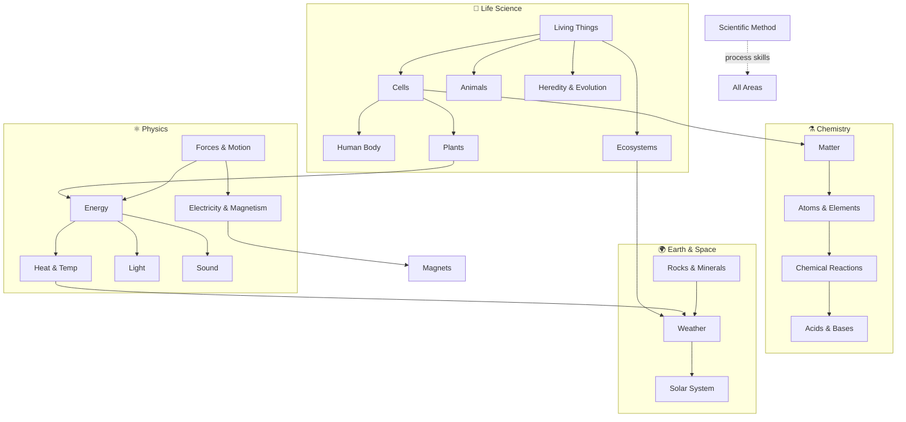

# Fundamental Science — วิทยาศาสตร์พื้นฐาน

> **Subject Area:** Integrated Science for Primary & Lower Secondary (ป.1–ม.3)
> **Course Codes:** ว111–ว116 (ป.1–ป.6), ว211–ว213 (ม.1–ม.3)
> **Total Concept Areas:** ~22 | **Duration:** 9 years
> **Source:** IPST (สสวท.) Basic Education Core Curriculum B.E. 2551 (2008), revised 2560 (2017)
> **Leads to:** [[Physics - Overview|Physics]], [[Chemistry - Overview|Chemistry]], [[Biology - Overview|Biology]], [[Earth Science - Overview|Earth Science]] — ม.4–ม.6

## What Is This?

Fundamental Science (วิทยาศาสตร์พื้นฐาน) is the **integrated** science curriculum covering ป.1 through ม.3 — the nine years before students enter the specialized วิทย์-คณิต track. Unlike ม.4–ม.6 (which splits into Physics, Chemistry, Biology, Earth Science), this level treats all sciences as one connected subject.

A single unit might explore how plants grow (biology), what soil is made of (chemistry/earth science), and how sunlight provides energy (physics) — all together. This integration reflects how the real world works: nature doesn't separate itself into textbook chapters.

The curriculum develops scientific process skills (observing, hypothesizing, experimenting, concluding) alongside content knowledge, building the scientific literacy foundation that all later specialization rests on.

## The ~22 Concept Areas

### 🔬 Process Skills
- [[01_Scientific_Method]] — Observing, questioning, classifying, measuring, inferring, predicting, hypothesizing, experimenting, variables, data analysis, scientific writing

### 🧬 Life Science
- [[02_Living_Things]] — Characteristics of life, classification (kingdoms, vertebrates/invertebrates), taxonomy (intro), binomial nomenclature, biodiversity
- [[03_Cells]] — Cell as basic unit, cell structure (membrane, nucleus, cytoplasm), plant vs animal cells, organelles, osmosis/diffusion (intro)
- [[04_Human_Body_Systems]] — Five senses, digestive, circulatory, respiratory, skeletal/muscular, nervous, excretory, endocrine, immune systems, homeostasis
- [[05_Plants]] — Parts and functions, photosynthesis, reproduction (flowers, seeds), transport, transpiration, hormones, tropisms
- [[06_Animals]] — Types (mammals, birds, reptiles, fish, amphibians, insects), habitats, life cycles, behavior, adaptation, metamorphosis
- [[07_Ecosystems]] — Habitats, food chains/webs, producers/consumers/decomposers, energy flow, biotic/abiotic factors, symbiosis, nutrient cycles, conservation
- [[08_Heredity_and_Evolution]] — Traits, genes (concept), variation, natural selection (intro), adaptation, fossils as evidence

### ⚗️ Physical Science — Chemistry
- [[09_Matter_and_Properties]] — States of matter, properties (color, shape, texture, hardness, mass, volume, density), changing states, mixtures/solutions, separating mixtures, particle theory
- [[10_Atoms_Elements_and_Compounds]] — Elements as building blocks, common elements (O, H, C, N, Fe), atomic structure (protons, neutrons, electrons), periodic table (intro), chemical formulas (intro), molecules
- [[11_Chemical_Reactions]] — Observable signs, chemical equations (intro), conservation of mass, types of reactions, rusting, combustion
- [[12_Acids_Bases_and_Salts]] — Properties, pH scale, indicators, neutralization, common acids/bases in daily life

### ⚛️ Physical Science — Physics
- [[13_Forces_and_Motion]] — Push/pull, simple machines (lever, pulley, inclined plane), gravity, friction, Newton's laws, F=ma, speed/velocity/acceleration, momentum (intro)
- [[14_Energy]] — Forms (kinetic, potential, heat, light, sound, chemical, electrical), conversion, conservation, renewable/non-renewable, efficiency, sustainable energy
- [[15_Heat_and_Temperature]] — Measuring temperature, scales (°C, °F), heat transfer (conduction, convection, radiation), expansion/contraction, conductors/insulators, specific heat (intro)
- [[16_Light]] — Sources, shadows, reflection, refraction, colors, transparent/translucent/opaque, lenses, Snell's law (intro), the eye, optical instruments
- [[17_Sound]] — Sources, vibration, pitch, volume, sound waves, frequency/amplitude, speed of sound, ultrasound
- [[18_Electricity_and_Magnetism]] — Magnets (poles, attract/repel), static electricity, simple circuits (series/parallel), conductors/insulators, Ohm's law (intro), electromagnets, generators/motors

### 🌍 Earth & Space Science
- [[19_Rocks_Minerals_and_Soil]] — Rock types (igneous, sedimentary, metamorphic), rock cycle, minerals, soil composition, weathering, erosion, plate tectonics (intro), earthquakes, volcanoes
- [[20_Weather_and_Climate]] — Weather observation, seasons, water cycle, weather instruments, cloud types, atmosphere layers, greenhouse effect, climate change, air pressure
- [[21_Solar_System_and_Astronomy]] — Sun, Moon, stars, planets, Earth's rotation/revolution, Moon phases, constellations, star life cycle (overview), galaxies, light-years
- [[22_Technology_and_Engineering]] — Tools, simple machines, engineering design process, materials science (intro), STEM applications

## Concept Area Progression

| Concept Area | ป.1–3 | ป.4–6 | ม.1–ม.3 |
|---|---|---|---|
| **Scientific Method** | Observe, question, classify, measure | Hypothesize, design experiments | Full method, variables, reports |
| **Living Things** | Characteristics, basic classification | Five kingdoms, vertebrates/invertebrates | Taxonomy, binomial nomenclature |
| **Cells** | — | Cell as unit, basic structure | Organelles, osmosis, cell division |
| **Human Body** | Body parts, five senses | Digestive, circulatory, respiratory | Excretory, endocrine, immune |
| **Plants** | Parts, basic needs | Photosynthesis, reproduction | Plant hormones, tropisms |
| **Animals** | Types, habitats, life cycles | Behavior, adaptation, metamorphosis | Body systems, evolution (intro) |
| **Ecosystems** | Habitats, simple food chains | Food webs, energy flow | Symbiosis, nutrient cycles |
| **Heredity** | — | — | Traits, natural selection, fossils |
| **Matter** | Properties, states of matter | Density, mixtures, solutions | Particle theory, chromatography |
| **Atoms & Elements** | — | Common elements, symbols | Atomic structure, periodic table |
| **Chemical Reactions** | — | Observable signs | Equations, conservation of mass |
| **Acids & Bases** | — | — | pH scale, indicators, neutralization |
| **Forces & Motion** | Push/pull, simple machines | Gravity, friction, Newton's laws (concept) | F=ma, speed/velocity/acceleration |
| **Energy** | Sources, hot/cold | Forms, conversion, conservation | Efficiency, sustainable energy |
| **Heat & Temp** | Hot/cold, thermometer | Scales, heat transfer | Specific heat, latent heat |
| **Light** | Sources, shadows | Reflection, refraction, colors | Snell's law, the eye |
| **Sound** | Loud/soft, high/low | Vibration, pitch, volume | Sound waves, frequency |
| **Electricity & Magnetism** | Magnets, static electricity | Circuits, conductors/insulators | Ohm's law, electromagnets |
| **Rocks & Minerals** | Rock types, soil | Rock cycle, minerals | Plate tectonics, earthquakes |
| **Weather & Climate** | Observation, seasons | Water cycle, instruments | Atmosphere, greenhouse effect |
| **Solar System** | Sun, Moon, stars | Planets, rotation/revolution | Galaxies, star life cycle |
| **Technology** | Tools, daily life | Simple machines, engineering design | STEM, materials science |

## How This Connects to ม.4–ม.6

The integrated science at this level **directly feeds** into the four specialized subjects:

| Fundamental Science Concept | ม.4–ม.6 Subject |
|---|---|
| Forces, Motion, Energy, Heat, Light, Sound, Electricity | [[Physics - Overview\|Physics (ว301–ว303)]] |
| Matter, Atoms, Reactions, Acids/Bases | [[Chemistry - Overview\|Chemistry (ว311–ว313)]] |
| Living Things, Cells, Human Body, Plants, Ecosystems | [[Biology - Overview\|Biology (ว321–ว323)]] |
| Rocks, Weather, Solar System, Climate | [[Earth Science - Overview\|Earth Science (ว341)]] |

## Prerequisites

- **Before ป.1:** Curiosity, basic observation skills, ability to follow instructions
- **Before ป.4:** Basic classification, measurement, understanding of living vs non-living
- **Before ม.1:** Ecosystems, basic chemistry, forces, energy concepts
- **Before ม.4 (ว301/ว311/ว321):** All 22 concept areas at ม.3 level

## How Concept Areas Connect

## Reading Paths

- **Life science track:** 02 → 03 → 04 → 05 → 06 → 07 → 08
- **Chemistry track:** 09 → 10 → 11 → 12
- **Physics track:** 13 → 14 → 15 → 16 → 17 → 18
- **Earth science track:** 19 → 20 → 21 → 22
- **Full sequence (recommended):** 01 through 22 in order

## Related

- [[Body of Knowledge - Overview|← Back to Math-Sci Overview]]
- [[Fundamental Mathematics - Overview|Fundamental Mathematics]] — Math foundation (ป.1–ม.3)
- [[Physics - Overview|Physics]] — The next level for forces, energy, waves (ว301–ว303)
- [[Chemistry - Overview|Chemistry]] — The next level for matter, atoms, reactions (ว311–ว313)
- [[Biology - Overview|Biology]] — The next level for life sciences (ว321–ว323)
- [[Earth Science - Overview|Earth Science]] — The next level for geology, astronomy (ว341)
- **IPST Textbooks:** [ipst.ac.th](https://www.ipst.ac.th) — Free PDF textbooks for all levels
