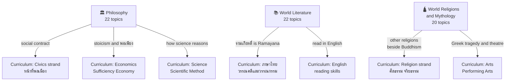

# General Knowledge — ความรู้ทั่วไป

> **Position:** Beyond-curriculum layer, separate from the 8 learning areas and Learner Development Activities
> **Audience:** Adult and family lifelong reference, exam-free
> **Total Topics:** ~62 across 3 domains (Philosophy 22, World Literature 22, World Religions and Mythology 20)
> **Language policy:** English narrative with Thai terms in parentheses by default; per-topic language is decided by the user (column in each domain overview)
> **Source:** [[more-topic-proposal-20260905|More Topics Proposal 2026-09-05]] (10 decisions locked via grill-me)

## What Is This?

The curriculum BOK answers one question: what does a Thai student learn in school, ป.1–ม.6. This layer answers the next one: **what should an educated adult know beyond the school curriculum**. It covers the humanities the Thai curriculum touches only lightly: Western and world philosophy, world literature beyond Thai classics, and world religions and mythology beyond the Buddhist-centered Religion strand.

Built for the same family the curriculum BOK serves: parents reading alongside their children now, and those children later as adults. No exams, no grade bands, no course codes: concepts, context, and sources. Each note ends where adult life begins (why it matters today).

## The Three Domains

| # | Domain | Thai | Topics | Focus | Status |
|---|---|---|---|---|---|
| 1 | 🏛️ **Philosophy** | ปรัชญา | 22 (20 core + 2 optional) | The question-asking toolkit: reality, knowledge, ethics, logic, beauty | ❌ 0/22 built |
| 2 | 📚 **World Literature** | วรรณกรรมโลก | 22 (20 core + 2 optional) | Great stories and traditions from Gilgamesh to modern world voices | ❌ 0/22 built |
| 3 | 🛕 **World Religions and Mythology** | ศาสนาโลกและเทพปกรณัม | 20 (11 religions + 9 mythology) | How humanity has believed and storied the sacred | ❌ 0/20 built |

- [[Philosophy - Overview|→ Philosophy Full Overview]]
- [[World Literature - Overview|→ World Literature Full Overview]]
- [[World Religions and Mythology - Overview|→ World Religions and Mythology Full Overview]]

## How This Layer Connects to the Curriculum

**Key:** the new layer deliberately points into the curriculum (a child studying Buddhism meets world religions; a parent reading รามเกียรติ์ meets the Ramayana). The curriculum BOK itself stays untouched: no beyond-curriculum topics are added inside it.

## Reading Paths

- **Full humanities journey:** Philosophy 01-06 → World Literature 01-13 → Religions 01-20 → Philosophy 07-22
- **Ethics and meaning track:** Philosophy 03, 05, 06, 13, 14 → Religions 01, 11 → Philosophy 22
- **Story-lover track:** Religions 12-20 (mythology) → World Literature 02, 06, 10, 16 → Philosophy 15 (existentialism)
- **Parent-child track:** World Literature 20 (children's classics) → Religions 13-18 (mythology) → Religions 01 (what is religion)
- **Civic-minded track:** Philosophy 12, 18 → World Literature 15 (dystopia) → Religions 11 (golden rule)

## Build Status (2026-09-05)

| Phase | Work | Status |
|---|---|---|
| 0 | Baseline hygiene: 20 missing notes + ~92 broken links + duplicates + N1 | ⬜ pending |
| 1 | Scaffolding: this BOK layer + book checklists in `checklist/` | ✅ BOK done (this file); checklists ⬜ pending |
| 2 | Philosophy build: 22 topic notes in `General Knowledge/01 Philosophy/` | ⬜ pending |
| 3 | World Literature build: 22 topic notes | ⬜ pending |
| 4 | World Religions and Mythology build: 20 topic notes | ⬜ pending |
| 5 | Re-audit: link checker clean, new audit doc in `Audit/` | ⬜ pending |

**Topic notes built: 0/62.** The domain overviews below are the build contracts: one numbered note per row, file names fixed, cross-links specified.

## Related

- [[Body of Knowledge - Overview|← Curriculum BOK (8 learning areas + Learner Development Activities)]]
- [[more-topic-proposal-20260905|More Topics Proposal 2026-09-05]]
