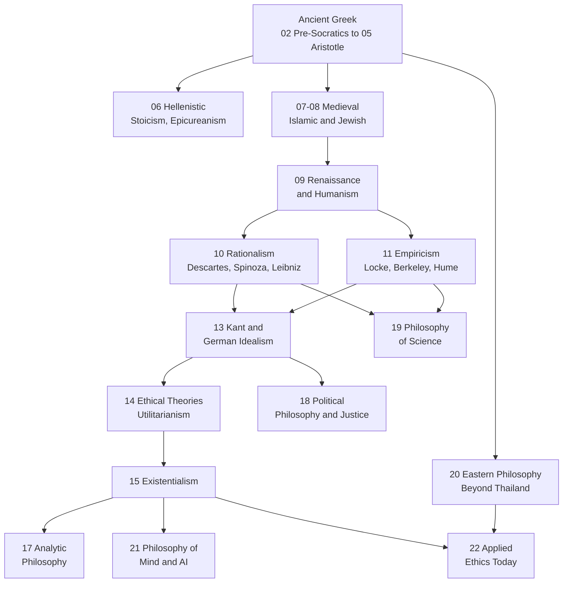

# Philosophy — ปรัชญา

> **Domain:** Philosophy for adult general knowledge (exam-free, no grade bands)
> **Total Topics:** 22 (20 core + 2 optional)
> **Content root:** `Philosophy/` in the general-knowledge vault (files numbered 01-22, plus `00_overview.md` progress tracker)
> **Language policy:** English narrative with Thai terms in parentheses (default); user overrides per topic
> **Source:** [[more-topic-proposal-20260905|More Topics Proposal 2026-09-05]]; canonical books listed below
> **Note template:** see proposal section 4 (tags `general-knowledge` + `philosophy`, concepts tables, Mermaid timeline, Thai terminology, why it matters today, further reading, cross-links)

## What Is This?

Philosophy is the toolkit for asking good questions: what is real (metaphysics, อภิปรัชญา), how we know (epistemology, ญาณวิทยา), what is right (ethics, จริยศาสตร์), what is beautiful (aesthetics, สุนทรียศาสตร์), and what reasoning is valid (logic, ตรรกศาสตร์). This domain walks the Western tradition chronologically from Thales to the present, adds the Eastern schools beyond Thai Buddhism, and ends where philosophy meets modern life: science, mind, AI, and applied ethics.

Why it matters for a Thai family: the curriculum teaches Buddhist moral reasoning in the Religion strand and Sufficiency Economy in the Economics strand. This domain puts those in a world context: Stoicism and พอเพียง are near twins; the social contract underlies the democracy the Civics strand describes; the Socratic method is the same questioning skill behind การอ่านวิเคราะห์ in ภาษาไทย; and the philosophy of science is the deep foundation of the Scientific Method note students already read.

## The 22 Topic Areas

### 🏛️ Ancient Foundations (01-06)

| # | Topic | What it covers | Language | Cross-links |
|---|---|---|---|---|
| 01 | [[01_What_Is_Philosophy]] | Branches of philosophy; how to ask good questions; philosophy vs science vs religion | EN + TH | CS [[12_Digital_Citizenship]] (thinking skills) |
| 02 | [[02_Pre_Socratic_Philosophers]] | Thales, Heraclitus, Parmenides, atomists: the first scientists | EN + TH | Science [[01_Scientific_Method]] |
| 03 | [[03_Socrates_and_the_Socratic_Method]] | Questioning as a way of life; the examined life; his trial | EN + TH | ภาษาไทย การอ่านวิเคราะห์; English Skill debate notes |
| 04 | [[04_Plato]] | Theory of Forms; The Republic; the cave; justice | EN + TH | Civics [[06_Government_Structure]] |
| 05 | [[05_Aristotle]] | Logic, virtue ethics, politics; the philosopher of science | EN + TH | Science [[01_Scientific_Method]] |
| 06 | [[06_Hellenistic_Philosophy]] | Stoicism, Epicureanism, Skepticism: philosophy as therapy | EN + TH | Economics Sufficiency Economy (Stoic parallels) |

### ⛪ Medieval and Renaissance (07-09)

| # | Topic | What it covers | Language | Cross-links |
|---|---|---|---|---|
| 07 | [[07_Medieval_Philosophy]] | Augustine, Aquinas, scholasticism: faith and reason | EN + TH | Religion strand [[01_Buddhist_Principles]] (comparative) |
| 08 | [[08_Islamic_and_Jewish_Philosophy]] | Al-Farabi, Avicenna, Averroes, Maimonides: philosophy preserved and bridged | EN + TH | Religion strand other-religions notes |
| 09 | [[09_Renaissance_and_Humanism]] | Machiavelli, Erasmus, Montaigne: the human at the center | EN + TH | History strand world civilizations |

### 🧠 The Modern Turn (10-14)

| # | Topic | What it covers | Language | Cross-links |
|---|---|---|---|---|
| 10 | [[10_Rationalism]] | Descartes, Spinoza, Leibniz: reason as foundation | EN + TH | Mathematics logic notes |
| 11 | [[11_Empiricism]] | Locke, Berkeley, Hume: experience as foundation | EN + TH | Science [[01_Scientific_Method]] |
| 12 | [[12_Enlightenment_and_Social_Contract]] | Hobbes, Locke, Rousseau, Voltaire, Montesquieu | EN + TH | Civics democracy notes |
| 13 | [[13_Kant_and_German_Idealism]] | The Copernican revolution; categorical imperative; Hegel | EN + TH | Religion strand moral reasoning |
| 14 | [[14_Utilitarianism_and_Ethical_Theories]] | Bentham, Mill; deontology vs consequentialism vs virtue ethics | EN + TH | Religion strand ethics |

### 🌍 Contemporary (15-19)

| # | Topic | What it covers | Language | Cross-links |
|---|---|---|---|---|
| 15 | [[15_Existentialism]] | Kierkegaard, Nietzsche, Sartre, Camus, Beauvoir: freedom and meaning | EN + TH | World Literature [[15_Dystopian_Fiction]] era |
| 16 | [[16_Pragmatism]] | Peirce, James, Dewey: truth as what works | EN + TH | CS computational thinking |
| 17 | [[17_Analytic_Philosophy]] | Frege, Russell, Wittgenstein, Popper: clarity and language | EN + TH | CS [[07_Data_Structures]] (logic context) |
| 18 | [[18_Political_Philosophy_and_Justice]] | Marx, Rawls, Nozick, Berlin: justice, liberty, equality | EN + TH | Economics [[10_Economic_Indicators]] |
| 19 | [[19_Philosophy_of_Science]] | Induction, falsification, Kuhn's paradigms | EN + TH | Science [[01_Scientific_Method]] |

### 🌏 Eastern and Applied (20-22)

| # | Topic | What it covers | Language | Cross-links |
|---|---|---|---|---|
| 20 | [[20_Eastern_Philosophy_Beyond_Thailand]] | Confucianism, Daoism, Zen, Vedanta, Indian logic | EN + TH | Religion strand Buddhism notes (contrast) |
| 21 | [[21_Philosophy_of_Mind_and_AI]] *(optional)* | Consciousness, Turing, the Chinese Room | EN + TH | CS AI notes |
| 22 | [[22_Applied_Ethics_Today]] *(optional)* | Bioethics, tech ethics, climate ethics, Stoic revival | EN + TH | Health-PE; work-careers-technology |

## How Topics Connect

## Reading Paths

- **Chronological journey (recommended):** 01 → 02 → 03 → 04 → 05 → 06 → 07 → 08 → 09 → 10 → 11 → 13 → 14 → 15 → 17 → 18 → 19 → 20
- **Ethics track:** 01 → 03 → 05 → 06 → 13 → 14 → 22
- **Political track:** 04 → 12 → 18, then Economics strand for the economic side
- **Science-minded track:** 02 → 05 → 10 → 11 → 19 → 17 → 21
- **Fast start (5 notes):** 01 → 03 → 06 → 14 → 15

## Key Thai Terminology

| Thai | English |
|---|---|
| ปรัชญา | Philosophy |
| อภิปรัชญา | Metaphysics |
| ญาณวิทยา | Epistemology |
| จริยศาสตร์ | Ethics |
| ตรรกศาสตร์ | Logic |
| สุนทรียศาสตร์ | Aesthetics |
| เหตุผลนิยม | Rationalism |
| ประจักษ์นิยม | Empiricism |
| อัตถิภาวนิยม | Existentialism |
| ประโยชน์นิยม | Utilitarianism |
| ปฏิบัตินิยม | Pragmatism |
| สัญญาประชาคม | Social contract |
| ปรัชญาการเมือง | Political philosophy |
| ปรัชญาวิทยาศาสตร์ | Philosophy of science |
| จิตปรัชญา | Philosophy of mind |
| สโตอิก | Stoicism |
| เอพิคิวเรียน | Epicureanism |
| ทฤษฎีแบบฟอร์ม | Theory of Forms |

## Book Recommendations

| Tier | Book | Why |
|---|---|---|
| 🔴 Essential | Sophie's World (Jostein Gaarder, 1991) | Best first book: the whole history as a story. Bridges to World Literature. Summarize first in `Book/`. |
| 🔴 Essential | A Little History of Philosophy (Nigel Warburton, 2011) | 40 short readable chapters, one per thinker: the ideal source skeleton for the notes |
| 🔴 Essential | The Story of Philosophy (Will Durant, 1926) | Classic readable survey |
| 🟡 Recommended | Meditations (Marcus Aurelius) | Primary text for 06, the practical Stoic |
| 🟡 Recommended | The Republic (Plato) | Primary text for 04 |
| 🟡 Recommended | On Liberty (J. S. Mill) | Primary text for 14 and 18 |
| 🟡 Recommended | Tao Te Ching (Laozi) | Primary text for 20 |
| 🟡 Recommended | Existentialism Is a Humanism (Sartre) | Primary text for 15 |
| 🟢 Deep dive | A History of Western Philosophy (Russell, 1945) | Reference; use selectively, it has biases |
| 🟢 Deep dive | Think (Simon Blackburn) | Modern thematic introduction |

## Progress Tracker (Build Contract)

> **Contract for the next educator:** create one note per row, exactly these file names, in `General Knowledge/01 Philosophy/`. Follow the proposal's note template (section 4). Write in the Language column's language. Add the Cross-links column's wikilinks. Mark rows ✅ Done with the created file name, then update the completion count.

| # | Topic | Status | Content File | Notes |
|---|---|---|---|---|
| 01 | What Is Philosophy | ✅ Done | `01_What_Is_Philosophy.md` | Open with the branch map; adult relevance: spotting bad arguments in daily media |
| 02 | Pre-Socratic Philosophers | ✅ Done | `02_Pre_Socratic_Philosophers.md` | Timeline from Thales to the atomists; link to Scientific Method note |
| 03 | Socrates and the Socratic Method | ✅ Done | `03_Socrates_and_the_Socratic_Method.md` | Worked example of the method; the trial as context |
| 04 | Plato | ✅ Done | `04_Plato.md` | The cave explained with a modern example; The Republic summary |
| 05 | Aristotle | ✅ Done | `05_Aristotle.md` | Golden mean table; his science legacy and later corrections |
| 06 | Hellenistic Philosophy | ✅ Done | `06_Hellenistic_Philosophy.md` | Highlight Stoicism and พอเพียง parallels (user's favorite bridge) |
| 07 | Medieval Philosophy | ✅ Done | `07_Medieval_Philosophy.md` | Faith vs reason; Aquinas' five ways listed neutrally |
| 08 | Islamic and Jewish Philosophy | ✅ Done | `08_Islamic_and_Jewish_Philosophy.md` | Preservation story: Greek thought through Baghdad and Córdoba |
| 09 | Renaissance and Humanism | ✅ Done | `09_Renaissance_and_Humanism.md` | The Prince as political realism, not villainy |
| 10 | Rationalism | ✅ Done | `10_Rationalism.md` | Cogito ergo sum; Spinoza's ethics; Leibniz' monads |
| 11 | Empiricism | ✅ Done | `11_Empiricism.md` | Hume's fork and the problem of induction |
| 12 | Enlightenment and Social Contract | ✅ Done | `12_Enlightenment_and_Social_Contract.md` | Three contract versions compared; link to Thai democracy civics |
| 13 | Kant and German Idealism | ✅ Done | `13_Kant_and_German_Idealism.md` | Categorical imperative with a worked everyday case |
| 14 | Utilitarianism and Ethical Theories | ✅ Done | `14_Utilitarianism_and_Ethical_Theories.md` | The three families compared in one table; trolley problem variants |
| 15 | Existentialism | ✅ Done | `15_Existentialism.md` | Existence precedes essence; Camus' Sisyphus |
| 16 | Pragmatism | ✅ Done | `16_Pragmatism.md` | What pragmatism means for learning and testing ideas |
| 17 | Analytic Philosophy | ✅ Done | `17_Analytic_Philosophy.md` | Language games and clarity; why it matters in the AI era |
| 18 | Political Philosophy and Justice | ✅ Done | `18_Political_Philosophy_and_Justice.md` | Rawls' veil of ignorance; liberty vs equality trade-off |
| 19 | Philosophy of Science | ✅ Done | `19_Philosophy_of_Science.md` | Falsification and paradigms; why science revises itself |
| 20 | Eastern Philosophy Beyond Thailand | ✅ Done | `20_Eastern_Philosophy_Beyond_Thailand.md` | Confucian ren, Daoist wu-wei, Zen; contrast table with Buddhism |
| 21 | Philosophy of Mind and AI | ✅ Done | `21_Philosophy_of_Mind_and_AI.md` | Optional; consciousness debates; what AI does and does not think |
| 22 | Applied Ethics Today | ✅ Done | `22_Applied_Ethics_Today.md` | Optional; bioethics, tech ethics, climate ethics, Stoic revival |

**Completion: 22/22 (100%)**

## Related

- [[General Knowledge - Overview|← General Knowledge BOK]]
- [[World Literature - Overview|World Literature]] (Sartre, Camus, Dostoevsky as philosophical fiction)
- [[World Religions and Mythology - Overview|World Religions and Mythology]] (faith and reason meet in 07-08)
- [[Social Studies - Overview|Social Studies]] (Religion, Civics, Economics strands)
- [[Thai Language - Overview|Thai Language]] (การอ่านวิเคราะห์ as Socratic reading)
- [[more-topic-proposal-20260905|More Topics Proposal 2026-09-05]]
