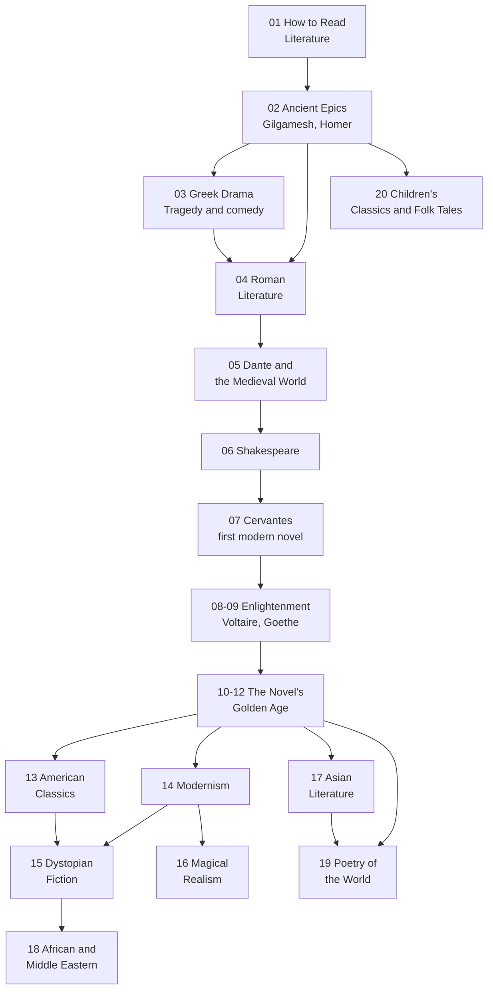

# World Literature — วรรณกรรมโลก

> **Domain:** World literature for adult general knowledge (exam-free, no grade bands)
> **Total Topics:** 22 (20 core + 2 optional)
> **Content root:** `General Knowledge/02 World Literature/` (files numbered 01-22)
> **Language policy:** English narrative with Thai terms in parentheses (default); user overrides per topic. Quotes from works may keep original language with translation
> **Source:** [[more-topic-proposal-20260905|More Topics Proposal 2026-09-05]]; the works themselves in translation
> **Note template:** see proposal section 4 (tags `general-knowledge` + `world-literature`, concepts tables, Mermaid timeline, Thai terminology, why it matters today, further reading, cross-links)

## What Is This?

World literature is the library of stories humanity has told itself: epics, tragedies, novels, and poems from Gilgamesh to today's global voices. This domain reads the canon the Thai curriculum only samples (Thai classics live in ภาษาไทย/วรรณคดี and are not duplicated here), teaching how to read a great work: plot, character, theme, and style, then what each work says about the society that produced it.

Why it matters for a Thai family: the vault's Thai literature notes already teach literary analysis. This domain applies the same toolkit to world classics, and opens the vault's most valuable single bridge: **รามเกียรติ์ is the Thai Ramayana**, the same epic India told first. Parents and children who know Thai classics can step into world literature through the door they already hold open.

## The 22 Topic Areas

### 📖 How to Read (01)

| # | Topic | What it covers | Language | Cross-links |
|---|---|---|---|---|
| 01 | [[01_How_to_Read_Literature]] | Plot, character, theme, style; the reading toolkit; why stories matter | EN + TH | ภาษาไทย การวิเคราะห์วรรณคดี notes |

### 🏺 Ancient and Classical (02-04)

| # | Topic | What it covers | Language | Cross-links |
|---|---|---|---|---|
| 02 | [[02_Ancient_Epics]] | Gilgamesh, Iliad, Odyssey: the first heroes and journeys | EN + TH | Mythology [[13_Greek_Mythology]] |
| 03 | [[03_Greek_Drama]] | Sophocles' Oedipus Rex, Euripides, Aristophanes: tragedy and comedy | EN + TH | Art Performing Arts (theatre history) |
| 04 | [[04_Roman_Literature]] | Virgil's Aeneid, Ovid's Metamorphoses: empire and myth | EN + TH | Mythology [[13_Greek_Mythology]] |

### ⛪ Medieval to Renaissance (05-07)

| # | Topic | What it covers | Language | Cross-links |
|---|---|---|---|---|
| 05 | [[05_Dante_and_the_Medieval_World]] | Divine Comedy, Chaucer: the medieval cosmos in verse | EN + TH | Religions [[02_Christianity]] (medieval world) |
| 06 | [[06_Shakespeare]] | Hamlet, Macbeth, the sonnets: the human heart on stage | EN + TH | English Skill reading notes |
| 07 | [[07_Cervantes_and_the_Early_Novel]] | Don Quixote: the first modern novel, reality vs illusion | EN + TH | Philosophy [[15_Existentialism]] (later echoes) |

### 📚 The Novel's Golden Age (08-12)

| # | Topic | What it covers | Language | Cross-links |
|---|---|---|---|---|
| 08 | [[08_Enlightenment_Literature]] | Voltaire's Candide, Swift, Defoe: satire and reason | EN + TH | Philosophy [[12_Enlightenment_and_Social_Contract]] |
| 09 | [[09_Goethe_and_German_Literature]] | Faust, Werther: the romantic bargain | EN + TH | Philosophy [[13_Kant_and_German_Idealism]] (same era) |
| 10 | [[10_Russian_Literature]] | Tolstoy, Dostoevsky, Chekhov: the soul at war with itself | EN + TH | Philosophy [[15_Existentialism]] (Dostoevsky's influence) |
| 11 | [[11_French_19th_Century]] | Hugo's Les Misérables, Balzac, Flaubert: society under the microscope | EN + TH | musical notes in oralita_md (Les Mis) |
| 12 | [[12_English_19th_Century]] | Austen, Dickens, the Brontës: manners, injustice, passion | EN + TH | English Skill |

### 🌆 Modern and Contemporary (13-16, 18)

| # | Topic | What it covers | Language | Cross-links |
|---|---|---|---|---|
| 13 | [[13_American_Classics]] | Melville, Twain, Poe; Fitzgerald, Hemingway, Steinbeck | EN + TH | History strand world civilizations |
| 14 | [[14_Modernism]] | Kafka, Joyce, Woolf, Eliot: the mind turned inward | EN + TH | Philosophy [[17_Analytic_Philosophy]] (same era of doubt) |
| 15 | [[15_Dystopian_Fiction]] | Orwell's 1984, Huxley, Bradbury, Golding: warnings from the future | EN + TH | Civics [[12_Media_Literacy]] |
| 16 | [[16_Magical_Realism_and_Latin_America]] | García Márquez, Borges, Allende: the fantastic as the real | EN + TH | Mythology [[19_Universal_Mythic_Archetypes]] |
| 18 | [[18_African_and_Middle_Eastern_Literature]] | Achebe, Mahfouz, Adichie, Gibran: postcolonial voices | EN + TH | History strand |

### 🌏 World Voices (17, 21)

| # | Topic | What it covers | Language | Cross-links |
|---|---|---|---|---|
| 17 | [[17_Asian_Literature]] | Murakami, Kawabata, Tagore, Mo Yan; Bashō's haiku | EN + TH | ภาษาไทย วรรณกรรมไทย (neighbor traditions) |
| 21 | [[21_ASEAN_and_Southeast_Asian_Literature]] *(optional)* | Neighbors beyond Thailand: Vietnam, Myanmar, Indonesia, Philippines | EN + TH | History strand SE Asian history |

### 🎼 Poetry and Folklore (19-20)

| # | Topic | What it covers | Language | Cross-links |
|---|---|---|---|---|
| 19 | [[19_Poetry_of_the_World]] | Rumi, Neruda, Whitman, Dickinson, Baudelaire | EN + TH | ภาษาไทย ฉันทลักษณ์ (poetic forms contrasted) |
| 20 | [[20_Childrens_Classics_and_Folk_Tales]] | Aesop, Grimm, Andersen, Arabian Nights | EN + TH | ภาษาไทย นิทานและตำนาน |

### 🗺️ Movements (22, optional)

| # | Topic | What it covers | Language | Cross-links |
|---|---|---|---|---|
| 22 | [[22_Literary_Movements_Overview]] *(optional)* | Romanticism → Realism → Modernism → Postmodernism as one map | EN + TH | (could be merged into the folder's 00_overview instead) |

## How Topics Connect

## Reading Paths

- **Chronological journey (recommended):** 01 → 02 → 03 → 04 → 05 → 06 → 07 → 08 → 09 → 10 → 11 → 12 → 13 → 14 → 15 → 16 → 17 → 18 → 19 → 20
- **Fast start (5 notes):** 01 → 02 → 06 → 10 → 16
- **Warnings from the future:** 01 → 15 → 16 → 18 (dystopia, magic, postcolonial)
- **Asian route home:** 01 → 17 → 21 → back to ภาษาไทย วรรณคดี
- **Poetry route:** 01 → 19 → ภาษาไทย ฉันทลักษณ์ (Thai poetic forms as comparison)

## Key Thai Terminology

| Thai | English |
|---|---|
| วรรณกรรม | Literature |
| วรรณกรรมโลก | World literature |
| มหากาพย์ | Epic |
| โศกนาฏกรรม | Tragedy |
| สุขนาฏกรรม | Comedy |
| นวนิยาย | Novel |
| เรื่องสั้น | Short story |
| กวีนิพนธ์ | Poetry |
| บทกวี | Poem |
| แก่นเรื่อง | Theme |
| ตัวละคร | Character |
| โครงเรื่อง | Plot |
| วรรณกรรมดิสโทเปีย | Dystopian fiction |
| สัจนิยมมหัศจรรย์ | Magical realism |
| สมัยใหม่นิยม | Modernism |
| หลังสมัยใหม่ | Postmodernism |
| วรรณกรรมเยาวชน | Children's literature |
| นิทานพื้นบ้าน | Folktale |
| การแปล | Translation |

## Book Recommendations

| Tier | Book | Why |
|---|---|---|
| 🔴 Essential | The works themselves in translation (Thai editions exist for major classics) | Each note's primary source is the work it covers |
| 🔴 Essential | A Little History of Literature (John Sutherland, 2013) | Readable survey: the skeleton for movements and context |
| 🟡 Recommended | The Well-Educated Mind (Susan Wise Bauer, 2003) | The how-to-read framework for note 01 |
| 🟡 Recommended | Sophie's World (Gaarder) | A novel that is a philosophy history: shared with the Philosophy domain |
| 🟢 Deep dive | How to Read a Book (Adler & Van Doren, 1940) | Systematic reading method |

**Reading order for the family shelf:** Sophie's World → The Little Prince → Grimm/Andersen → Animal Farm → The Old Man and the Sea → One Hundred Years of Solitude.

## Progress Tracker (Build Contract)

> **Contract for the next educator:** create one note per row, exactly these file names, in `General Knowledge/02 World Literature/`. Follow the proposal's note template (section 4). Write in the Language column's language. Add the Cross-links column's wikilinks. Each note includes a short passage in the original/translation as a taste of the work. Mark rows ✅ Done with the created file name, then update the completion count.

| # | Topic | Status | Content File | Notes |
|---|---|---|---|---|
| 01 | How to Read Literature | ❌ Pending | — | The reading toolkit; make it the gateway note |
| 02 | Ancient Epics | ❌ Pending | — | Gilgamesh, Iliad, Odyssey: hero's journey preview |
| 03 | Greek Drama | ❌ Pending | — | Oedipus Rex plot and the tragic pattern |
| 04 | Roman Literature | ❌ Pending | — | Aeneid as empire's founding story |
| 05 | Dante and the Medieval World | ❌ Pending | — | Divine Comedy structure; Inferno highlights |
| 06 | Shakespeare | ❌ Pending | — | Hamlet or Macbeth deep dive + sonnets |
| 07 | Cervantes and the Early Novel | ❌ Pending | — | The windmills scene; why the novel form was born |
| 08 | Enlightenment Literature | ❌ Pending | — | Candide as satire; Swift's modest proposal |
| 09 | Goethe and German Literature | ❌ Pending | — | Faust's bargain; Werther's storm |
| 10 | Russian Literature | ❌ Pending | — | Big souls: War and Peace scale, Crime and Punishment psychology |
| 11 | French 19th Century | ❌ Pending | — | Les Misérables links to the musical notes in oralita_md |
| 12 | English 19th Century | ❌ Pending | — | Austen irony, Dickens' London, Brontë passion |
| 13 | American Classics | ❌ Pending | — | Moby-Dick, Huckleberry Finn, Gatsby |
| 14 | Modernism | ❌ Pending | — | Metamorphosis as entry point; stream of consciousness |
| 15 | Dystopian Fiction | ❌ Pending | — | 1984 and the media-literacy connection |
| 16 | Magical Realism and Latin America | ❌ Pending | — | One Hundred Years of Solitude as the door |
| 17 | Asian Literature | ❌ Pending | — | Murakami and Kawabata first; haiku as form |
| 18 | African and Middle Eastern Literature | ❌ Pending | — | Things Fall Apart first |
| 19 | Poetry of the World | ❌ Pending | — | Sample each poet with one short poem |
| 20 | Children's Classics and Folk Tales | ❌ Pending | — | The parent-child track's favorite note |
| 21 | ASEAN and Southeast Asian Literature | ❌ Pending | — | Optional; regional neighbors |
| 22 | Literary Movements Overview | ❌ Pending | — | Optional; may become the folder's 00_overview instead |

**Completion: 0/22 (0%)**

## Related

- [[General Knowledge - Overview|← General Knowledge BOK]]
- [[Philosophy - Overview|Philosophy]] (Sartre and Camus wrote novels; Dostoevsky is philosophy)
- [[World Religions and Mythology - Overview|World Religions and Mythology]] (mythology is literature's oldest layer)
- [[Thai Language - Overview|Thai Language]] (Thai classics: the home tradition this domain extends)
- [[English - Overview|English]] (reading these works in English)
- [[more-topic-proposal-20260905|More Topics Proposal 2026-09-05]]
