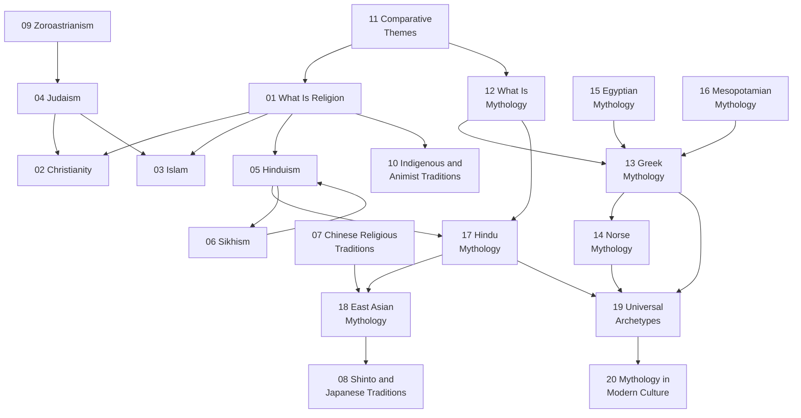

# World Religions and Mythology — ศาสนาโลกและเทพปกรณัม

> **Domain:** World religions and mythology for adult general knowledge (exam-free, no grade bands)
> **Total Topics:** 20 (11 religions + 9 mythology)
> **Content root:** `General Knowledge/03 World Religions and Mythology/` (files numbered 01-20)
> **Language policy:** English narrative with Thai terms in parentheses (default); user overrides per topic. Respectful, descriptive tone: these notes describe traditions, they do not evaluate them
> **Source:** [[more-topic-proposal-20260905|More Topics Proposal 2026-09-05]]; canonical books listed below
> **Note template:** see proposal section 4 (tags `general-knowledge` + `world-religions` or `mythology`, concepts tables, Mermaid timeline, Thai terminology, why it matters today, further reading, cross-links)

## What Is This?

The curriculum's Religion strand teaches Buddhism as the living tradition, with shorter visits to other religions. This domain completes the picture: the major world religions in their own terms (beliefs, texts, practices, history), the comparative themes that connect them (creation, afterlife, the golden rule, pilgrimage), and the mythology that predates and feeds them all, from Greek Olympus to the Ramayana.

Why it matters for a Thai family: Thailand is a Buddhist-majority country with Muslim, Christian, Hindu, and Sikh communities; understanding neighbors starts here. And the vault's most treasured bridge lives in this domain: **รามเกียรติ์ is the Thai telling of the Ramayana**. When a child studying รามเกียรติ์ in ภาษาไทย discovers the same epic in its Hindu original, world literature, religion, and Thai heritage meet in one story.

## The 20 Topic Areas

### 🕯️ Foundations (01, 12)

| # | Topic | What it covers | Language | Cross-links |
|---|---|---|---|---|
| 01 | [[01_What_Is_Religion]] | The comparative frame: belief, ritual, ethics, community, texts | EN + TH | Religion strand [[01_Buddhist_Principles]] |
| 12 | [[12_What_Is_Mythology]] | Myth vs legend vs folktale; the hero's journey | EN + TH | ภาษาไทย นิทานและตำนาน |

### 📜 The Abrahamic Traditions (02-04)

| # | Topic | What it covers | Language | Cross-links |
|---|---|---|---|---|
| 02 | [[02_Christianity]] | History, denominations, the Bible, core beliefs | EN + TH | Religion strand other-religions notes |
| 03 | [[03_Islam]] | History, the Five Pillars, the Quran, Sunni and Shia | EN + TH | Religion strand other-religions notes |
| 04 | [[04_Judaism]] | The Torah, history, traditions and festivals | EN + TH | History strand |

### 🕉️ Indian and East Asian Traditions (05-08)

| # | Topic | What it covers | Language | Cross-links |
|---|---|---|---|---|
| 05 | [[05_Hinduism]] | The Vedas, deities, karma, dharma, moksha | EN + TH | Mythology [[17_Hindu_Mythology]] |
| 06 | [[06_Sikhism]] | The gurus, scripture, practices | EN + TH | |
| 07 | [[07_Chinese_Religious_Traditions]] | Confucianism as tradition, Daoism, folk religion | EN + TH | Philosophy [[20_Eastern_Philosophy_Beyond_Thailand]] |
| 08 | [[08_Shinto_and_Japanese_Traditions]] | Kami, shrines, festivals | EN + TH | |

### 🏛️ Ancient and Indigenous (09-10)

| # | Topic | What it covers | Language | Cross-links |
|---|---|---|---|---|
| 09 | [[09_Zoroastrianism]] | The first monotheism and its influence | EN + TH | History strand ancient civilizations |
| 10 | [[10_Indigenous_and_Animist_Traditions]] | A world overview of animism and indigenous practice | EN + TH | Thai spirit-house and folk-belief notes |

### ⚖️ Comparative (11)

| # | Topic | What it covers | Language | Cross-links |
|---|---|---|---|---|
| 11 | [[11_Comparative_Themes]] | Creation, afterlife, the golden rule, pilgrimage, fasting | EN + TH | Religion strand ceremonies notes |

### 🐉 Mythologies (13-19)

| # | Topic | What it covers | Language | Cross-links |
|---|---|---|---|---|
| 13 | [[13_Greek_Mythology]] | The Olympians, heroes, the Trojan War | EN + TH | World Literature [[02_Ancient_Epics]] |
| 14 | [[14_Norse_Mythology]] | The gods, Yggdrasil, Ragnarok | EN + TH | |
| 15 | [[15_Egyptian_Mythology]] | The gods, the afterlife, the Book of the Dead | EN + TH | History strand ancient civilizations |
| 16 | [[16_Mesopotamian_Mythology]] | Enuma Elish, Gilgamesh | EN + TH | World Literature [[02_Ancient_Epics]] |
| 17 | [[17_Hindu_Mythology]] | The Ramayana, the Mahabharata | EN + TH | **รามเกียรติ์ ↔ Ramayana** (gold cross-link to ภาษาไทย วรรณคดี) |
| 18 | [[18_East_Asian_Mythology]] | Journey to the West, the Kojiki | EN + TH | World Literature [[17_Asian_Literature]] |
| 19 | [[19_Universal_Mythic_Archetypes]] | Flood myths, tricksters, underworld journeys | EN + TH | World Literature [[16_Magical_Realism_and_Latin_America]] |

### 🎬 Mythology Today (20)

| # | Topic | What it covers | Language | Cross-links |
|---|---|---|---|---|
| 20 | [[20_Mythology_in_Modern_Culture]] | Retellings, films, games: where the myths live now | EN + TH | Art folder; CS games notes |

## How Topics Connect

## Reading Paths

- **Full journey (recommended):** 01 → 02 → 03 → 04 → 05 → 06 → 07 → 08 → 09 → 10 → 11 → 12 → 13 → 14 → 15 → 16 → 17 → 18 → 19 → 20
- **Fast start (5 notes):** 01 → 02 → 03 → 13 → 17
- **The Thai bridge track:** 05 → 17 → then ภาษาไทย วรรณคดี รามเกียรติ์ note
- **Comparative track:** 01 → 11 → 19 (religion frame, themes, archetypes)
- **Story-lover track:** 12 → 13 → 14 → 18 → 20 (mythology only)

## Key Thai Terminology

| Thai | English |
|---|---|
| ศาสนา | Religion |
| ศาสนาเปรียบเทียบ | Comparative religion |
| คริสต์ศาสนา | Christianity |
| ศาสนาอิสลาม | Islam |
| ศาสนายูดาห์ | Judaism |
| ศาสนาฮินดู | Hinduism |
| ศาสนาซิกข์ | Sikhism |
| ลัทธิขงจื๊อ | Confucianism |
| ลัทธิเต๋า | Daoism |
| ชินโต | Shinto |
| โซโรอัสเตอร์ | Zoroastrianism |
| เทพปกรณัม | Mythology |
| ตำนาน | Legend |
| นิทานปรัมปรา | Myth |
| กฎทอง | Golden rule |
| การแสวงบุญ | Pilgrimage |
| การถือศีลอด | Fasting |
| โลกหน้า | The afterlife |
| วีรบุรุษ | Hero |
| รามายณะ | Ramayana |

## Book Recommendations

| Tier | Book | Why |
|---|---|---|
| 🔴 Essential | The World's Religions (Huston Smith, 1958) | The canonical respectful survey: skeleton for notes 01-11 |
| 🔴 Essential | Mythology (Edith Hamilton, 1942) | The Greek, Norse, and Egyptian canon: skeleton for 13-16 |
| 🔴 Essential | Norse Mythology (Neil Gaiman, 2017) | Modern retelling: readable and accurate |
| 🟡 Recommended | A History of God (Karen Armstrong, 1993) | The Abrahamic traditions' shared story |
| 🟡 Recommended | The Hero with a Thousand Faces (Joseph Campbell, 1949) | The hero's journey: foundation for 12 and 19 |
| 🟡 Recommended | Bhagavad Gita (translation) | Primary text for 05 and 17 |
| 🟢 Deep dive | A History of Religious Ideas (Mircea Eliade) | Reference set |

## Progress Tracker (Build Contract)

> **Contract for the next educator:** create one note per row, exactly these file names, in `General Knowledge/03 World Religions and Mythology/`. Follow the proposal's note template (section 4). Write in the Language column's language. Add the Cross-links column's wikilinks. Keep the tone descriptive and respectful: no tradition is evaluated against another. Mark rows ✅ Done with the created file name, then update the completion count.

| # | Topic | Status | Content File | Notes |
|---|---|---|---|---|
| 01 | What Is Religion | ❌ Pending | — | The comparative frame; adult relevance: understanding neighbors |
| 02 | Christianity | ❌ Pending | — | Denominations map; major festivals; links to Thai Christian communities |
| 03 | Islam | ❌ Pending | — | Five Pillars explained; Sunni and Shia; Islam in Thailand and ASEAN |
| 04 | Judaism | ❌ Pending | — | Torah structure; festivals cycle |
| 05 | Hinduism | ❌ Pending | — | Deity family table; karma, dharma, moksha |
| 06 | Sikhism | ❌ Pending | — | Ten gurus; the five Ks |
| 07 | Chinese Religious Traditions | ❌ Pending | — | Confucian ritual, Daoist practice, folk religion; Thai-Chinese connections |
| 08 | Shinto and Japanese Traditions | ❌ Pending | — | Kami and shrines; festivals |
| 09 | Zoroastrianism | ❌ Pending | — | Dualism and its influence on the Abrahamic traditions |
| 10 | Indigenous and Animist Traditions | ❌ Pending | — | World overview; the Thai spirit house as a living example |
| 11 | Comparative Themes | ❌ Pending | — | Golden rule table across traditions; pilgrimage and fasting compared |
| 12 | What Is Mythology | ❌ Pending | — | Myth vs legend vs folktale; the hero's journey diagram |
| 13 | Greek Mythology | ❌ Pending | — | Olympian family tree (Mermaid); the Trojan War |
| 14 | Norse Mythology | ❌ Pending | — | The nine worlds; Ragnarok |
| 15 | Egyptian Mythology | ❌ Pending | — | The weighing of the heart; the Book of the Dead |
| 16 | Mesopotamian Mythology | ❌ Pending | — | Enuma Elish; Gilgamesh and immortality |
| 17 | Hindu Mythology | ❌ Pending | — | Ramayana summary with the รามเกียรติ์ comparison as the centerpiece |
| 18 | East Asian Mythology | ❌ Pending | — | Journey to the West; the Kojiki |
| 19 | Universal Mythic Archetypes | ❌ Pending | — | Flood myths compared; tricksters; underworld journeys |
| 20 | Mythology in Modern Culture | ❌ Pending | — | Retellings, films, games; why myths still sell |

**Completion: 0/20 (0%)**

## Related

- [[General Knowledge - Overview|← General Knowledge BOK]]
- [[Philosophy - Overview|Philosophy]] (07-08: faith and reason in the medieval world)
- [[World Literature - Overview|World Literature]] (mythology is literature's oldest layer)
- [[Social Studies - Overview|Social Studies]] (the Religion strand's world context)
- [[Thai Language - Overview|Thai Language]] (รามเกียรติ์ and Thai folklore)
- [[more-topic-proposal-20260905|More Topics Proposal 2026-09-05]]
