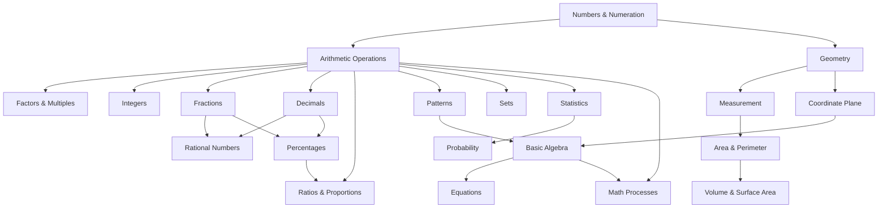

# Fundamental Mathematics — คณิตศาสตร์พื้นฐาน

> **Subject Area:** Foundation Mathematics for Primary & Lower Secondary (ป.1–ม.3)
> **Course Codes:** ค111–ค116 (ป.1–ป.6), ค211–ค213 (ม.1–ม.3)
> **Total Concept Areas:** ~20 | **Duration:** 9 years
> **Source:** IPST (สสวท.) Basic Education Core Curriculum B.E. 2551 (2008), revised 2560 (2017)
> **Leads to:** [[01_Advance Mathematics (Sci-Math) - Overview|Mathematics (ค301–ค303)]] — ม.4–ม.6

## What Is This?

Fundamental Mathematics (คณิตศาสตร์พื้นฐาน) is the integrated math curriculum covering ป.1 through ม.3 — the nine years before students enter the specialized วิทย์-คณิต track. This is where students build the numerical fluency, geometric intuition, and algebraic thinking that everything else rests on.

Unlike the ม.4–ม.6 curriculum (which is split into calculus, probability, etc.), this level is organized by **concept areas** that deepen progressively across grade bands. A concept like "fractions" starts in ป.1–3 with simple halves and quarters, expands in ป.4–6 to operations, and solidifies in ม.1–ม.3 with complex applications.

## The ~20 Concept Areas

Fundamental Mathematics is organized into **5 categories** with detailed sub-overviews:

| # | Category | Concepts | Sub-Overview |
|---|---|---|---|
| 01 | **Numbers and Operations** | 01–09 | [[01 Numbers and Operations - Overview\|→ Full Overview]] |
| 02 | **Algebra and Patterns** | 10–11 | [[02 Algebra and Patterns - Overview\|→ Full Overview]] |
| 03 | **Geometry and Measurement** | 12–16 | [[03 Geometry and Measurement - Overview\|→ Full Overview]] |
| 04 | **Data, Statistics, and Probability** | 17–19 | [[04 Data Statistics and Probability - Overview\|→ Full Overview]] |
| 05 | **Mathematical Processes** | 20 | [[05 Mathematical Processes - Overview\|→ Full Overview]] |

### 🔢 Numbers & Operations
- [[01_Numbers_and_Numeration]] — Counting, place value, comparing, ordering, number systems (Thai/Arabic/Roman), scientific notation
- [[02_Arithmetic_Operations]] — Addition, subtraction, multiplication, division of whole numbers; order of operations (PEMDAS); properties (commutative, associative, distributive)
- [[03_Factors_Multiples_and_Number_Theory]] — Factors, multiples, GCF/LCM, prime numbers, prime factorization, divisibility rules
- [[04_Integers]] — Negative numbers, number line, four operations with integers, absolute value
- [[05_Fractions]] — Concept, equivalent fractions, mixed numbers, four operations, comparing, applications
- [[06_Decimals]] — Place value, four operations, converting fractions↔decimals, repeating/terminating
- [[07_Rational_Numbers]] — Number line, operations, comparing, ordering, absolute value
- [[08_Percentages]] — Converting percent↔fraction↔decimal, percentage of a number, increase/decrease, applications (discount, tax, interest)
- [[09_Ratios_and_Proportions]] — Ratios, equivalent ratios, proportions, direct/inverse proportion, scale drawings, speed/distance/time

### 📐 Algebra & Patterns
- [[10_Patterns_and_Algebraic_Thinking]] — Number patterns, function machines, geometric patterns, input/output tables
- [[11_Basic_Algebra]] — Variables, algebraic expressions, substitution, simplifying, one-variable linear equations, inequalities (intro)

### 📏 Geometry & Measurement
- [[12_Geometry_Shapes]] — 2D shapes (circle, square, rectangle, triangle, polygons), 3D shapes (cube, sphere, cylinder, cone), angles, symmetry, congruence/similarity
- [[13_Measurement]] — Length (cm, m, km), mass (g, kg), capacity (mL, L), unit conversion, reading instruments
- [[14_Area_and_Perimeter]] — Perimeter formulas, area formulas (rectangle, triangle, parallelogram, trapezoid, circle), composite shapes
- [[15_Volume_and_Surface_Area]] — Volume (rectangular prism, cylinder, pyramid, cone), surface area, capacity
- [[16_Coordinate_Plane]] — Cartesian plane, plotting points, four quadrants, reading graphs, gradient/slope (intro)

### 📊 Data & Chance
- [[17_Sets]] — Set notation, subsets, union, intersection, complement, Venn diagrams, universal/empty set
- [[18_Statistics_Data_Handling]] — Collecting data, tally marks, pictographs, bar/line/pie graphs, mean, median, mode, range, frequency tables, histograms
- [[19_Probability]] — Certain/impossible/likely, theoretical/experimental probability, sample space, compound events (intro)

### 🧠 Mathematical Thinking
- [[20_Mathematical_Processes]] — Problem-solving strategies, reasoning (deductive/inductive), communication, connections to real life, representation, mathematical modeling (intro)

## Concept Area Progression

| Concept Area | ป.1–3 | ป.4–6 | ม.1–ม.3 |
|---|---|---|---|
| **Numbers & Numeration** | Count to 100,000; place value | Large numbers; rounding; number systems | Real number system; scientific notation |
| **Arithmetic** | + − × ÷ basics | Multi-digit ops; PEMDAS; properties | Properties formalized; exponents |
| **Factors & Multiples** | — | GCF/LCM; primes | Divisibility rules; applications |
| **Integers** | — | Negative numbers (intro) | Four operations; absolute value |
| **Fractions** | Halves, thirds, quarters | Operations; mixed numbers | Complex operations; applications |
| **Decimals** | Place value to thousandths | Four operations; conversions | Repeating decimals; approximations |
| **Rational Numbers** | — | — | Number line; operations; ordering |
| **Percentages** | — | Concept; conversions | Increase/decrease; real-world apps |
| **Ratios & Proportions** | — | Ratios; equivalent ratios | Proportion; scale; speed problems |
| **Patterns** | Skip counting; growing patterns | Geometric/numerical rules | Algebraic expressions; variables |
| **Basic Algebra** | — | — | Linear equations; inequalities |
| **Geometry** | Basic 2D/3D shapes | Angles; triangles; quadrilaterals | Angle relationships; constructions |
| **Measurement** | Standard units; reading rulers | Unit conversion; perimeter | Surface area; volume; compounds |
| **Area & Perimeter** | Counting squares | Formulas | Circles; composite shapes |
| **Volume & Surface Area** | — | Rectangular prisms | Prisms; cylinders; pyramids; cones |
| **Coordinate Plane** | — | First quadrant; plotting | All quadrants; slope (intro) |
| **Sets** | — | — | Notation; union; intersection; Venn |
| **Statistics** | Tally; pictographs; bar graphs | Mean/median/mode; line/pie graphs | Frequency tables; histograms |
| **Probability** | — | Simple experiments | Theoretical; experimental; compound |
| **Math Processes** | Problem solving; reasoning | Communication; connections | Modeling; logic (intro) |

## Prerequisites

- **Before ป.1:** Basic counting, recognizing numbers, fine motor skills for writing
- **Before ป.4:** Whole number operations, basic shapes, measurement concepts
- **Before ม.1:** Fractions, decimals, percentages, basic geometry, data handling
- **Before ม.4 (ค301):** All 20 concept areas at ม.3 level

## How Concept Areas Connect

## Key Connections to Upper Level

- [[01_Advance Mathematics (Sci-Math) - Overview|Mathematics (ค301–ค303)]] — Algebra → Functions → Calculus
- [[01_Physics - Overview|Physics]] — Measurement, arithmetic for calculations
- [[02_Chemistry - Overview|Chemistry]] — Ratios for stoichiometry
- [[05_Computer Science - Overview|Computer Science]] — Number systems, logic

## Reading Paths

- **Number sense first:** 01 → 02 → 03 → 04 → 05 → 06 → 07 → 08 → 09
- **Algebra track:** 01 → 02 → 10 → 11 → 16 → (then ค301)
- **Geometry track:** 12 → 13 → 14 → 15 → 16
- **Data & chance:** 17 → 18 → 19
- **Full sequence (recommended):** 01 through 20 in order

## Related

- [[Body of Knowledge - Overview|← Back to Math-Sci Overview]]
- [[00_Fundamental Science - Overview|Fundamental Science]] — Integrated science (ป.1–ม.3)
- [[01_Advance Mathematics (Sci-Math) - Overview|Mathematics]] — The next level (ค301–ค303, ม.4–ม.6)
- **IPST Textbooks:** [ipst.ac.th](https://www.ipst.ac.th) — Free PDF textbooks for all levels
