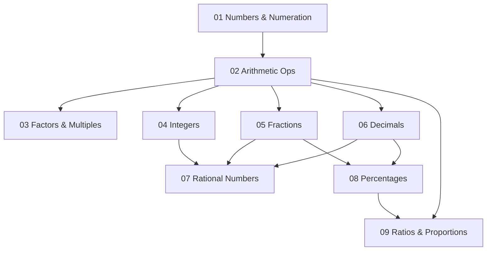

# Numbers and Operations — จำนวนและการดำเนินการ

> **Category:** Fundamental Mathematics (ป.1–ม.3)
> **Covering:** 9 concept areas — Numbers, Arithmetic, Factors, Integers, Fractions, Decimals, Rational Numbers, Percentages, Ratios
> **Duration:** 9 years, spiral progression across 3 grade bands

## Overview

Numbers and Operations is the largest category in fundamental mathematics, covering everything from counting to rational numbers. This is where students build **numerical fluency** — the ability to work confidently and flexibly with numbers. The 9 concept areas are taught in a **spiral**: each concept appears at ป.1–3 in simple form, deepens at ป.4–6, and reaches formal abstraction at ม.1–3.

---

## Concept Areas

| # | Concept Area | Thai Name | ป.1–3 | ป.4–6 | ม.1–3 |
|---|---|---|---|---|---|
| 01 | [[Numbers and Numeration]] | จำนวนและการนับ | Count to 100k, place value, Thai/Arabic numerals | Millions+, rounding, estimation | Real number system, scientific notation |
| 02 | [[Arithmetic Operations]] | การดำเนินการทางคณิตศาสตร์ | +−×÷ basics, fact families | Multi-digit ops, PEMDAS, properties | Properties formalized, exponents |
| 03 | [[Factors, Multiples, and Number Theory]] | ตัวประกอบและจำนวนเฉพาะ | Equal groups concept | GCF/LCM, primes | Divisibility rules, Euclidean algorithm |
| 04 | [[Integers]] | จำนวนเต็ม | — | Negative numbers intro | Four operations, absolute value |
| 05 | [[Fractions]] | เศษส่วน | Halves, thirds, quarters | Operations, mixed numbers | Complex operations, negative fractions |
| 06 | [[Decimals]] | ทศนิยม | Money context (Baht/Satang) | Operations, converting | Terminating vs repeating |
| 07 | [[Rational Numbers]] | จำนวนตรรกยะ | — | — | Formal definition, ℚ vs irrationals, ℝ |
| 08 | [[Percentages]] | ร้อยละ | — | Concept, conversions | Increase/decrease, discount, profit, interest, VAT |
| 09 | [[Ratios and Proportions]] | อัตราส่วนและสัดส่วน | — | Ratios, equivalent ratios | Direct/inverse proportion, scale, speed |

---

## Learning Progression

---

## Key Concepts by Grade Band

### ป.1–3: Building Number Sense

| Concept | Key Learning |
|---|---|
| **Counting** | Forward and backward, skip counting by 2, 5, 10 |
| **Place value** | Ones, tens, hundreds, thousands — understanding that 345 = 300 + 40 + 5 |
| **Basic operations** | Addition/subtraction within 1000, multiplication tables 2–12 |
| **Fractions intro** | Halves, thirds, quarters using pizza/pie models |
| **Money** | Baht and Satang as early decimal exposure |

**Common misconception:** "When multiplying, the answer is always bigger" — shattered when fractions arrive.

### ป.4–6: Operational Fluency

| Concept | Key Learning |
|---|---|
| **Large numbers** | Up to billions, rounding, estimation |
| **Multi-digit operations** | Long multiplication, long division, PEMDAS |
| **Properties** | Commutative, associative, distributive — formalized |
| **Factors & primes** | GCF, LCM, prime factorization, factor trees |
| **Fractions/Decimals** | All four operations, converting between forms |
| **Percentages** | Meaning, conversions, finding percentage of a quantity |
| **Ratios** | Writing, simplifying, equivalent ratios |
| **Negative numbers** | Introduction via temperature, debt, elevation |

**Common misconception:** "0.5 is smaller than 0.25 because 5 < 25" — students need to understand that tenths > hundredths.

### ม.1–3: Formal Abstraction

| Concept | Key Learning |
|---|---|
| **Integers** | Full formal treatment — ℤ, absolute value, all operations |
| **Rational numbers** | ℚ as a/b — unifying fractions, decimals, integers |
| **Irrational numbers** | √2, π — what cannot be expressed as a/b |
| **Real numbers** | ℝ = ℚ ∪ irrationals — the complete number line |
| **Percent applications** | Discount, profit/loss, simple/compound interest, VAT |
| **Proportional reasoning** | Direct (y = kx) and inverse (y = k/x), speed/distance/time |
| **Number theory** | Divisibility rules extended, Euclidean algorithm, modular arithmetic intro |

**Common misconception:** Believing all decimals terminate. 1/3 = 0.333... never ends.

---

## Key Thai Terminology

| Thai | English | Symbol |
|---|---|---|
| จำนวนนับ | Natural numbers | ℕ |
| จำนวนเต็ม | Integers | ℤ |
| จำนวนตรรกยะ | Rational numbers | ℚ |
| จำนวนจริง | Real numbers | ℝ |
| ห.ร.ม. | GCD | ตัวหารร่วมมาก |
| ค.ร.น. | LCM | ตัวคูณร่วมน้อย |
| ค่าสัมบูรณ์ | Absolute value | \|a\| |
| ร้อยละ | Percent | % |
| สัดส่วนตรง | Direct proportion | y = kx |
| สัดส่วนผกผัน | Inverse proportion | y = k/x |
| สัญกรณ์วิทยาศาสตร์ | Scientific notation | a × 10ⁿ |

---

## Exam Relevance

| Exam | Key Topics |
|---|---|
| **O-NET ป.6** | Arithmetic operations, fractions, decimals, percentages, ratios |
| **O-NET ม.3** | Integers, rational numbers, real numbers, percentage applications, proportions |
| **O-NET ม.6** | Review of fundamentals (less weight, but foundational for higher math) |

---

## Cross-Links

- [[00_Fundamental Mathematics - Overview|← Back to Fundamental Mathematics]]
- [[02 Algebra and Patterns|Algebra and Patterns]] — Algebra builds on arithmetic generalization
- [[03 Geometry and Measurement|Geometry and Measurement]] — Measurement uses number operations
- [[04 Data Statistics and Probability|Data, Statistics, and Probability]] — Statistics uses fractions, percentages, ratios
