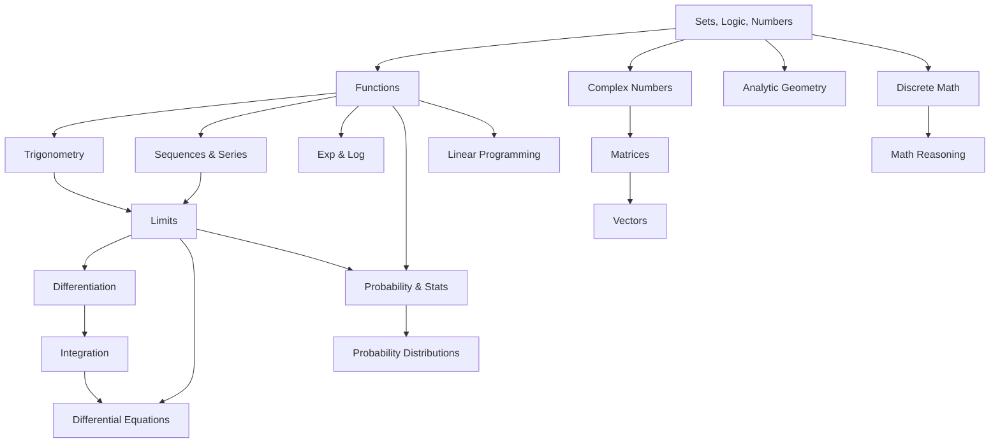

# Mathematics — คณิตศาสตร์

> **Subject Area:** Pure and Applied Mathematics for Science-Math High School (สายวิทย์-คณิต ม.4–ม.6)
> **Course Codes:** ค301 (ม.4), ค302 (ม.5), ค303 (ม.6) | 3 credits each
> **Total Topics:** ~23 | **Duration:** 3 years (6 semesters)
> **Source:** IPST (สสวท.) Basic Education Core Curriculum B.E. 2551 (2008), revised 2560 (2017)
> **Foundation for:** Physics, Chemistry, Computer Science, Statistics

## What Is This?

Mathematics is the abstract science of number, quantity, structure, space, and change. For วิทย์-คณิต students, it serves as the essential language and toolkit for all scientific disciplines. The Thai high school math curriculum (ค301–ค303) covers everything from basic algebraic foundations through calculus and discrete mathematics — preparing students for university-level STEM programs.

The curriculum is developed by the Institute for the Promotion of Teaching Science and Technology (สสวท./IPST) and follows a progression from concrete computation to abstract reasoning across three years. IPST textbooks are freely available at [ipst.ac.th](https://www.ipst.ac.th).

## The ~23 Topic Areas

Advanced Mathematics is organized into **5 categories** with detailed sub-overviews:

| # | Category | Topics | Sub-Overview |
|---|---|---|---|
| 06 | **Foundations and Functions** | 01–09 | [[06 Foundations and Functions - Overview\|→ Full Overview]] |
| 07 | **Calculus** | 10–16 | [[07 Calculus - Overview\|→ Full Overview]] |
| 08 | **Algebra and Geometry** | 10–13* | [[08 Algebra and Geometry - Overview\|→ Full Overview]] |
| 09 | **Probability and Statistics** | 17–19 | [[09 Probability and Statistics - Overview\|→ Full Overview]] |
| 10 | **Discrete and Advanced Topics** | 20–23 | [[10 Discrete and Advanced Topics - Overview\|→ Full Overview]] |

*\*Note: Topics 10–13 (Complex Numbers, Matrices, Vectors, Analytic Geometry) span across categories*

### 🔢 ม.4 (ค301) — Foundations & Functions

### 🔢 ม.4 (ค301) — Foundations & Functions
- [[01_Sets_and_Logic]] — Sets, subsets, unions, intersections, Venn diagrams, Cartesian products, propositions, truth tables, logical connectives
- [[02_Real_Numbers_and_Inequalities]] — Real number system, absolute value, linear/quadratic/rational inequalities
- [[03_Algebraic_Expressions]] — Polynomials, factoring, remainder & factor theorems, polynomial operations
- [[04_Systems_of_Equations]] — Linear systems, nonlinear systems, graphical methods
- [[05_Functions]] — Definition, domain/range, types (linear, quadratic, polynomial, rational), composition, inverse, piecewise
- [[06_Exponential_and_Logarithmic_Functions]] — Properties, graphs, equations, real-world applications
- [[07_Tigonometric_Functions]] — Unit circle, radian measure, graphs, identities, inverse trig functions
- [[08_Sequences_and_Series]] — Arithmetic, geometric sequences, sigma notation, mathematical induction
- [[09_Tigonometric_Equations]] — Solving trig equations, applications

### 📈 ม.5 (ค302) — Calculus & Applied Math
- [[10_Complex_Numbers]] — Imaginary unit, operations, polar form, De Moivre's theorem, roots
- [[11_Matrices_and_Determinants]] — Matrix operations, inverses, Cramer's rule, systems of equations
- [[12_Analytic_Geometry]] — Lines, circles, conic sections (parabola, ellipse, hyperbola)
- [[13_Vectors]] — 2D/3D vectors, dot product, cross product, applications
- [[14_Limits_and_Continuity]] — Limit definition, techniques, continuity, squeeze theorem
- [[15_Differentiation]] — Derivative definition, rules (chain, product, quotient), applications (rate of change, maxima/minima, related rates)
- [[16_Integration]] — Antiderivatives, definite integrals, fundamental theorem, area under curves
- [[17_Probability]] — Counting principles, permutations, combinations, conditional probability, Bayes' theorem

### 🧮 ม.6 (ค303) — Advanced Topics
- [[18_Probability_Distributions]] — Binomial, Poisson, normal distributions
- [[19_Statistics]] — Central tendency, dispersion, correlation, regression, sampling, hypothesis testing
- [[20_Discrete_Mathematics]] — Graph theory, combinatorics, recurrence relations
- [[21_Mathematical_Reasoning]] — Direct proof, contradiction, contrapositive, induction (deep dive)
- [[22_Linear_Programming]] — Optimization, graphical method, simplex (intro)
- [[23_Differential_Equations]] — First-order ODEs, separation of variables, applications

## Topic Distribution

| Year | Code | Semester 1 | Semester 2 |
|---|---|---|---|
| **ม.4** | ค301 | Sets, Logic, Real Numbers, Algebra, Systems | Functions, Exp/Log, Trig Functions, Sequences |
| **ม.5** | ค302 | Complex Numbers, Matrices, Analytic Geometry, Vectors | Limits, Differentiation, Integration, Probability |
| **ม.6** | ค303 | Probability Distributions, Statistics, Discrete Math | Reasoning/Proof, Linear Programming, Diff Eq |

## Prerequisites

- **Before ม.4:** Basic algebra, equations, graphing, geometry fundamentals
- **Before ม.5:** Functions, trigonometry, sequences (ค301 content)
- **Before ม.6:** Calculus basics, probability (ค302 content)

## How Topics Connect

## Key Connections to Other Subjects

- [[01_Physics - Overview|Physics]] — Calculus for mechanics, vectors for forces, stats for experiments
- [[02_Chemistry - Overview|Chemistry]] — Stoichiometry (algebra), rates (calculus), equilibrium (functions)
- [[05_Computer Science - Overview|Computer Science]] — Discrete math, logic, algorithms, number systems
- [[03_Biology - Overview|Biology]] — Statistics for research, population models (calculus)

## Reading Paths

- **Strong foundation:** 01 → 02 → 03 → 05 → 06 → 07 → 08 → 14 → 15 → 16
- **Probability track:** 01 → 05 → 17 → 18 → 19
- **Applied/Engineering:** 01 → 05 → 14 → 15 → 16 → 10 → 11 → 13 → 23
- **CS/Discrete track:** 01 → 08 → 20 → 21 → 22
- **Full sequence (recommended):** 01 through 23 in order

## Related

- [[Body of Knowledge - Overview|← Back to Math-Sci Overview]]
- [[01_Physics - Overview|Physics]] — Uses calculus, vectors, and trigonometry extensively
- [[05_Computer Science - Overview|Computer Science]] — Uses discrete math, logic, and number theory
- **IPST Textbooks:** [ipst.ac.th](https://www.ipst.ac.th) — Free PDF textbooks for all levels
