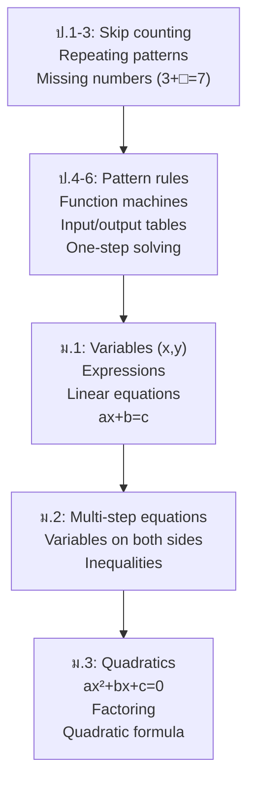

# Algebra and Patterns — พีชคณิตและแบบรูป

> **Category:** Fundamental Mathematics (ป.1–ม.3)
> **Covering:** Patterns & Algebraic Thinking, Basic Algebra
> **Duration:** 9 years — from skip counting to linear equations

## Overview

Algebra begins long before students see an **x**. It starts with pattern recognition in ป.1 (red-blue-red-blue...), grows into function machines and input/output tables in ป.4–6, and blossoms into formal algebra with variables, expressions, and equations in ม.1–3. This progression mirrors how mathematics itself evolved — from concrete patterns to abstract generalization.

---

## Concept Areas

| # | Concept Area | Thai Name | ป.1–3 | ป.4–6 | ม.1–3 |
|---|---|---|---|---|---|
| 10 | [[Patterns and Algebraic Thinking]] | แบบรูปและความสัมพันธ์ | Skip counting, repeating patterns | Geometric/numerical patterns, function machines | Linear/quadratic patterns, algebraic rules |
| 11 | [[Basic Algebra]] | พีชคณิตเบื้องต้น | Missing number boxes (□) | Pre-algebra, one-step equations | Linear equations, inequalities, quadratics |

---

## Learning Progression

---

## Key Concepts

### From Pattern to Algebra

| Stage | Example | Mathematical Idea |
|---|---|---|
| **Pattern recognition** (ป.1) | 🟡🔵🟡🔵🟡🔵... | Identifying repeating units |
| **Skip counting** (ป.2) | 2, 4, 6, 8, 10... | Constant difference = 2 |
| **Function machine** (ป.4) | Input → +3 → ×2 → Output | Two-step operations |
| **Finding the rule** (ป.5) | (1,4), (2,7), (3,10)... | y = 3x + 1 |
| **Writing expressions** (ป.6–ม.1) | "Three more than twice a number" | 2x + 3 |
| **Solving equations** (ม.1) | 2x + 5 = 17 | x = 6 |
| **Quadratic equations** (ม.3) | x² − 5x + 6 = 0 | x = 2 or x = 3 |

### Key Formulas (ม.1–3)

| Topic | Formula |
|---|---|
| Linear equation | ax + b = c → x = (c−b)/a |
| Slope-intercept form | y = mx + c |
| Quadratic formula | x = (−b ± √(b²−4ac))/2a |
| Discriminant | Δ = b² − 4ac |
| Factoring (a²−b²) | (a+b)(a−b) |
| Factoring (a±b)² | a² ± 2ab + b² |

### Common Misconceptions

- **"The equal sign means 'the answer is'"** — Students need to understand = as balance/equality
- **"x always equals 1 number"** — In quadratics, there can be two solutions
- **"When moving terms across =, just change the sign"** — Better to understand: we're doing the same operation to both sides
- **Inequality sign flipping** — When multiplying/dividing by a negative, the sign flips

---

## Key Thai Terminology

| Thai | English | Example |
|---|---|---|
| ตัวแปร | Variable | x, y |
| ค่าคงตัว | Constant | 3, -7 |
| สมการ | Equation | 2x + 5 = 17 |
| อสมการ | Inequality | x > 5 |
| นิพจน์ | Expression | 3x² + 2x − 1 |
| การแก้สมการ | Solving an equation | Finding x |
| สัมประสิทธิ์ | Coefficient | 3 in 3x |
| สมการกำลังสอง | Quadratic equation | ax² + bx + c = 0 |
| การแยกตัวประกอบ | Factoring | (x+2)(x+3) |

---

## Exam Relevance

| Exam | Key Topics |
|---|---|
| **O-NET ป.6** | Pattern recognition, simple missing-number problems |
| **O-NET ม.3** | Linear equations, solving, word problems → equations |
| **O-NET ม.6** | Quadratic equations, systems of equations |

---

## Cross-Links

- [[00_Fundamental Mathematics - Overview|← Back to Fundamental Mathematics]]
- [[01 Numbers and Operations|Numbers and Operations]] — Algebra generalizes arithmetic
- [[03 Geometry and Measurement|Geometry and Measurement]] — Coordinate plane connects algebra and geometry
